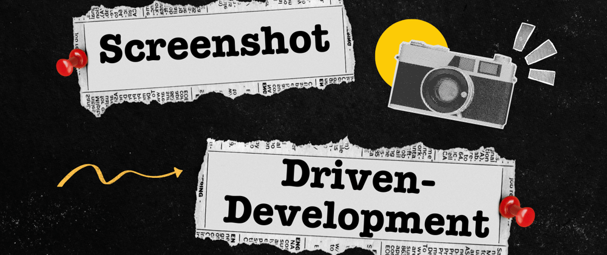
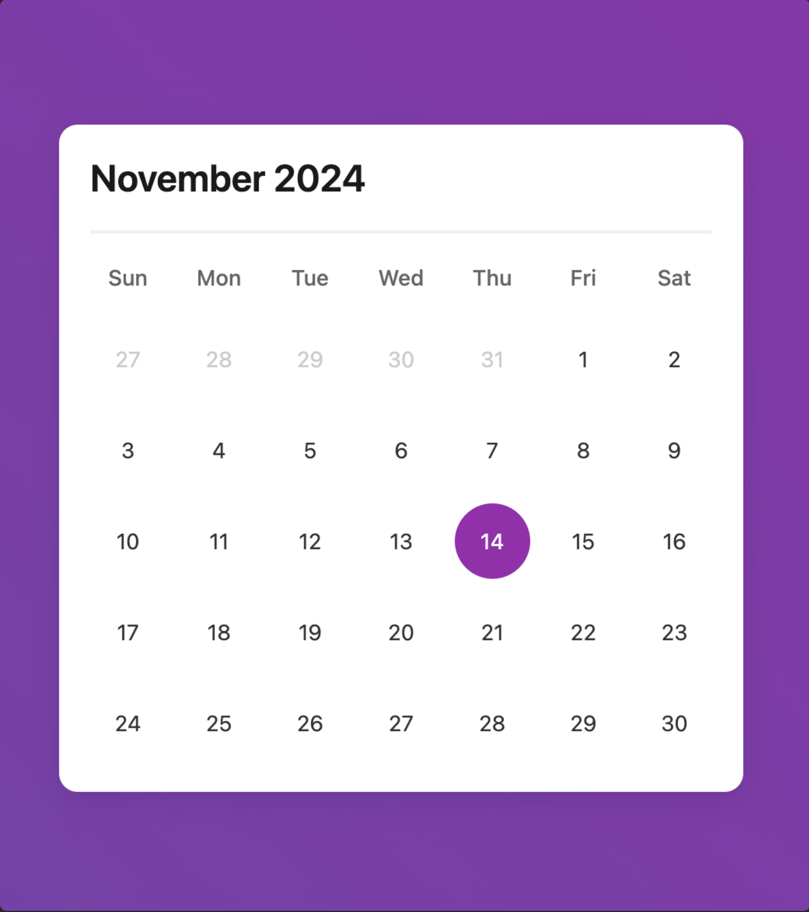
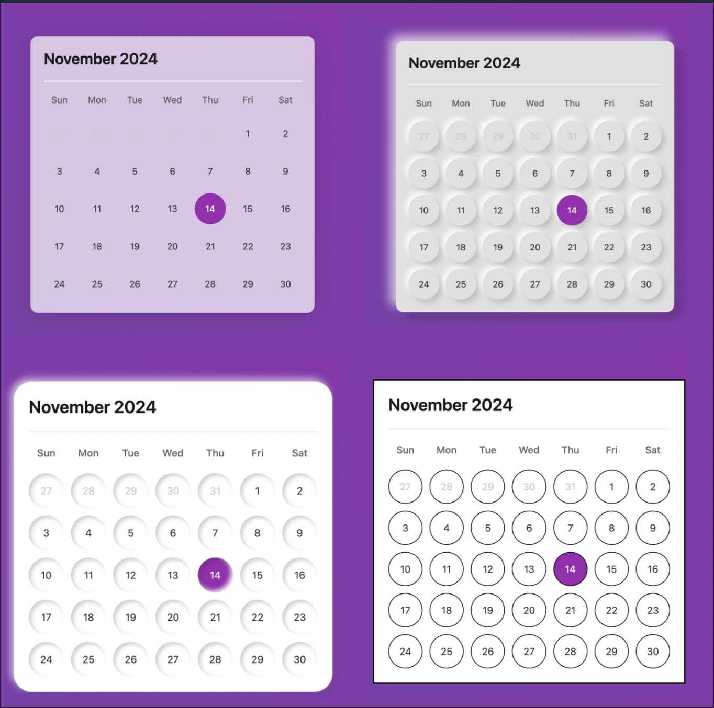
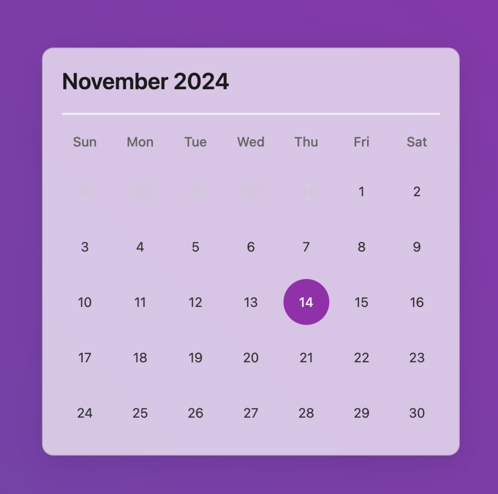
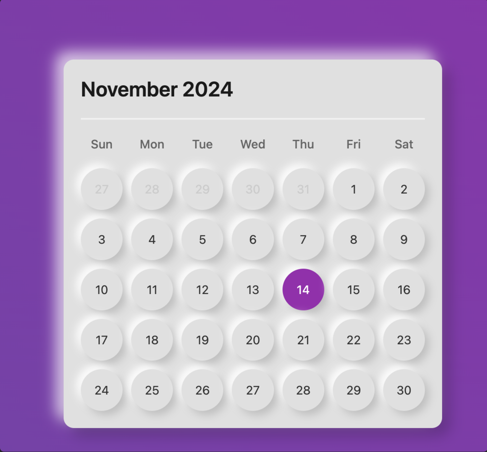
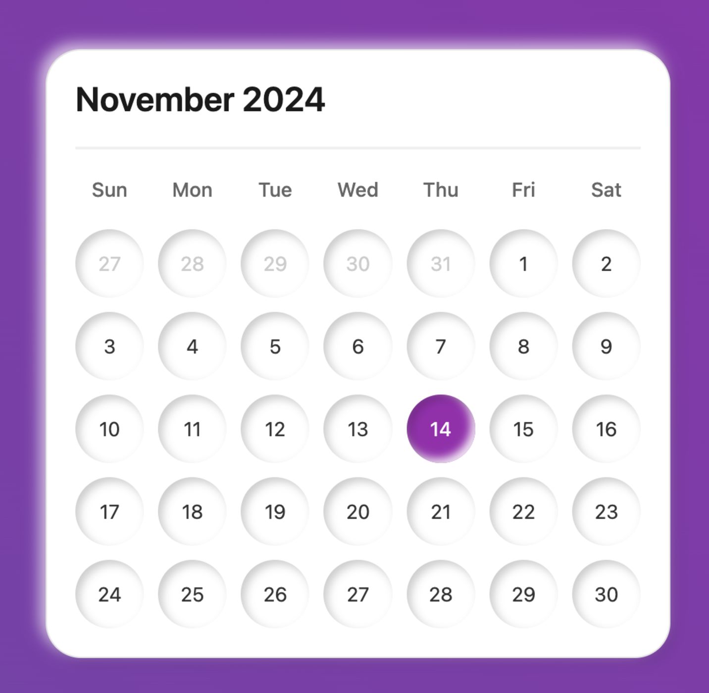
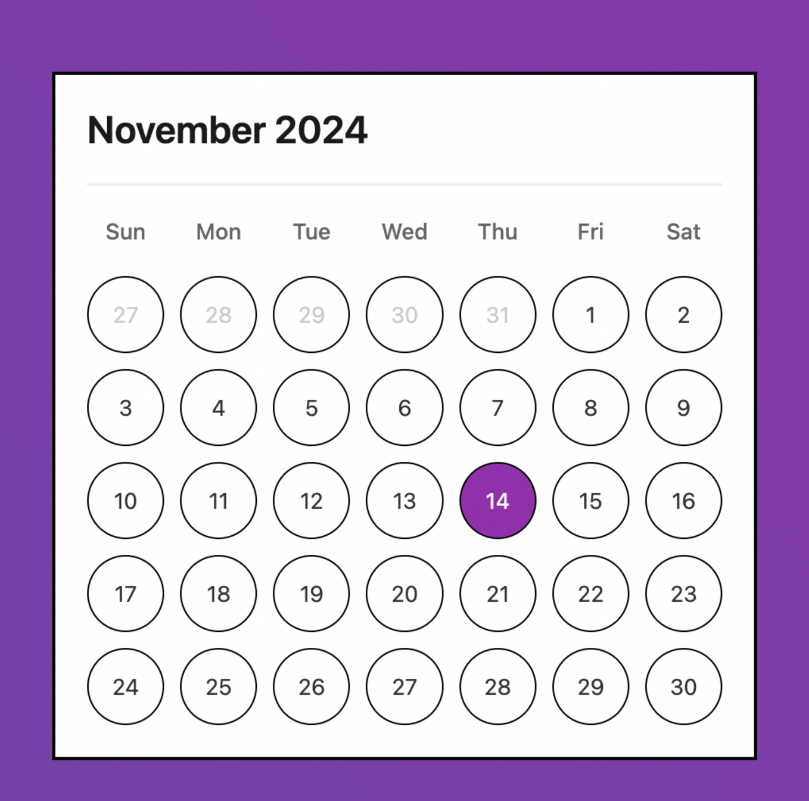

我骨子里是个开发者，所以做个人项目时，最难的往往不是写代码，而是做设计决定。我最近做了一个日历用户界面。我想增强它的视觉吸引力，于是研究了「玻璃拟态」和「黏土拟态」这类 UI 设计趋势。

不过，我不想花几个小时为每种设计趋势实现 CSS，所以我发展出一种更快的方法：截图驱动开发。我用一个叫 [goose](https://github.com/aaif-goose/goose) 的开源开发者智能体，快速改造用户界面。

<!-- truncate -->

:::warning goose Beta 版本
本文写的是 goose 的 beta 版本，命令和流程可能已经改变。
:::

### 我原来的日历：


### goose 做出的原型如下：


在这篇博文里，我会展示如何让 goose 处理 CSS，从而快速原型化设计风格。
>💡 注意：你的结果可能和我的示例看起来不同——这正是生成式 AI 有趣的地方！每次运行都可能产生这些设计趋势的独特变体。

## 开始截图驱动开发

### 步骤 1：创建你的 UI
我们先创建一个用来试验的基础 UI。用下面的代码创建一个 index.html 文件：

<details>
<summary>用下面的代码创建一个 index.html 文件</summary>

```html
<!DOCTYPE html>
<html>
<head>
    <style>
        body {
            display: flex;
            justify-content: center;
            align-items: center;
            min-height: 100vh;
            margin: 0;
            background: linear-gradient(45deg, #6e48aa, #9c27b0);
            font-family: -apple-system, BlinkMacSystemFont, "Segoe UI", Roboto, sans-serif;
        }

        .calendar {
            background: white;
            border-radius: 12px;
            box-shadow: 0 5px 20px rgba(0,0,0,0.1);
            width: 400px;
            padding: 20px;
        }

        .header {
            display: flex;
            justify-content: space-between;
            align-items: center;
            padding-bottom: 20px;
            border-bottom: 2px solid #f0f0f0;
        }

        .month {
            font-size: 24px;
            font-weight: 600;
            color: #1a1a1a;
        }

        .days {
            display: grid;
            grid-template-columns: repeat(7, 1fr);
            gap: 10px;
            margin-top: 20px;
            text-align: center;
        }

        .days-header {
            display: grid;
            grid-template-columns: repeat(7, 1fr);
            gap: 10px;
            margin-top: 20px;
            text-align: center;
        }

        .days-header span {
            color: #666;
            font-weight: 500;
            font-size: 14px;
        }

        .day {
            aspect-ratio: 1;
            display: flex;
            align-items: center;
            justify-content: center;
            border-radius: 50%;
            font-size: 14px;
            color: #333;
            cursor: pointer;
            transition: all 0.2s;
        }

        .day:hover {
            background: #f0f0f0;
        }

        .day.today {
            background: #9c27b0;
            color: white;
        }

        .day.inactive {
            color: #ccc;
        }
    </style>
</head>
<body>
    <div class="calendar">
        <div class="header">
            <div class="month">November 2024</div>
        </div>
        <div class="days-header">
            <span>Sun</span>
            <span>Mon</span>
            <span>Tue</span>
            <span>Wed</span>
            <span>Thu</span>
            <span>Fri</span>
            <span>Sat</span>
        </div>
        <div class="days">
            <div class="day inactive">27</div>
            <div class="day inactive">28</div>
            <div class="day inactive">29</div>
            <div class="day inactive">30</div>
            <div class="day inactive">31</div>
            <div class="day">1</div>
            <div class="day">2</div>
            <div class="day">3</div>
            <div class="day">4</div>
            <div class="day">5</div>
            <div class="day">6</div>
            <div class="day">7</div>
            <div class="day">8</div>
            <div class="day">9</div>
            <div class="day">10</div>
            <div class="day">11</div>
            <div class="day">12</div>
            <div class="day">13</div>
            <div class="day today">14</div>
            <div class="day">15</div>
            <div class="day">16</div>
            <div class="day">17</div>
            <div class="day">18</div>
            <div class="day">19</div>
            <div class="day">20</div>
            <div class="day">21</div>
            <div class="day">22</div>
            <div class="day">23</div>
            <div class="day">24</div>
            <div class="day">25</div>
            <div class="day">26</div>
            <div class="day">27</div>
            <div class="day">28</div>
            <div class="day">29</div>
            <div class="day">30</div>
        </div>
    </div>
</body>
</html>
```
</details>

保存后，在浏览器里打开这个文件。你应该能看到一个日历！

### 步骤 2：安装 goose

```bash
brew install pipx
pipx ensurepath
pipx install goose-ai
```

### 步骤 3：开始一个会话

```bash
goose session start
```

#### 自带 LLM

>第一次运行这条命令时，goose 会提示你设置 API 密钥。你可以使用 OpenAI 或 Anthropic 等多种 LLM 提供商

```bash
export OPENAI_API_KEY=your_api_key
# Or for other providers:
export ANTHROPIC_API_KEY=your_api_key
```

### 步骤 4：启用 Screen 工具包
goose 用[工具包](https://goose-docs.ai/plugins/plugins.html)扩展自己的能力。[screen](https://goose-docs.ai/plugins/available-toolkits.html#6-screen-toolkit) 工具包让 goose 能截图并分析截图。

要启用 Screen 工具包，把它加到 ~/.config/goose/profiles.yaml 里的 goose 配置中。

> 你的配置可能略有不同，取决于你偏好的 LLM 提供商。


```yaml
default:
  provider: openai
  processor: gpt-4o
  accelerator: gpt-4o-mini
  moderator: truncate
  toolkits:
  - name: developer
    requires: {}
  - name: screen
    requires: {}
```

### 步骤 5：提示 goose 截取你的 UI
goose 通过截图分析你的 UI，以理解它的结构和元素。在 goose 会话中，指定 UI 所在的显示器，提示 goose 截图：

```bash
Take a screenshot of display(1)  
```

> 必须提供显示器编号——主显示器用 display(1)，副显示器用 display(2)。

成功后，goose 会运行 `screencapture` 命令，并把它存成临时文件。

### 步骤 6：提示 goose 改造你的 UI

现在，你可以让 goose 应用不同的设计风格。下面是我给 goose 的一些提示，以及它产出的结果：

#### 玻璃拟态

```bash
Apply a glassmorphic effect to my UI
```




#### 新拟态

```bash
Apply neumorphic effects to my calendar and the dates
```




#### 黏土拟态

```bash
Please replace with a claymorphic effect
```




#### 粗野主义

```bash
Apply a brutalist effect please
```



## 进一步了解

开发用户界面是创造力和解决问题的结合。我喜欢用 goose，因为它给我更多时间专注于创造力，而不是跟 CSS 较劲好几个小时。

除了做原型，goose 分析截图的能力还能帮助开发者发现并解决 UI 缺陷。

如果你想进一步了解，看看 [goose 仓库](https://github.com/aaif-goose/goose)，并加入我们的 [Discord 社区](https://discord.gg/n8R5VaWDAn)。

<head>
    <meta property="og:title" content="截图驱动开发" />
    <meta property="og:type" content="article" />
    <meta property="og:url" content="https://goose-docs.ai/blog/2024/11/22/screenshot-driven-development" />
    <meta property="og:description" content="AI 智能体用截图协助样式设计。" />
    <meta property="og:image" content="https://goose-docs.ai/assets/images/screenshot-driven-development-4ed1beaa10c6062c0bf87e2d27590ad6.png" />
    <meta name="twitter:card" content="summary_large_image" />
    <meta property="twitter:domain" content="goose-docs.ai" />
    <meta name="twitter:title" content="截图驱动开发" />
    <meta name="twitter:description" content="AI 智能体用截图协助样式设计。" />
    <meta name="twitter:image" content="https://goose-docs.ai/assets/images/screenshot-driven-development-4ed1beaa10c6062c0bf87e2d27590ad6.png" />
</head>
