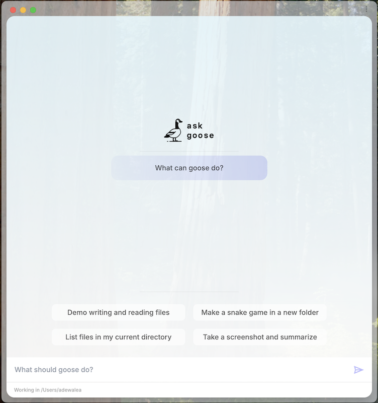

我们很高兴分享即将随 goose v1.0 Beta 到来的新更新预览！

这次重大更新带来一批新功能和改进，让 goose 更强大，也更好用。下面是一些关键亮点。

<!-- truncate -->


## goose 1.0 Beta 的精彩功能

### 1. 迁移到 Rust

goose 的核心已经用 Rust 重写。这为什么重要？Rust 带来更可移植、更稳定的体验。这一变化意味着 goose 可以在不同系统上顺畅运行，而不需要安装 Python，任何人都能更容易地开始使用。

### 2. 上下文记忆

goose 会记住之前的交互，从而更好地理解正在进行的项目。这意味着你不必反复重复自己说过的话。想象和一个人交谈，对方记得每一个细节——这正是 goose 希望提供的支持。

### 3. 改进的插件系统

在 goose v1.0 中，goose 工具包系统将被扩展取代。扩展是 goose 可以动态交互的模块化守护进程。因此，goose 将能够支持更复杂的插件和集成。这会让用新功能扩展 goose 变得更容易。

### 4. 无界面模式

你现在可以在无界面模式下运行 goose。这适合在服务器上运行，或在没有图形界面的环境中运行。

```sh
cargo run --bin goose -- run -i instructions.md
```

### 5. goose 现在有了 GUI

goose 现在有一个基于 Electron 的 GUI macOS 应用，为 CLI 提供了另一种与 goose 交互、管理项目的方式。



### 6. goose 与开放协议对齐

goose v1.0 Beta 现在使用一套自定义协议，它与 [Anthropic 的 Model Context Protocol](https://www.anthropic.com/news/model-context-protocol)（MCP）并行设计，用于与各类系统通信。这让开发者可以创建自己的系统（例如 Jira），并让 goose 与之集成。

期待更多功能更新和改进吗？请继续关注 goose 的后续消息！查看 [goose 仓库](https://github.com/aaif-goose/goose)，并加入我们的 [Discord 社区](https://discord.gg/n8R5VaWDAn)。


<head>
  <meta property="og:title" content="预览 goose v1.0 Beta" />
  <meta property="og:type" content="article" />
  <meta property="og:url" content="https://goose-docs.ai/blog/2024/12/06/previewing-goose-v10-beta" />
  <meta property="og:description" content="AI 智能体使用截图协助样式调整。" />
  <meta property="og:image" content="https://goose-docs.ai/assets/images/goose-v1.0-beta-5d469fa73edea37cfccfe8a8ca0b47e2.png" />
  <meta name="twitter:card" content="summary_large_image" />
  <meta property="twitter:domain" content="goose-docs.ai" />
  <meta name="twitter:title" content="截图驱动开发" />
  <meta name="twitter:description" content="AI 智能体使用截图协助样式调整。" />
  <meta name="twitter:image" content="https://goose-docs.ai/assets/images/goose-v1.0-beta-5d469fa73edea37cfccfe8a8ca0b47e2.png" />
</head>
