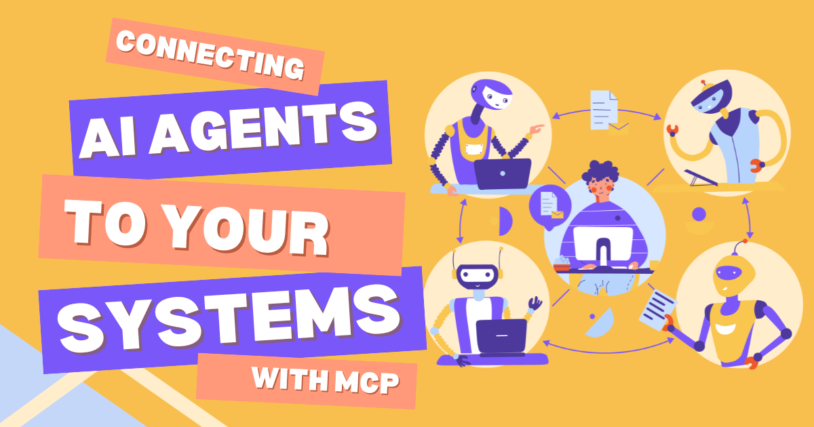
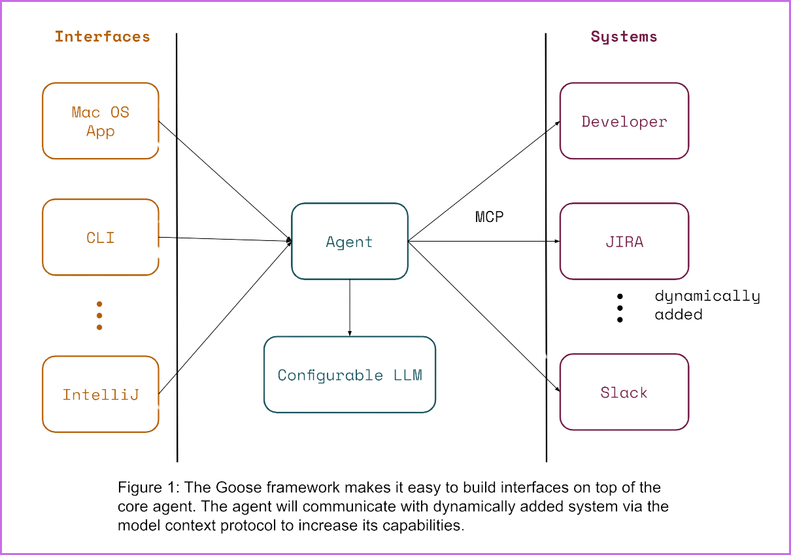

开放标准是可互操作系统的关键成分。我们依赖的大多数技术都得益于它们。无论身在何处都能上网，靠的是 Wi-Fi、TCP/IP 和 DNS 这类开放标准。当你的 Gmail 收到来自 Outlook 发件人的邮件，正是 SMTP、IMAP 和 POP3 这类开放标准让这一切无缝发生。我们这个时代最具变革性的技术之一——互联网——之所以能让任何人的网页被全世界访问，也是因为 HTTP 和 HTML 标准。

我们正处于科技新时代的早期：各家公司正在为大众创新并构建实用的 AI 解决方案。要让这项技术长久，开放标准将必不可少，它引导 AI 工具的发展，使不同公司构建的多样系统能够无缝协作。

<!-- truncate -->

:::warning goose Beta 版本
本文写于 goose 的 beta 版本，命令和流程可能已经改变。
:::

### MCP 开放标准

Anthropic 正在引领 [Model Context Protocol（MCP）](https://modelcontextprotocol.io)。这是一项开放标准，让大语言模型（LLM）应用能够连接外部系统，为更知情、更相关的 AI 交互提供必要上下文。

这对像 [goose](https://goose-docs.ai/) 这样的 AI 智能体是一次变革。它们可以自主执行任务，远超只提供分步说明的聊天机器人。但要释放这些 AI 智能体的全部潜力，我们需要一种把它们连接到外部数据源的标准方法。MCP 提供了这个基础。

借助 MCP 标准化的 API 和端点，goose 可以无缝集成到你的系统中，增强它直接在你的环境里完成复杂任务的能力，例如调试、写代码和运行命令。

### 能做什么

没有 MCP，每个 [goose 工具包](https://goose-docs.ai/plugins/using-toolkits.html)开发者都需要为自己要连接的每个系统实现定制集成。这不仅繁琐、重复，还会推迟真正有趣的部分。

以一个简单的 GitHub 工作流为例。goose 用自定义脚本或配置直接与 GitHub API 交互。开发者必须配置 goose 以向 GitHub 认证，并指定获取未合并拉取请求或添加评论等操作的端点。每次集成都需要手动设置和自定义编码，来处理认证令牌、错误处理和 API 更新。

MCP 通过提供访问 GitHub 这一资源的标准化接口来简化这一过程。goose 作为 [MCP 客户端](https://modelcontextprotocol.io/clients)，向配置为暴露 GitHub 能力的 [MCP 服务器](https://modelcontextprotocol.io/quickstart#general-architecture)请求所需信息（例如未合并拉取请求列表）。MCP 服务器处理认证以及与 GitHub 的通信，把 API 交互的复杂性抽象掉。然后 goose 可以专注于提供详细评审评论或建议代码修改这类任务。

### 加入这个生态

随着 MCP 采用范围扩大，goose 为你的组织交付更强大解决方案的潜力也在增长。把 [goose 集成](https://goose-docs.ai/)进你的工作流并[拥抱 MCP](https://modelcontextprotocol.io/introduction)，你不只是在增强自己的系统，也在为一个让 AI 工具更可互操作、更高效、更有影响力的生态做贡献。

<head>
  <meta charset="UTF-8" />
  <title>用 MCP 把 AI 智能体连接到你的系统</title>
  <meta name="description" content="goose" />
  <meta name="keywords" content="MCP, Anthropic, AI Open Standards" />

  <!-- HTML Meta Tags -->
  <title>用 MCP 把 AI 智能体连接到你的系统</title>
  <meta name="description" content="了解 MCP 如何标准化集成，并为 AI 工具的未来培育一个生态。" />

  <!-- Facebook Meta Tags -->
  <meta property="og:url" content="https://goose-docs.ai/blog/2024/12/10/connecting-ai-agents-to-your-systems-with-mcp" />
  <meta property="og:type" content="website" />
  <meta property="og:title" content="用 MCP 把 AI 智能体连接到你的系统" />
  <meta property="og:description" content="了解 MCP 如何标准化集成，并为 AI 工具的未来培育一个生态。" />
  <meta property="og:image" content="https://goose-docs.ai/assets/images/goose-mcp-34a5252d18d18dff26157d673f7af779.png" />

  <!-- Twitter Meta Tags -->
  <meta name="twitter:card" content="summary_large_image" />
  <meta property="twitter:domain" content="aaif-goose.github.io" />
  <meta property="twitter:url" content="https://goose-docs.ai/blog/2024/12/10/connecting-ai-agents-to-your-systems-with-mcp" />
  <meta name="twitter:title" content="用 MCP 把 AI 智能体连接到你的系统" />
  <meta name="twitter:description" content="了解 MCP 如何标准化集成，并为 AI 工具的未来培育一个生态。" />
  <meta name="twitter:image" content="https://goose-docs.ai/assets/images/goose-mcp-34a5252d18d18dff26157d673f7af779.png" />
</head>
