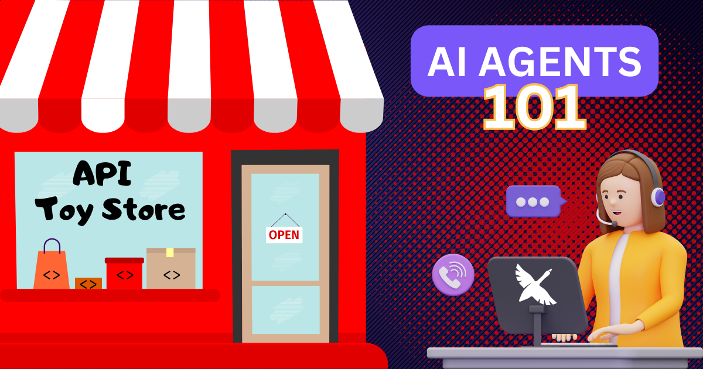

似乎就在昨天，我们都被生成式 AI 惊艳，尤其是那些让普通人也能与大语言模型（LLM）交互的聊天界面。

尽管这很了不起，它只是开始。下一波 AI 是智能体式的，意味着 AI 系统不只回应提示，还会采取行动、做决定，并与外部系统交互。这通过 **AI 智能体**完成。

<!--truncate-->

## 什么是 AI 智能体？

当你与使用 AI 的聊天机器人交互时，比如 ChatGPT，你可以问它如何做某件事，它会提供分步说明。

例如，如果我编码时遇到错误，我可以把错误信息粘贴到 ChatGPT，让它帮我调试。因为 ChatGPT 无法访问我的代码库，它会推测错误原因，并给我几个可以尝试的解决方案。然后我手动尝试这些提议的方案，再回去告诉 ChatGPT 结果。我们这样来回，直到错误解决或我放弃。

AI 智能体通过替我与 LLM 交谈，并采取直接行动修复问题，大大简化了这个流程。

> _**AI 智能体是一个自主运作以完成目标的系统。**_

因为 AI 智能体连接到系统，它们可以分析情况、决定下一步行动并执行，几乎不需要人工干预。这种能力把它们从被动的聊天机器人变成自动化助手。

通过使用 AI 智能体，我只要说「修复这个错误」，它就会有关于哪里出错的上下文，并自动为我修复错误。

## AI 智能体如何与 LLM 一起工作

LLM（例如 GPT-4o、Claude 3.5 Sonnet、Gemini 2.0 等）为 AI 智能体提供认知能力。大多数 AI 智能体自己会有一个聊天界面，你在那里输入提示，智能体把这条提示发送给 LLM。同时，智能体也会告知 LLM 它能访问哪些**工具**。

### 工具调用

工具是智能体 AI 最重要的方面之一。AI 智能体能够通过**工具调用**执行 API 调用。

来看一个例子：

1. 用户向他们的 AI 智能体发送一条提示：_「修复我的 UserService.java 文件中的 NullPointerException。」_

2. 智能体以结构化格式把用户请求和它可用工具的列表发送给 LLM。
```
User Request: "Fix the NullPointerException in my UserService.java file."

Available Tools:
1. read_file(file_path: str) → Returns the contents of the specified file.
2. analyze_code(file_content: str) → Identifies potential errors and suggests fixes.
3. edit_file(file_path: str, modifications: dict) → Applies code changes.
4. run_tests() → Executes the test suite and returns results.
```

3. LLM 分析请求并选择合适的工具。它确定需要读取文件才能帮忙。
```json
[
  {
    "tool": "read_file",
    "parameters": { "file_path": "UserService.java" }
  }
]
```

4. 智能体执行 `read_file()` 并把代码发送给 LLM。
```java
public class UserService {
    private Database db;

    public void getUser(String userId) {
        System.out.println(db.findUserById(userId).getName());
    }
}
```

5. LLM 识别出问题（`db` 变量未初始化），并选择另一个工具来修复。
```json
[
  {
    "tool": "edit_file",
    "parameters": {
      "file_path": "UserService.java",
      "modifications": {
        "line_number": 3,
        "replacement": "private Database db = new Database();"
      }
    }
  }
]
```

6. 智能体执行 `edit_file()` 来修复 `UserService.java`，并告知 LLM。

7. LLM 判断运行测试来确认更改是个好主意。
```json
[
  {
    "tool": "run_tests",
    "parameters": {}
  }
]
```

8. 智能体执行 `run_tests()` 并把结果提供给 LLM。
```json
{
  "tests_passed": true,
  "failed_tests": []
}
```

9. LLM 生成一条最终消息，然后由智能体呈现给用户。
```
I’ve fixed the NullPointerException in UserService.java by initializing the db variable. All tests have passed. Let me know if you need further modifications!
```

没有工具调用，LLM 只会根据训练数据猜测答案。但通过使用工具，智能体可以直接访问它们做出准确决策和采取行动所需的数据。

值得注意的是，说到工具访问，并非所有智能体都一样。大多数专有智能体被紧紧限定在特定 LLM 和预定义的工具集上，因为公司为他们自己的应用构建量身定制的智能体。

其他智能体，比如 goose，更具可扩展性，允许用户用自己选择的 LLM 配置它，并为各种 API、数据库，甚至[像 IDE 这样的本地环境](/docs/mcp/jetbrains-mcp)添加工具。然而，要让智能体在不同工具和系统之间扩展，而不必为每一个做自定义集成，它们需要一种标准化的方式来发现、调用和管理工具。这正是 [Model Context Protocol（MCP）](https://modelcontextprotocol.io/introduction) 提供的。

## MCP 生态

传统 AI 集成需要为每个系统做自定义 API 调用，使扩展变得困难。MCP 通过提供一个开放、通用的协议来解决这个问题，让智能体动态地与外部系统通信。

有了 MCP，像 goose 这样的智能体可以：

* 连接到任何 API，而不需要开发者编写手动集成代码
* 与云服务、开发工具、数据库和企业系统集成
* 检索和存储上下文以增强推理

在撰写本文时，有超过 [1000 台 MCP 服务器](https://www.pulsemcp.com/servers)（暴露工具的系统），任何像 goose 这样启用了 MCP 的 AI 智能体都可以连接！这些 MCP 服务器充当智能体与外部系统之间的桥梁，实现对 API、数据库和开发环境的访问。有些由官方 API 提供商开发，而绝大多数由社区成员开发。因为 MCP 是开放标准，任何人都可以为任何资源构建 MCP 服务器。这大大增加了 AI 智能体的可能性！

例如，假设我想让 goose 根据一份 Figma 设计，在我的 WebStorm IDE 中为我开发一个新的 Web 应用，然后把代码提交到 GitHub 上的一个新仓库。我可以把以下 MCP 服务器添加为 goose 扩展，从而给它所有这些能力：

* [Figma](/docs/mcp/figma-mcp)
* [JetBrains](/docs/mcp/jetbrains-mcp)
* [GitHub](/docs/mcp/github-mcp)

有了这些，我可以用自然语言提示我的 AI 智能体，它会处理工作：

> _「根据文件 ID 为 XYZ 的 Figma 设计，在 WebStorm 中构建一个 Web 应用，并把代码提交到名为 angiejones/myapp 的新 GitHub 仓库」_

相当强大，对吧？！

## 开始使用 AI 智能体
希望这已经清楚说明了什么是 AI 智能体、它们如何工作，以及它们能为你实现什么。[goose](/docs/getting-started/installation) 免费且开源，你可以按意愿添加任意多的[扩展](/docs/getting-started/using-extensions#adding-extensions)。这是开始使用 AI 智能体、看看它们如何自动化你工作流中的任务、让你更高效的好方法。


<head>
  <meta property="og:title" content="智能体 AI 与 MCP 生态" />
  <meta property="og:type" content="article" />
  <meta property="og:url" content="https://goose-docs.ai/blog/2025/02/17/agentic-ai-mcp" />
  <meta property="og:description" content="AI 智能体入门介绍" />
  <meta property="og:image" content="https://goose-docs.ai/assets/images/agentic-ai-with-mcp-1e3050cc8d8ae7a620440e871ad9f0d2.png" />
  <meta name="twitter:card" content="summary_large_image" />
  <meta property="twitter:domain" content="goose-docs.ai" />
  <meta name="twitter:title" content="智能体 AI 与 MCP 生态" />
  <meta name="twitter:description" content="AI 智能体入门介绍" />
  <meta name="twitter:image" content="https://goose-docs.ai/assets/images/agentic-ai-with-mcp-1e3050cc8d8ae7a620440e871ad9f0d2.png" />
</head>
