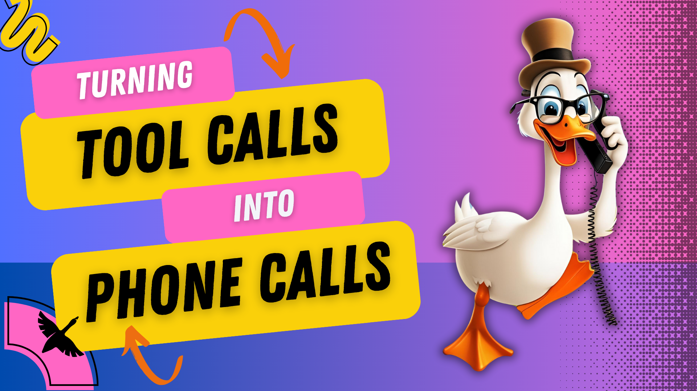

在最新一期 [Wild goose Case](https://www.youtube.com/playlist?list=PLyMFt_U2IX4uMW9kpE1FENQUyIgLuUnWD) 中，主持人 [Ebony Louis](https://www.linkedin.com/in/ebonylouis/) 和 [Ace Abati](https://www.linkedin.com/in/acekyd/) 探索了一种扩展 goose 自动化能力的新方式：与 [VOYP](https://voyp.app/) 集成。VOYP 是一套能拨打电话的 AI 系统。嘉宾 [Paulo Taylor](https://www.linkedin.com/in/paulotaylor/) 拥有超过 35 年经验，他演示了开发者如何用 goose 通过 VOYP 触发并管理基于电话的交互。

<!--truncate-->

# 用 AI 电话扩展 goose 的触达范围

goose 已经以自动化任务著称，但你可以把这种自动化延伸到屏幕之外。借助 [VOYP Goose 扩展](goose://extension?cmd=npx&arg=-y&arg=voyp-mcp&id=voyp&name=VOYP&description=Automated%20Phone%20Calling&env=VOYP_API_KEY%3DVOYP%20API%20key)，你可以自动拨打电话来获取信息、处理客户交互，甚至协助无障碍需求。

VOYP 作为一个 AI 通话智能体，使用 LLM 和文本转语音（TTS）技术在电话上进行对话。这意味着你可以直接从 goose 会话触发电话交互，把自动化带到传统界面之外的真实世界。

# 它如何工作

在底层，VOYP 使用多家电信服务商来优化通话成本。它支持多种 LLM 和 TTS 提供商，让用户在配置 AI 呼叫方时有灵活性。与 goose 的集成通过 [Model Context Protocol（MCP）](https://modelcontextprotocol.io/) 实现，这让 goose 能与 VOYP 以及其他 AI 驱动的工具无缝通信。

# 现场演示：AI 通话实战
直播中，Paulo 用一系列生动的例子展示了 VOYP 的能力。其中一个亮点是一次俏皮的实验：AI 打电话讲了一个 goose 主题的笑话。

<iframe class="aspect-ratio" src="https://www.youtube.com/embed/Cvf6xvz1RUc?si=KQ44y6ypZFrzbest" title="YouTube video player" frameborder="0" allow="accelerometer; autoplay; clipboard-write; encrypted-media; gyroscope; picture-in-picture; web-share" referrerpolicy="strict-origin-when-cross-origin" allowfullscreen></iframe>

在[另一个演示](https://www.youtube.com/live/g_F1u6aqohk?t=1515)中，Paulo 让 VOYP 与 ChatGPT 的电话服务就时间旅行展开对话，展示 AI 的回应可以多么流畅、适应力有多强。他还介绍了 VOYP 的实时对话监控仪表板，让人清楚地看到 AI 在通话中如何处理信息并作出回应。

# 开始使用 goose 和 VOYP
如果你想试用 [VOYP](https://github.com/paulotaylor/voyp-mcp)，请在 [VOYP 网站](https://voyp.app/) 注册账号并获取 API 密钥。通话需要点数，新用户会获得 20 点免费额度用于测试。每次通话的费用因地区而异，美国境内通话最便宜，大约每分钟 5 点。要把 VOYP 与 goose 集成，请[安装 VOYP 扩展](goose://extension?cmd=npx&arg=-y&arg=voyp-mcp&id=voyp&name=VOYP&description=Automated%20Phone%20Calling&env=VOYP_API_KEY%3DVOYP%20API%20key)。

<head>
  <meta property="og:title" content="Wild goose Case：用 goose 和 VOYP 自动拨打电话" />
  <meta property="og:type" content="article" />
  <meta property="og:url" content="https://goose-docs.ai/blog/2025/03/06/goose-tips" />
  <meta property="og:description" content="通过 VOYP 扩展，让 goose 能够拨打电话。" />
  <meta property="og:image" content="https://goose-docs.ai/assets/images/goose-voyp-215f3391cfbe2132542a2be63db84999.png" />
  <meta name="twitter:card" content="summary_large_image" />
  <meta property="twitter:domain" content="goose-docs.ai" />
  <meta name="twitter:title" content="Wild goose Case：用 goose 和 VOYP 自动拨打电话" />
  <meta name="twitter:description" content="通过 VOYP 扩展，让 goose 能够拨打电话。" />
  <meta name="twitter:image" content="https://goose-docs.ai/assets/images/goose-voyp-215f3391cfbe2132542a2be63db84999.png" />
</head>
