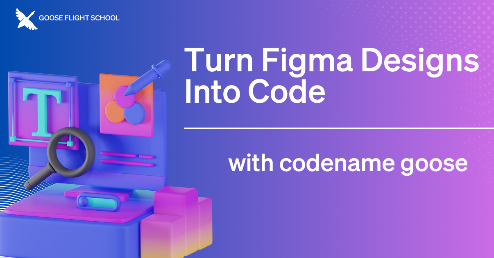

在上一期 [goose Flight School](https://www.youtube.com/playlist?list=PLyMFt_U2IX4s1pMaidir5P4lSfjUK6Nzm) 中，主持人 [Adewale Abati](https://www.linkedin.com/in/acekyd/) 演示了如何用 goose 把一份 Figma 设计变成可运行的 Nuxt 应用。这场直播覆盖了从初始设置到最终实现的全过程，说明 goose 如何帮助开发者弥合设计与开发之间的差距。

<!--truncate-->

# 它如何工作
[扩展](https://goose-docs.ai/docs/getting-started/using-extensions)通过连接你现有的工具和工作流来增强 goose 的能力。它们添加新功能、访问外部数据资源，并与其他系统集成。来看看包括 Figma 和 Developer 在内的多个扩展如何无缝配合，大幅加快开发。

# 直播教程：goose 现场构建
直播中，Adewale 逐步演示了 goose 如何处理每个开发阶段：从创建基本应用结构，到用 Tailwind CSS 生成响应式布局。Adewale 还说明了 goose 如何在过程中处理可能的限制，展示了 goose 自动化与开发者控制之间有力的平衡。

<iframe class="aspect-ratio" src="https://www.youtube.com/embed/_9t_N9zKwKM?si=r3e1MkrjS-f2AvkI" title="YouTube video player" frameborder="0" allow="accelerometer; autoplay; clipboard-write; encrypted-media; gyroscope; picture-in-picture; web-share" referrerpolicy="strict-origin-when-cross-origin" allowfullscreen></iframe>

整场直播中，Adewale 分享了为 goose 准备设计的实用建议。他的关键建议包括：

* 从结构清晰的 Figma 设计开始
* 初次生成之后，用 goose 做有针对性的改进
* 按需要微调特定元素
* 务必彻底测试功能和响应式表现

# 开始使用 goose 和 Figma
无论你是想快速把概念变成可运行代码的设计师，还是想简化设计落地的开发者，都可以下载带有内置 [Developer 扩展](https://goose-docs.ai/docs/getting-started/installation)的 goose，并添加 [Figma 扩展](https://goose-docs.ai/v1/extensions/)。

分步说明见 [Figma 教程](/docs/mcp/figma-mcp)。

<head>
  <meta property="og:title" content="goose Flight School：用 goose 把 Figma 设计变成代码" />
  <meta property="og:type" content="article" />
  <meta property="og:url" content="https://goose-docs.ai/blog/2025/03/12/goose-figma-mcp" />
  <meta property="og:description" content="通过 Figma 扩展，让 goose 能把 Figma 设计变成代码。" />
  <meta property="og:image" content="http://goose-docs.ai/assets/images/goosefigma-e6f84a734bd56cb431bb02452331a5d5.png" />
  <meta name="twitter:card" content="summary_large_image" />
  <meta property="twitter:domain" content="goose-docs.ai" />
  <meta name="twitter:title" content="goose Flight School：用 goose 把 Figma 设计变成代码" />
  <meta name="twitter:description" content="通过 Figma 扩展，让 goose 能把 Figma 设计变成代码。" />
  <meta name="twitter:image" content="http://goose-docs.ai/assets/images/goosefigma-e6f84a734bd56cb431bb02452331a5d5.png" />
</head>
