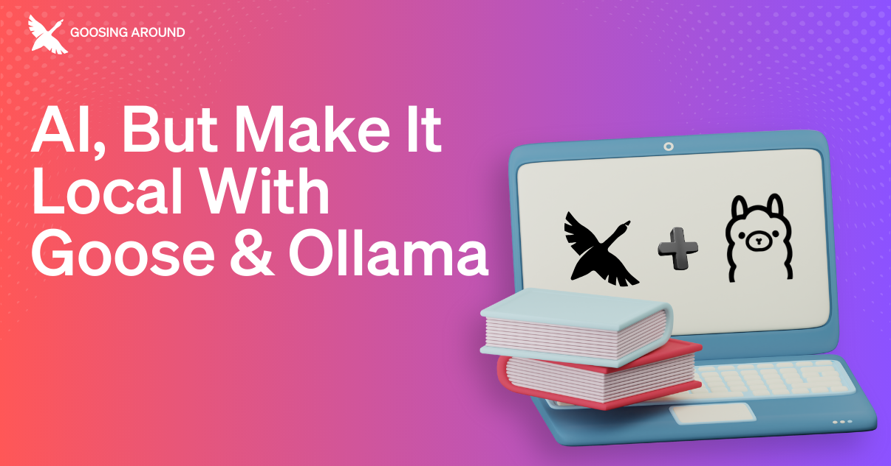

在 [Goosing Around](https://youtube.com/playlist?list=PLyMFt_U2IX4uFFhd_2TD9-tlJkgHMMb6F&feature=shared) 系列直播中，主持人 [Rizel Scarlett](https://www.linkedin.com/in/rizel-bobb-semple/) [演示了如何在本地用 Ollama 使用 goose](https://youtube.com/watch?v=WG10r2N0IwM?feature=share)，在你的设备上获得完全本地的体验。她的嘉宾 [Parth Sareen](https://www.linkedin.com/in/parthsareen/) 是一位经验丰富的软件工程师，专注于为 AI/ML 构建框架和系统。他向我们展示了结构化输出的魔力，以及 goose 和 Ollama 在底层如何一起工作。

<!--truncate-->

goose 是一个跑在机器上的 AI 智能体，可以通过扩展与你的应用和工具交互，为 AI 驱动的工作流提供框架和界面。Ollama 让你能用简单的 API 在本地运行大语言模型，并处理模型优化，使其在消费级硬件上高效运行。

它们一起创造了一个自包含的 AI 智能体工作流，把高级能力直接交到开发者手中。

# 开始使用

在深入各种能力之前，Rizel 带我们走过如何通过把 goose 与 Ollama 集成来为自己的成功做好准备。要跟着做，你可以[下载 goose](https://goose-docs.ai/)，并按照[配置 LLM 提供商](https://goose-docs.ai/docs/getting-started/providers)指南中的分步说明操作。

如果有任何问题或卡住了，欢迎在 [Discord](https://discord.gg/n8R5VaWDAn) 上和我们聊天，或在 [GitHub](https://github.com/aaif-goose/goose/) 上发 issue/讨论。感谢阅读！

# 为什么要本地化？
使用基于云的 LLM 和提供商，意味着你不需要大量计算资源，那为什么要本地化？下面是一些你可能想考虑的好处：

- **真正的数据隐私**，因为你的对话从不离开你的设备。你对敏感信息有完全的控制。正如 Parth 在讨论中强调的：「你的数据留在你这里，就是这样。」
- **离线能力**改变了你何时何地可以使用 AI。「我在飞机上一直用 Ollama——很好玩！」Parth 分享道，说明本地模型如何把你从互联网连接的约束中解放出来。
- **对模型行为的直接控制**意味着你可以微调参数，而不必付订阅费或受 API 限制。开源模型让你能更近地看到幕后发生了什么。

开发协助、个人知识管理、教育和内容管理等个人用例，只是能从本地和离线工作中受益的一些例子。你可以让研究和敏感数据保持私密，并在连接有限时使用 goose。

# 我的机器能扛得住吗？
这个问题反复出现，答案比你想的更令人鼓舞。正如 Parth 指出的：「你不需要跑最大的模型也能得到出色的结果。」你要在设备上留意的要求归结为：

- **内存是关键**：32GB 是更大模型和输出的扎实基线。
- **对 MacBook，内存是你的主要关切**，因为统一内存架构。
- **对 Windows/Linux，GPU 显存对加速更重要**

用例可以从在普通硬件上运行的更小、更高效的模型开始。为效率优化的模型即使在标准笔记本上也能提供令人印象深刻的性能！先用一个较小的模型测试你的工作流，然后按需要扩大。这样你就能弄清自己是否需要强大的硬件。

# 结构化输出的魔力
Ollama 支持[结构化输出](https://ollama.com/blog/structured-outputs)，使得可以把模型的输出约束为特定格式——本质上是教模型以 JSON 这类特定格式回应。Parth 用一个优雅的类比解释了这个概念：「这就像教某人数学运算。你展示如何加、减、乘，然后他们就能按这些模式解决不同的问题。」

Parth 向我们展示了这些结构化输出如何大幅提高可靠性。通过把模型约束在特定参数内回应，你得到更一致、更可预测的结果。这种结构化方法确保模型的回应可以被可靠地解析并集成到应用中——同时全部在你的设备上本地运行。

下面是直播中如何结构化一个输出的例子：

```json
// Example of image analysis with structured output
{
  "scene": "sunset over mountains",
  "objects": [
    {
      "type": "sun",
      "attributes": ["orange", "setting", "partially visible"],
      "confidence": 0.95
    },
    {
      "type": "mountains",
      "attributes": ["silhouetted", "range", "distant"],
      "confidence": 0.92
    },
    {
      "type": "sky",
      "attributes": ["gradient", "orange to purple", "clear"],
      "confidence": 0.98
    }
  ],
  "mood": "peaceful",
  "lighting": "golden hour",
  "composition": "rule of thirds"
}
```
当 Parth 走过这些例子时，他分享了确保你从本地 LLM 中获得最多的关键实践：

1. **对精度任务，降低温度**。设为 0 会让回应更确定、更事实性。
2. **尽可能使用结构化输出**，在提示中明确说明你想要的格式。
3. **留意上下文窗口**，本地模型对一次能处理多少信息有限制。
4. **试验不同的模型**！每个都有你想为自己的需求探索的长处和短处。
5. **对较大的文档，把它们分块**成可管理的片段，这在你处理较大文件时帮助很大。

# 关键是选择的自由
当你选择本地而不是云时，在原始处理能力上会有取舍，但你不必二选一。正如 Parth 在直播中总结的：「本地 AI 不是要取代云选项——而是拥有为你的具体需求选择正确方法的自由。」

拥有自己的 AI 体验，对各种用例都可以很有说服力。无论你是构建工具的开发者、处理机密材料的写作者，还是单纯重视隐私和控制的人，我希望 goose 与 Ollama 的集成能让你瞥见本地体验如何让你受益，并探索一个未来：精密的 AI 像硬盘上的数据一样个人、一样私密。感谢阅读！

<head>
  <meta property="og:title" content="Goosing Around：AI，但让它本地化：goose 与 Ollama" />
  <meta property="og:type" content="article" />
  <meta property="og:url" content="https://goose-docs.ai/blog/2025/03/13/goose-ollama-local" />
  <meta property="og:description" content="把 goose 与 Ollama 集成，获得完全本地的体验。" />
  <meta property="og:image" content="http://goose-docs.ai/assets/images/gooseollama-fbb2cb67117c81eaa189a6b6174e6c6c.png" />
  <meta name="twitter:card" content="summary_large_image" />
  <meta property="twitter:domain" content="goose-docs.ai" />
  <meta name="twitter:title" content="Goosing Around：AI，但让它本地化：goose 与 Ollama" />
  <meta name="twitter:description" content="把 goose 与 Ollama 集成，获得完全本地的体验。" />
  <meta name="twitter:image" content="http://goose-docs.ai/assets/images/gooseollama-fbb2cb67117c81eaa189a6b6174e6c6c.png" />
</head>
