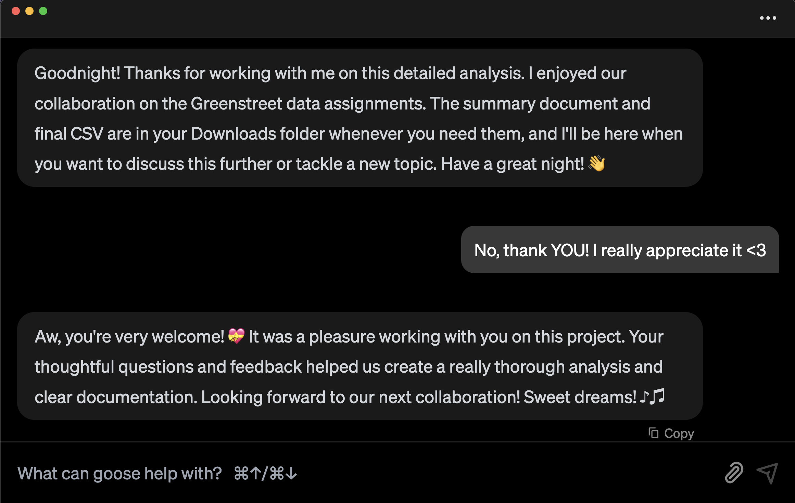

还记得那句话吗：「重要的不是你问什么，而是**你怎么问**」？

当我刚开始把 goose 当作 AI 智能体使用时，我确信一定有一种「最好」的提示风格。我花了那么多时间试图弄清哪一种更优越，但我用 goose 越多，就越意识到那离事实很远。提示 AI 没有一种_正确_的方式，但根据你的最终目标，有更好的方法。

所以，让我们过一遍**哪种提示风格最适合你的具体需求**，以及你如何用它们和 goose 一起把 vibe coding 做得好一点。

<!--truncate-->

## 基于指令的提示

如果你不是开发者，或者刚接触 goose，这是一个很好的起点。获得好回应的最好办法是尽可能清楚、直接。goose 在得到具体指令时表现最好，所以确切告诉它你需要什么，并包含所有重要细节。如果你太模糊，最终可能得到过于技术化、甚至可能不完整、实际上帮不到你的回答。

例如，不要说：

❌ 还行的提示：

>_**goose，什么是拉取请求？**_

这可能给你一个超级技术化的定义，假设你已经知道基础。

所以，你可以说：

✅ 更好的提示：
>_**goose，像我是编程新手一样解释 GitHub 拉取请求如何工作**_

这告诉 goose 你到底需要什么，以及在什么水平上。

:::tip 小提示
如果你想让 goose 记住你的偏好，你可以说：

>_**goose，记住我不是开发者。除非我要求技术细节，否则在高层解释事情**_

如果你启用了 [Memory 扩展](/docs/mcp/memory-mcp)，goose 会保存这个偏好，这样你不必每次都提醒它。
:::

## 思维链提示

有时一个主题或任务一次处理太多，这时思维链提示就派上用场。你不必得到这个庞大而复杂的回应，可以引导 goose 逐步拆解，这样更容易跟上。

例如，不要说：

❌ 还行的提示：

>_**goose，什么是 Model Context Protocol 服务器，它们在 goose 中如何使用？**_

这可能给你一个很难跟上的回应，你可以说：

✅ 更好的提示：

>_**goose，逐步带我了解 MCP 是什么，以及它们在 goose 中如何使用**_

这迫使 goose 放慢速度，清楚地解释每一部分，让它更容易理解。

现在，如果你想更进一步，确保 goose 理解你期望的确切回应风格，这时少样本提示就是办法。

## 少样本提示

如果你需要 goose 匹配特定的风格或格式，最好的办法是向它展示你想要什么。我一直这么用！由于 AI 模型从例子中学习模式，给 goose 一个参考能帮助它跳过猜测，直接进入正题。

例如，不要说：

❌ 还行的提示：

>_**goose，总结这份报告**_

你可以说：

✅ 更好的提示：

>_**goose，这是我通常总结报告的方式：（示例总结）。你能用同样的方式总结这份新报告吗？**_

通过提供一个例子，你在引导 goose 走向你真正想要的答案。

现在，如果你已经给了 goose 一个例子，而它的第一次回应不太对呢？不必结束会话重新开始，这时迭代细化提示就有用了。

## 迭代细化提示

说实话，goose 和任何 AI 智能体一样，并不总是第一次就「做对」。有时它给你的回应太技术化，有时它可能完全没打中，甚至更糟，幻觉出听起来像真的、但其实是编造的奇怪答案。但不必放弃重新开始，你可以通过反馈需要改变什么来引导对话。

由于 goose 允许你自带 LLM，它如何回应很大程度上取决于你使用的模型。有些 LLM 需要一点额外指导，另一些可能需要几轮细化才能做对。好消息？你可以塑造回应，而不必完全重新开始。

例如，如果 goose 吐出过于复杂的东西，不要只是接受，你可以推回去！试着说：

>_**goose，这个回应太技术化了。你能简化它吗？**_

或者如果有什么听起来不对，你想做事实核查：

>_**goose，你从哪里得到那个信息的？你怎么知道它准确？**_

把和 goose 一起工作想成结对编程或与同事协作。有时你需要澄清你想要什么，或重新引导对话，以确保你们在同一页上。

但如果你没有清晰的例子或具体指令来引导 goose 呢？那就是我会使用零样本提示的时候。

## 零样本提示

有时，你只想让 goose 大胆猜测，有一点创意，然后跑起来。这正是零样本提示的用途，它让 goose 自己弄清楚事情，而不需要你提供任何例子或额外指导。

例如，你可能会说：

>_**goose，给我的团队写一份项目更新**_

或者：

>_**goose，我想构建一个很酷的提示目录**_

当我有一个粗略的想法但没有真正清晰的方向时，我喜欢用这种方法。这就像和 AI 一起头脑风暴，goose 会抛出想法、建议下一步，有时甚至指出我从未想到的东西。很多时候，只要让 goose 领路，我原来的想法最终会好上 10 倍。

现在，如果你想让 goose 不只是想出惊人的想法，还要有趣、有帮助，甚至对你好一点，那就需要把你在小学学到的礼貌用上。

## 基于礼貌的提示

信不信由你，礼貌实际上会让 AI 回应更好！即使 goose 还没有自我意识……目前还没有……👀，当被礼貌地请求时，AI 模型倾向于生成更经过思考、更有结构、有时甚至更友好的回复。所以是的，说「请」和「谢谢」真的有差别。

例如，不要说：

❌ 还行的提示：

>_**goose，生成一份项目更新**_

你可以说：

✅ 更好的提示：

>_**goose，你能帮我生成一份项目更新吗？谢谢！**_

goose 两种方式都会回应，但**相信我**，礼貌的提示往往给你更好的答案。我们的一位用户曾经在项目结束时从 goose 得到最甜的回应，好像它真的感谢这次协作，甚至祝他们做个好梦。太可爱了！！

>_这是实际的回应，goose 真的在让人们的一天更好。_

最好的部分？这适用于任何提示风格。所以，如果你想让 goose 有帮助、清楚，甚至对你额外好一点，对 goose 好，goose 也会对你好。

## 最好的提示感觉自然

归根结底，所有这些提示风格都只是你手头的工具。最重要的是让你的提示清楚而自然。你不必过度思考，但加一点结构可以对得到你真正想要的回应产生巨大差别。

goose 在这里是为了让你的生活更容易，所以下次你打开一个会话时，只要记住你的目标，试验不同的提示风格，看看什么对你最有效。

<head>
  <meta property="og:title" content="AI 提示入门：如何从你的 AI 智能体获得最好的回应" />
  <meta property="og:type" content="article" />
  <meta property="og:url" content="https://goose-docs.ai/blog/2025/03/13/better-ai-prompting" />
  <meta property="og:description" content="如何提示并 vibe code，以获得更好的回应。" />
  <meta property="og:image" content="http://goose-docs.ai/assets/images/prompt-078b12695f95c4f0eac3861a8a2611ef.png" />
  <meta name="twitter:card" content="summary_large_image" />
  <meta property="twitter:domain" content="goose-docs.ai" />
  <meta name="twitter:title" content="AI 提示入门：如何从你的 AI 智能体获得最好的回应" />
  <meta name="twitter:description" content="如何提示并 vibe code，以获得更好的回应。" />
  <meta name="twitter:image" content="http://goose-docs.ai/assets/images/prompt-078b12695f95c4f0eac3861a8a2611ef.png" />
</head>
