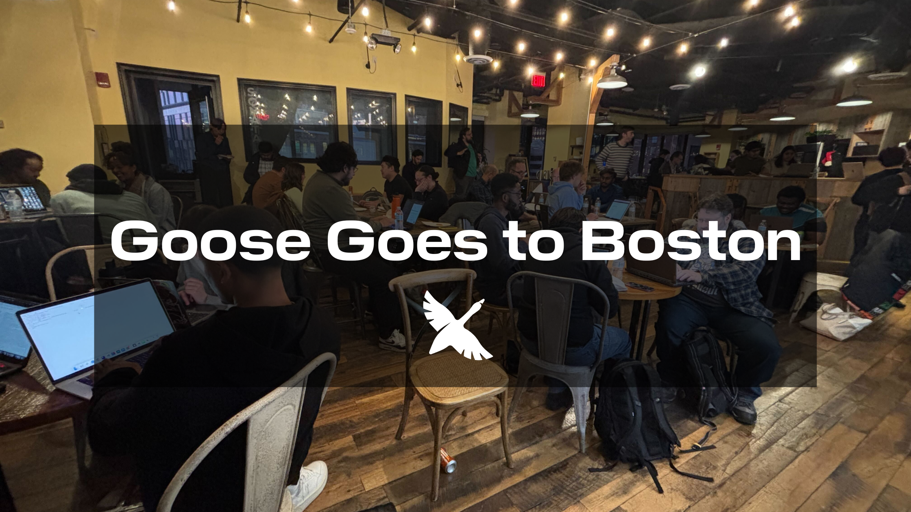
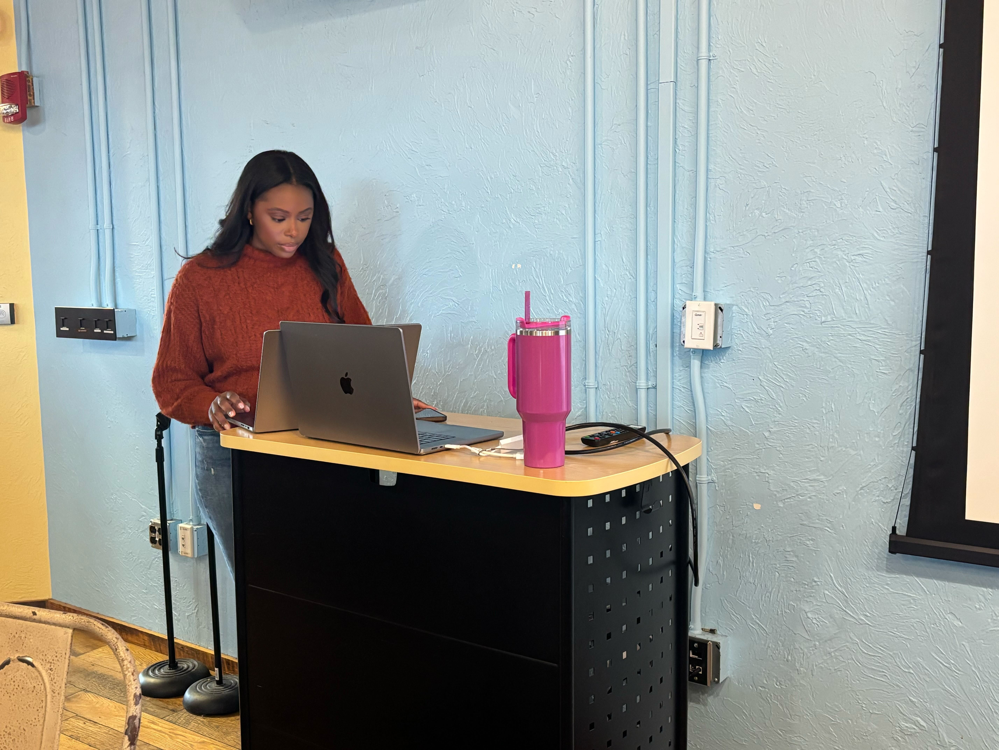
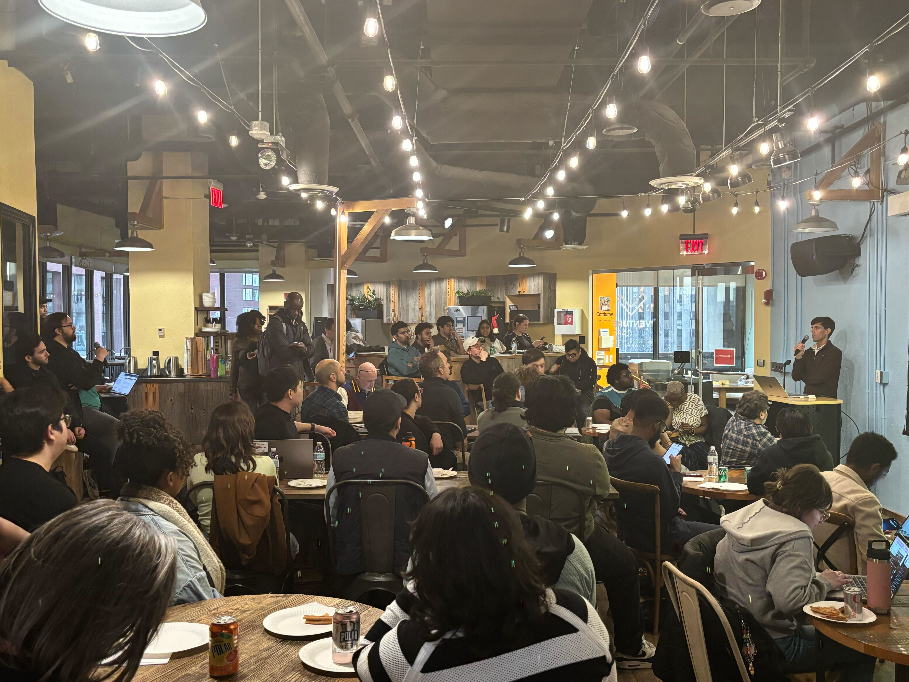
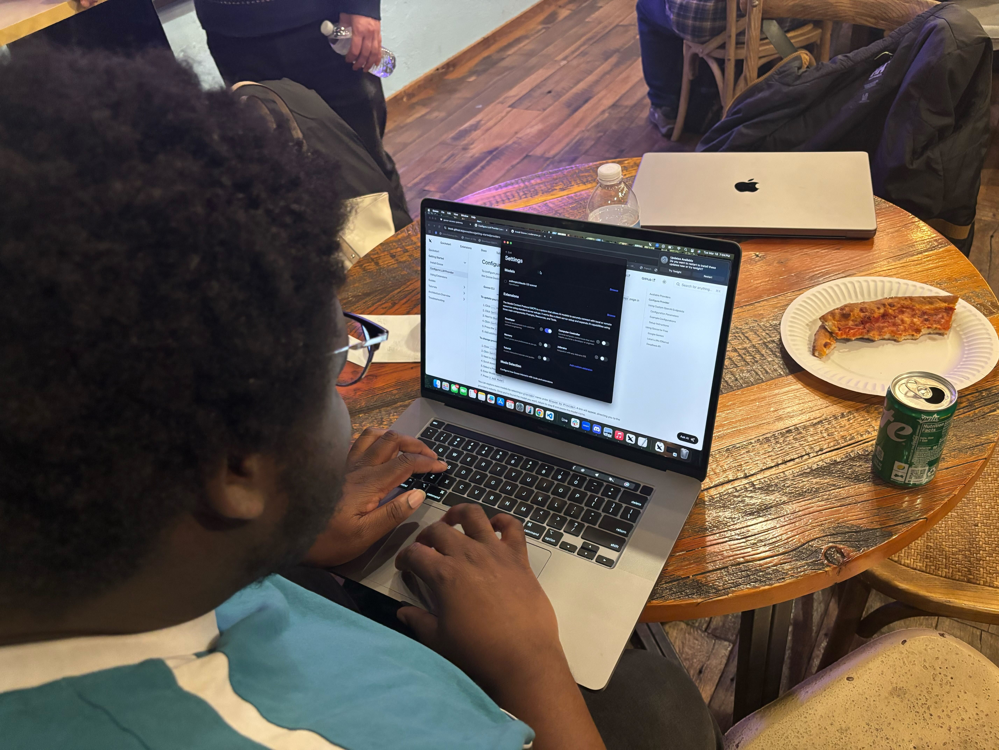
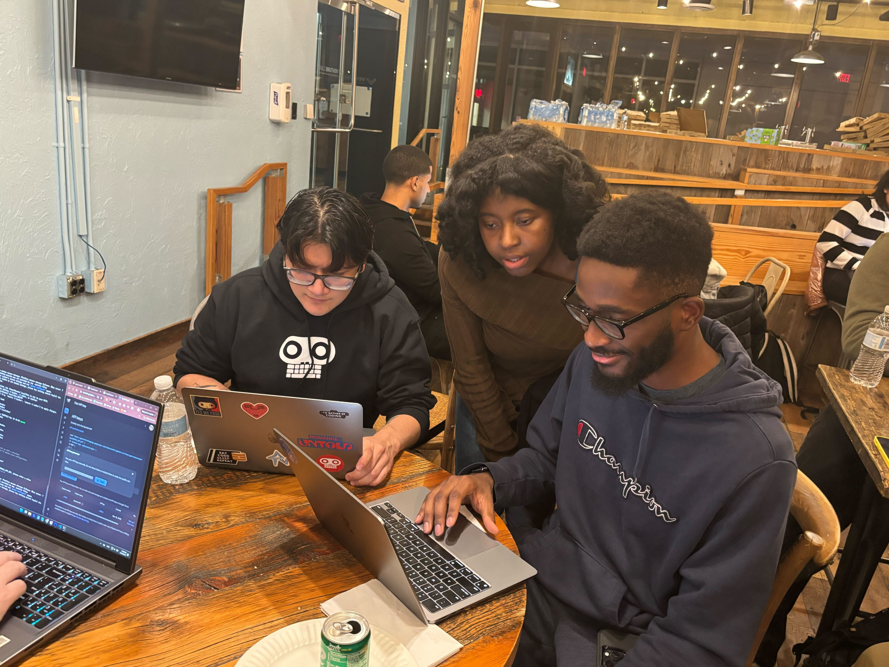
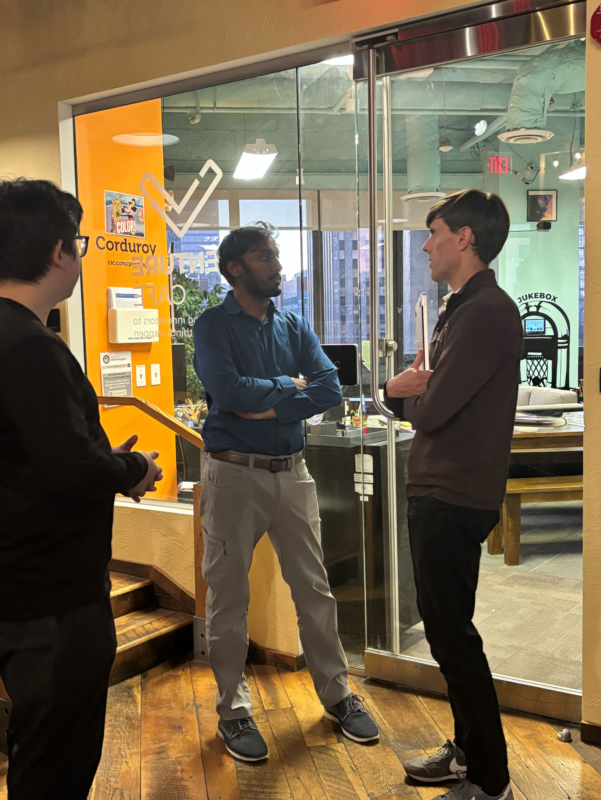
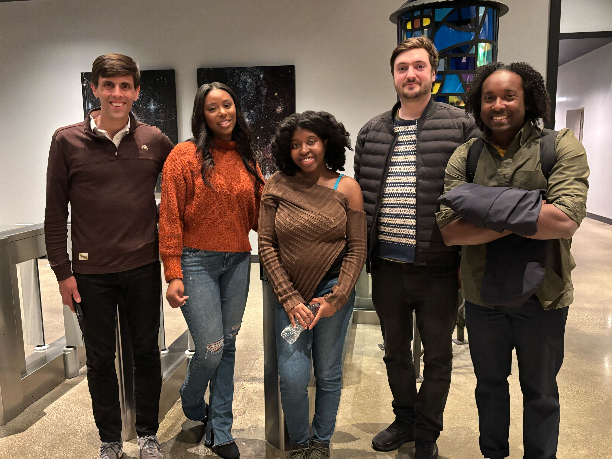

*问题：当你把 70 多位 AI 爱好者、开源贡献者和好奇的学习者聚在一个房间里，会发生什么？*

**答案：你会得到一个充满电的夜晚，有精彩的对话、动手黑客活动，以及对智能体系统令人震撼的洞察。**

本周，我们在剑桥创新中心举办了波士顿的第一场 [goose](https://goose-docs.ai) 聚会。到场人数和能量超出了所有预期！从第一次使用 goose 的用户到资深 AI 工程师，参会者聚在一起，探索 goose 和 [Model Context Protocol（MCP）](https://modelcontextprotocol.io/introduction) 如何塑造 AI 自动化的未来。

<!--truncate-->

## 我们为什么举办这场聚会

随着社区持续增长，我们想创造一个空间，让 goose 爱好者可以：

✅ 结识志同道合的技术人

✅ 为智能体系统和 MCP 兴奋不已

✅ 通过演讲、演示和动手黑客活动学习

波士顿有繁荣的科技生态，看到这么多人聚在一起探索 AI 智能体的未来，令人难以置信。

## 如果你错过了

披萨和社交之后，我们以两场闪电演讲开场，为当晚定下基调：

-  Block, Inc. 开发者倡导者 Ebony Louis 做了一场引人入胜的 goose 介绍，涵盖如何开始、它的能力，以及一场抓住观众的动手演示。回顾这个夜晚，她分享道：

    > 「没有什么能代替当面见面，面对面谈论 AI 智能体能把我们带到哪里。看到第一次使用 goose 的人的兴奋很好，但更有成效的是得到问题和反馈，关于我们如何一起让用户体验更好。AI 正在改变我们如何在线上互动，但这场聚会证明，它也能在现实生活中把我们聚在一起。」

_Ebony 准备走上舞台_

-  Block, Inc. 高级软件工程师、MCP 委员会成员 Alex Hancock 接着深入讲解 Model Context Protocol 架构，拆解它如何驱动智能体系统，以及这个生态接下来是什么。Alex 对房间里的热情印象深刻，他分享道：

    > 「到场人数和参与度让我震惊。演讲结束后留下来回答问题、听人们如何想使用 goose 和 MCP，我玩得很开心。」

_Alex 与观众分享 MCP 洞察_

两场演讲都充满洞察、出色的幽默和互动时刻，让参会者为接下来的内容兴奋不已。

## 我们喜欢的时刻

当晚我们最喜欢的一些亮点：

📞 活动期间，goose 给 Hack.Diversity 校友 Eliana Lopez 打了一通现场电话。这是一个有趣的时刻，展示了 goose 在自动化日常任务方面的真实世界能力。

{/* Video Player */}

  <video 
    controls 
    width="100%" 
    height="400px"
    playsInline
  >
    <source src={require('@site/static/videos/goose_makes_a_call.mp4').default} type="video/mp4" />
    你的浏览器不支持 video 标签。
  </video>

💻 参会者投入动手黑客活动，做自己的项目，试验 goose，并实时分享想法。为了确保每个人都能参与，我们提供了 OpenRouter 额度，让参会者运行 goose 时不必担心访问障碍。

_参会者与 goose 一起做黑客活动_

_Rizel Scarlett 与聚会参会者一起调试_

💬 整个晚上都迸发出引人入胜的讨论，包括：
- MCP 的安全——随着智能体系统扩展，我们应该如何思考安全？
- 智能体系统的未来——我们现在能做什么，接下来是什么？

_Alex 与参会者交谈_

对 Block Inc. 软件工程师 Marcelle B. 来说，这场聚会凸显了社区有多么多样，并强化了让 goose 对每个人都可及的重要性：

    > 「看到参会者背景的多样性很有启发。对一些人来说，goose 是一个机会，把 AI 的力量用到他们的项目上，而我们的聚会是一个友好的地方，让他们先试一试。这让我非常体会到，我们在开发中需要怎样的产品功能，以及多么扎实的实现，这样 goose 才能继续成为一个赋能的工具，而不是又一个你必须是某种『圈内人』才能使用的 AI 产品。」

## 影响以及接下来

这场聚会的兴奋和参与证明，社区驱动的学习有多重要。参会者喜欢这次体验，有人分享道：

    > 「很棒的活动——节奏好，超级友好，学到很多，也遇到了很棒的人。10/10 会推荐！」

没有你们所有人，这场活动不会是这样。向 Hack.Diversity、Resilient Coders、goose 贡献者和波士顿科技圈大声致谢，感谢你们到场、支持，并让这场聚会如此成功！

_波士顿的 goose 团队_

- 如果你正在经历 FOMO（错失恐惧），并想参加下一场聚会，在[社交媒体](https://linktr.ee/goose_oss)上关注我们以获取更新。

- 把 goose 聚会带到你的城市！如果你有场地，在 [Discord](https://discord.gg/n8R5VaWDAn) 上联系我们——让我们促成它！

<head>
  <meta property="og:title" content="codename goose 来到波士顿" />
  <meta property="og:type" content="article" />
  <meta property="og:url" content="https://goose-docs.ai/blog/2025/03/21/goose-boston-meetup" />
  <meta property="og:description" content="我们在波士顿举办了第一场 goose 聚会，把 70 多名社区成员聚在一起，进行闪电演讲、黑客活动和关于智能体系统与 MCP 未来的热烈交谈。" />
  <meta property="og:image" content="http://goose-docs.ai/assets/images/goose_goes_to_boston_banner-3ef0eedeb9d3eac56907c0c5e615d919.png" />
  <meta name="twitter:card" content="summary_large_image" />
  <meta property="twitter:domain" content="goose-docs.ai" />
  <meta name="twitter:title" content="codename goose 来到波士顿" />
  <meta name="twitter:description" content="我们在波士顿举办了第一场 goose 聚会，把 70 多名社区成员聚在一起，进行闪电演讲、黑客活动和关于智能体系统与 MCP 未来的热烈交谈。" />
  <meta name="twitter:image" content="http://goose-docs.ai/assets/images/goose_goes_to_boston_banner-3ef0eedeb9d3eac56907c0c5e615d919.png" />
</head>
