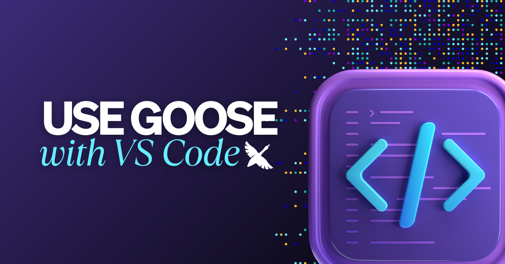

import ArchivedExtensionWarning from '@site/src/components/ArchivedExtensionWarning';



<ArchivedExtensionWarning extensionName="VS Code MCP" repoUrl="https://github.com/block/vscode-mcp" />

想在 VS Code 里使用 goose 吗？在最近的 [Wild Goose Case 直播](https://www.youtube.com/watch?v=hG7AnTw-GLU&ab_channel=BlockOpenSource)中，主持人 [Ebony Louis](https://www.linkedin.com/in/ebonylouis/) 和 [Adewale Abati](https://www.linkedin.com/in/acekyd/) 邀请了 Cash App 工程负责人 [Andrew Gertig](https://www.linkedin.com/in/andrewgertig/)。他演示了新的 VSCode MCP，以及它如何把强大的 goose 辅助编程能力直接带进 VS Code。

<!--truncate-->

## 什么是 VSCode MCP？
[VSCode MCP 服务器](https://github.com/block/vscode-mcp)及其配套的 [VSCode 扩展](https://marketplace.visualstudio.com/items?itemName=block.vscode-mcp-extension)让像 goose 这样的 AI 智能体能够通过 Model Context Protocol 与 VS Code 交互。

正如 Andrew 在直播中解释的，MCP（[Model Context Protocol](https://modelcontextprotocol.io/introduction)）服务器充当大语言模型（LLM）与你想访问的应用或工具之间的代理，这里就是 VS Code。扩展是基于该协议的附加组件，提供一种为你的工作流扩展 goose 功能的方式。

```
vscode-mcp/
├── server/    # MCP server implementation
└── extension/ # VS Code extension
```

## 关键功能
VSCode MCP 和 VSCode 扩展提供了几个值得探索的强大功能：

**智能上下文感知**

该扩展保持 goose 与你的 VS Code 环境同步，从而理解项目结构并给出与上下文相关的建议。在现场演示中，这非常有用：goose 能精确地在复杂代码库中导航。

**交互式代码修改**

扩展不会直接改代码，而是通过 VS Code 的 diff 工具呈现修改。这确保没有你的明确批准就不会发生代码变更，让你保持对代码库的控制。

**逐步处理复杂度**

演示中，VSCode MCP 无缝处理了复杂度各异的任务，从基本文本修改，到实现带动画表情和鼠标交互的功能。

**实时视觉反馈**

开发者可以在 diff 视图中实时看到建议的变更，从而在接受之前轻松理解 goose 具体建议改什么。演示中，一个表情的尺寸在视觉上变化，同时保留了现有功能。

## VSCode MCP 下一步是什么？
功能不止于此。团队正在积极探索几项令人兴奋的功能，把 VSCode MCP 带到下一阶段：

- **用于细粒度控制的自定义 diff 工具**——这意味着你可以选择接受或拒绝变更中的特定部分。
- **智能导航到特定代码位置**——想象你可以让 goose 直接带你到函数定义或某个具体实现。
- **增强的 lint 集成**——帮助自动维持代码质量标准，让在上线前修复问题容易得多。
- **用于执行命令的终端集成**——这将允许 goose 执行命令，并直接在你的开发环境中显示结果。
- **可能把 goose 聊天集成进 VS Code 侧边栏**——Andrew 快速预览了一个早期原型，展示 goose 直接在 VS Code 里运行。

# 社区与贡献
该项目是开源的，欢迎社区贡献。如果你想支持项目或直接贡献，可以查看 [GitHub 上的 VSCode MCP 仓库](https://github.com/block/vscode-mcp)，或者[加入 Block Open Source Discord](https://discord.gg/n8R5VaWDAn)，向团队提问或发起讨论。

<head>
  <meta property="og:title" content="在 VS Code 里破解代码" />
  <meta property="og:type" content="article" />
  <meta property="og:url" content="https://goose-docs.ai/blog/2025/03/21/goose-vscode" />
  <meta property="og:description" content="用这个 Visual Studio Code MCP，把 goose 直接连到你的代码编辑器。" />
  <meta property="og:image" content="http://goose-docs.ai/assets/images/vscodestream-74eafa34e7ae10cfb738feddecc98519.png" />
  <meta name="twitter:card" content="summary_large_image" />
  <meta property="twitter:domain" content="goose-docs.ai" />
  <meta name="twitter:title" content="在 VS Code 里破解代码" />
  <meta name="twitter:description" content="用这个 Visual Studio Code MCP，把 goose 直接连到你的代码编辑器。" />
  <meta name="twitter:image" content="http://goose-docs.ai/assets/images/vscodestream-74eafa34e7ae10cfb738feddecc98519.png" />
</head>
