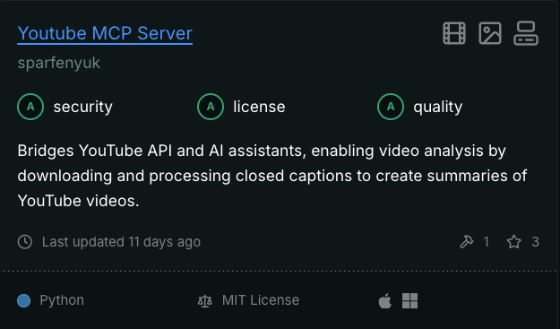

# 接入之前我如何审查 MCP 服务器

[Model Context Protocol（MCP）](https://www.anthropic.com/news/model-context-protocol)服务器现在到处都是。我上次查看时已经有 **3000 个，而且还在增加**。每天都有新的冒出来，让像 goose 这样的 AI 智能体访问文件、查询你的 Google Drive、搜索网页，并解锁各种出色的集成。

<!--truncate-->

正当我觉得事情不能再更疯狂时，Zapier 给我们带来了一台 MCP 服务器。这意味着你的智能体现在可以接入 8000 多个集成。

所以相信我，我知道把 AI 智能体接到一切上、看看会发生什么，诱惑非常大。

但等一下，我们不能跳过安全。

当你连接到一台 MCP 服务器，你就是在给它访问你工作流的权限，很多时候还包括你的数据。而且很多服务器是社区构建的，几乎没有治理。

## 在信任一台 MCP 服务器之前我会做什么

每次我查看一台新的 MCP 服务器、准备接到 goose 时，我都从 **[Glama.ai](https://glama.ai/mcp/servers)** 开始。

Glama 是一个一体化 AI 工作区，它维护着我见过的**最全面、也最注重安全的 MCP 服务器目录之一**。列出的服务器要么是社区构建的，要么由工具背后的公司创建，比如 **Azure** 或 **JetBrains**。

每台服务器都有一张**成绩单**，所以一眼就能判断它是扎实的，还是有点可疑。

## Glama 评什么分

Glama 对服务器的评分包括：

- ✅ **安全**——检查服务器或其依赖中的已知漏洞
- ✅ **许可证**——确认它使用宽松的开源许可证
- ✅ **质量**——表明服务器是否在运行，以及是否按预期工作

你还会看到有用的上下文，比如服务器暴露了多少工具、是否有 README 文件、上次更新时间，以及是否通过 MCP inspector 工具支持实时预览。

Glama 不只做一次检查，他们会**定期重新评估服务器**，所以如果某样东西坏了或引入了漏洞，分数会自动更新。

这里有一个扎实服务器的例子：**YouTube MCP 服务器**，它让 goose 下载并处理视频，以创建摘要和文字稿。

>_全是 A——**安全、许可证和质量**。_

这正是我在把 goose 接到任何服务器之前想看到的分数。

所以请**先检查再连接**。

快速看一眼像 Glama 这样的 MCP 目录，可以免得你以后在办公室地板上哭。不过，功课做完之后呢？

**去玩吧。把智能体接上。搞坏一些东西（安全地）。然后安心地 vibe code。**

<head>
  <meta property="og:title" content="如何判断一台 MCP 服务器是否安全" />
  <meta property="og:type" content="article" />
  <meta property="og:url" content="https://goose-docs.ai/blog/2025/03/26/mcp-security" />
  <meta property="og:description" content="在把 AI 智能体接到任意 MCP 服务器之前，这里说明如何检查它是否真的安全。" />
  <meta property="og:image" content="http://goose-docs.ai/assets/images/mcpsafety-87eb7ace7163a5edbe068ff75b79a199.png" />
  <meta name="twitter:card" content="summary_large_image" />
  <meta property="twitter:domain" content="goose-docs.ai" />
  <meta name="twitter:title" content="如何判断一台 MCP 服务器是否安全" />
  <meta name="twitter:description" content="在把智能体接到任意 MCP 服务器之前，这里说明如何检查它是否真的安全。" />
  <meta name="twitter:image" content="http://goose-docs.ai/assets/images/mcpsafety-87eb7ace7163a5edbe068ff75b79a199.png" />
</head>
