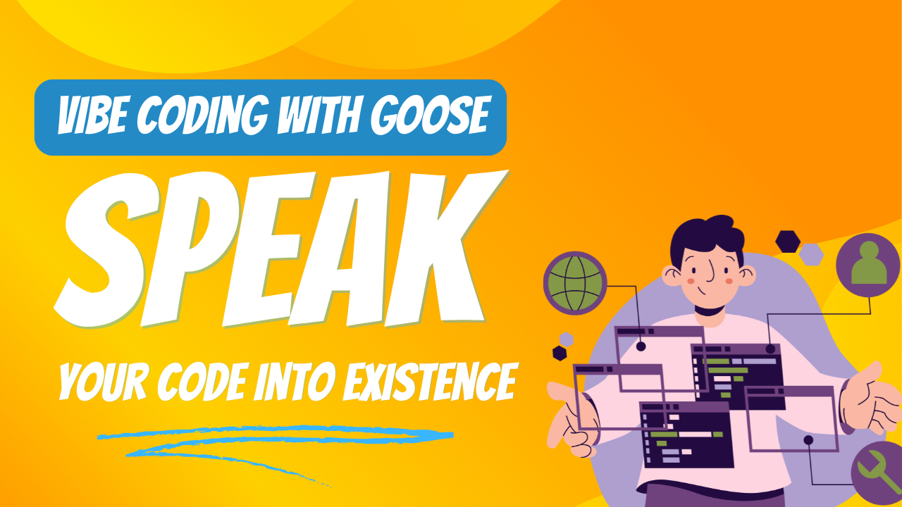

想象只靠大声描述你想要什么来创建一个应用，就像在和朋友说话。这就是 vibe coding 的魔力：在 AI 智能体的帮助下，把自然语言变成能运行的代码。打字输入提示能完成工作，但说出来感觉完全不同 🔥 新的 [Speech MCP 服务器](/docs/mcp/speech-mcp)简直是走进了聊天。

<!--truncate-->

在最近的 [Wild Goose Case 直播](https://www.youtube.com/watch?v=Zey9GHyXlHYe)中，主持人 [Ebony Louis](https://www.linkedin.com/in/ebonylouis/) 和 [Adewale Abati](https://www.linkedin.com/in/acekyd/) 邀请了来自 Block AI 工具团队的 [Max Novich](https://www.linkedin.com/in/maksym-stepanenko-26404867)，他演示了一个令人兴奋的新扩展——[Speech MCP 服务器](https://github.com/Kvadratni/speech-mcp)。

直播中，Max 只用语音命令创建了整个 Web 应用——不需要键盘或鼠标。结果是一个充满活力、带有 3D 效果、合成波美学和交互元素的动画网页，全部通过与 goose 的自然对话创建。

<iframe class="aspect-ratio" src="https://www.youtube.com/embed/Zey9GHyXlHY?start=437&end=752" title="YouTube video player" frameborder="0" allow="accelerometer; autoplay; clipboard-write; encrypted-media; gyroscope; picture-in-picture; web-share" referrerpolicy="strict-origin-when-cross-origin" allowfullscreen></iframe>


## Speech MCP 服务器

[Speech MCP](https://github.com/Kvadratni/speech-mcp)是一个开源 MCP 服务器，让你能与像 goose 这样的 AI 智能体进行语音交互。它的特别之处在于完全在你的机器上本地运行，因此它：

- 与 LLM 无关
- 注重隐私
- 比基于云的替代方案更省成本
- 没有互联网连接也能使用

### 关键功能

1. **本地语音处理**：使用两个主要模型：
   - Faster Whisper：一种把语音转成文本的高效方法
   - Coqui TTS：一个日本工程团队打造的文本转语音模型，有 54 种听起来自然的声音

2. **声音选择**：从 54 种不同声音中选择，特征和个性各异

3. **多说话人叙述**：生成并播放多个声音之间的对话

4. **音频转写**：把音频/视频内容转成带时间戳和说话人检测的文本

## 现场演示亮点

演示中，Max 展示了几项令人印象深刻的能力：

1. **语音控制的开发**：
   - 创建动画文字效果
   - 实现 3D 变换
   - 用渐变和网格加入合成波美学
   - 集成音乐控制

2. **系统集成**：
   - 用语音命令控制 Discord 等应用
   - 在文件系统和开发环境中导航
   - 生成并管理音频内容

3. **自然交互**：
   - 与 goose 流畅对话
   - 实时反馈和调整
   - 用于文档的多声音叙述

## 开始使用

要自己试用 Speech MCP 服务器：

1. 安装所需的音频库（PortAudio）：
   ```bash
   # For macOS
   brew install portaudio
   
   # For Linux
   apt-get install portaudio  # or dnf install portaudio
   ```

2. 使用一键[深链接安装](goose://extension?cmd=uvx&&arg=-p&arg=3.10.14&arg=speech-mcp@latest&id=speech_mcp&name=Speech%20Interface&description=Voice%20interaction%20with%20audio%20visualization%20for%20Goose)直接在 goose 中安装该扩展


## 加入开发

Speech MCP 服务器是[开源的](https://github.com/Kvadratni/speech-mcp)，欢迎贡献。你也可以在 [Discord](https://discord.gg/n8R5VaWDAn)上联系 Max，提问和协作。

与像 goose 这样有能力和工具去执行指令的 AI 智能体进行语音交互，带来一种不同的氛围，让未来感觉比以往更近。无论你对 vibe coding、无障碍改进感兴趣，还是只是想在让 goose 扮演 J.A.R.V.I.S 时更像一点钢铁侠，Speech MCP 服务器都提供了人机协作未来的一瞥——而且今天就能用。

<head>
  <meta property="og:title" content="用 goose 和 Speech MCP 做 vibe coding" />
  <meta property="og:type" content="article" />
  <meta property="og:url" content="https://goose-docs.ai/blog/2025/03/28/vibe-coding-with-goose" />
  <meta property="og:description" content="探索新的 Speech MCP 服务器，它让你用语音控制编程，并与 AI 智能体自然对话。" />
  <meta property="og:image" content="https://goose-docs.ai/assets/images/vibe-coding-b2efeed37ea43f4773da5f1ff96f4184.png" />
  <meta name="twitter:card" content="summary_large_image" />
  <meta property="twitter:domain" content="goose-docs.ai" />
  <meta name="twitter:title" content="用 goose 和 Speech MCP 做 vibe coding" />
  <meta name="twitter:description" content="探索新的 Speech MCP 服务器，它让你用语音控制编程，并与 AI 智能体自然对话。" />
  <meta name="twitter:image" content="https://goose-docs.ai/assets/images/vibe-coding-b2efeed37ea43f4773da5f1ff96f4184.png" />
</head>
