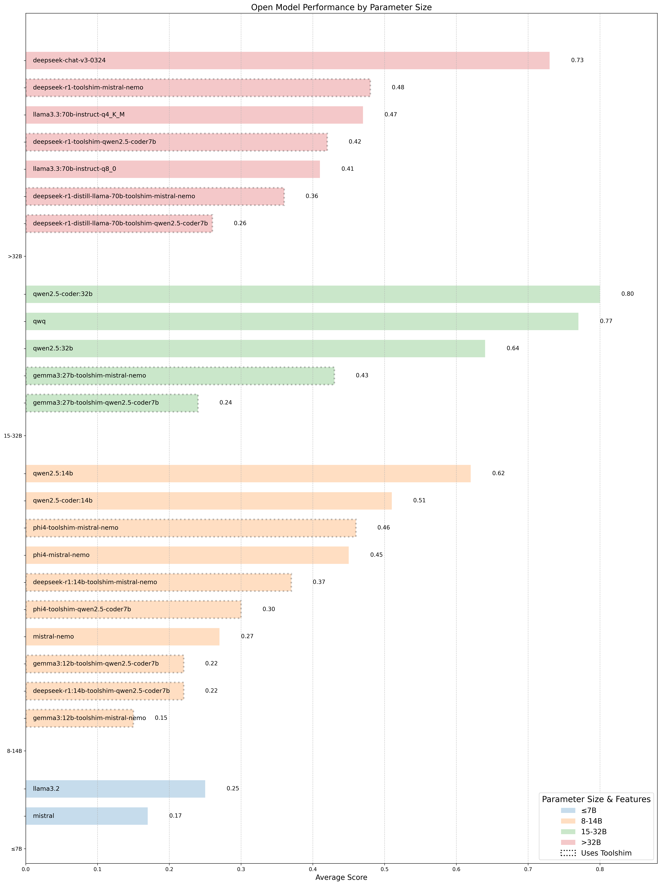
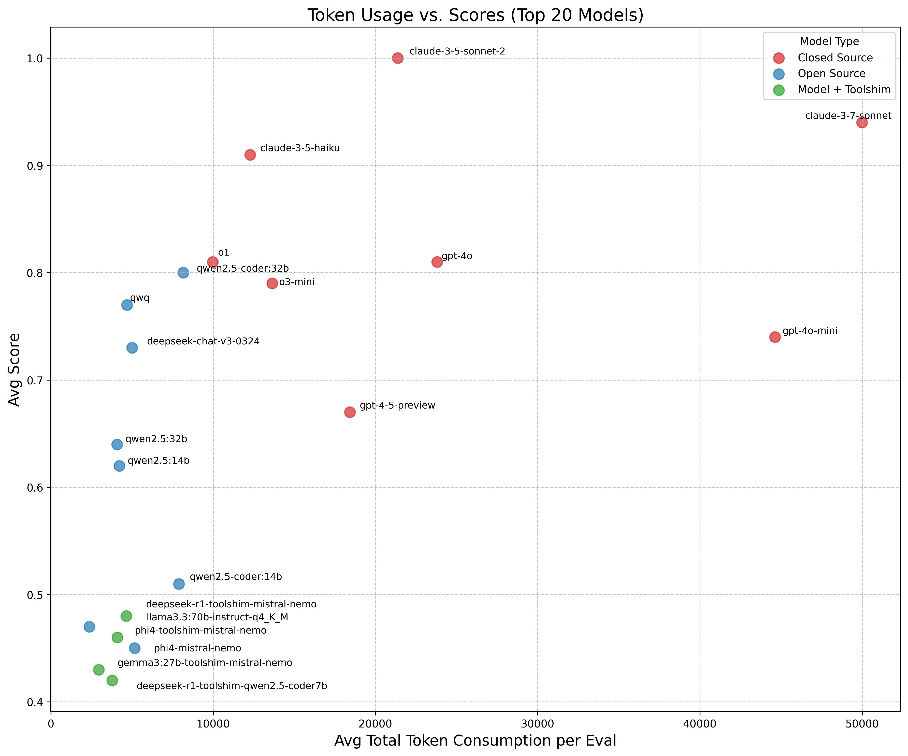
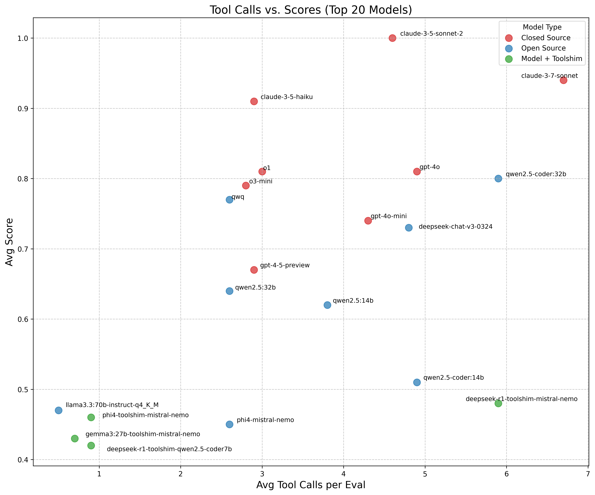

import ImageCarousel from '@site/src/components/ImageCarousel';


我们一直在用各种 AI 模型衡量 goose 的表现，其中包括不少能在消费级硬件（RTX 4080、Mac M 系列）上本地运行的流行开源模型。我们知道，社区里很多人看重完全开源、本地运行、不依赖云服务的体验。

这篇博文分享我们把开源模型与闭源模型对比后的发现，既指出当前的性能差距，也标出今后改进的路径。我们的基准测试仍处早期，但我们希望把它作为一个起点：用模型驾驶 goose 的能力，区分哪些模型展现出更强的智能体能力（这不同于其他流行基准里常测的推理或其他能力）。


<!--truncate-->

我们的评测受到 [r/LocalLlama](https://www.reddit.com/r/LocalLLaMA/) 这类社区里草根做法的启发。如果你在那里待过，大概见过爱好者众包模型在标准任务上的表现，比如「做一只 flappy bird 游戏」，或[做一个带弹球的旋转六边形](https://www.reddit.com/r/LocalLLaMA/comments/1j7r47l/i_just_made_an_animation_of_a_ball_bouncing/)，以便快速比较模型。

这些社区评测不是研究实验室发表在学术论文里的那种严格、经过同行评审的基准。但它们能对不同模型和版本的能力给出快速、直觉的判断。

本着同样的精神，我们推出 **goose 氛围检查**排行榜。

感谢 Ollama 团队在促成这篇博文的实验中提供的帮助和支持！我们用了 Ollama 的[结构化输出](https://ollama.com/blog/structured-outputs)功能来启用[toolshim 实现](https://goose-docs.ai/docs/experimental/ollama)（下文会讲），也用了他们最近发布的[上下文长度参数覆盖](https://github.com/ollama/ollama/blob/main/docs/faq.mdx#how-can-i-specify-the-context-window-size)，以便在更长的上下文上测试。

## 排行榜

| Rank | Model | Average Eval Score | Inference Provider |
|------|-------|-------------------|-------------------|
| 1 | claude-3-5-sonnet-2 | 1.00 | databricks (bedrock) |
| 2 | claude-3-7-sonnet | 0.94 | databricks (bedrock) |
| 3 | claude-3-5-haiku | 0.91 | databricks (bedrock) |
| 4 | o1 | 0.81 | databricks (bedrock) |
| 4 | gpt-4o | 0.81 | databricks (bedrock) |
| 6 | qwen2.5-coder:32b | 0.8 | ollama |
| 7 | o3-mini | 0.79 | databricks (bedrock) |
| 8 | qwq | 0.77 | ollama |
| 9 | gpt-4o-mini | 0.74 | databricks (bedrock) |
| 10 | deepseek-chat-v3-0324 | 0.73 | openrouter |
| 11 | gpt-4-5-preview | 0.67 | databricks |
| 12 | qwen2.5:32b | 0.64 | ollama |
| 13 | qwen2.5:14b | 0.62 | ollama |
| 14 | qwen2.5-coder:14b | 0.51 | ollama |
| 15 | deepseek-r1-toolshim-mistral-nemo* | 0.48 | openrouter |
| 16 | llama3.3:70b-instruct-q4_K_M | 0.47 | ollama |
| 17 | phi4-toolshim-mistral-nemo* | 0.46 | ollama |
| 18 | phi4-mistral-nemo | 0.45 | ollama |
| 19 | gemma3:27b-toolshim-mistral-nemo* | 0.43 | ollama |
| 20 | deepseek-r1-toolshim-qwen2.5-coder7b* | 0.42 | openrouter |
| 21 | llama3.3:70b-instruct-q8_0 | 0.41 | ollama |
| 22 | deepseek-r1:14b-toolshim-mistral-nemo* | 0.37 | openrouter |
| 23 | deepseek-r1-distill-llama-70b-toolshim-mistral-nemo* | 0.36 | ollama |
| 24 | phi4-toolshim-qwen2.5-coder7b* | 0.3 | ollama |
| 25 | mistral-nemo | 0.27 | ollama |
| 26 | deepseek-r1-distill-llama-70b-toolshim-qwen2.5-coder7b* | 0.26 | openrouter |
| 27 | llama3.2 | 0.25 | ollama |
| 28 | gemma3:27b-toolshim-qwen2.5-coder7b* | 0.24 | ollama |
| 29 | deepseek-r1:14b-toolshim-qwen2.5-coder7b* | 0.22 | ollama |
| 29 | gemma3:12b-toolshim-qwen2.5-coder7b* | 0.22 | ollama |
| 31 | mistral | 0.17 | ollama |
| 32 | gemma3:12b-toolshim-mistral-nemo* | 0.15 | ollama |

> _名称里带 toolshim 的模型，表示一种 goose 配置：同时使用一个主模型和一个本地 Ollama 辅助模型，把主模型的回应解释成 goose 要调用的合适工具。低分可能反映的是 shim 的表现，而不是基础模型本身。我们只对部分模型使用 toolshim，因为本实验里的所有评测都需要工具使用能力，但并非所有模型都原生支持工具调用。_

## 开源模型详情

| Rank | Model                                    | Model Params                      | Quantization |
|-----|-------------------------------------------|-----------------------------------|-------------|
| 1   | qwen2.5-coder:32b                          | 32B                               | Q4_K_M      |
| 2   | qwq                                        | 32B                               | Q4_K_M      |
| 3   | deepseek-chat-v3-0324                       | 671B total, 37B active             | -           |
| 4   | qwen2.5:32b                                | 32B                               | Q4_K_M      |
| 5   | qwen2.5:14b                                | 14B                               | Q4_K_M      |
| 6   | qwen2.5-coder:14b                           | 14B                               | Q4_K_M      |
| 7   | deepseek-r1-toolshim-mistral-nemo            | 671B total, 37B active             | fp8         |
| 8   | llama3.3:70b-instruct-q4_K_M                 | 70B                               | Q4_K_M      |
| 9   | phi4-toolshim-mistral-nemo                   | 14B                               | Q4_K_M      |
| 10  | phi4-mistral-nemo                           | 14B                               | Q4_K_M      |
| 11  | gemma3:27b-toolshim-mistral-nemo             | 27B                               | Q4_K_M      |
| 12  | deepseek-r1-toolshim-qwen2.5-coder7b         | 671B total, 37B active             | fp8         |
| 13  | llama3.3:70b-instruct-q8_0                   | 70B                               | Q8_0        |
| 14  | deepseek-r1:14b-toolshim-mistral-nemo         | 14B                               | Q4_K_M      |
| 15  | deepseek-r1-distill-llama-70b-toolshim-mistral-nemo | 70B                      | -           |
| 16  | phi4-toolshim-qwen2.5-coder7b                | 14B                               | Q4_K_M      |
| 17  | mistral-nemo                                | 12B                               | Q4_0        |
| 18  | deepseek-r1-distill-llama-70b-toolshim-qwen2.5-coder7b | 70B                 | -           |
| 19  | llama3.2                                    | 3B                                | Q4_K_M      |
| 20  | gemma3:27b-toolshim-qwen2.5-coder7b          | 27B                               | Q4_K_M      |
| 21  | deepseek-r1:14b-toolshim-qwen2.5-coder7b     | 14B                               | Q4_K_M      |
| 21  | gemma3:12b-toolshim-qwen2.5-coder7b          | 12B                               | Q4_K_M      |
| 23  | mistral                                     | 7B                                | Q8_0        |
| 24  | gemma3:12b-toolshim-mistral-nemo             | 12B                               | Q4_K_M      |




   > _这张图展示不同参数规模下开源模型的表现。在 15-32B 这一档，qwen2.5-coder:32b（0.80）和 qwq（0.77）这类模型尤其亮眼。图中也标出了具备原生工具调用能力的模型，与需要 toolshim 实现的模型（虚线）之间的性能差距，而且这个差距在所有规模档里都大致一致。这说明原生工具调用能力会显著影响智能体任务上的表现。如果针对工具调用能力做定向改进，更大的开源模型有可能在智能体场景里缩小与闭源方案的差距。_




   > _这张散点图显示，Claude 模型无论 token 用量多少都能拿到顶尖分数（0.9+），而 qwen2.5-coder:32b 这类开源模型在中等 token 消耗下表现不错。使用 toolshim 的模型分数持续偏低，说明 toolshim 在弥补模型之间原生工具支持差距方面并不很有效。在一定范围内，更高的 token 消耗通常会改善表现。_




> _工具调用过少或过多的模型分数都更低，说明与更好表现相关的是有效使用工具，而不只是调用次数。使用 toolshim 的模型大多调用次数更少，说明以目前的实现，toolshim 还不足以让模型有效地调用正确的工具。_


## 关键结果

1. **闭源模型目前领先**：Claude 和 GPT 这类闭源模型在智能体任务上总体仍领先于开源替代方案。

2. **有希望的开源挑战者**：Qwen 系列和 DeepSeek-v3 这类模型在开源替代方案里很有潜力，但它们还没有在所有任务上达到闭源模型那种一致性和可靠性。

3. **Token 效率很重要**：有些开源模型可以用更少的 token 取得不错的表现，这可以转化为更快的任务完成时间，以及可能更低的成本。claude-3-7-sonnet 和 claude-3-5-sonnet-2 一样表现强，但 token 用量大得多。

4. **工具调用至关重要，但今天的开源模型还没那么可靠**：有效的工具调用仍是智能体模型表现的重要区分因素。开源模型在可靠生成结构化工具调用方面仍然吃力，限制了它们在复杂任务上的效果。

5. **需要更全面、更复杂的评测任务，才能进一步拉开顶尖模型的差距：** 我们当前的评测套件只有八个任务（各跑 3 次），可能太有限，不足以有效区分顶尖模型。好几个模型的分数挤在 0.77-0.81 附近，很可能是因为任务简单，几乎不需要复杂推理。把评测扩展到更精细的任务，能进一步分层，也让模型更好地展示更强或更弱的能力。

## 方法与做法

我们开发了一套紧凑、范围清楚的评测，用来建立当前的性能基线。任务相对简单，但已经能有意义地区分模型表现。与主要关注文本生成（例如问答、代码生成）的基准不同，我们的评测强调**工具调用能力**——这是让 goose 成为强大智能体的核心组成部分。

工具调用让模型能与 [MCP 扩展](https://github.com/modelcontextprotocol/servers)交互并发起 API 调用，把 goose 的功能扩展到基础模型之外。很多情况下，任务需要多次串联的工具调用才能完成。例如，修改一个文件包括在文件系统里找到它、查看内容，然后更新它。每一步都必须正确执行，任务才算有效完成。

### 评测套件

我们的评测定义在 [goose 仓库](https://github.com/aaif-goose/goose/tree/main/crates/goose-bench/src/eval_suites)里（欢迎 PR 增加更多评测！），分成两类：

#### 核心套件
这些评测关注开发者工作流里的某些基础任务：
- **创建文件**：生成并保存一个新文件
- **列出文件**：访问并显示目录内容
- **开发者搜索/替换**：在一个大文件里搜索并做多处替换

#### 氛围套件
这些任务被设计成一次「氛围检查」，能快速看出模型带着 goose 做各种各样任务时表现如何。有些任务，比如 Flappy Bird 和 goose Wiki，可以直接用眼睛检查，方便跨模型扫一眼输出：

- **博客摘要**：抓取一篇博文并总结要点
- **Flappy Bird**：用 Python 2D 实现这个游戏
- **goose Wiki**：做一个关于 goose 的维基百科风格网页
- **餐厅调研**：搜索纽约东村最好的川菜馆
- **松鼠普查**：对一个 CSV 文件做数据分析

这组初始评测是精心挑选的手工设计任务，用来突出模型与 goose 集成时的关键强弱。但这只是开始！我们的目标是持续用高质量、有针对性的任务扩展 Goosebench 评测套件，更深入地了解模型与 goose 一起工作时的表现。

### 评测方法

每个模型都在上述 **8 个任务**上测试，**每个任务跑 3 次**（每个模型共 **24 次运行**）：

- 每次评测都是给 goose 的单轮提示。这个基准关注单轮执行，未来的评测可能会评估多轮交互和迭代改进
- goose 必须在没有用户干预的情况下，用工具执行循环自主完成任务
- 如果 goose 停下来向用户要更多指引（例如「我要把以下内容写入文件。要继续吗？」），这被视为任务完成的终点。在这种情况下，即便方向是对的，按我们的评测框架，goose 也可能没有成功完成任务。
- 为了计入输出的波动，每个评测对每个模型跑三次，给多次成功机会。

### 评分与评测标准

我们把模型在所有评测任务上的表现取平均，得到排行榜分数。对每个任务，我们跑三次，并把每次分数归一化到 0-1。该任务的分数是这三次的平均。最终排行榜分数是该模型所有任务分数的平均。

每个评测按针对具体任务混合的标准打分：

1. **工具调用执行**：模型是否做了正确的工具调用来完成任务？

2. **LLM 作为裁判**（适用时）：有些评测用 GPT-4o 按 0-2 分评估回答质量。这些情况下，我们生成 3 次 GPT-4o 评估，取其中最常见的分数；如果需要打破平局，再跑第四次，得到最终分数。
   - 0 分：不正确，或有根本缺陷
   - 1 分：部分正确，但有问题
   - 2 分：完全正确，而且执行得好

3. **任务特定标准**：不同任务需要不同检查，例如：
   - 正确的输出格式（例如 markdown、输出到文件）
   - 预期答案（例如数据分析里的正确洞察）
   - 有效实现（例如有效的 Python 代码）

有些评测，比如代码执行或创建文件，有清楚的通过/失败标准，类似单元测试。另一些，比如博客摘要或餐厅调研，需要定性判断，而不是严格的对错。为了同时评估客观任务和开放式任务，我们把任务特定标准、工具调用核验，以及（适用时）LLM 作为裁判的评分结合起来。

为了同时评估客观任务和开放式任务，我们把任务特定标准、工具调用核验，以及（适用时）LLM 作为裁判的评分结合起来。这种方法在正确性定义清楚的地方保持严格，同时允许对主观输出做有细微差别的评估。

我们的目标是给出模型表现的方向性信号，而不是绝对精度，在具体标准和定性标准之间取得平衡。


此外，我们还跟踪：

1. **Token 效率**：衡量成功运行中使用的总 token，从而了解模型效率和推理速度。

2. **耗时**：执行任务的时间。这没有反映在排行榜上，因为它受模型推理提供商和硬件差异的显著影响。

### 对结果的人工检查与观察

我们人工抽查了一部分结果来评估质量。鉴于规模（32 个模型共 768 次运行），对每一次评测做完整人工核验并不可行。检查中的要点：

- LLM 作为裁判在识别完全错误的答案（0 分）时是可靠的，但区分 1 分和 2 分更主观。

- 有些任务（例如博客摘要、餐厅搜索）缺少自动的事实核验。评测框架可以确认是否调用了工具（例如执行了网页搜索），LLM 裁判也能在一定程度上评估是否遵循指令，但整个系统无法核验回答在事实上是否正确。

- 工具执行失败是表现波动的一个关键来源，凸显了智能体能力在真实 AI 任务中的重要性。模型也许能在对话里生成正确输出，但如果它随后没能执行正确的工具——比如按用户指示把输出写到正确的文件——任务就不完整。这强调模型需要可靠地自主完成多步动作，而不只是生成准确的回应。


## 开源模型的技术挑战

### 上下文长度限制

实验早期遇到的一个关键限制，是 Ollama 的 OpenAI 兼容端点默认上下文长度（2048 个 token），对大多数交互式智能体场景都不够。

光是我们的系统提示就消耗大约 1,000 个 token，留给用户查询、上下文和工具回应的空间很有限。这个限制妨碍模型在不丢失关键上下文的情况下处理长时间或复杂的任务。量化（例如许多 Ollama 模型默认 4-bit）可以降低内存占用，但也可能降低表现。

不过，我们没有广泛探索不同量化级别的影响。幸运的是，在我们工作期间，Ollama 引入了一项覆盖，让我们能增加上下文长度，从而在实验中缓解这个限制。


### 各模型工具调用不一致

不同模型对工具调用格式的预期不同。例如，Ollama 需要 JSON，而 Functionary 这类则用 XML。缺少标准化给推理提供商带来集成挑战，他们必须为每个模型调整工具调用机制。

我们观察到，表现会随模型托管方和输入/输出格式而波动，这凸显了在模型训练中需要标准化的工具调用格式。
对没有原生工具调用能力的模型，我们开发了「toolshim」——一个解释层，把模型输出翻译成合适的工具调用。

这种方法让 DeepSeek 和 Gemma 这类模型能做基本的工具动作，但表现仍然有限。实验中，配置了 toolshim 的模型没有一个成功率超过 41%。未来的改进可能会聚焦于微调这些 shim，以便更好地处理智能体任务，帮助减少各模型在生成工具调用时的不一致。

### 用「toolshim」补上差距？

我们把 toolshim 做成一项实验功能，让缺少原生工具调用支持的模型（例如 DeepSeek、Gemma3、Phi4）能与外部工具交互。toolshim 把这些模型配上一个更小的本地模型（例如 mistral-nemo、qwen2.5-coder 7b），由它把主模型的自然语言回应翻译成 goose 要调用的合适工具。本地模型由 Ollama 的结构化输出功能引导，以便强制工具调用生成使用正确格式。

不过，这个方案的表现有限，原因是：

- **遵循指令的限制：** 所用的较小模型通常遵循指令的能力较弱，尤其是输入较长时，把主模型输出解析成正确工具调用时容易出错。我们也发现 shim 模型对提示相当敏感。

- **结构化输出的干扰：** Ollama 的结构化输出功能会影响模型的 token 采样过程，输出受模型提取信息并恰当生成 JSON 的根本能力影响。

尽管有这些挑战，把这些 toolshim 模型微调到专门优化工具调用生成，仍可能有潜力。
如果你想试试 toolshim，看看我们的[文档](https://goose-docs.ai/docs/experimental/ollama)。

## 给本地模型用户的实用建议

如果你用 goose 跑本地、开源的 AI 体验，基于我们的测试，下面是一些关键建议：

### 优化上下文长度

确保模型有足够的上下文长度，避免上下文窗口用尽。对 Ollama，你可以通过环境变量调整上下文长度：

```bash
OLLAMA_CONTEXT_LENGTH=28672 ollama serve
```

你也可以在 Ollama 里把上下文长度设为参数：用你想要的上下文长度更新 Modelfile，然后运行 `ollama create`。

### 留意量化级别

不同量化级别（4-bit、8-bit 和 16-bit）对表现的影响不同：

- **4-bit：** 压缩最大、内存需求最小，但可能降低质量。
- **8-bit：** 对大多数消费级硬件是平衡选项，表现不错，质量也合理。
- **16-bit：** 质量更高，但需要明显更多内存，在较低端硬件上可能限制表现。

Ollama 在大多数情况下默认 4-bit 量化，但对需要更复杂推理或工具使用的任务，用更高的量化级别（例如 8-bit）测试可能会改善表现。


### 对较小模型，提示很重要

较小的模型对提示变化更敏感，而且因为推断能力有限，往往需要更明确的指令。为了达到最好表现，任务可能需要进一步拆开，减少歧义，并限制可能回应的范围。

### 硬件方面的考虑

我们用多种推理提供商（本地和托管）以及硬件配置跑了这些模型，包括 Apple M1、NVIDIA RTX 4080、NVIDIA RTX 4090 和 NVIDIA H100。由于硬件混杂，我们没有把任务耗时纳入基准，因为底层硬件会带来预期中的推理性能波动。

#### GPU 后端

取决于你的硬件，不同的 GPU 加速后端提供不同水平的性能：

- **CUDA（NVIDIA GPU）**：目前在本地运行 LLM 方面提供最好的性能和兼容性。大多数开源模型和推理框架都优先为 CUDA 优化。

- **Metal（Apple 芯片）**：在带 M 系列芯片的 Mac 上提供不错的加速。虽然不如高端 NVIDIA GPU 快，最近的优化工作已经让 Metal 越来越适合运行 7B-13B 模型。

- **ROCm（AMD GPU）**：支持在改善，但仍落后于 CUDA。如果你有兼容的 AMD GPU，可能会看到一些性能限制，以及某些模型和量化方法的兼容问题。


#### CPU/GPU 内存管理

Ollama 帮助把模型层分布到 CPU 和 GPU 内存上，让你能运行比 GPU 显存完全装得下更大的模型。不过要注意：

- **数据搬运开销**：当模型不能完全放进 GPU 内存时，CPU 和 GPU 之间持续的数据搬运会显著影响性能
- **GPU 利用率**：完全放进 GPU 内存的模型，表现会戏剧性地好于需要卸载到 CPU 的模型


### 考虑云端托管的开源模型？

如果用 OpenRouter 这类云服务来试更大的开放权重模型（例如 LLaMA 3 70B 或 Qwen），要注意表现可能取决于你用的是哪家托管推理提供商。

不同提供商可能会：

- 在后端量化模型，却没有清楚披露
- 实现不同的集成模式，影响模型表现，尤其是工具调用
- 有不同的硬件配置，影响速度和可靠性

我们建议用不同的托管推理提供商做实验，看哪个最适合你的具体用例。例如 OpenRouter 让你[指定提供商](https://openrouter.ai/docs/features/provider-routing)，把请求路由过去。

## 跑你自己的基准

我们鼓励社区用各种硬件和配置做自己的基准测试，帮助我们更深入理解 goose 在不同环境下的表现。我们也欢迎向 GooseBench 贡献更多评测，以扩大覆盖面。

我们正在清理代码，并做一些改善日常使用的改进，让跑评测和复现这些结果的过程更顺畅，准备好后会分享（接下来几周）！

特别感谢我们的贡献者 Zaki 和 Marcelle 在 GooseBench 上的工作，是它让这次实验成为可能。


## 未来工作

随着 AI 能力继续演进，我们希望系统地扩展评测框架，覆盖更广的用例。我们希望在更广泛的消费级硬件上给模型做基准，以便更好地理解系统要求、执行时间，以及不同量化级别对表现的影响。

我们也计划引入面向视觉的评测，尤其是针对带 goose 的多模态模型。这些评测会评估图像处理、多模态推理和视觉工具交互，帮助我们衡量模型如何跨不同模态集成并表现。

此外，我们希望开发针对非开发者工作流和任务的评测。这将提供洞察：goose 和 AI 模型如何服务技术受众之外更广的用户。

最后，我们认为测试长上下文保持和多轮交互是有价值的，以便评估模型在复杂、持续对话中的表现。


## 评测结果示例

### Flappy Bird
对成功用 pygame 做出可玩 flappy bird 游戏的那些运行，下面是玩游戏的 gif：


<ImageCarousel id="flappy" width="40%" images={[

  require('./flappy_bird_carousel/claude-3-5-haiku.gif').default,
  require('./flappy_bird_carousel/claude-3-5-sonnet-2.gif').default,
  require('./flappy_bird_carousel/claude-3-7-sonnet.gif').default,
  require('./flappy_bird_carousel/deepseek-chat-v3-0324.gif').default,
  require('./flappy_bird_carousel/deepseek-r1-toolshim-mistral-nemo.gif').default,
  require('./flappy_bird_carousel/gpt-4-5-preview.gif').default,
  require('./flappy_bird_carousel/gpt-4o-mini.gif').default,
  require('./flappy_bird_carousel/gpt-4o.gif').default,
  require('./flappy_bird_carousel/o1.gif').default,
  require('./flappy_bird_carousel/o3-mini.gif').default,
  require('./flappy_bird_carousel/qwen2.5-coder-32b.gif').default,
  require('./flappy_bird_carousel/qwq.gif').default,
 ]}
 names={[
    "claude-3-5-haiku",
    "claude-3-5-sonnet-2",
    "claude-3-7-sonnet",
    "deepseek-chat-v3-0324",
    "deepseek-r1-toolshim-mistral-nemo",
    "gpt-4-5-preview",
    "gpt-4o-mini",
    "gpt-4o",
    "o1",
    "o3-mini",
    "qwen2.5-coder-32b",
    "qwq"
  ]} />


### Wiki 页面

对成功为 Wiki 页面任务创建了 index.html 的那些运行，渲染输出看起来是这样的：Wiki 页面。缺失的结果属于没有成功写入 index.html 文件的模型。例如，它们可能把要写的代码输出到对话里，并请用户把代码实现到 index.html 文件中，而不是自己写入文件。


<ImageCarousel id="wiki" width="80%" images={[

   require('./wiki_pages_carousel/gemma3.27b-toolshim-mistral-nemo.png').default,
   require('./wiki_pages_carousel/claude-3.5-haiku.png').default,
   require('./wiki_pages_carousel/claude-3.5-sonnet-2.png').default,
   require('./wiki_pages_carousel/claude-3.7-sonnet.png').default,
   require('./wiki_pages_carousel/deepseek-chat-v3-0324.png').default,
   require('./wiki_pages_carousel/deepseek-r1-distill-llama-70b-toolshim-mistral-nemo.png').default,
   require('./wiki_pages_carousel/gpt-4.5-preview.png').default,
   require('./wiki_pages_carousel/gpt-4o-mini.png').default,
   require('./wiki_pages_carousel/gpt-4o.png').default,
   require('./wiki_pages_carousel/llama3.3.70b-instruct-q4_K_M.png').default,
   require('./wiki_pages_carousel/llama3.3.70b-instruct-q8_0.png').default,
   require('./wiki_pages_carousel/mistral-nemo_index.png').default,
   require('./wiki_pages_carousel/o1.png').default,
   require('./wiki_pages_carousel/o3-mini.png').default,
   require('./wiki_pages_carousel/phi4-toolshim-mistral-nemo.png').default,
   require('./wiki_pages_carousel/phi4-toolshim-qwen2.5-coder7b.png').default,
   require('./wiki_pages_carousel/qwen2.5-coder.14b.png').default,
   require('./wiki_pages_carousel/qwen2.5-coder.32b.png').default,
   require('./wiki_pages_carousel/qwen2.5.14b.png').default,
   require('./wiki_pages_carousel/qwen2.5.32b.png').default,
   require('./wiki_pages_carousel/qwq.png').default
   ]} 
   
   names={[
   "gemma3.27b-toolshim-mistral-nemo",
   "claude-3.5-haiku",
   "claude-3.5-sonnet-2",
   "claude-3.7-sonnet",
   "deepseek-chat-v3-0324",
   "deepseek-r1-distill-llama-70b-toolshim-mistral-nemo",
   "gpt-4.5-preview",
   "gpt-4o-mini",
   "gpt-4o",
   "llama3.3.70b-instruct-q4_K_M",
   "llama3.3.70b-instruct-q8_0",
   "mistral-nemo",
   "o1",
   "o3-mini",
   "phi4-toolshim-mistral-nemo",
   "phi4-toolshim-qwen2.5-coder7b",
   "qwen2.5-coder.14b",
   "qwen2.5-coder.32b",
   "qwen2.5.14b",
   "qwen2.5.32b",
   "qwq"
   ]}/>


<head>
  <meta property="og:title" content="社区启发的基准测试：goose 氛围检查" />
  <meta property="og:type" content="article" />
  <meta property="og:url" content="https://goose-docs.ai/blog/2025/03/31/goose-benchmark" />
  <meta property="og:description" content="看看开源 AI 模型在我们第一次 goose 智能体基准测试中表现如何" />
  <meta property="og:image" content="http://goose-docs.ai/assets/images/goose-benchmark-d9726c203290ef892fe3fe3adc7d898f.png" />
  <meta name="twitter:card" content="summary_large_image" />
  <meta property="twitter:domain" content="goose-docs.ai" />
  <meta name="twitter:title" content="社区启发的基准测试：goose 氛围检查" />
  <meta name="twitter:description" content="看看开源 AI 模型在我们第一次 goose 智能体基准测试中表现如何" />
  <meta name="twitter:image" content="http://goose-docs.ai/assets/images/goose-benchmark-d9726c203290ef892fe3fe3adc7d898f.png" />
</head>
