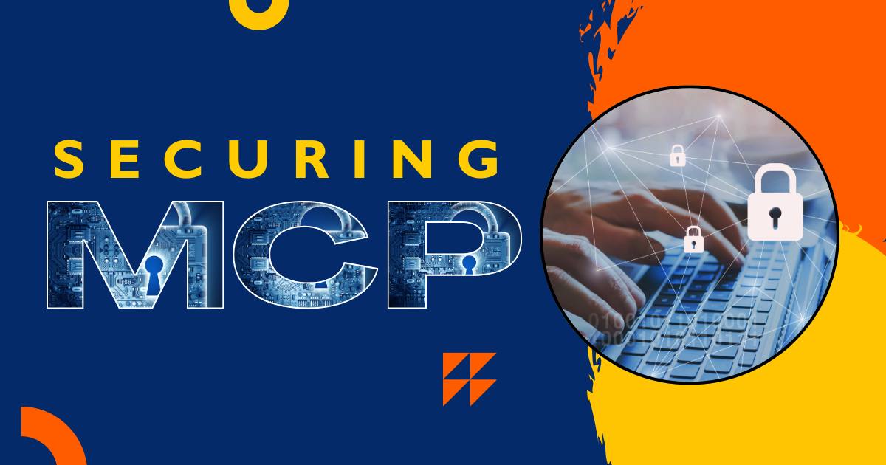
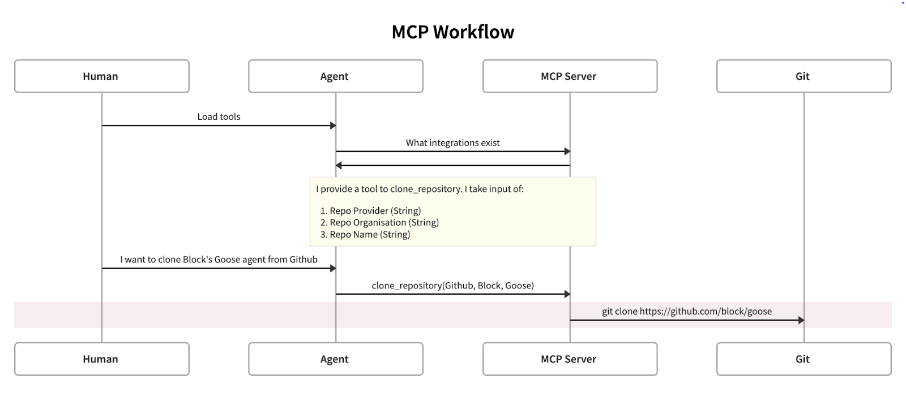

> _**作者：** Alex Rosenzweig、Arihant Virulkar、Andrea Leoszko、Wes Ring、Mike Shema、F G、Alex Klyubin、Michael Rand、Zhen Lian、Angie Jones、Douwe Osinga、Mic Neale、Bradley Axen、Gelareh Taban_


在 Block，我们一直努力通过构建「MCP 服务器」来增强 AI 工具的能力。这些服务器旨在帮助我们的人工智能（AI）智能体 codename goose 更好地与我们关心的系统和工具交互。

Block 的信息安全（InfoSec）团队深度参与了这项工作，我们想记录在这个领域学到的东西，以帮助其他人。我们预计采用和使用场景会增长，包括把这项技术用在安全领域。


<!--truncate-->

## 什么是 Model Context Protocol（MCP）

Model Context Protocol（MCP）是由 [Anthropic 开发](https://docs.anthropic.com/en/docs/agents-and-tools/mcp)、并有 Block 工程师参与的协议，它让为智能体构建集成、以便连接和使用其他工具变得更容易。简单说，如果你想让 AI 连接到 SaaS 解决方案（例如 GitHub、Jira）、CLI 工具（例如 AWS CLI）或你自己的自定义应用，你可以写一台 MCP 服务器，并「教」它如何正确交互。

这有巨大优势，因为我们可以创建确定性、定义良好的接口，减少智能体执行有用任务所需的「试验/暴力尝试」。

像「读取这张 Jira 工单，然后克隆相关的 GitHub 仓库并实现该功能」这样的用例，如果智能体不必自己摸索如何与 Jira、GitHub 和 Git CLI 交互，就更可能成功。

这帮助智能体把时间花在解决新问题上，而不是烧掉 token 去理解定义良好的 API 规范。

下面是一个与 Snowflake API 集成的 MCP 工具示例代码。

```python
@mcp.tool()
async def submit_feedback(
    feedback: str
) -> Dict[str, Union[str, int, List]]:
    """Submit feedback to the Snowflake team.

    Args:
        feedback: Feedback message

    Returns:
        Dictionary containing feedback status
    """
    return snowflake_client.submit_feedback(
        feedback_text=feedback
    )
```

## 对 MCP 的误解

围绕 MCP 有一些小误解，可以理解，因为一些用语与更类似的技术并不准确对齐。最大的混淆点是「MCP 服务器」这个术语。

最初审阅 MCP 时，我注意到多处提到「MCP 服务器」，这让我以为与它们集成需要修改应用后端。

然而，这些「服务器」充当一个客户端层（本地或远程），帮助智能体以确定性方式把函数调用代理到现有服务、工具、API 或 RPC。

在保护 MCP 集成时，我们需要考虑两组通信：

- 智能体如何与 MCP 服务器交谈？
- MCP 服务器如何作为它所连接系统的客户端行事？

我们可以这样建模：

- 把智能体当作非确定性客户端，它可以任意调用 MCP 服务器提供的工具。这是因为我们不知道它会收到什么提示。
- 把 MCP 服务器当作它所集成的实用程序的客户端库。客户端类型可以不同（gRPC、REST、SOAP、CLI 等），但实践中，MCP 只是提供一种成文的方式来执行一个行动。

对前者，我们可以依靠现有实践，理解访问范围，以及如果使用不当会带来什么风险。

对后者，我们可以直接把它建模为外部提供商的客户端。这是一个理解得很清楚的模式，因为客户端库生成一点也不新。



## 我们如何让它安全？

用这个心智模型，我们可以把 MCP 安全拆成几个组件：

- 保护智能体到 MCP 的通信
- 保护 MCP 到工具/服务器的连接
- 在与服务器交谈时保护用户和智能体的身份
- 保护底层主机和供应链

### 保护到 MCP 服务器的智能体通信

在当前运行模型中，智能体和 MCP 服务器都运行在「客户端一侧」。

然而，大多数智能体工具与第三方提供的 LLM 集成。这对数据隐私和安全有影响。

例如，如果你暴露一个返回机密数据（如社会安全号码，[我们在 Block 称之为 DSL4 数据](https://code.cash.app/dsl-framework)）的 MCP 接口，你就面临这些数据暴露给底层 LLM 提供商的风险。

这里的一种缓解是允许 MCP 实现指定它可以集成的 LLM 提供商允许列表，作为配置选项。有工具来「告诉」能与多个模型集成的智能体，哪些模型被允许调用给定工具，这是一个强大的原语。

回到我们的社会安全号码例子，如果我们能指定这个工具只能由本地 LLM 模型调用，并信任智能体客户端强制执行这一点，我们就可以防止敏感数据被传输到第三方 LLM。作为进一步增强，能够指示智能体不要与其他 MCP 共享工具输出，会提供对数据流的进一步控制。


### 保护 MCP 到工具/服务器的通信

这个范式其实并不新，我们可以依靠面向外部 API 的现有最佳实践。

具体来说，如果我们在构建服务器端 API 时已经考虑到经过审查的框架中已有的安全设计模式，我们就已经处于强势位置，因为 MCP 服务器只是这些面向外部的 API 和实用程序的客户端。

这个范式并不新，是因为任何人已经可以与外部 API 和工具交互，并且很可能以意外的方式调用端点。

这来自 LLM 解释信息的方式与人类用户不同这一事实。协议并没有隐含地允许智能体执行用户不能执行的行动，但 LLM 可能决定执行用户不会选择的行动。

**范式确实发生变化**的地方，是与此前并非设计为与各种客户端通信的工具集成时。例如，如果一个 API 此前只设计为与特定客户端或实现通信（如移动 API 或内部工具），那么采用 MCP 可能导致意外的失败模式或安全关切。

这个领域很可能是安全从业者需要进一步集中时间和努力的地方，以限制集成范围，避免在底层 LLM 或规划逻辑遭受安全攻击时造成损害。


### 智能体、人和设备身份

在我们传统的认证（AuthN）和授权（AuthZ）模型中，通常把身份绑定到单一抽象点，比如一个人或一家企业。

这个领域有机地演进为把服务身份、用户身份抽象与客户端设备（如浏览器和手机）的识别配对。这样做是为了帮助减少由自动化和不真实流量引起的攻击，例如账户接管攻击（ATO）。

随着智能体代表用户执行行动的演进，我们需要能够确定以下组合：

1. 主要身份抽象
2. 智能体的身份
3. 智能体运行所在的设备/位置

以这种方式识别使用的一致机制，允许公司保护用户免受与恶意智能体的集成，并保护他们的平台免受不想要的智能体工具的攻击。

模型上下文协议本身有一份 [OAuth 规范](https://spec.modelcontextprotocol.io/specification/2025-03-26/basic/authorization/)，撰写时是草案，但此后已在这里发布。

这个流程考虑以下步骤：

1. 客户端/智能体与 MCP 服务器发起标准 OAuth 流程
2. MCP 服务器把用户重定向到第三方授权服务器
3. 用户在第三方服务器上授权
4. 第三方服务器带着授权码重定向回 MCP 服务器
5. MCP 服务器用授权码交换第三方访问令牌
6. MCP 服务器生成自己的、绑定到第三方会话的访问令牌
7. MCP 服务器与客户端/智能体完成原始 OAuth 流程

这与现有最佳实践一致，但要求 MCP 本身具有浏览器集成/编排，以便 OAuth 能有效重定向用户。

我们希望看到的未来增强，是要求智能体实现浏览器编排，以提供一个 MCP 自己可以集成并利用的 OAuth 接口。我们相信这一变化很可能有助于标准化实现，并允许协议扩展，以便在用户之外识别智能体和客户端。

让各个 MCP 实现自己实现 OAuth，很可能由于错误实现或延迟采用未来的协议增强，导致长期的安全和维护问题。

### 为运行安全把人放在回路中

到某个时刻，我们可能对智能体建立足够信任，允许它们执行更危险的操作。对这类用例，我们很可能可以依靠已知的良好变更管理实践。

具体来说，构建服务器端解决方案，向用户告警预期的更改以及执行它们的智能体，并寻求同意，很可能是未来 API 的关键原语。其目标最终是把不可逆或难以逆转的行动关在人类交互或批准之后。

例如，对于被指派编写基础设施即代码（IaC）的智能体，这可以简单到在应用/部署 IaC 之前请求人类批准者。

在客户端智能体中，如果底层 LLM 幻觉，或通过恶意 MCP 或数据源被外部篡改，这会改善数据完整性。

在协议的最新版本中，我们喜欢的一项增强是能够[标注一个工具](https://github.com/modelcontextprotocol/specification/blob/9236eb1cbfa02c17ab45c83a7bdbe55c450070be/schema/2025-03-26/schema.ts#L730)，向客户端表明工具行动是「readOnly」或「destructive」。用这一点来决定何时在执行给定行动之前要求用户二次批准，为用户提供显著更好的保护。

虽然我们鼓励一个基于 LLM 的处理步骤来检查潜在的恶意命令，**对更高风险的命令同时有一个确定性方面，确保良好的访问控制，是提供保护的更准确方式**。

### 保护 MCP 供应链

在这个阶段，大多数 MCP 通过 docker、uvx、pipx 和 npx 等命令在客户端安装和运行。实践中这意味着，当用户安装基于 MCP 的扩展时，他们是在向 MCP 服务器提供任意代码执行权限。

实践中这呈现一个文档充分、理解清楚的供应链问题。我们如何降低与使用第三方代码相关的风险。好消息是同样的技术仍然有效，包括：

1. 只安装来自可信来源且维护良好的 MCP
2. 在可能时实现完整性检查和/或制品签名，以确保你执行的是预期代码
3. 在企业智能体上实现允许列表，确保用户只使用预先验证的 MCP

## 结论

正如智能体正在铺路，让 LLM 有更多真实世界效用，MCP 和类似协议将继续在采用上增长。

我们相信，通过早期为开源项目做贡献、公开分享我们的学习，并构建我们自己利用 MCP 的解决方案，Block 可以保持来自确定性世界的安全最佳实践，同时继续随新技术演进它们。

我们很兴奋于让这个协议对用户和开发者都更安全，并期待分享我们未来如何把 MCP 用于自己的安全用例。


<head>
  <meta property="og:title" content="保护 Model Context Protocol" />
  <meta property="og:type" content="article" />
  <meta property="og:url" content="https://goose-docs.ai/blog/2025/03/31/securing-mcp" />
  <meta property="og:description" content="在 Block 用 Model Context Protocol（MCP）构建安全且有能力的 AI 集成。" />
  <meta property="og:image" content="http://goose-docs.ai/assets/images/securing-mcp-5e475e91c0e621afa33e30b3d89ef065.png" />
  <meta name="twitter:card" content="summary_large_image" />
  <meta property="twitter:domain" content="goose-docs.ai" />
  <meta name="twitter:title" content="保护 Model Context Protocol" />
  <meta name="twitter:description" content="在 Block 用 Model Context Protocol（MCP）构建安全且有能力的 AI 集成。" />
  <meta name="twitter:image" content="http://goose-docs.ai/assets/images/securing-mcp-5e475e91c0e621afa33e30b3d89ef065.png" />
</head>
