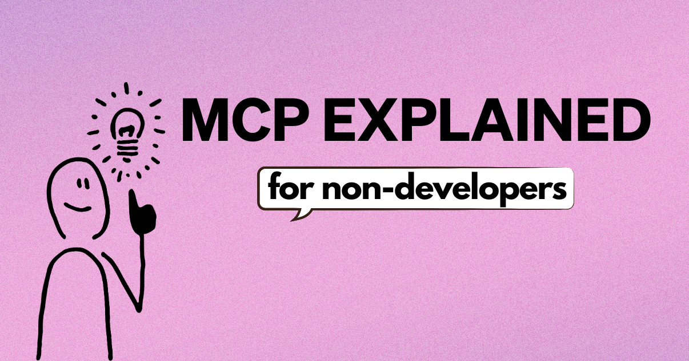

MCP 这个、MCP 那个，它到底是什么？如果你不是开发者，也能用吗？🤔

<!--truncate-->

## 什么是 MCP？

MCP 代表 [Model Context Protocol](https://modelcontextprotocol.io/introduction)，由 Anthropic 创建的开放标准。

假设你在寻找在工作中使用 AI 的方法，好变得更高效、尽可能节省时间。于是你去了解 OpenAI 或 Claude 这类大语言模型（LLM），并开始和其中一个聊天。能和 AI 聊天、让它立刻回答问题或告诉你怎么做某件事，很神奇。但让 AI 替你把事情做了呢？

现在有 AI 智能体，或 AI 助手，可以为你采取行动并做决定。但要让你的 AI 智能体与你的系统交互，比如 Google Drive、Asana 或 Slack，以前没有标准做法。至少不是每次需要智能体与你需要它配合的东西工作时，都不必从头摸索。那超级繁琐。

这正是 MCP 的用武之地。最好的部分是，你不必是开发者就能开始使用！MCP 本质上让你把外部系统的访问权交给 AI 智能体，而不必写代码。你可以把 MCP 想成系统和你的 AI 智能体之间的连接器，或者 AI 集成的 USB-C。

## 你现在就该试试的 MCP 服务器
那么你可以把 AI 智能体连到什么？MCP 服务器！MCP 服务器让你的智能体访问你的工具。你可以连接[超过 3000 台 MCP 服务器](https://glama.ai/mcp/servers)，这里是你应该尝试的热门 MCP 服务器清单：

- **[Google Drive](/docs/mcp/google-drive-mcp)**：Google Drive 的文件访问和搜索能力
- **[YouTube Transcript](/docs/mcp/youtube-transcript-mcp)**：抓取并处理 YouTube 视频文字稿
- **[Google Maps](/docs/mcp/google-maps-mcp)**：位置服务、路线和地点详情
- **[Tavily Web Search](/docs/mcp/tavily-mcp)**：使用 Tavily 的 Search API 进行网页和本地搜索
- **[Asana](/docs/mcp/asana-mcp)**：查看 Asana 任务、项目、工作区和/或评论
- **[Speech](/docs/mcp/speech-mcp)**：实时语音交互、音频/视频转写、文本转语音等
- **[GitHub](/docs/mcp/github-mcp)**：读取、搜索和管理 Git 仓库的工具
- **[Fetch](/docs/mcp/fetch-mcp)**：获取网页内容并转换，以便高效使用 LLM

这份简短清单应该能让你对现在能如何把 AI 智能体用进工作流有个概念。你也可以在[好用的 MCP 目录](https://dev.to/techgirl1908/my-favorite-mcp-directories-573n)里探索社区最爱，并在安装前了解[如何检查 MCP 服务器是否安全](/blog/2025/03/26/mcp-security)。

你也可以看看这些 [goose 教程](/docs/category/mcp-servers)，它们确切展示如何把其中一些热门 MCP 服务器和 goose 一起使用，或使用 [goose 的 Tutorial 扩展](/docs/mcp/tutorial-mcp)获得额外帮助，带你使用或构建扩展。

## MCP 提示示例
现在你已经瞥见外面有哪些 MCP 服务器，如何确保你尽可能好地把 MCP 和 AI 智能体一起使用？这就是提示的用武之地。

提示归根结底是你与 AI 助手交互时输入的文本，提示可以从超级简单的问题到详细的指令！下面是一些你现在就可以问像 goose 这样的 AI 智能体的示例提示，它们使用了上面提到的一些 MCP 服务器：

### Google Maps
```
Google Maps: Track the live GPS location of driver ID #{driver_id}. Query Google Maps for real-time traffic data and adjust the estimated delivery time if delays exceed 5 minutes. If ETA changes, update the customer's live tracker and send an SMS notification. If the delay is greater than 20 minutes, check if another driver within a 1-mile radius can take over the delivery.
```
### YouTube Transcript
```
YouTube Transcript: Get the transcript from this youtube video [link to video]. Then, summarize it into a blog post.
```
### Google Drive
```
I have an important marketing budget review meeting in 30 minutes and I need your help getting prepared. I have several documents in my Google Drive from our previous meetings and planning sessions. Could you help me by:

1. Finding all relevant documents about our marketing budget and performance
2. Giving me a quick summary of our Q1 performance
3. Highlighting the key decisions we need to make about the marketing automation tool and video production
4. Identifying any outstanding action items from our last meeting
```
### Asana
```
Asana: Create a new task in my Asana workspace called 'Review Q4 metrics' and set the due date to next Friday. Then, find all tasks assigned to me that are due this week and summarize them.
```
### GitHub
```
GitHub: Create a new branch called hello-world in my angiejones/goose-demo repository. Update the README.md file to say "this was written by goose" and commit it. Open a pull request with your changes.
```

## 可能性没有尽头
虽然有些由官方提供商开发，你看到的绝大多数 MCP 服务器实际上是社区成员开发的！而且，因为 MCP 是开放标准，任何人都可以为任何资源构建 MCP 服务器。你甚至可以用 goose 帮你构建一个！

希望现在，你不必花数小时手动收集数据、做下一份营销报告，或在星期一手动整理待办积压，而是用 MCP 和 goose，几分钟内就让它替你完成。

*要了解更多关于使用 MCP 服务器和 goose 的内容，查看 [goose 文档](https://goose-docs.ai/docs/category/getting-started)，或加入 [Block Open Source Discord](https://discord.gg/n8R5VaWDAn)，与其他开源社区成员联系。*

<head>
  <meta property="og:title" content="给非开发者讲清楚 MCP" />
  <meta property="og:type" content="article" />
  <meta property="og:url" content="https://goose-docs.ai/blog/2025/04/01/mcp-nondevs" />
  <meta property="og:description" content="了解什么是 Model Context Protocol（MCP），以及任何人如何用它在任务上节省时间。" />
  <meta property="og:image" content="http://goose-docs.ai/assets/images/mcp_nondevs-5ce7f39de923cab01de6e14e5dc06744.png" />
  <meta name="twitter:card" content="summary_large_image" />
  <meta property="twitter:domain" content="goose-docs.ai" />
  <meta name="twitter:title" content="给非开发者讲清楚 MCP" />
  <meta name="twitter:description" content="了解什么是 Model Context Protocol（MCP），以及任何人如何用它在任务上节省时间。" />
  <meta name="twitter:image" content="http://goose-docs.ai/assets/images/mcp_nondevs-5ce7f39de923cab01de6e14e5dc06744.png" />
</head>
