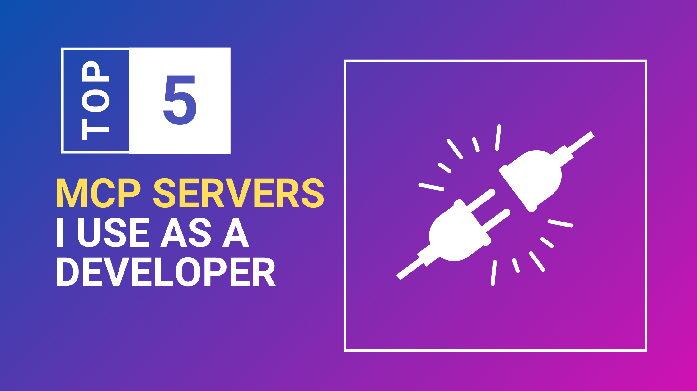

import ArchivedExtensionWarning from '@site/src/components/ArchivedExtensionWarning';



作为开发者，找到能无缝配合的合适工具，感觉就像发现了一种超能力。而当你已经有一套能用的流程时，有时很难去尝试新工具。

有了 MCP，像 goose 这样的 AI 智能体能够接入我现有的工具，我的工作流唯一的变化就是随之而来、非常受欢迎的自动化。我仍然做同样的事，但有了 AI 的支持，我现在可以做得更快、更有信心。

今天，我很高兴分享的不只是我最喜欢的 MCP 服务器，而是我几乎每天真正在用的那些，以及你大概也能对上号的真实应用。

<!--truncate-->

:::tip
你可以问 goose 一个扩展能做什么，它会列出所有功能，以及你可以尝试的示例用例。
:::

## GitHub MCP 服务器：GitHub 的一切

[GitHub MCP 服务器](/docs/mcp/github-mcp)带有相当多的功能。它可以帮助你创建 issue、拉取请求、仓库和分支。我用 GitHub MCP 最频繁的用例是评审和理解拉取请求。

当拉取请求很大，或者我不理解正在发生什么时，我可以把 PR 交给 goose，给它合适的上下文，让我理解，然后对拉取请求采取行动。我甚至能根据 PR 中的文件变更创建文档更新或更新日志更新。这绝对是我最喜欢的事情之一。

例如

```
Hey Goose, this pull request https://github.com/aaif-goose/goose/pull/1949, has a lot of changes. Can you summarize into a changelog for me?
```

## 知识图谱记忆：加强版上下文

[知识图谱记忆](/docs/mcp/knowledge-graph-mcp)扩展就像给 goose 一份关于你的项目或数据的照相记忆。顾名思义，它为喂进去的任何信息创建一张图，把不同信息片段之间的点连起来，或者像我喜欢用它的方式——用于文档。

如果我在做一个特定项目或库，并且不想要任何幻觉，我可以把正确的上下文喂给 goose，它就能用正确的上下文回答关于该项目或库的问题。

这可以是我当前正在做的项目的文档，甚至是我正在使用的某个库的文档。

例如

```
I'm currently in a project called Goose, read through the documentation in `documentation/docs/` folder and store key information in the knowledge graph. Use it for reference anytime I ask you about Goose.
```

## Fetch 扩展：掌握在手中的网页

我在 [Tavily Web Search 扩展](/docs/mcp/tavily-mcp)和 [Fetch 扩展](/docs/mcp/fetch-mcp)之间稍微纠结了一下，因为虽然我两者都用来访问网页，Fetch 扩展对我来说更像默认选择。结合上面知识图谱的例子，我能从互联网获取信息，给 goose 额外的上下文来工作。

:::note
Tavily Web Search 扩展有深度研究能力，很适合查找特定信息，而 Fetch 扩展更偏向一般的网页访问和数据检索。
:::

## Memory 扩展：我的习惯和偏好

我用 [Memory 扩展](/docs/mcp/memory-mcp)提醒 goose 我工作时的一般偏好——尝试新原型时默认用 JavaScript 或 Node，我更喜欢哪一种命名约定——甚至我喜欢怎样喝咖啡 :D。

这和知识图谱扩展的工作方式不同，尽管两者都在本地存储信息。与知识图谱结合时，它也能帮助维持技术决策及其理由的清晰轨迹。例如我卡在一次代码迁移上，就让 goose 记住我们停在哪里、到目前为止试过什么，以及下次开始新会话时我们想做什么。


## VS Code 扩展：你最喜欢的编辑器，已连接

<ArchivedExtensionWarning extensionName="VS Code Extension" repoUrl="https://github.com/block/vscode-mcp" />

和人们交谈时，尤其是围绕 vibe coding，最大的点之一是找到追踪正在发生哪些变更的方法。虽然始终推荐版本控制，但有时我想在走得太远之前停下来或改变方向。[VS Code 扩展](https://github.com/block/vscode-mcp)连同其他功能，让我能在提交之前预览代码变更的 diff。

我可以选择接受或拒绝这些变更，或者在任何实际变更发生之前告诉 goose 试试别的。


## 集成的力量

如本文开头所说，这些 MCP 服务器最好的地方在于它们如何接入我现有的工作流。我能够：

- 在 goose 上开始一个新会话，它会把当前文件夹作为项目在 VS Code 中打开。
- 开始处理任何变更，并从知识图谱或通过 Fetch 扩展从互联网获取我需要的任何上下文。
- 任何试图做出变更的尝试都会把 Memory 扩展中的我的偏好考虑进去。
- 然后我可以就在 VS Code 里审查这些变更，接受或拒绝它们。
- 并通过让 goose 为我创建一个拉取请求来完成任务。

这是我如何一起使用这些扩展的简化例子——我未必在每个会话里都用到全部，但有它们可用，确实让我的工作流顺畅得多。

你最喜欢的 MCP 服务器是什么？你如何把它们一起使用？在 [Discord 服务器](https://discord.gg/n8R5VaWDAn)上和我们分享你的经验！

<head>
  <meta property="og:title" content="作为开发者，我用 goose 扩展搭配的 5 个 MCP 服务器" />
  <meta property="og:type" content="article" />
  <meta property="og:url" content="https://goose-docs.ai/blog/2025/04/01/top-5-mcp-servers" />
  <meta property="og:description" content="这 5 个 MCP 服务器帮助我自动化工作流，让我成为更好的开发者。" />
  <meta property="og:image" content="http://goose-docs.ai/assets/images/mcp-servers-cover-6994acb4dec5a3b33d10ea61f7609e4b.png" />
  <meta name="twitter:card" content="summary_large_image" />
  <meta property="twitter:domain" content="goose-docs.ai" />
  <meta name="twitter:title" content="作为开发者，我用 goose 扩展搭配的 5 个 MCP 服务器" />
  <meta name="twitter:description" content="这 5 个 MCP 服务器帮助我自动化工作流，让我成为更好的开发者。" />
  <meta name="twitter:image" content="http://goose-docs.ai/assets/images/mcp-servers-cover-6994acb4dec5a3b33d10ea61f7609e4b.png" />
</head>
