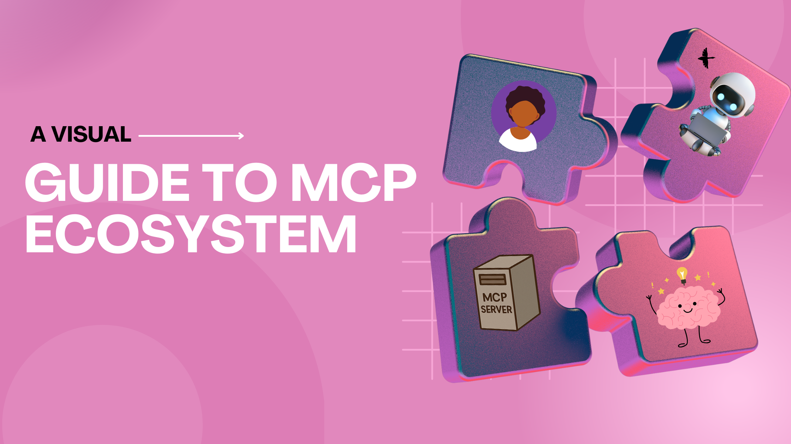
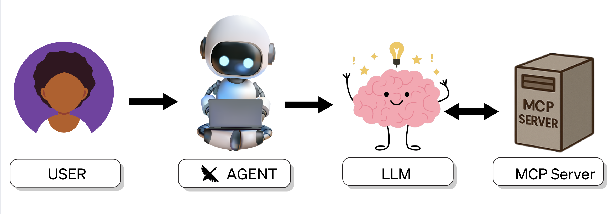
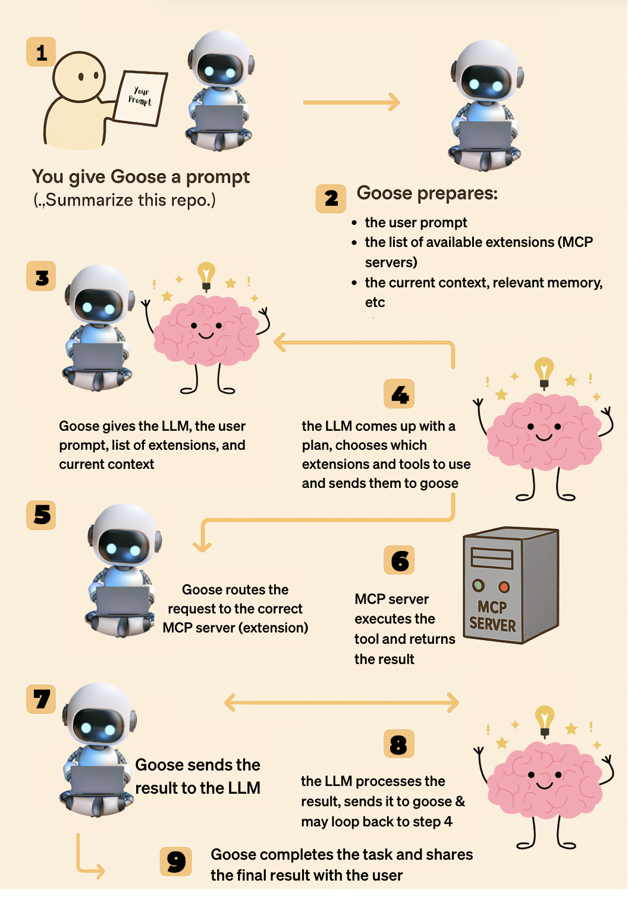
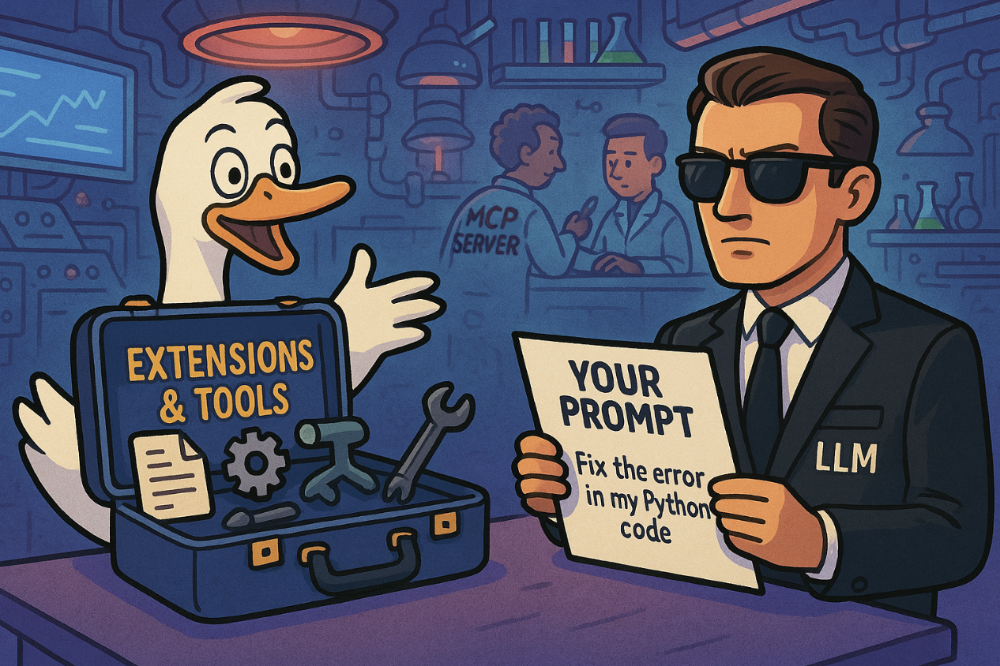

# MCP 生态视觉指南

你有没有打开一个 GitHub 仓库或博客，读完第一句就觉得自己闯进了一篇博士论文？

是的。我也一样。

MCP（Model Context Protocol）听起来复杂，其实并不复杂。把这篇当作你的速查表：没有白皮书，没有学术行话，只有大白话和几张好图。
<!--truncate-->

我们一起来拆开它。

## 用大白话说，MCP 是什么？

MCP 就像你的 AI 智能体（比如 goose）与外部工具、文件、数据库、API 之间的通用翻译器，凡是你能想到的都算。

它给你的智能体一种方式：提问、运行工具、存储/取回上下文，并跟踪它知道的一切。

不必把所有东西塞进一条提示，像「这里有 1 万 token 的上下文，祝你好运」。MCP 帮助模型在需要时拉取它需要的内容。

## 参与者是谁？

- **用户**——你，那个有宏大想法和一团乱麻问题的人

- **智能体**——AI 智能体 goose，住在你的 CLI、IDE 或桌面应用里

- **LLM**——做推理的模型（如 Claude、GPT-4 等）

- **MCP 服务器（扩展）**——goose 的工具箱：内置和自定义扩展，让 goose 能够执行任务

## 它们如何通信？
来看看所有参与者如何一起工作：

在这个流程中，用户通过给 goose 一条提示来启动一切。goose 准备好提示，连同可用工具和任何相关上下文，交给 LLM。LLM 决定完成任务需要哪些工具。然后 goose 把这些工具调用路由到正确的 MCP 服务器，由它们执行任务。任务的步骤完成时，它会告诉你这个用户它做了什么，也可以按需要与 LLM 循环。

## 一个类比

用一个詹姆斯·邦德的类比，让这一点更清楚。有时候一个故事能让一切对上。

如果你看过詹姆斯·邦德电影，你知道那个场景：
任务开始前，邦德走进 Q 的实验室。
Q 打开装满小工具的手提箱：爆炸笔、隐形车、抓钩手表，凡是你能想到的。

在这个情境里，goose _就像_ Q。
手提箱已经装满了工具：内置和自定义扩展（MCP 服务器）。

在 LLM（邦德）开始任务之前，goose 给它完整简报：

>_"这是你的目标（提示）。这是你的工具箱（你可以使用的扩展）。祝你好运。"_

MCP 服务器呢？

那是幕后真正制造这些小工具、并在邦德在现场需要时递过去的隐藏团队。

LLM（邦德）为任务挑选合适的工具，goose 把请求路由到正确的 MCP 服务器，MCP 确保它们能工作，整个行动顺畅运行。

如果没有 goose 递上工具箱，模型就只会穿着燕尾服、带着微笑出现在现场，我们可不想知道那会怎么收场。

## 轮到你了

现在你已经掌握了基础，也理解了 MCP 生态如何工作，是时候自己试试了。

[快速开始指南](/docs/quickstart)会带你连接第一台 MCP 服务器。

准备好探索更多时，去文档的[教程部分](/docs/category/tutorials)——那里有分步指南和短视频演示，展示如何连接各种 MCP 服务器。

也别忘了[加入社区](https://discord.gg/n8R5VaWDAn)，看看别人在构建什么，提问，或只是认识一下。

<head>
  <meta property="og:title" content="MCP 视觉指南" />
  <meta property="og:type" content="article" />
  <meta property="og:url" content="https://goose-docs.ai/blog/2025/04/10/visual-guide-mcp" />
  <meta property="og:description" content="MCP 的视觉拆解：你的智能体、工具和模型如何一起工作。" />
  <meta property="og:image" content="https://goose-docs.ai/assets/images/mcpblog-40894789122bda594a8576ebcb67a2d8.png" />
  <meta name="twitter:card" content="summary_large_image" />
  <meta property="twitter:domain" content="goose-docs.ai" />
  <meta name="twitter:title" content="MCP 视觉指南" />
  <meta name="twitter:description" content="MCP 的视觉拆解：你的 AI 智能体、工具和模型如何一起工作。" />
  <meta name="twitter:image" content="https://goose-docs.ai/assets/images/mcpblog-40894789122bda594a8576ebcb67a2d8.png" />
</head>
