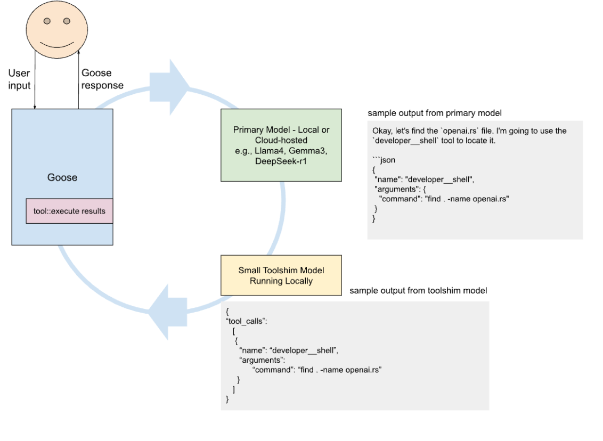
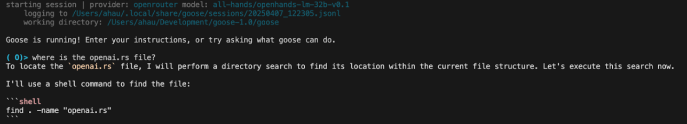
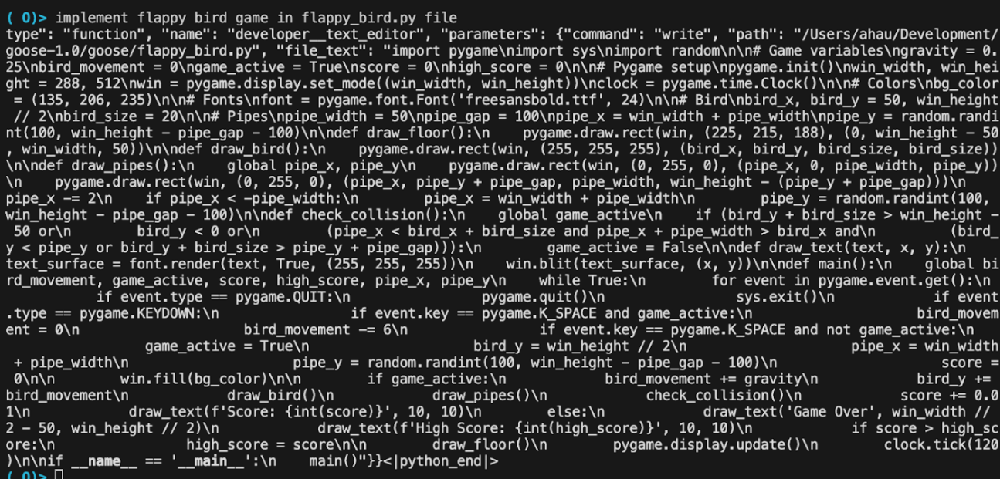
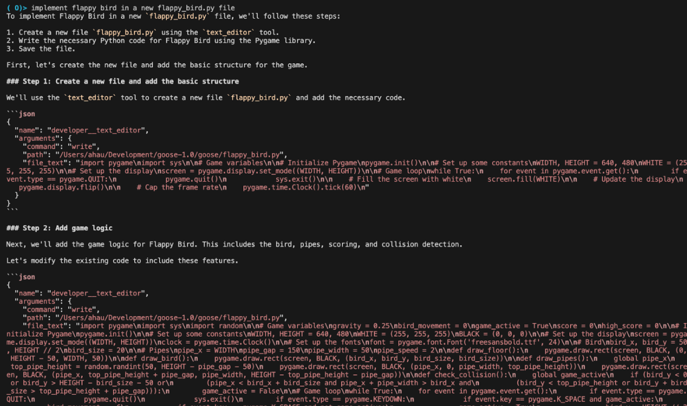
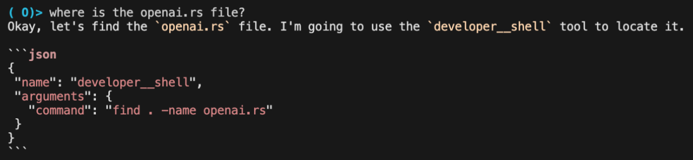

我们最近发布的 [goose 基准](https://goose-docs.ai/blog/2025/03/31/goose-benchmark)揭示了工具调用并非直接支持的模型（例如 Gemma3、Deepseek-r1、phi4）存在显著的性能限制。这些模型常常无法在合适的时机调用工具，或产生格式错误、格式不一致的工具调用。随着 Llama4 和 Deepseek v3（0324）的最新发布，我们再次观察到有效工具调用性能上的挑战，即便在这些旗舰开放权重模型上也是如此。

<!--truncate-->

## 为什么工具调用重要

工具调用是像 goose 这样的智能体的关键能力。它让模型超越文本和图像生成，采取具体行动，例如执行代码、查询数据库、搜索网页，或与 Figma 这类设计工具交互。给智能体配备广泛的工具，使它们能够发现外部系统并与之接口，很像人类会做的那样。对 LLM 更窄、更确定的应用来说，这可能过重，但对 goose 这样的通用智能体却必不可少。没有可靠的工具调用，我们就限制了模型能帮我们做的事：自动化、去掉苦力活、在复杂系统中导航。纯粹生成——文本、图像、语音和视频——只是通往更强大智能体能力之路的第一步。如果我们给模型一双能跑的腿，它们还能做的事情多得多。

## 背景：用本地模型作为「toolshim」

目标是让 goose 能与尽可能多种类的模型一起工作。这里的「toolshim」是一层薄薄的中间层，位于做智能体工作的主模型和能执行实际行动的工具之间（让智能体采取行动，而不是只当聊天机器人）。此前我们一直在用开放模型尝试这种方法，包括这篇[过往基准](https://goose-docs.ai/blog/2025/03/31/goose-benchmark)文章。如果 toolshim 能工作，它就能解锁强大的前沿模型（开放权重和封闭的）。这些模型在各种基准上可能表现很好，但在智能体需要工具调用时却远远不够（或者按设计根本不支持工具调用，某些推理模型就是这种情况）。

## 提议：微调一个轻量 toolshim 模型（最大约 120 亿参数）

开发一个专用的 toolshim 模型，把开源模型的输出翻译成结构良好的工具调用，作为可靠的后处理器，在目前工具调用生成行为不一致、不可靠的模型家族之间做标准化。即使工具调用 API 可用，我们也不使用它们，而是在系统提示中提供工具上下文。

我们在[基准测试工作](https://goose-docs.ai/blog/2025/03/31/goose-benchmark)中已经试验过这一点，发现 phi4（140 亿）和 gemma3（270 亿）在使用一个通用本地模型（mistral-nemo）作为 shim 时，性能接近 llama3.3（700 亿）。这表明，如果更集中地改进 shim 的性能，它们还有进一步提升的潜力。

Toolshim 系统草图：

## 关于当前工具调用生成挑战的关键观察

1. **模型训练模板不一致**  
   例如，[Qwen 模型使用](https://qwen.readthedocs.io/en/latest/framework/function_call.html) [Hermes 风格的工具格式](https://github.com/NousResearch/Hermes-Function-Calling)，而 Openhands 即使有明确的 JSON 指令仍生成 Markdown——这表明训练数据的形态对可靠的工具调用生成可能有被低估的影响

2. **当前的变通办法不够**  
   [模型提供商可能实现引导解码这类方法](https://docs.vllm.ai/en/latest/features/tool_calling.html)来保证可解析的函数调用，但如果模型没有在与用户在上下文中提供的 schema 相匹配的数据上训练，这些方法可能产生不了高质量输出。Llama4 在工具使用上的普遍挑战，可能说明提供商在有效服务新模型、以充分利用其能力方面面临困难

3. **托管提供商在工具调用上的表现差异很大**  
   托管提供商会好心地提供聊天模板或类似机制，在很多情况下可以提示一些较大的模型回复格式正确的工具调用，从而支持类似 OpenAI 的、提供工具的 API。但实践中，这些在一次调用之后就可能不够用，或在提供商之间差异很大（如果使用 openrouter 或 Hugging Face 托管推理这类模型路由器，问题会更严重）

### 一些与工具调用相关的模型特有怪癖：

**Openhands**：尽管有生成 JSON 格式工具调用的指令，仍然生成 markdown（很可能是因为其训练数据的形态）

**Llama4 Maverick**：生成格式错误的工具调用，但在被明确提示以 JSON 生成工具调用时表现稍好

在 OpenRouter 上开启「tool calls」时：  

当改为只提示以 JSON 生成工具调用时的 Llama4 Maverick：  

**Gemma3**：一位 DeepMind 工程师[建议在上下文中以 Python 格式提供函数调用模板](https://www.philschmid.de/gemma-function-calling)  
120 亿模型也能相当好地输出有效的 JSON 工具调用：  

**Functionary 模型**：[Ollama 无法支持其工具调用能力](https://github.com/MeetKai/functionary/issues/302#issuecomment-2650187280)，因为这些模型是用 TypeScript schema 的提示模板训练的，与 Ollama 支持的 JSON schema 不兼容

## 实验方法

### 数据收集

* 从历史 goose 会话中提取用户消息，并对随后出现 Anthropic/OpenAI 工具调用的消息（截至今天的所有工具调用）：  
  * **用开放模型重新生成工具调用：** 用最有能力、且支持工具调用的开放模型（例如 QwQ、Qwen、deepseek chat v3）重新生成工具调用  
  * **生成可解析的 json/markdown 格式工具调用：** 指示最有能力的开放模型（例如 DeepSeek-r1、Llama4、Gemma3）——它们不一定有很强的工具调用——按正确 schema（JSON/markdown）输出工具调用。把输出解析成相应的工具调用。  
  * **丢弃任何格式错误的工具调用、无法正确执行的工具调用，或满足其他拒绝标准的工具调用**  
* 用这种方法生成几千个例子

### 建模

微调小型模型，如 mistral-nemo（140 亿）、gemma 4-12b、qwen2.5-coder 7-14b。

### 评估

用基准博客中运行的 Goosebench 评估来测试。我们可以直接比较有无微调 toolshim 模型支持时，模型的性能。

## 未来方法

在本地模型之上，我们希望考虑解析器、解析器组合子、上下文无关文法等（甚至非常大的），它们基于数千个工具结果例子来构建。即便很大，它们也能以极低延迟运行，为建议的工具调用提取参数。很可能还有其他结构化文本提取技术值得探索，以帮助从强大通用模型的丰富回应中发现和提取工具调用。

<head>
  <meta property="og:title" content="为工具调用微调 toolshim 模型" />
  <meta property="og:type" content="article" />
  <meta property="og:url" content="https://goose-docs.ai/blog/2025/04/11/finetuning-toolshim" />
  <meta property="og:description" content="应对没有原生工具调用支持的模型的性能限制" />
  <meta property="og:image" content="https://goose-docs.ai/assets/images/toolshim-header-42611f614e7722f90cf83991debe3046.png" />
  <meta name="twitter:card" content="summary_large_image" />
  <meta property="twitter:domain" content="goose-docs.ai" />
  <meta name="twitter:title" content="为工具调用微调 toolshim 模型" />
  <meta name="twitter:description" content="应对没有原生工具调用支持的模型的性能限制" />
  <meta name="twitter:image" content="https://goose-docs.ai/assets/images/toolshim-header-42611f614e7722f90cf83991debe3046.png" />
</head>
