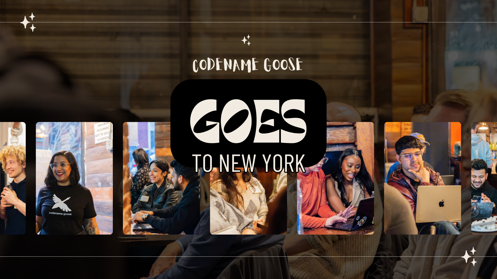

import ImageCarousel from '@site/src/components/ImageCarousel';
import swag from './swag2.jpg';
import swag1 from './swag1.jpg';
import swag2 from './swag.jpg';
import swag3 from './swag3.jpg';
import focus from './focus.jpg';
import focus2 from './focus2.jpg';
import focus3 from './focus3.jpg';
import focus4 from './focus5.jpg';
import focus5 from './focus4.jpg';
import speaker from './speaker.jpg';
import speaker1 from './speaker1.jpg';
import fun from './fun.jpg';
import fun1 from './fun1.jpg';

# codename goose 来到纽约 🗽

我们把 goose 带到了纽约市，这是值得记下一笔的一场。

超过 100 人注册，另有 87 人在等候名单上，房间里挤满了好奇、有思考、准备深入的人。有些是已经在探索 goose 和 MCP 的开发者，另一些对 AI 智能体的世界完全陌生。这就是 goose 的美：它既给开发者，也给非开发者。

能量从活动一开始就在——音乐、披萨，以及真实的社交。我们有闪电演讲、一个 goose 主题的游戏、动手黑客活动，而且……到了晚上，几罐 Ebbs IPA 可能进了人们的背包。

<!--truncate-->

## 我们为什么把 goose 带到纽约

波士顿聚会之后，我们想保持势头，并在一座新城市测试。纽约感觉是完美的地方。它是人的大熔炉，也有非常强的科技场景。我们的目标很简单：

✅ 继续建设 goose 社区  
✅ 当面从社区获得真实反馈和想法  
✅ 一边一起学习一边玩得开心

纽约没有让人失望。

## 如果你错过了

<ImageCarousel id="test-carousel" images={[focus5,focus, focus2, focus3, focus4]} />

我们以食物和自由时间开场，让人们在进入演讲之前见面、聊天、提问：

- 来自 Galileo 的 **[Erin Mikail](https://www.linkedin.com/in/erinmikail/)** 主持了一个 goose 主题游戏，让人们边笑*边*学习智能体评估的重要性。  
- **[我，Ebony Louis](https://www.linkedin.com/in/ebonylouis/)** 带大家走过 goose 和 MCP，展示用任何 MCP 服务器开始有多快。  
- **[Alex Hancock](https://www.linkedin.com/in/alexjhancock/)** 深入讲了 MCP，以及它如何驱动安全、可扩展的智能体工作流。

然后是最好的部分——黑客时间。活动期间**有 27 个人现场把 goose 跑起来了**，看到这一点很棒。看那一刻对某人「咔嗒」一声总是很有趣：想法开始流动，人们受到启发，离开时准备真正*使用* goose。

## 人们怎么说

<ImageCarousel id="test-carousel" images={[swag, swag1, swag2, swag3]} />

> 「我花了不到 5 分钟就用一个示例项目把自己设置好，并在 GitHub Codespaces 里运行 goose CLI！总体感觉很好，回到一个实体场地参加动手活动，有投入的社区和及时的讨论话题。」  
> —— *[Nitya Narasimhan，Microsoft 高级云倡导者](https://www.linkedin.com/in/nityan/)*

> 「现场演示、开放讨论和实际练习让它成为一次出色的学习体验。感到充满能量和灵感，去探索如何在未来的数据工程项目中利用 goose 和 MCP！」  
> —— *[Manikumarreddy Gajjela，Tetra Computing 全栈开发者](https://www.linkedin.com/in/manireddy12/)*

> 「这些天每个人似乎都看好 Model Context Protocol（MCP）……goose 是一个开源、跑在机器上的 AI 智能体，用来自动化你的任务。最酷的部分？你甚至可以把自己托管的 Ollama LLM 接到 goose 上！」  
> —— *[Rijul Dahiya，纽约大学研究生助教](https://www.linkedin.com/in/rijuldahiya/)*

> 「很棒的活动——入门材料和技术材料搭配得好，也很有趣，我喜欢它在开头和结尾提供了一大段没有结构的时间。」  
> —— *[Matthew Hill，Dataminr AI 工程高级总监](https://www.linkedin.com/in/matthewhillnewyork/)*

## 我们喜欢的时刻 ❤️

- 🍕 披萨、音乐，以及事情正式开始前人们叙旧  
- 🎮 goose 游戏——是的，它变得很有竞争性，而且奇怪地暗黑 lol
- 🧳 有人从费城和华盛顿特区专程来参加  
- 📸 有摄影师捕捉自然和有趣的时刻
- 🧠 一堆经过思考的「我不是开发者，但是……」的问题，我们*很喜欢*听到

<ImageCarousel id="test-carousel" images={[speaker1,speaker, fun, fun1, focus2]} />

最后，人们在问下一场是什么时候，是的，我们可能提前透露了一点……

## 接下来：goose 飞向南方 🛫

我们的下一场 goose 聚会已经定了！

👉 **亚特兰大——4 月 30 日，星期三**  
🕕 **美国东部时间下午 6:00 – 8:30**  
📍 [在此报名](https://lu.ma/x9ccqruq)

## 大声感谢 🙌

向 **[Tania Chakraborty](https://www.linkedin.com/in/taniachakraborty/)** 和 **[Anthony Giuliano](https://www.linkedin.com/in/anthonygiuliano1/)** 大声致谢，感谢你们在场，也感谢每一个来到、提问、帮忙、让这个夜晚值得记住的人。

社区真正让这一场特别：人们留下来聊天，没人要求就帮忙清理，并把这么好的能量带进房间。我们不能要求更好的一群人。

亚特兰大见 👀

<head>
  <meta property="og:title" content="codename goose 来到纽约" />
  <meta property="og:type" content="article" />
  <meta property="og:url" content="https://goose-docs.ai/blog/2025/04/17/goose-goes-to-NY" />
  <meta property="og:description" content="goose 降落纽约，举办第二场社区聚会" />
  <meta property="og:image" content="https://goose-docs.ai/assets/images/cover-6c131d275bcdb4d8651a140d62e2975f.png" />
  <meta name="twitter:card" content="summary_large_image" />
  <meta property="twitter:domain" content="goose-docs.ai" />
  <meta name="twitter:title" content="codename goose 来到纽约" />
  <meta name="twitter:description" content="goose 降落纽约，举办第二场社区聚会" />
  <meta name="twitter:image" content="https://goose-docs.ai/assets/images/cover-6c131d275bcdb4d8651a140d62e2975f.png" />
</head>
