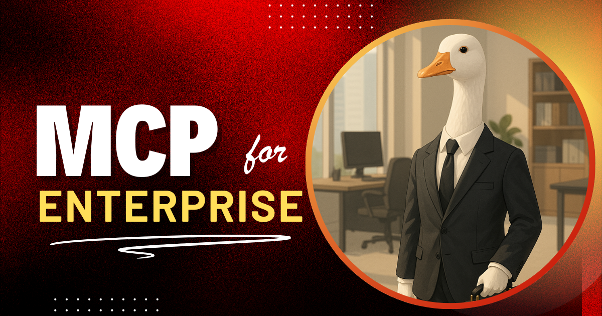
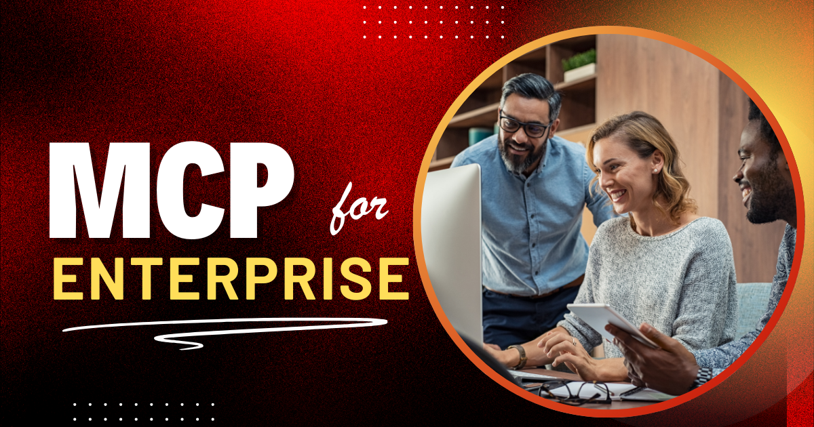

在 Block，我们一直在探索如何让 AI 智能体在商业环境中真正有用。不只是用于演示或原型，而是用于真实的日常工作。
作为 [Model Context Protocol（MCP）](https://www.anthropic.com/news/model-context-protocol) 的早期合作者之一，我们与 Anthropic 合作，帮助塑造和定义这项开放标准，它把 AI 智能体与真实世界的工具和数据连接起来。

MCP 让 AI 智能体通过一个共同接口与 API、工具和数据系统交互。它通过暴露确定性的工具定义来消除猜测，这样智能体不必猜测如何调用 API。
相反，它专注于我们真正想要的……结果！

当其他人还在试验时，我们已经在 Block 全公司推出了它，并且有真实的影响。

<!--truncate-->

## 我们为什么在 Block 选择 MCP

我们不想构建一次性集成，或把 AI 硬接到某个特定供应商生态。
像大多数企业公司一样，我们的需求跨越工程、设计、安全、合规、客户支持、销售等等。
我们想要灵活性。

MCP 给我们这个。
它与模型无关，也与工具无关，允许我们的 AI 智能体与内部 API、开源工具，甚至现成的 SaaS 产品交互，全部通过同一套协议。

它也与我们的[安全理念](/blog/2025/03/31/securing-mcp)很契合。
MCP 允许我们定义哪些模型可以调用哪些工具，并让我们把工具标注为「只读」或「破坏性」，以便在必要时要求用户确认。

## 我们如何配置和保护 MCP

我们开发了 [**goose**](/)，一个开源、兼容 MCP 的 AI 智能体。数千名 Block 员工每天使用这个工具。
作为 CLI 和桌面应用都可用，goose 默认可以访问一组经过策划、已批准的 MCP 服务器。
大多数员工报告在常见任务上节省 50–75% 的时间，还有几个人分享，曾经要花几天的工作现在几个小时就能完成。

为了确保安全可靠的体验，内部使用的所有 MCP 服务器都由我们自己的工程师编写。
这让我们能把每个集成定制到我们的系统和用例，从开发工具到合规工作流。

我们使用最广的一些 MCP 包括：

- **Snowflake**，用于查询内部数据
- **GitHub 和 Jira**，用于软件开发工作流
- **Slack 和 Google Drive**，用于信息收集和任务协调
- **内部 API**，用于合规检查和支持分诊等专门用例

除了工具访问，goose 还依赖大语言模型（LLM）来解释提示并规划行动。
我们使用 Databricks 作为 LLM 托管平台，使 goose 能通过安全、由企业托管的端点与 Claude 和 OpenAI 模型交互。
我们与模型提供商建立了包含数据使用保护的公司协议，并按照内部政策，限制 goose 被用于某些类别的敏感数据。

对于服务级授权，我们使用 OAuth 安全地分发令牌。
goose 被预先配置为与常用服务认证，令牌使用原生系统钥匙串安全存储。
目前，OAuth 流程直接在本地运行的 MCP 服务器内实现，这是一个实用但临时的方案。
我们正在积极探索未来更可扩展、更解耦的模式。

此外，一些服务器强制 LLM 允许列表，或限制工具输出在系统之间共享，以进一步降低数据暴露风险。

## 有真实影响的真实故事

goose 已经成为 Block 各团队的日常工具。
MCP 服务器作为灵活的连接器，员工以越来越有创意、越来越实用的方式使用自动化，以去掉瓶颈并专注于更高价值的工作。

我们的工程师使用由 MCP 驱动的工具来迁移遗留代码库、重构并简化复杂逻辑、生成单元测试、简化依赖升级，并加快分诊工作流。
goose 帮助开发者在不熟悉的系统中工作，减少重复的编码任务，并比传统方法更快地交付改进。

数据和运营团队使用 goose 查询内部系统、总结大型数据集、自动化报告，并从多个来源浮现相关上下文。
在很多情况下，这减少了对手动拉数据或与专家漫长来回的依赖，让洞察对每个人都更容易获得。

与此同时，设计、产品、支持和风险团队以去掉日常工作开销的方式使用 goose。
无论是生成文档、分诊工单，还是创建原型，基于 MCP 的工作流证明在工程之外也能适应。

这一转变正在帮助消除拖慢我们的机械工作。
随着更多团队试验，他们发现与 goose 协作的新方式，并重塑事情如何完成。

## 到目前为止我们学到了什么

在全公司推出 MCP 工具需要的不只是技术设置。我们投入了：

- 预装的智能体访问和默认服务器包
- 来自内部开发者关系团队的每周教育课程
- 内部沟通渠道，用来寻求帮助，以及分享和庆祝胜利

我们的一些收获：

- 我们让开始变得越容易——预装 goose、打包 MCP、自动配置模型——采用就越快起飞
- 人们一旦看到什么是可能的，就会更有创意，尤其是当他们能改编或在别人已经做过的基础上构建时
- 集中的上手和提示分享节省时间，并帮助扩展最佳实践

## 接下来

我们继续把用例扩展到传统工程团队之外。MCP 正在帮助打通营销、销售和支持工作流，而我们才刚刚开始。

我们也在投入：

- 基于上下文的更安全默认值和工具限制
- 用于更高风险操作的人在回路功能
- 鼓励来自全公司的开源 MCP 贡献

## 想了解更多？

如果你对 goose 或 MCP 好奇，查看 [goose 文档](/docs/quickstart)或 [MCP 规范](https://spec.modelcontextprotocol.io/)。
我们很想听听其他人如何在规模上处理 AI 自动化。

<head>
  <meta property="og:title" content="企业中的 MCP：Block 的真实世界采用" />
  <meta property="og:type" content="article" />
  <meta property="og:url" content="https://goose-docs.ai//blog/2025/04/21/mcp-in-enterprise" />
  <meta property="og:description" content="Block 如何使用 MCP 在全公司驱动真实世界的自动化。" />
  <meta property="og:image" content="https://goose-docs.ai/assets/images/mcp-for-enterprise-social-bb8a18872fedc0046ef72bb413dea851.png" />
  <meta name="twitter:card" content="summary_large_image" />
  <meta property="twitter:domain" content="goose-docs.ai" />
  <meta name="twitter:title" content="企业中的 MCP：Block 的真实世界采用" />
  <meta name="twitter:description" content="Block 如何使用 MCP 在全公司驱动真实世界的自动化。" />
  <meta name="twitter:image" content="https://goose-docs.ai/assets/images/mcp-for-enterprise-social-bb8a18872fedc0046ef72bb413dea851.png" />
</head>
