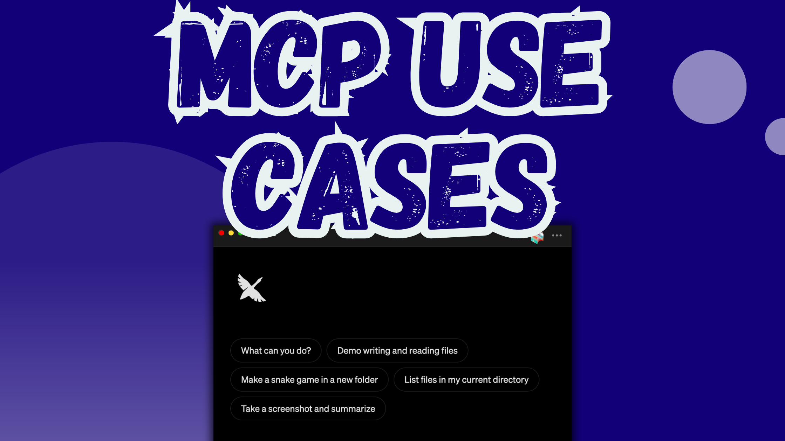

「别再用 AI 了」，又一条病毒式帖子这样写。我懂。审阅同事自动生成的作品令人沮丧，里面满是 AI 的经典破绽，比如泛泛的代码注释，以及「在当今快节奏的世界里……」这类句子。

尽管如此，AI 在我的职业生涯里仍扮演关键角色。我不靠 AI 替我干活，但我用它帮我头脑风暴、更高效地工作。
[模型上下文协议（MCP）](https://modelcontextprotocol.io)的出现让这件事更容易了。MCP 是一项开放标准，给 AI 工具提供它们在真实世界里派上用场所需的上下文。它让 AI 智能体能以结构化方式与 API、应用和系统交互。我用的是 [codename goose](/)，一个基于 MCP 构建的开源 AI 智能体。

下面是我在不牺牲本色、创造力或质量的前提下使用 AI 智能体的 11 种真实方式：

<!--truncate-->

## 1. 🙌🏿 解放双手写代码

### 用例

我对着 goose 说话，而不是打字，用声音作为输入来写代码或跑任务。

### 为什么有用

我常有「脑子里有想法，但双手腾不开」的时刻。无论是在给宝宝喂奶，还是从腕管综合征中恢复，这都给我一种不用打字就能捕捉想法的无障碍方式。

旁注：我在一次聚会上遇到一位 AI 爱好者，他说自己有时开车时会冒出写代码的想法。他在探索用声音随时做 vibe coding。出门注意安全。别边开车边写代码！🚗⛑️

### 如何尝试

1. 按照[这篇教程](/docs/mcp/speech-mcp)操作
2. 启用 [`Speech`](https://github.com/Kvadratni/speech-mcp) 和 [`Developer`](/extensions/detail?id=developer) 扩展
3. 提示 goose：
    > 我想说话，而不是打字。

<iframe class="aspect-ratio" src="https://www.youtube.com/embed/rurAp_WzOiY" title="YouTube video player" frameborder="0" allow="accelerometer; autoplay; clipboard-write; encrypted-media; gyroscope; picture-in-picture; web-share" allowfullscreen></iframe>

## 2. 🎤 准备播客提纲

### 用例

我给 goose 一段嘉宾会议演讲的 YouTube 视频。然后提示 goose 生成文字稿，并写出有思考的访谈问题。

### 为什么有用

我希望嘉宾觉得我真的了解他们的工作，即使我没有几个小时来准备。这让我能问出更聪明的问题，把节目做得更好。

### 如何尝试

1. 按照[这篇教程](/docs/mcp/youtube-transcript-mcp)操作
2. 启用 [`YouTube Transcript`](https://github.com/jkawamoto/mcp-youtube-transcript) 和 [`Developer`](/extensions/detail?id=developer) 扩展
3. 提示 goose：
   > 为这个视频生成文字稿 https://www.youtube.com/watch?v=dQw4w9WgXcQ，然后根据内容创建相关的访谈问题

---

## 3. 🖼 调整图片尺寸

### 用例

演讲管理平台对头像往往有不同的图片要求。我以前会花多得不好意思的时间，试着在不破坏宽高比的情况下调整照片尺寸。现在，我直接让 goose 去做。

### 为什么有用

它让我不用再跟随机的在线工具或臃肿的设计应用较劲。几秒钟就能得到一张干净、尺寸正确的图片，而且看起来正是我想要的样子。

### 如何尝试

1. 启用 [`Developer`](/extensions/detail?id=developer) 扩展
2. 提示 goose：
   > 把这张图片（~/Downloads/image.png）调整为 1000x1000 像素。保持宽高比和图片质量。

---

## 4. 📝 对照职位列表审阅简历

### 用例

我用 goose 把当前简历和我看到的职位列表做对比。

### 为什么有用

我现在不在找工作，但我喜欢保持准备。我的策略是让简历保持更新、有竞争力。我通过把当前简历和职位列表对比来做到这一点，但不必再手工做了。相反，goose 能针对具体职位快速指出我的优势和短板。这种方法也能帮助招聘经理更快地审阅简历。

### 如何尝试

1. 按照[这篇教程](/docs/mcp/pdf-mcp)操作
2. 启用 [`PDF Reader`](https://github.com/michaelneale/mcp-read-pdf) 扩展
3. 提示 goose：
   > 阅读 ~/Downloads/resume.pdf 里的简历，评估这位候选人与以下岗位要求的匹配程度：
   >   - 5 年以上后端开发经验
   >   - 扎实的系统设计与分布式系统知识
   >   - 云基础设施经验（优先 AWS）
   >   - 曾领导技术项目或团队
   >   - 加分项：熟悉 LLM 或 AI/ML 工具
   >
   > 每项按 5 分制打分，给出支持证据，并用最终匹配评级做总结。

<iframe class="aspect-ratio" src="https://www.youtube.com/embed/EJf2_iZfaWk" title="YouTube video player" frameborder="0" allow="accelerometer; autoplay; clipboard-write; encrypted-media; gyroscope; picture-in-picture; web-share" allowfullscreen></iframe>
---

## 5. 🧠 理解习语

### 用例

我请 goose 解释我不懂的习语或典故。

### 为什么有用

因为我不是在美国出生的，而且我是神经多样性的，有时会把习语按字面理解，或误解它们。与其冒着在工作中尴尬的风险，我悄悄让 goose 翻译。

### 如何尝试

1. 启用 [`Developer`](/extensions/detail?id=developer) 扩展
2. 提示 goose：
   > 这句话是什么意思："Who does Vegas have as the favorite?"

---

## 6. 📊 查询关系型数据库

### 用例

我用自然语言向 goose 要数据洞察，它为我写了一条公用表表达式。

### 为什么有用

SQL 会因为连接、存储过程和子查询而变复杂。goose 帮我处理查询逻辑，让我更快，也少出错。

### 如何尝试

1. 按照[这篇教程](/docs/mcp/postgres-mcp)操作
2. 启用 [`PostgreSQL`](https://github.com/bytebase/dbhub/) 和 [`Developer`](/extensions/detail?id=developer) 扩展
3. 提示 goose：
   > 找出过去 90 天里按每周平均浏览量排名前 3 的博客文章。包含标题、URL、每周平均浏览量，以及是否在社交平台上推广过。

<iframe class="aspect-ratio" src="https://www.youtube.com/embed/PZlYQ5IthYM" title="YouTube video player" frameborder="0" allow="accelerometer; autoplay; clipboard-write; encrypted-media; gyroscope; picture-in-picture; web-share" allowfullscreen></iframe>
---

## 7. 🗓 规划我的会议演讲策略

### 用例

我用 goose 分析历史会议数据，以便更聪明地规划即将到来的 CFP 截止日期。

### 为什么有用

我容易把自己约满，或担心不被录取，于是什么都投。然后全部被录取，我不加思考就答应，结果规划很差、演讲赶工。有了 goose，我可以分析 CFP 时间线里的模式，做出更有意图的选择。

### 如何尝试

1. 按照[这篇教程](/docs/mcp/agentql-mcp)操作
2. 启用 [`AgentQL`](https://github.com/tinyfish-io/agentql-mcp) 扩展
3. 提示 goose：
   > 我是一名技术会议演讲者，正在规划 2025-2026 年的投稿。
   > 提取 2022-2024 年间举办、参会人数超过 500 的开发者会议：
   > - 会议名称
   > - 会议日期
   > - CFP 时间线
   >
   > 以便识别：
   > - 稳定的月度模式
   > - 会议是否每年固定在相同月份
   > - CFP 窗口是否年年一致
   > - 传统时间安排有没有任何变化
   >
   > 把结果组织成 JSON

---

## 8. 🐞 追查引入缺陷的提交

### 用例

一个功能坏了，但我提交太多，分不清是哪一次引入了缺陷。我请 goose 帮我运行 `git bisect`，以便找出有问题的代码。

### 为什么有用

调试最难的部分常常只是弄清该看哪里。Git bisect 让这件事更快，goose 带我走完流程，不必把步骤背下来。

### 如何尝试

1. 安装 [Git CLI](https://git-scm.com/book/en/v2/Getting-Started-Installing-Git)
2. 启用 [`Developer`](/extensions/detail?id=developer) 扩展
3. 提示 goose：
   > 我不知道自己什么时候引入了缺陷。你能带我用 git bisect 找出导致它的那次提交吗？

---

## 9. 学习新技术

### 用例

我喜欢跟上最新技术。既然 MCP 服务器很流行，我就用 goose 的教程扩展，一步步构建自己的 MCP 服务器。

### 为什么有用

除了生成代码，AI 智能体还能帮你学习如何写代码。goose 内置了一个教程扩展，用动手的方式带用户走过技术概念。

### 如何尝试

1. 按照[这篇教程](/docs/mcp/tutorial-mcp)操作
3. 提示 goose：
   > 我想学习如何为 goose 构建扩展或 MCP 服务器

---

## 10. 💼 对比监管文件

### 用例

这不是我自己做的，但我印象深刻：一位社区成员用 goose 对比了监管文件的拟议版和最终版。

### 为什么有用

法律文件往往又密又重复。goose 能标出真正改了什么，帮助用户快速看出更新如何影响合规或义务。

### 如何尝试

1. 启用 [`Computer Controller`](/extensions/detail?id=computercontroller) 扩展
2. 提示 goose：
   > 标出 FinCEN《投资顾问反洗钱法规》这两个版本之间的差异：
   >
   > 拟议版（2015）：https://www.federalregister.gov/documents/2015/09/01/2015-21318/anti-money-laundering-program-and-suspicious-activity-report-filing-requirements-for-registered
   >
   > 最终版（2024）：https://www.federalregister.gov/documents/2024/09/04/2024-19260/financial-crimes-enforcement-network-anti-money-launderingcountering-the-financing-of-terrorism
   >
   > 重点看投资顾问 AML/CFT 项目要求中的关键变化，以及它们如何影响合规义务。

---

## 11. 🛠 快速做出想法原型

### 用例

我用 goose 做了一个能跑的原型，并看到完整应用实际运行。

### 为什么有用

它又快又能用，让我验证一个想法值不值得继续，而不必从零写好几个小时代码。

### 如何尝试

1. 启用 [`Developer`](/extensions/detail?id=developer) 扩展
2. 提示 goose：
   > 用 JavaScript 做一个带实时滤镜的摄像头应用

🎥 **看现场：**
看 The Great Goose Off，我们挑战 goose 从零做出有创意的应用，比如：
- 一个鹅形状的绘图工具
- 一个故意混乱的认证流程

你会看到想法在一次会话里从提示变成原型。

<iframe class="aspect-ratio" src="https://www.youtube.com/embed/OsA3qhns7dg" title="YouTube video player" frameborder="0" allow="accelerometer; autoplay; clipboard-write; encrypted-media; gyroscope; picture-in-picture; web-share" allowfullscreen></iframe>

---

## 想要更多例子？

这篇博文只写了我使用 goose 的几种方式。如果你好奇它还能做什么，直接问：

今天你能帮我做的 5 件有用的事是什么？

让 goose 给你一个惊喜。✨

<head>
  <meta property="og:title" content="我在不丢掉本色的前提下使用 AI 智能体的 11 种实用方式" />
  <meta property="og:type" content="article" />
  <meta property="og:url" content="https://goose-docs.ai/blog/2025/04/21/practical-use-cases-of-ai" />
  <meta property="og:description" content="从会议规划到准备播客，我如何把基于 MCP 的 AI 智能体用在日常任务上。" />
  <meta property="og:image" content="https://goose-docs.ai/assets/images/mcp-use-cases-758ecc959d6334783257fc9d6329e1f2.png" />
  <meta name="twitter:card" content="summary_large_image" />
  <meta property="twitter:domain" content="goose-docs.ai" />
  <meta name="twitter:title" content="我在不丢掉本色的前提下使用 AI 智能体的 11 种实用方式" />
  <meta name="twitter:description" content="从会议规划到准备播客，我如何把基于 MCP 的 AI 智能体用在日常任务上。" />
  <meta name="twitter:image" content="https://goose-docs.ai/assets/images/mcp-use-cases-758ecc959d6334783257fc9d6329e1f2.png" />
</head>
