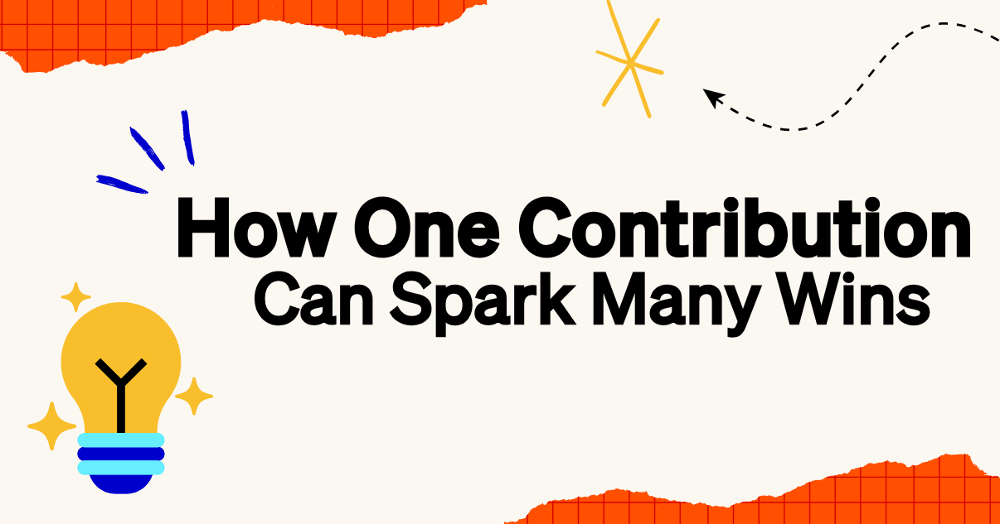

想知道自己的贡献能产生多大影响，唯一的办法就是提交出去，然后看结果。有时候，感觉只是「一个小修复」的改动，最终会重塑一个开源项目，或催生一个全新功能。下面讲一位杰出贡献者如何把一个小小的构建修复，变成对 goose 体验的重要改进。

<!--truncate-->

## BestCodes 如何发现 goose

[BestCodes（本名 William Steele）](https://bestcodes.dev/) 第一次发现 goose，是在一场 [GitHub Open Source Friday 直播](https://www.youtube.com/watch?v=O-zJJN-TkXc&ab_channel=AngieJones)里，随后决定试一试。当时 goose 对 Windows/Linux 的支持有限（正式发布前还有更多工作在进行）。BestCodes 不是 Mac 用户，他想帮忙把支持带到 Linux。经过大量排查，他最终做出了[一项 Debian 构建修复](https://github.com/aaif-goose/goose/pull/2070)，这才让他能在 Linux 上开始使用 goose。

尽管 BestCodes 曾怀疑这么小的修复值不值得分享，正是这份「小」贡献，让同样想在 Linux 上使用 goose 的社区成员用上了它，也给他后续的 PR 带来了动力。他的经历证明：你的贡献有机会帮到某个人，所以应该分享出去。你永远不知道好奇心和开源社区能促成什么。

## 积蓄势头

BestCodes 持续用细致的改进让 goose 变得更好——从[打磨 UI](https://github.com/aaif-goose/goose/pull/2079)、[改进加载状态](https://github.com/aaif-goose/goose/pull/2079)，到[修复那些让体验更顺滑的细微 bug](https://github.com/aaif-goose/goose/pull/2279)。你可以在 GitHub 上查看 [BestCodes 的贡献](https://github.com/aaif-goose/goose/pulls?q=is%3Apr+is%3Aclosed+author%3AThe-Best-Codes)。

非常感谢你持续的支持和贡献，BestCodes！你的工作让我们离 Windows 和 Linux 上完整的 goose 体验又近了一步。

为了表达我们对你贡献的感激，我们在 Block Open Source Discord 上授予你专属的 ✨Top Contributor✨ 徽章！此外，你还会收到 codename goose 专属周边。👀🪿

## 成为杰出贡献者
有兴趣为 goose 做贡献，并让自己的工作被介绍出来吗？无论是修 bug、分享想法，还是帮助他人，开源社区的每一份贡献都有机会帮到某个人。你可以今天就[加入 Block Open Source Discord](https://discord.gg/n8R5VaWDAn)，或[开始使用 codename goose](https://goose-docs.ai/)。

<head>
  <meta property="og:title" content="一份贡献如何点燃一连串成果" />
  <meta property="og:type" content="article" />
  <meta property="og:url" content="https://goose-docs.ai/blog/2025/04/22/community-bestcodes" />
  <meta property="og:description" content="一位贡献者的修复如何滚雪球" />
  <meta property="og:image" content="https://goose-docs.ai/assets/images/bestcodes-3d6c50de10a2d84def19d515aaea0724.png" />
  <meta name="twitter:card" content="summary_large_image" />
  <meta property="twitter:domain" content="goose-docs.ai" />
  <meta name="twitter:title" content="一份贡献如何点燃一连串成果" />
  <meta name="twitter:description" content="一位贡献者的小修复如何滚雪球" />
  <meta name="twitter:image" content="https://goose-docs.ai/assets/images/bestcodes-3d6c50de10a2d84def19d515aaea0724.png" />
</head>
