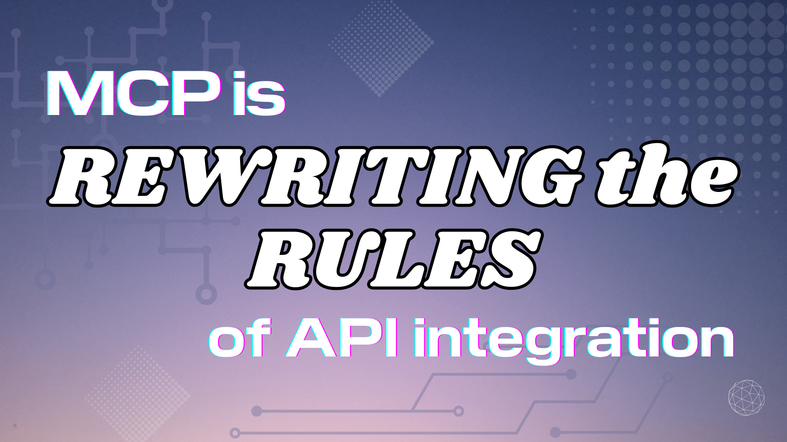

作为开发者，我们一直在寻找构建更高效、可扩展、智能应用的方法。多年来，RESTful API 一直是我们连接服务的首选。下面是一些你可以把 AI 智能体和 MCP 集成进现有 API 基础设施的方式，让它更聪明、更高效、更容易维护。

<!--truncate-->

## 引言：你的 API 的智能演进

2023 年 3 月，OpenAI 宣布通过使用格式正确的 OpenAPI 规范文件，并在同一文件中写上细致、详细的说明，更容易集成到 ChatGPT。这一宣布在开发者社区获得了很多关注。商业影响是开发者和文档作者一起在一份巨大的规范文件上工作，为 ChatGPT 提供必要上下文，以理解使用哪个 API，以及如何使用。

只过了很短一段时间，[AI 智能体](https://news.microsoft.com/source/features/ai/ai-agents-what-they-are-and-how-theyll-change-the-way-we-work/)结合 [Model Context Protocol（MCP）](https://modelcontextprotocol.io/introduction) 正在拆分这项工作：MCP 可以包含上下文和感知，你的 API 团队可以专注于 API 本身。这些也不只是增量改进；智能体 AI 与 MCP 的组合代表了我们如何连接并与数据和服务交互的根本转变。

转向[使用 AI 智能体和 MCP](/blog/2025/02/17/agentic-ai-mcp/) 有潜力成为像 2005 年引入 REST API 一样大的变化。想象一个世界，集成更动态、更具上下文感知，并且需要更少的手工编码。这不是遥远的未来——它已经在发生。这是我们提高生产力、增强应用智能，并最终为我们的用户、客户和顾客提供更好体验的机会。

让我们用一个例子：想象你的团队希望 AI 在 Square 处理电商工作流中的动态定价调整。如果你能对市场变化或库存获得更快的响应时间，就可以减少在代码中构建几十或几百条动态定价规则的需要。作为开发者，你的生产力上升，你要维护的代码更少。你可以用更接近口语的方式写那些规则，AI 智能体可以通过 MCP 和你的 API 处理其余部分。

## 从静态端点到智能交互

### 当前图景：传统 API 的限制

我们当前的许多系统严重依赖传统 API，如 RESTful API，它们被设计为用静态端点对特定请求回应特定结果。虽然这些 API 为我们服务得很好（而且肯定不会很快消失），它们有限制：

- RESTful API 的静态性质使它们更僵硬，对业务变化的适应性更差，并需要围绕版本控制的硬规则来提供兼容性。
- 它们常常需要大量手工努力来定义端点、处理数据转换和管理复杂工作流。这可能导致更慢的开发周期和更高的维护开销。

**AI 的机会在于利用智能体，结合 MCP，创建更具适应性的集成。** 这些智能体可以理解上下文、发现相关服务，并以比静态 API 调用更动态的方式协商交互。静态 API 仍在使用，但 AI 智能体可以比修改你调用 API、解析和验证响应、处理错误的代码更容易地导航它们。

### 开发影响：提高生产力，增强用户体验

AI 智能体和 MCP 的这种双重集成，可以对你的开发流程和你构建的应用产生显著的积极影响：

* **开发者生产力：** 通过自动化许多集成任务并减少大量手工编码的需要，AI 智能体解放我们的时间，让我们专注于核心应用逻辑和创新。（还有测试。还有安全。还有文档。还有……）
* **客户满意度：** 智能集成可以带来更个性化、更灵敏的用户体验。智能体可以促进实时数据分析和上下文感知的交互，让我们的应用更聪明、更易用。
* **可扩展性：** 随着应用增长，管理多个 API 的复杂性可能变得压倒性。[使用多个 AI 智能体](/blog/2025/02/21/gooseteam-mcp/)可以通过动态适应底层服务和工作流的变化来帮助管理这种复杂性。

### 商业影响：推动效率和成本节省

从业务一侧，AI 智能体和 MCP 的集成可以带来显著的成本节省和效率提升。下面是你可以期待看到改进的一些关键领域：

**示例 ROI 计算（每位开发者）：**

传统 API 开发：
- 添加功能的平均时间：2 周
- 开发者成本：每小时 150 美元
- 假设每周 40 小时：2 周 × 每周 40 小时 × 每小时 150 美元 = 12,000 美元

启用 AI 智能体：
- 添加功能的平均时间：2 天
- 开发者成本：每小时 150 美元
- 假设每天 8 小时：2 天 × 每天 8 小时 × 每小时 150 美元 = 2,400 美元

50 个功能的年度节省：（12,000 美元 − 2,400 美元）× 50 = **每位开发者 480,000 美元**

这说明通过采用 AI 智能体，每位开发者有显著的时间和成本节省潜力。

## 集成 AI 和 MCP：在图景中导航

集成 AI 智能体，尤其是通过 MCP 这样的平台，需要仔细考虑。

- 风险管理：MCP 虽然有前景，但是较新的技术。你的团队需要彻底评估[潜在的安全关切](/blog/2025/03/26/mcp-security/)，并在深度集成进关键系统之前理解平台的成熟度。
- 为连续性和版本控制做计划：和任何演进中的技术一样，你需要策略来确保集成的连续性，并管理 AI 智能体和 MCP 本身的版本。

### 分阶段方法：一种实用的集成策略

逐步方法可以帮助降低风险，并在你通过 MCP 集成 AI 智能体时通过反馈有效学习：

**阶段 1：评估（初步探索）**
- 查看你现有的 API 使用，并识别集成可能性
- 考虑 ROI：从小想法开始，随时间扩大你的集成努力
- 为采用 AI 智能体和 MCP 建立初步的业务/技术计划

**阶段 2：A/B 测试和试点项目**
- 选择一个低风险、高价值的服务，通过 MCP 做初步的 AI 智能体集成
- 实现集成，然后针对传统 API 方法做彻底的 A/B 测试和比较
- 衡量结果，收集基准/性能数据，并和团队谈论你的发现

**阶段 3：扩展和优化**
- 一次走一步：根据结果，承担更大、更复杂的集成想法
- 继续随时间优化你的集成过程
- 使用来自开发团队和最终用户的反馈来细化你的过程

## 衡量成功：量化影响

给业务读者：要理解通过 MCP 集成 AI 智能体的好处，下面是你可以跟踪的一些关键绩效指标（KPI）：

- 开发速度
- 错误率
- 客户满意度

### 建立你的案例研究并分享你的学习

记录你团队的旅程并分享经验，对你的团队和更广泛的开发者社区都有价值。下面是你应该分享的几件事，以帮助展示项目的影响：

- **前后指标**：集成 AI 智能体和 MCP 之后，你在开发时间、错误率上看到了什么样的改进？
- **团队反馈**：这里会有学习曲线，类似于我们集成 API 时都经历过的；收集关于集成工作流进展如何、什么可以改进的反馈
- **客户/最终用户影响**：突出用户参与、满意度或其他用户/客户指标中的任何积极变化
- **经验教训**：也许最重要；什么有效，什么无效，你如何为下一阶段的集成改变过程

## 我们从这里去哪里？

理解你现有的集成，并识别用 AI 智能体和 MCP 改进的潜在领域，是你的起点。关于集成 AI 智能体有很多要学，MCP 仍然是新技术。

找到 AI 能帮忙的那些机会，并勾勒一个逐步把 AI 和 MCP 采纳进项目的计划，是开始的最好方式。

记住，这个集成图景仍在演进。对新想法保持开放，并随着技术成熟调整你的方法。构建更聪明的应用是一段旅程，路上会有分岔。

延伸阅读：

1. 什么是 AI 智能体
- [AI agents — what they are, and how they’ll change the way we work](https://news.microsoft.com/source/features/ai/ai-agents-what-they-are-and-how-theyll-change-the-way-we-work/)
- [What are AI Agents and Why do They Matter?](https://www.aitrends.com/ai-agents/what-are-ai-agents-and-why-do-they-matter/)

2. [MCP 简介](https://modelcontextprotocol.io/introduction)

3. [用 MCP 把 AI 智能体连接到你的系统](/blog/2024/12/10/connecting-ai-agents-to-your-systems-with-mcp/)

4. [Global AI Survey: AI proves its worth, but few scale impact](https://www.mckinsey.com/featured-insights/artificial-intelligence/global-ai-survey-ai-proves-its-worth-but-few-scale-impact)

5. [Bringing generative AI to bear on legacy modernization in insurance](https://www.thoughtworks.com/en-us/insights/blog/generative-ai/generative-ai-legacy-modernization-insurance-erik-doernenburg)

## 一句话常见问题

问：**MCP 如何帮助 API？** 
答：从 [Angie Jones 的这篇文章](/blog/2025/02/17/agentic-ai-mcp/#mcp-ecosystem)开始。MCP 提供关于你的 API 的上下文，给 AI 智能体更多关于你的 API 端点和响应能力的上下文和感知。这可以帮助智能体理解请求的意图，并动态调用（或「call」）底层 API 端点、处理数据转换并返回响应。不必再手动编写代码、响应验证器、错误处理器等等！

问：**作为开发者，我可以采取哪些初步步骤来探索 AI 智能体和 MCP？** 
答：从研究基本概念开始，并使用其他现有的 MCP 服务器。我们建议从 [goose](/) 开始，集成一台现有的 MCP 服务器。我们有一份不断增长的[教程列表](/docs/category/mcp-servers)，帮助你找到 GitHub、PostgreSQL、Google Maps 等技术。一旦你对使用 MCP 感到自在，就可以开始为自己的 API 构建自己的 MCP 服务器。

问：**AI 和 MCP 的安全呢？** 
答：AI 智能体可以通过交互中更好的上下文感知来增强安全，但 MCP 仍然相对新，需要[仔细的安全评估](/blog/2025/03/26/mcp-security/)。你的业务和开发团队应该彻底调查 MCP 的能力，以确保你在构建适当的访问控制并管理数据隐私。

问：**完整迁移通常要多久？** 
答：太动态了，给不出一个固定答案。集成和迁移可能差异很大，取决于你现有 API 使用和现有集成的范围。从小处开始，构建一些试点项目来试试，这些可能只需要几天或几周。

问：**开发者在这条 AI/MCP 旅程上可能遇到哪些潜在问题？** 
答：任何技术都有学习曲线。当你考虑到 MCP 仍然相对新且在演进时，这可能更复杂。更大的社区需要围绕测试和调试 MCP 的策略，以及考虑安全和数据隐私。这意味着你今天学到的东西，即使短短几个月后也需要重新评估。

问：**MCP 对企业级 AI 集成有多成熟、多适合生产？** 
答：你的方法可能取决于你是在构建自己的 MCP 服务器，还是在集成中使用第三方 MCP 服务器。开发者应该评估 MCP 的全部好处，并考虑围绕安全和数据隐私正在做的工作。最初聚焦于一个小的试点项目或非关键系统，以评估它是否适合你的具体需求。关注 [MCP 的开发路线图](https://modelcontextprotocol.io/development/roadmap)和社区反馈。

<head>
  <meta property="og:title" content="MCP 正在改写 API 集成的规则" />
  <meta property="og:type" content="article" />
  <meta property="og:url" content="https://goose-docs.ai/blog/2025/04/22/mcp-is-rewriting-the-rules-of-api-integration" />
  <meta property="og:description" content="一份开发者指南：用 AI 智能体和 Model Context Protocol 现代化 API 基础设施。了解好处、集成策略，以及如何处理安全考虑。" />
  <meta property="og:image" content="https://goose-docs.ai/assets/images/cover-1e2153c66f3f0c92da7bbaafd240a9b4.png" />
  <meta name="twitter:card" content="summary_large_image" />
  <meta property="twitter:domain" content="goose-docs.ai" />
  <meta name="twitter:title" content="MCP 正在改写 API 集成的规则" />
  <meta name="twitter:description" content="一份开发者指南：用 AI 智能体和 Model Context Protocol 现代化 API 基础设施。了解好处、集成策略，以及如何处理安全考虑。" />
  <meta name="twitter:image" content="https://goose-docs.ai/assets/images/cover-1e2153c66f3f0c92da7bbaafd240a9b4.png" />
</head>
