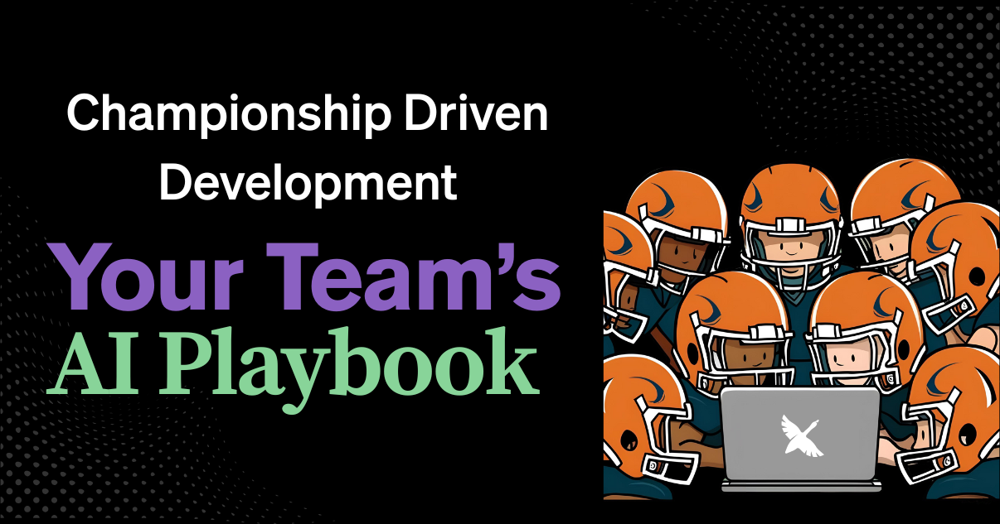

# 开发者战术手册：用 AI 提升团队效率

开发团队可以像运动队那样运作。每个成员有自己的角色，一份共享的战术手册帮助协调努力。让我们看看 AI 驱动的「战术」如何构成你的开发团队的起步「战术手册」，帮助处理常见技术任务。你可以配合 [goose](/) 使用配方，借助[模型上下文协议（MCP）](https://modelcontextprotocol.io)让自己更有生产力。

<!-- truncate -->

---

## 理解现代开发团队的挑战

* 开发团队管理复杂的系统和工具。他们努力快速、可靠地交付软件。
* 新开发者需要学习团队的流程和工具。这需要时间。
* 要在所有工作中保证一致的质量，需要清楚的标准，例如：一支运动队一遍遍练习战术，以达到一致的执行。
* 团队常常使用很多工具，从 IDE 和版本控制到 CI/CD 流水线和问题跟踪器。
* 管理这些工具以及它们之间的工作流可能很复杂。

## 使用 AI 战术手册的好处

一份共享的 AI 战术手册给开发团队带来几项好处：
* **更快入职：** 新成员可以用现有配方学习标准流程，更快变得有生产力。
* **更好的一致性：** 标准化配方确保任务每次都以同样方式完成，结果更可预期。
* **更高的效率：** 把常规任务自动化，让开发者能专注于更复杂的问题解决。
* **知识共享：** 配方可以把团队知识和最佳实践编码下来，让每个人都能用。

随着团队采用 goose 这类 AI 工具，定义并分享这些自动化工作流的能力会越来越重要。


## AI 战术：标准化团队工作流

goose 可以通过[创建配方](/docs/guides/recipes/session-recipes)来帮助标准化并自动化这些任务。当你团队里的一位开发者使用 goose 时，他们可以创建一份描述如何执行某项任务的配方，然后分享给团队其他人。这些配方可以分享、复用，并随时间改进，就像运动队的战术手册。

配方建立在你希望 goose 协助的工作流理解之上，这些工作流可能涉及一个或多个 MCP 服务器，例如 [GitHub](/docs/mcp/github-mcp/) 或 [PostgreSQL](/docs/mcp/postgres-mcp/)。配方被设计成可复用、可适应，让开发者能建一个跨不同项目使用的库。

一份共享的 AI 战术手册帮助团队里每个人一致地执行任务。它也能减少花在重复工作上的时间。

## goose 配方：战术手册的构件

想要一个厨房类比作为概览，看看 [Rizel](/blog/authors/rizel/) 最近的博文[《成功配方》](/blog/2025/05/06/recipe-for-success)。

一份 goose 配方可以从当前 goose 会话保存，也可以从零写成 YAML 文件。它包括给 AI 遵循的指令、给 AI 回应的提示、带数据类型的可选参数，以及所需扩展的列表。

### 创建配方

如果你[从当前 goose 会话创建配方](/docs/guides/recipes/session-recipes/#create-recipe)，它会提示你输入名称和描述，并生成一些你可以编辑的活动，以及你应该审阅并编辑的指令。你会得到一个可以分享给团队的 URL。

要从零创建配方，你可以在会话里用 `/recipe` 命令，让 goose CLI 创建一个新的配方文件。这会在当前目录创建 `recipe.yaml`。要自定义文件名，可以用 `/recipe custom-filename.yaml`。然后，你加上自己的指令和活动。

### 校验配方

像所有会测试自己代码的好开发者一样（你确实会测试代码，对吧？），你也可以在终端/shell 里运行 `goose validate recipe-filename.yaml` 来校验 goose 配方，它会检查配方文件的语法和结构。

### 分享配方

如果你用的是 goose 桌面应用，创建配方会给你一个 URL，可以直接分享给团队。

如果你在用 YAML 创建配方文件，可以把文件分享给团队，也可以在终端/shell 里运行 `goose recipe deeplink recipe-filename.yaml` 为它创建一个 URL。

### 使用配方

点击团队分享的 URL 会打开 goose，并在新会话里加载配方。用户之间不共享数据，所以你不必担心泄露 API 密钥或其他敏感信息。

对 CLI，你可以在终端/shell 里用命令 `goose run recipe-filename.yaml` 运行配方。

:::info 专业提示
你可以设置一个环境变量，指向团队配方所在的共享 GitHub 仓库，队友就可以按名称运行配方：
`export GOOSE_RECIPE_GITHUB_REPO=github-username/repo-name`

然后，运行一份配方：`goose run --recipe <recipe-name>`
:::


## 给你的团队的 AI 战术起步包

一套 AI 战术「起步包」可以覆盖常见的开发工作流。这给你的团队一个自动化常规任务的基础。下面是一些想法，帮你开始思考可以用 goose 自动化哪些任务。

### 战术 1：生成变更日志

维护变更日志对跟踪项目进展和沟通更新很重要。这项任务可能很费时。
一条 AI 战术可以自动化这个过程的一部分。例如，「从 Git 提交生成变更日志」这条战术（基于所提供文件里的 `recipe.yaml`）帮助创建一致的变更日志。

#### 这条战术如何工作：
1.  **收集数据：** AI 从 Git 仓库中检索指定点之间的提交信息、日期和问题编号。
2.  **归类信息：** 它把提交组织成功能、缺陷修复和性能改进等类别。
3.  **格式化输出：** AI 把这些信息格式化成结构化的变更日志文档。
4.  **更新文件：** 然后它可以把这些格式化好的说明插入你现有的 `CHANGELOG.md` 文件。

这条战术帮助确保变更日志详细且格式一致，节省开发者时间。

<details>
  <summary>查看变更日志配方</summary>

```yaml
version: 1.0.0
title: Generate Changelog from Commits
description: Generate a weekly Changelog report from Git Commits
prompt: perform the task to generate change logs from the provided git commits
instructions: |
  Task: Add change logs from Git Commits

  1. Please retrieve all commits between SHA {{start_sha}} and SHA {{end_sha}} (inclusive) from the repository.

  2. For each commit:
    - Extract the commit message
    - Extract the commit date
    - Extract any referenced issue/ticket numbers (patterns like #123, JIRA-456)

  3. Organize the commits into the following categories:
    - Features: New functionality added (commits that mention "feat", "feature", "add", etc.)
    - Bug Fixes: Issues that were resolved (commits with "fix", "bug", "resolve", etc.)
    - Performance Improvements: Optimizations (commits with "perf", "optimize", "performance", etc.)
    - Documentation: Documentation changes (commits with "doc", "readme", etc.)
    - Refactoring: Code restructuring (commits with "refactor", "clean", etc.)
    - Other: Anything that doesn't fit above categories

  4. Format the release notes as follows:
    
    # [Version/Date]
    ## Features
    - [Feature description] - [PR #number](PR link)
    ## Bug Fixes
    - [Bug fix description] - [PR #number](PR link)
    [Continue with other categories...]
    
    Example:
    - Optimized query for monthly sales reports - [PR #123](https://github.com/fake-org/fake-repo/pull/123)

  5. Ensure all commit items have a PR link. If you cannot find it, try again. If you still cannot find it, use the commit sha link instead. For example: [commit sha](commit url)

  6. If commit messages follow conventional commit format (type(scope): message), use the type to categorize and include the scope in the notes as a bug, feature, etc

  7. Ignore merge commits and automated commits (like those from CI systems) unless they contain significant information.

  8. For each category, sort entries by date (newest first).

  9. Look for an existing CHANGELOG.md file and understand its format; create the file if it doesn't exist. Then, output the new changelog content at the top of the file, maintaining the same markdown format, and not changing any existing content.

extensions:
- type: builtin
  name: developer
  display_name: Developer
  timeout: 300
  bundled: true
activities:
- Generate release notes from last week's commits
- Create changelog for version upgrade
- Extract PR-linked changes only
- Categorize commits by conventional commit types
author:
  contact: goose-community
```

</details>


### 战术 2：撰写拉取请求描述

清楚的拉取请求（PR）描述帮助审阅者理解正在做的更改，从而给出更好的反馈。写详细的 PR 需要力气。

#### 这条战术如何工作：
1.  **分析更改：** AI 分析本地 Git 仓库里已暂存的更改和未推送的提交。
2.  **识别更改类型：** 它判断更改的性质（例如功能、修复、重构）。
3.  **生成描述：** 它创建一份 PR 描述，包括更改摘要、技术细节、修改文件列表和潜在影响。
4.  **建议分支/提交（可选）：** 有些战术也可能根据代码更改建议分支名或提交信息。

使用这条战术有助于创建一致、信息充分的 PR。这让代码审阅过程更高效。

<details>
  <summary>查看 PR 生成器配方</summary>

```yaml
version: 1.0.0
title: PR Generator
author:
  contact: goose-community
description: Automatically generate pull request descriptions based on changes in a local git repo
instructions: Your job is to generate descriptive and helpful pull request descriptions without asking for additional information. Generate commit messages and branch names based on the actual code changes.
parameters:
  - key: git_repo_path
    input_type: string
    requirement: first_run
    description: path to the repo you want to create PR for
  - key: push_pr
    input_type: boolean
    requirement: optional
    default: false
    description: whether to push the PR after generating the description
extensions:
    - type: builtin
      name: developer
      display_name: Developer
      timeout: 300
      bundled: true
    - type: builtin
      name: memory
      display_name: Memory
      timeout: 300
      bundled: true
      description: "For storing and retrieving formatting preferences that might be present"
prompt: |
  Analyze the staged changes and any unpushed commits in the git repository {{git_repo_path}} to generate a comprehensive pull request description. Work autonomously without requesting additional information.

  Analysis steps:
  1. Get current branch name using `git branch --show-current`
  2. If not on main/master/develop:
     - Check for unpushed commits: `git log @{u}..HEAD` (if upstream exists)
     - Include these commits in the analysis
  3. Check staged changes: `git diff --staged`
  4. Save the staged changes diff for the PR description
  5. Determine the type of change (feature, fix, enhancement, etc.) from the code

  Generate the PR description with:
  1. A clear summary of the changes, including:
     - New staged changes
     - Any unpushed commits (if on a feature branch)
  2. Technical implementation details based on both the diff and unpushed commits
  3. List of modified files and their purpose
  4. Impact analysis (what areas of the codebase are affected)
  5. Testing approach and considerations
  6. Any migration steps or breaking changes
  7. Related issues or dependencies

  Use git commands:
  - `git diff --staged` for staged changes
  - `git log @{u}..HEAD` for unpushed commits
  - `git branch --show-current` for current branch
  - `git status` for staged files
  - `git show` for specific commit details
  - `git rev-parse --abbrev-ref --symbolic-full-name @{u}` to check if branch has upstream

  Format the description in markdown with appropriate sections and code blocks where relevant.

  
  Execute the following steps for pushing:
  1. Determine branch handling:
     - If current branch is main/master/develop or unrelated:
       - Generate branch name from staged changes (e.g., 'feature-add-user-auth')
       - Create and switch to new branch: `git checkout -b [branch-name]`
     - If current branch matches changes:
       - Continue using current branch
       - Note any unpushed commits

  2. Handle commits and push:
     a. If staged changes exist:
        - Create commit using generated message: `git commit -m "[type]: [summary]"`
        - Message should be concise and descriptive of actual changes
     b. Push changes:
        - For existing branches: `git push origin HEAD`
        - For new branches: `git push -u origin HEAD`

  3. Create PR:
     - Use git/gh commands to create PR with generated description
     - Set base branch appropriately
     - Print PR URL after creation

  Branch naming convention:
  - Use kebab-case
  - Prefix with type: feature-, fix-, enhance-, refactor-
  - Keep names concise but descriptive
  - Base on actual code changes

  Commit message format:
  - Start with type: feat, fix, enhance, refactor
  - Followed by concise description
  - Based on actual code changes
  - No body text needed for straightforward changes

  Do not:
  - Ask for confirmation or additional input
  - Create placeholder content
  - Include TODO items
  - Add WIP markers
  
```

</details>

### 战术手册里其他可能的战术

你的团队可以为许多其他任务创建战术：
* **调试协助：** 一条战术可以引导开发者或 AI 走过诊断常见问题的初始步骤，检查特定日志或运行预定义命令。
* **日志分析：** 一条 AI 战术可以定义查询并总结日志数据以发现问题的标准流程。
* **文档更新：** 一个「Readme 机器人」可以让 AI 协助生成或更新项目 README 文件。
* **内容迁移：** 「开发指南迁移」配方可以为迁移文档内容提供结构化方法，确保信息被保留并正确格式化。

## 你的团队可以自动化哪些任务？

我们很希望你把想法分享给我们！创建一份配方，并把它发到 [Discord 上的 goose 社区](http://discord.gg/n8R5VaWDAn)。


<head>
  <meta property="og:title" content="冠军驱动开发：你的团队冲刺表现 AI 战术手册" />
  <meta property="og:type" content="article" />
  <meta property="og:url" content="https://goose-docs.ai/blog/2025/05/09/developers-ai-playbook-for-team-efficiency" />
  <meta property="og:description" content="了解基于模型上下文协议的 AI 驱动「战术」如何帮助开发团队改进变更日志生成和拉取请求等常见工作流。" />
  <meta property="og:image" content="https://goose-docs.ai/assets/images/cdd-playbook-69a053588574d8678c2acb92a1b21da6.png" />
  <meta name="twitter:card" content="summary_large_image" />
  <meta property="twitter:domain" content="goose-docs.ai" />
  <meta name="twitter:title" content="冠军驱动开发：你的团队冲刺表现 AI 战术手册" />
  <meta name="twitter:description" content="了解基于模型上下文协议的 AI 驱动「战术」如何帮助开发团队改进变更日志生成和拉取请求等常见工作流。" />
  <meta name="twitter:image" content="https://goose-docs.ai/assets/images/cdd-playbook-69a053588574d8678c2acb92a1b21da6.png" />
  <meta name="keywords" content="AI development; Model Context Protocol; developer productivity; team playbook; AI automation; Goose; software development efficiency; changelogs; pull requests" />
</head>
