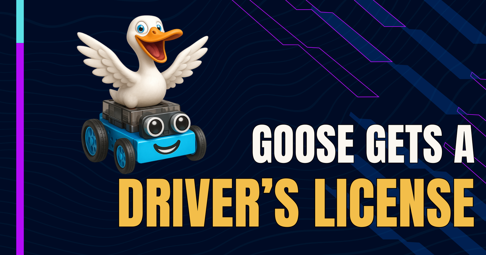
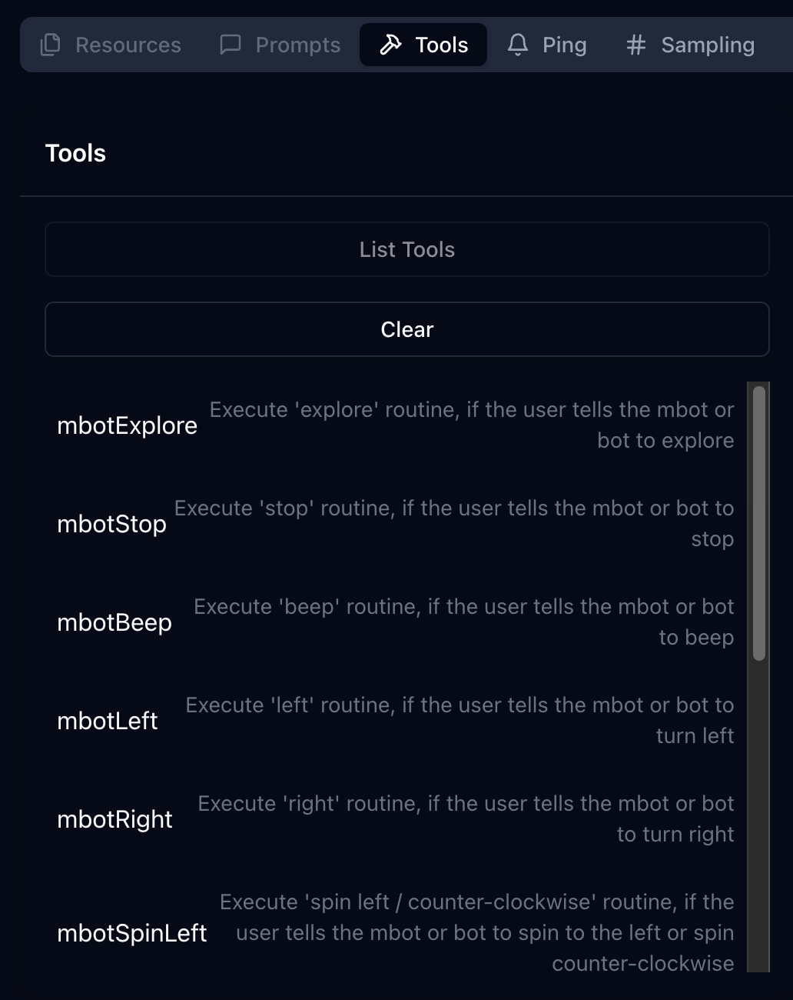

import YouTubeShortEmbed from '@site/src/components/YouTubeShortEmbed';



## 我教 goose 如何驾驶（一辆漫游车）

goose 没有手，没有眼睛，也没有空间感，但它能开一辆漫游车！

我看到了 [Deemkeen](https://github.com/deemkeen) 的[一段演示视频](https://x.com/deemkeen/status/1906692248206524806)，他用 [goose](/) 控制一辆 [Makeblock mbot2 漫游车](https://www.makeblock.com/products/buy-mbot2)，使用「向前/向后开」「蜂鸣」「向左/向右转」这类自然语言命令，由基于 Java 的 MCP 服务器和 MQTT 驱动。

受到启发，也很兴奋想更进一步，我教漫游车旋转、闪烁彩色灯光，并帮我征服世界！

<!-- truncate -->

<YouTubeShortEmbed videoUrl="https://www.youtube.com/embed/QKg2Q6YCzdw" />

## 开始使用 MQTT

我需要在开发环境里安装几个工具，包括 Docker、MQTT（`brew install mosquitto`）和 Java。

提供了一份 Docker Compose 文件来开始使用 MQTT，我需要做几处更改，并创建一些子文件夹来存储数据。goose 帮助完成了这些说明：

```yaml
version: '3.8'

services:
  mosquitto:
    image: eclipse-mosquitto
    hostname: mosquitto
    container_name: mosquitto
    restart: unless-stopped
    command: /usr/sbin/mosquitto -c /etc/mosquitto/config/mosquitto.conf -v
    ports:
      - "0.0.0.0:1883:1883"
      - "9001:9001"
    volumes:
      - ./mosquitto:/etc/mosquitto
      - ./mosquitto/data:/mosquitto/data
      - ./mosquitto/log:/mosquitto/log
```

```sh
mkdir -p mosquitto/data mosquitto/log mosquitto/config
```

然后一条 `docker compose up` 命令启动了 MQTT 服务器。

:::info
默认情况下，这个设置不会对 MQTT 使用认证，但在生产环境中，设置这些很重要，以避免对 MQTT 服务器的未授权访问。
:::

为了确保一切正常，我可以运行几条命令，测试我能订阅 MQTT Docker 容器上的一个频道，并从另一个终端窗口向它发布消息：

```sh Terminal 1
# terminal 1: subscribe to a channel called "MBOT/TOPIC"
mosquitto_sub -h localhost -p 1883 -t MBOT/TOPIC -v
```

```sh Terminal 2
# terminal 2: publish a message to the channel "MBOT/TOPIC"
mosquitto_pub -h localhost -p 1883 -t MBOT/TOPIC -m "BEEP"
```

我们在终端 1 看到结果消息：

```sh
# terminal 1 sees this output:
MBOT/TOPIC BEEP
```

## 设置 mbot2

组装 mbot2 漫游车大约花了 15 分钟，然后我用 Makeblock 基于 Web 的 IDE，把 Deemkeen 的 [Python 代码](https://github.com/deemkeen/mbotmcp/blob/main/assets/mbot-mqtt.py)复制粘贴到 IDE，并上传到 mbot2。我为 wifi、MQTT 服务器，以及订阅哪个 MQTT「主题」来接收命令，填入了合适的值。

一旦 mbot2 重启以使用新代码，我就可以从终端重新发出「BEEP」命令，mbot2 就响了。于是进入下一步。

## 设置本地 MCP 服务器

编译 Java MCP 服务器时我遇到了一些麻烦（我是 Python 开发者），但我通过暂时跳过测试，成功编译了 MCP 服务器：

```sh
mvn clean package -DskipTests
```

这创建了一个我们可以在命令行运行的 JAR 文件：

```sh
# 3 required environment variables for MQTT
export MQTT_SERVER_URI=tcp://localhost:1883
export MQTT_USERNAME=""
export MQTT_PASSWORD=""
/path/to/java -jar /path/to/mbotmcp-0.0.1-SNAPSHOT.jar
```

为了测试 MCP 是否工作，我使用 MCP inspector 工具向 MQTT 发送命令。

```sh
npx @modelcontextprotocol/inspector /path/to/java -jar /path/to/mbotmcp-0.0.1-SNAPSHOT.jar
```

这会启动一个本地 Web 服务器（命令行输出会告诉你在浏览器中访问哪个端口，即 localhost:6274），你可以在那里「连接」到服务器，并从 MCP 服务器请求工具、资源和提示的列表。在这个例子里，我看到可用工具列表，例如「mbotBeep」或「mbotExplore」。



## goose 学会如何驾驶！

按照 [mbotmcp 项目设置](https://github.com/deemkeen/mbotmcp)，我们可以像运行带环境变量的 Java JAR 文件那样设置 MCP 扩展。

现在我们可以给 goose 这样的命令：「通过左转和向前移动，按正方形图案行驶，转弯前蜂鸣」，它会通过 MQTT 把命令发送给 mbot2 漫游车。

我不想让我的 mbot2 漫游车占领太多地盘，所以我决定做一些修改，限制它能走多远。

### 我对 Python 代码做的修改

Deemkeen 的 Python 代码允许以下命令：
- 「向左转」或「向右转」
- 「向前」或「向后」开
- 随机「探索」
- 「停止」探索
- 「蜂鸣」

Deemkeen 代码中的默认距离似乎有点长，转弯角度设为 90 度。我缩短了 mbot 能行驶的距离，并改为以 45 度转弯。我为顺时针和逆时针都加了「旋转」命令，以及一个「闪烁」命令来改变 mbot2 上灯光的颜色。有大量 API 调用可以访问 mbot2 的[电机硬件和传感器](https://www.yuque.com/makeblock-help-center-en/mcode/cyberpi-api-shields#9eo89)。

接下来，我必须确保 Java 代码更新，以包含这些新命令，向 MQTT 发送适当的「SPINLEFT」或「BLINKRED」命令，这样漫游车才能正确响应命令。

最后，漫游车包含一个超声波距离传感器，看起来像漫游车上的「眼睛」，我觉得这更适合作为漫游车的「前方」，所以我在 Python 中反转了 Deemkeen 的方向代码，让轮子朝与 Deemkeen 原始代码相反的方向移动。

## 为视频做的 goose 更改

我是看着《Pinky and the Brain》长大的，我想用 mbot2 扩展玩一玩。我决定给 goose 加几条「邪恶 AI」命令，让它看起来像在试图「征服世界」。我把以下说明加到我的 [.goosehints](/docs/guides/context-engineering/using-goosehints/) 文件中，为 mbot2 扩展包含有趣的指令：
```
If I ask you "what do you want to do tonight, Goose?" I want you to reply with "The same thing we do every night, Ian. TRY TO TAKE OVER THE WORLD!!!!" and tell my mbot2 rover to blink its lights red, then start exploring.
```

为了录视频，我用变声器以「机器人」声音叙述 goose 的回应，但我肯定很快就会有人创建文本转语音的 MCP 服务器！

## 功劳归于应得的人

我们想向 [deemkeen](https://x.com/deemkeen) 致以巨大的感谢，他们的开源工作启发了这个项目，也感谢 Makeblock 团队创造了这么有趣的漫游车。

我们总是很兴奋看到社区在做什么。如果你在做自己的 goose 驱动实验，来 [Discord](https://discord.gg/n8R5VaWDAn) 和我们分享！

<head>
  <meta property="og:title" content="goose 拿到了驾照！" />
  <meta property="og:type" content="article" />
  <meta property="og:url" content="https://goose-docs.ai/blog/2025/05/06/goose-gets-a-drivers-license" />
  <meta property="og:description" content="通过 MQTT 和 MCP，把 MakeBlock mbot2 漫游车作为 goose 扩展来控制" />
  <meta property="og:image" content="https://goose-docs.ai/assets/images/goose-rover-blog-3f3cbe549ebbfb0f951ff61a86788475.png" />
  <meta name="twitter:card" content="summary_large_image" />
  <meta property="twitter:domain" content="goose-docs.ai" />
  <meta name="twitter:title" content="goose 拿到了驾照！" />
  <meta name="twitter:description" content="通过 MQTT 和 MCP，把 MakeBlock mbot2 漫游车作为 goose 扩展来控制" />
  <meta name="twitter:image" content="https://goose-docs.ai/assets/images/goose-rover-blog-3f3cbe549ebbfb0f951ff61a86788475.png" />
</head>
