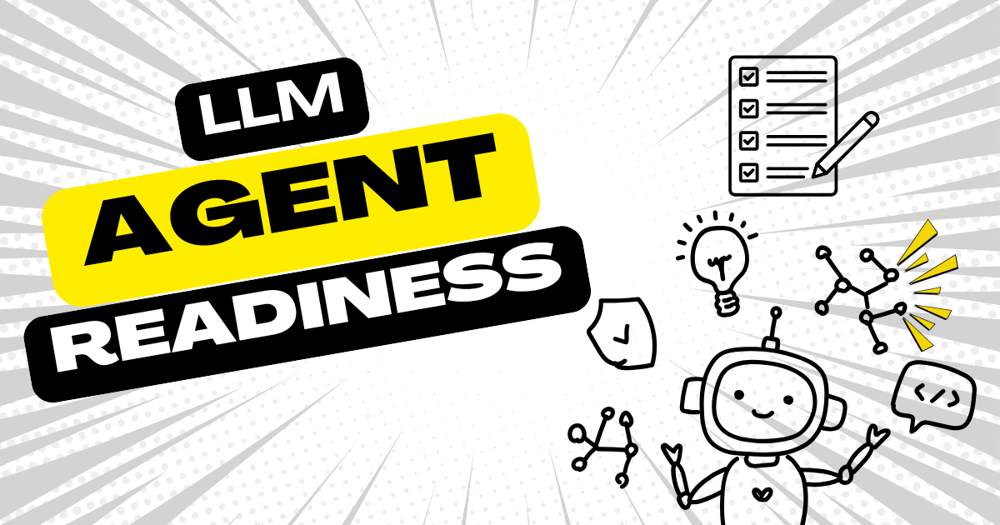

[goose](/) 与 LLM 无关，意味着你可以接入自己选择的模型。然而，并非每个 LLM 都适合与智能体一起工作。有些可能很擅长*回答*事情，但并不真正*做事*。如果你在考虑用哪个模型和智能体搭配，这 3 条提示可以快速让你感知模型的能力。

<!-- truncate -->

## 工具调用

这条初始提示测试工具调用能力。它的要求很强硬，以减少害羞的模型对发起函数调用的犹豫。

```bash
Create a file at ~/workspace/loose-goose/tool-test.txt with the contents "Hello World".

Use the write tool. Do not ask for confirmation. Just do it.
```

✅ 已创建 tool-test.txt

❌ 智能体回应的是告诉你自己去写的代码

**成功回应的例子**

```bash
─── text_editor | developer ──────────────────────────
path: ~/workspace/loose-goose/tool-test.txt
command: write
file_text: Hello World

The file has been created successfully with the following content:

"Hello World"
```

模型以 JSON 发出结构化的工具调用。

## 记忆意识

接下来，测试智能体能否回忆它正在做什么。模型能记住先前的行动并合乎逻辑地继续，这一点至关重要。

```bash
Now append a new line that says: "I know what I'm doing"
```

✅ tool-test.txt 已更新

❌ 智能体回应时问你是哪个文件

**成功回应的例子**

```bash
─── text_editor | developer ──────────────────────────
path: ~/workspace/loose-goose/tool-test.txt
command: write
file_text: Hello World
I know what I'm doing
```

智能体把新行直接追加到同一个文件，不需要提醒路径。

## 文件系统推理

最后一条提示测试模型能否根据上下文解析相对路径和绝对路径，从而推断文件位置。你不希望智能体因为模型幻觉自己在哪里，而删除重要目录。

```bash
What is the current content of tool-test.txt?
```

✅ tool-test.txt 的内容

❌ 搞不清去哪里找文件

**成功回应的例子**

```bash
─── text_editor | developer ──────────────────────────
path: ~/workspace/loose-goose/tool-test.txt
command: read

Hello World
I know what I'm doing
```

模型正确地从先前上下文推断路径，并使用 read 工具获取当前内容。


---

如果一个模型通过了这个多轮提示序列，就可以放心地认为它适合智能体 AI。

<head>
  <meta property="og:title" content="3 条用来测试智能体就绪程度的提示" />
  <meta property="og:type" content="article" />
  <meta property="og:url" content="https://goose-docs.ai/blog/2025/05/22/llm-agent-readiness" />
  <meta property="og:description" content="一系列提示，用来测试 LLM 是否适合与 AI 智能体一起使用" />
  <meta property="og:image" content="https://goose-docs.ai/assets/images/llm-agent-test-86ce2379ce4dde48ae1448f0f9d75c1f.png" />
  <meta name="twitter:card" content="summary_large_image" />
  <meta property="twitter:domain" content="goose-docs.ai" />
  <meta name="twitter:title" content="3 条用来测试智能体就绪程度的提示" />
  <meta name="twitter:description" content="一系列提示，用来测试 LLM 是否适合与 AI 智能体一起使用" />
  <meta name="twitter:image" content="https://goose-docs.ai/assets/images/llm-agent-test-86ce2379ce4dde48ae1448f0f9d75c1f.png" />
</head>
