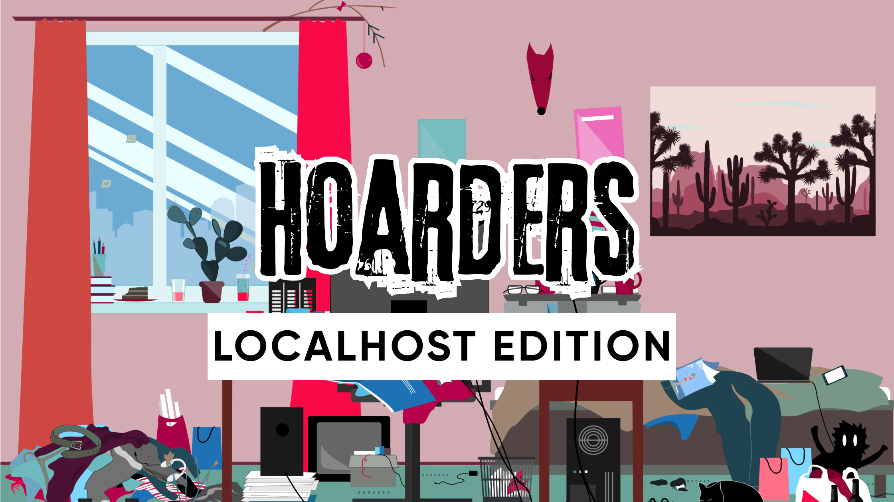

# 我如何用 AI 智能体管理本地端口冲突

## 囤积本地端口

我永远淹没在打开的标签页里。是的，我确实需要同时打开 Bluesky、ChatGPT、Claude、goose、Cursor、Discord、Slack、Netflix 和 Google Docs。我已经明白，标签管理不是我唯一的毛病。

> 「嗨，我叫 Rizel，我是一个本地端口囤积者。👋🏿」

<!-- truncate -->

它总是无辜地开始：我运行一个使用 localhost:3000 的项目。然后队友找我评审他们的 PR。他们的项目也跑在 localhost:3000。幸运的是，现代框架足够聪明，会自动跳到 3001 或 3002。不知不觉，3003、3004 和 3005 也在跑，我的笔记本在太多进程的重压下慢得像要起飞，风扇声也像要起飞。

## 传统的端口管理

通常，释放端口涉及运行以下命令：

```shell
# Step 1: list all open ports
lsof -i -P | grep LISTEN

# Step 2: find a specific port
lsof -i :3000

# Step 3: kill the process
kill -9 98026
```

因为我不常做这件事，我常常最终去搜索这些命令，这会让我原本在做的事脱轨。

## 用 goose 当我的端口管理员

为了避免这种打断，我开始把这项任务交给 [goose](/)，一个开源 AI 智能体。

goose 使用内置的 [Developer](/docs/mcp/developer-mcp) MCP 服务器来处理我机器上与编码相关的任务。交互看起来是这样：

**给 goose 的提示：**

```
Can you tell me which ports I have running?
```

**goose 的回应：**

```
Development Servers:
- Node.js servers on ports 3000, 3001, 3002
- Port 18030

Database:
- PostgreSQL on port 5432

Development Tools:
- Ollama on port 11434
- Multiple Goose instances (ports 49377, 49899, 63594, 64365)

Applications:
- Okta Verify (port 8769)
- inSync (ports 7010, 49831, 49830)
- Pieces (ports 39300, 62638)
- Rapportd macOS service (port 60151)
```

**给 goose 的提示：**

```
Kill all the Node.js servers running on localhost.
```

**goose 的回应：**

```
The command executed successfully, freeing up ports 3000, 3001, and 3002.
```

## 为什么用 AI 做简单任务

释放端口是我知道怎么做的事。但我用 goose 这样的 AI 工具来处理那些制造摩擦、拖慢我的小任务。我不是想把更多工作塞进一天。我的目标是高效工作、产生积极影响，同时仍然有时间过个人生活。

<head>
  <meta property="og:title" content="我如何用 AI 智能体管理本地端口冲突" />
  <meta property="og:type" content="article" />
  <meta property="og:url" content="https://goose-docs.ai/blog/2025/05/22/manage-local-host-conflicts-with-goose" />
  <meta property="og:description" content="了解我如何使用 goose——一个开源 AI 智能体——来管理冲突的端口，而不打断我的节奏。" />
  <meta property="og:image" content="https://goose-docs.ai/assets/images/hoarders-753809f09399a9e4f734006a8d74218d.png" />
  <meta name="twitter:card" content="summary_large_image" />
  <meta property="twitter:domain" content="goose-docs.ai" />
  <meta name="twitter:title" content="我如何用 AI 智能体管理本地端口冲突" />
  <meta name="twitter:description" content="了解我如何使用 goose——一个开源 AI 智能体——来管理冲突的端口，而不打断我的节奏。" />
  <meta name="twitter:image" content="https://goose-docs.ai/assets/images/hoarders-753809f09399a9e4f734006a8d74218d.png" />
</head>
