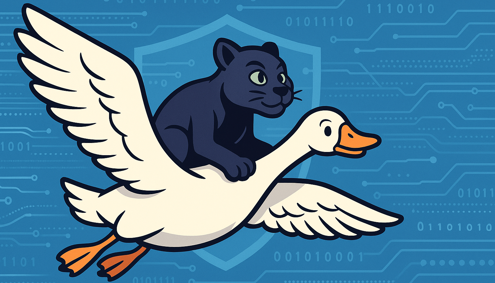
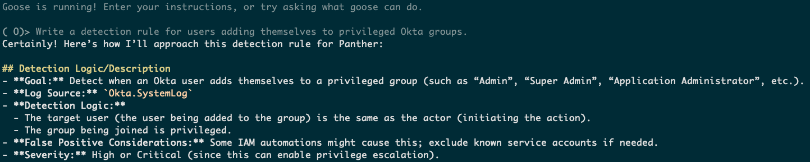
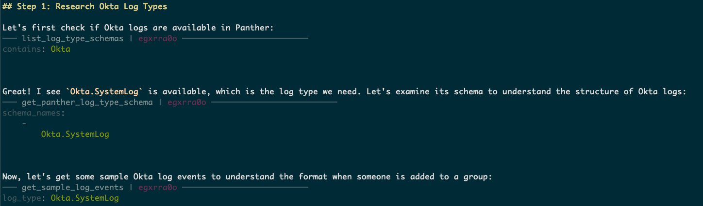
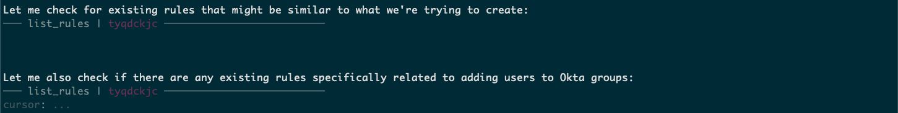
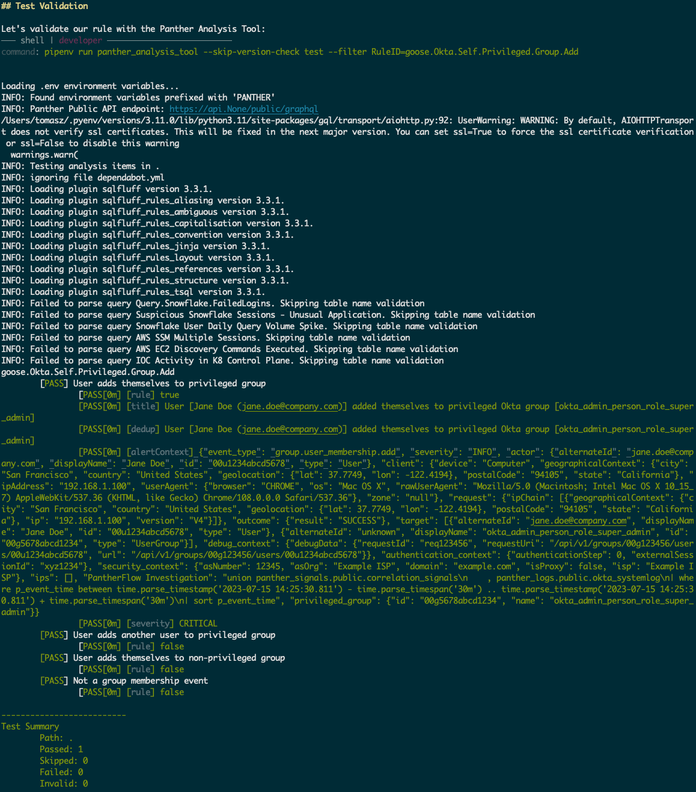
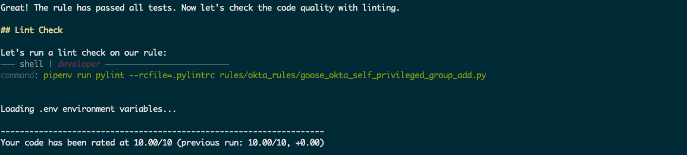

检测工程站在网络安全的前沿，但它往往是一团纠缠的复杂网络。传统的检测编写涉及艰苦的手工过程，包括理解日志格式和模式、创建复杂查询、威胁建模，以及反复的手工检测测试和打磨，既耗时，又依赖专门技能。这会导致威胁覆盖出现缺口，以及多到压垮人的告警。在 Block，我们面对不断演进的威胁和错综复杂的系统。为了保持领先，我们采用了 AI 驱动的方案，尤其是 goose（Block 的开源 AI 智能体）和 Panther MCP，让更广的组织能为自己擅长的领域贡献高质量规则。本文深入讲我们如何把复杂的检测工作流变成精简、由 AI 驱动、所有相关方都能用的流程。

<!-- truncate -->

## 检测工程的挑战

历史上，创建有效的检测是一项小众技能，需要深厚的技术知识和编程能力。这造成了显著障碍，例如：

* **陡峭的学习曲线：** 编写检测通常需要广泛的技术专长，往往限制了参与。
* **资源约束：** 即便是专家安全团队也常常带宽不足，妨碍他们快速开发和部署新检测。
* **演进中的威胁图景：** 高级威胁，尤其是来自老练国家行为者的威胁，持续演进，超过传统检测开发流程的速度。

## 愿景

我们设想这样一个未来：Block 的任何人都能轻松创建并部署安全检测，通过智能自动化革新我们的防御，并赋予一种大众化的安全态势。

## 介绍 Panther MCP

### 什么是 Panther MCP？

[Panther MCP](https://github.com/panther-labs/mcp-panther) 是一台开源的模型上下文协议服务器，诞生于 [Panther](https://panther.com/) 与 Block 的合作，目的是让安全运营工作流走向大众。作为扩展与 goose 紧密集成后，Panther MCP 让 Block 的安全团队把自然语言指令翻译成精确、可执行的 SIEM 检测逻辑，让贡献威胁检测比以往更容易、更快。

这次集成让 Block 各处的分析师和工程师能无缝地与 Panther 的安全分析平台交互。它把检测开发从偏重编码的过程，变成无论技术背景如何人人都能用的直观工作流。goose 作为中间智能体，协调对 Panther MCP 的调用、审阅输出、创建规则内容、测试它，并做正确性或风格上必要的编辑。这个 AI 驱动的反馈回路节省了无数小时。

### 关键功能

Panther MCP 提供数十种工具，增强并加速由 goose 驱动的检测工程工作流：

1. **从自然语言到检测逻辑**
   工程师用朴素的英文提示定义检测，Panther MCP 直接把它翻译成与 Panther 兼容的检测规则，可以提交进他们的 [panther-analysis](https://github.com/panther-labs/panther-analysis) 仓库。
2. **交互式数据探索与使用**
   工程师可以通过快速、自然语言驱动的交互，迅速探索日志源，并对数据和先前生成的告警进行搜索。
3. **统一的告警分诊与响应**
   借助从历史数据和现有检测中得出的洞察，实现由 AI 主导的告警分诊。

## 用 goose 加速检测创建

goose 用 AI 自动化日志分析和规则生成这类传统上的手工任务，从而显著加速安全检测的创建。这大幅减少工作量，提高开发和部署威胁覆盖的速度，并增强面对演进威胁时的敏捷性。

### 把 Panther MCP 集成为 goose 扩展

Panther MCP 作为 goose 扩展工作，通过以下过程把它的能力无缝嵌入 goose 环境：

1. **扩展注册：** Panther MCP 在 goose 中注册，使它的整套工具可以通过 goose 界面随时使用。
2. **API 连接：** 扩展建立到 Panther 后端 API 的连接，从而无缝检索上下文。
3. **可用工具：** Panther MCP 为 goose 提供一系列工具，用于高效创建检测、直观的数据交互，以及精简的告警管理。

### 用 `.goosehints` 利用增强的上下文

Panther MCP 与 goose 的集成，通过 [.goosehints](/docs/guides/context-engineering/using-goosehints/) 文件得到增强——这是 goose 的一项功能，提供规则示例和最佳实践等额外上下文。这份更丰富的上下文让 goose 能生成更准确、更高效的检测，并与 Block 的标准和要求对齐。

让我们用一个例子说明：创建一条规则，检测用户把自己加入特权 Okta 组，这是一种常见的权限提升手法。

## 打破障碍

传统上，创建这条检测需要：

1. 对 Okta 及其日志结构的深入了解
2. 理解 Panther 的检测框架
3. Python 编程技能
4. 熟悉不同的测试框架

有了 goose 和 Panther MCP，这变得就像：

> 「写一条检测规则，发现用户把自己加入特权 Okta 组。」

## 简单背后的智能

当收到「写一条检测规则，发现用户把自己加入特权 Okta 组」这样的自然语言请求时，goose 借助 Panther MCP 驱动的精密、多阶段过程，生成可用于生产的检测逻辑。这种自动化方法镜像了经验丰富的检测工程师的工作流，涵盖威胁研究、相关日志识别、检测目标定义、逻辑勾勒、样本日志分析、规则开发、误报考虑、严重性/上下文赋值、彻底测试、打磨/优化，以及文档。不过，goose 以 AI 和自动化带来的速度与规模执行这些步骤。

goose 首先解析自然语言输入，以理解核心意图和要求。它识别「用户」「特权 Okta 组」以及动作「把自己加入」这类关键实体。这种理解构成勾勒检测目标的基础：所需日志源（`Okta.SystemLog`），以及基本逻辑：识别行动者（发起动作的用户）与目标用户（被加入组的用户）相同、且所加入的组被标为特权的事件。goose 也会考虑潜在误报（例如合法的自动化流程），并根据所检测活动的潜在影响（权限提升）指定初步严重级别。



为了确保生成的逻辑准确、并在有效数据上运行，goose 与 Panther MCP 交互，检索指定日志源（`Okta.SystemLog`）的模式。这让 goose 结构化地理解 Okta 日志里可用字段及其数据类型。此外，goose 利用 Panther MCP 的查询能力，获取与组成员变更相关的样本日志事件。这一步至关重要，因为：

* **识别常见事件模式：** 分析真实日志让 goose 理解相关事件的典型结构和取值（例如 `group.user_membership.add`）。
* **推断特权组的命名惯例：** 通过检查历史数据，goose 可以识别组织的 Okta 实例里特权组命名中常用的模式和关键词（例如 "admin"、"administrator"、"security-admin"）。
* **发现边缘情况：** 检查多样的日志样本，有助于发现事件数据中的潜在变体，或检测逻辑需要容纳的较不常见场景。
* **映射典型用户行为：** 理解组成员变更周围的基线用户行为，有助于打磨检测逻辑，并降低误报的可能。

这一阶段与 Panther MCP 的交互涉及 API 调用，以检索模式信息并执行分析查询，让 goose 把推理建立在实际日志数据之上。



goose 不是孤立运作；它访问现有 Panther 检测规则的仓库，以识别相似逻辑或可复用组件。这促进检测版图的一致性，鼓励复用经过充分测试的辅助函数（如 `okta_alert_context`），并确保遵守我们安全生态里已建立的规则标准。从现有检测中学习是 goose 智能的核心组成部分，让它能建立在先前知识之上，避免重新发明轮子。



基于对检测目标的理解、对日志数据的分析，以及在 Panther MCP 协助下从现有检测中获得的知识，goose 用 Python 生成完整的 Panther 检测规则。这包括：

* **规则函数（`rule()`）：** 这个函数包含评估每条日志事件的核心逻辑。在示例中，它检查 `group.user_membership.add` 事件类型，验证行动者与目标用户的 ID（或邮箱）相同，并确认目标组的显示名包含表明特权组的关键词（定义在 `PRIVILEGED_GROUPS` 集合中）。
* **元数据函数（`title()`、`alert_context()`、`severity()`、`destinations()`）：** 这些函数为触发的告警提供关键上下文和运营信息。

```python
from panther_okta_helpers import okta_alert_context

# Define privileged Okta groups - customize this list based on your organization's needs
PRIVILEGED_GROUPS = {
    "_group_admin",  # Administrator roles
    "admin",
    "administrator",
    "application-admin",   
    "aws_",  # AWS roles can be privileged
    "cicd_corp_system",  # CI/CD admin access 
    "grc-okta",
    "okta-administrators",
    "okta_admin",
    "okta_admin_svc_accounts", # Admin roles
    "okta_resource-set_",      # Resource sets are typically privileged
    "security-admin",
    "superadministrators",
}

def rule(event):
    """Determine if a user added themselves to a privileged group"""
    # Only focus on group membership addition events
    if event.get("eventType") != "group.user_membership.add":
        return False
    # Ensure both actor and target exist in the event
    actor = event.get("actor", {})
    targets = event.get("target", [])
    if not actor or len(targets) < 2:
        return False
    actor_id = actor.get("alternateId", "").lower()
    actor_user_id = actor.get("id")
    # Extract target user and group
    target_user = targets[0]
    target_group = targets[1] if len(targets) > 1 else {}
    # The first target should be a user and the second should be a group
    if target_user.get("type") != "User" or target_group.get("type") != "UserGroup":
        return False
    target_user_id = target_user.get("id")
    target_user_email = target_user.get("alternateId", "").lower()
    group_name = target_group.get("displayName", "").lower()
    # Check if the actor added themselves to the group
    is_self_add = (actor_user_id == target_user_id) or (actor_id == target_user_email)
    # Check if the group is privileged
    is_privileged_group = any(priv_group in group_name for priv_group in PRIVILEGED_GROUPS)
    return is_self_add and is_privileged_group

def title(event):
    """Generate a descriptive title for the alert"""
    actor = event.get("actor", {})
    targets = event.get("target", [])
    actor_name = actor.get("displayName", "Unknown User")
    actor_email = actor.get("alternateId", "unknown@example.com")
    target_group = targets[1] if len(targets) > 1 else {}
    group_name = target_group.get("displayName", "Unknown Group")
    return (f"User [{actor_name} ({actor_email})] added themselves "
            f"to privileged Okta group [{group_name}]")

def alert_context(event):
    """Return additional context for the alert"""
    context = okta_alert_context(event)
    # Add specific information about the privileged group
    targets = event.get("target", [])
    if len(targets) > 1:
        target_group = targets[1]
        context["privileged_group"] = {
            "id": target_group.get("id", ""),
            "name": target_group.get("displayName", ""),
        }
    return context

def severity(event):
    """Calculate severity based on group name - more sensitive groups get higher severity"""
    targets = event.get("target", [])
    if len(targets) <= 1:
        return "Medium"
    target_group = targets[1]
    group_name = target_group.get("displayName", "").lower()
    # Higher severity for direct admin groups
    if any(name in group_name for name in ["admin", "administrator", "superadministrators"]):
        return "Critical"
    return "High"

def destinations(_event):
    """Send to staging destination for review"""
    return ["staging_destination"]
```

在 Python 代码之外，goose 还会生成对应的、基于 YAML 的规则配置文件。这个文件包含关于该检测的必要元数据：

```yaml
AnalysisType: rule
Description: Detects when a user adds themselves to a privileged Okta group, which could indicate privilege escalation attempts or unauthorized access.
DisplayName: "Users Adding Themselves to Privileged Okta Groups"
Enabled: true
DedupPeriodMinutes: 60
LogTypes:
  - Okta.SystemLog
RuleID: "goose.Okta.Self.Privileged.Group.Add"
Threshold: 1
Filename: goose_okta_self_privileged_group_add.py
Reference: >
  https://developer.okta.com/docs/reference/api/system-log/
  https://attack.mitre.org/techniques/T1078/004/
  https://attack.mitre.org/techniques/T1484/001/
Runbook: >
  1. Verify if the user should have access to the privileged group they added themselves to
  2. If unauthorized, revoke the group membership immediately
  3. Check for other group membership changes made by the same user
  4. Review the authentication context and security context for suspicious indicators
  5. Interview the user to determine intent
Reports:
  MITRE ATT&CK:
    - TA0004:T1078.004  # Privileged Accounts: Cloud Accounts
    - TA0004:T1484.001  # Domain Policy Modification: Group Policy Modification
Severity: High
Tags:
  - author:tomasz
  - coauthor:goose
Tests:
  - Name: User adds themselves to privileged group
    ExpectedResult: true
    Log:
      actor:
        alternateId: jane.doe@company.com
        displayName: Jane Doe
        id: 00u1234abcd5678
        type: User
      authenticationContext:
        authenticationStep: 0
        externalSessionId: xyz1234
      client:
        device: Computer
        geographicalContext:
          city: San Francisco
          country: United States
          geolocation:
            lat: 37.7749
            lon: -122.4194
          postalCode: "94105"
          state: California
        ipAddress: 192.168.1.100
        userAgent:
          browser: CHROME
          os: Mac OS X
          rawUserAgent: Mozilla/5.0 (Macintosh; Intel Mac OS X 10_15_7) AppleWebKit/537.36 (KHTML, like Gecko) Chrome/108.0.0.0 Safari/537.36
        zone: "null"
      debugContext:
        debugData:
          requestId: req123456
          requestUri: /api/v1/groups/00g123456/users/00u1234abcd5678
          url: /api/v1/groups/00g123456/users/00u1234abcd5678
      displayMessage: Add user to group membership
      eventType: group.user_membership.add
      legacyEventType: group.user_membership.add
      outcome:
        result: SUCCESS
      published: "2023-07-15 14:25:30.811"
      request:
        ipChain:
          - geographicalContext:
              city: San Francisco
              country: United States
              geolocation:
                lat: 37.7749
                lon: -122.4194
              postalCode: "94105"
              state: California
            ip: 192.168.1.100
            version: V4
      securityContext:
        asNumber: 12345
        asOrg: Example ISP
        domain: example.com
        isProxy: false
        isp: Example ISP
      severity: INFO
      target:
        - alternateId: jane.doe@company.com
          displayName: Jane Doe
          id: 00u1234abcd5678
          type: User
        - alternateId: unknown
          displayName: okta_admin_person_role_super_admin
          id: 00g5678abcd1234
          type: UserGroup
      transaction:
        detail: {}
        id: transaction123
        type: WEB
      uuid: event-uuid-123
      version: "0"
      p_event_time: "2023-07-15 14:25:30.811"
      p_parse_time: "2023-07-15 14:26:00.000"
      p_log_type: "Okta.SystemLog"
  - Name: User adds another user to privileged group
    ExpectedResult: false
    Log:
      actor:
        alternateId: admin@company.com
        displayName: Admin User
        id: 00u5678abcd1234
        type: User
      authenticationContext:
        authenticationStep: 0
        externalSessionId: xyz5678
      client:
        device: Computer
        geographicalContext:
          city: San Francisco
          country: United States
          geolocation:
            lat: 37.7749
            lon: -122.4194
          postalCode: "94105"
          state: California
        ipAddress: 192.168.1.100
        userAgent:
          browser: CHROME
          os: Mac OS X
          rawUserAgent: Mozilla/5.0 (Macintosh; Intel Mac OS X 10_15_7) AppleWebKit/537.36 (KHTML, like Gecko) Chrome/108.0.0.0 Safari/537.36
        zone: "null"
      debugContext:
        debugData:
          requestId: req789012
          requestUri: /api/v1/groups/00g123456/users/00u9876fedc4321
          url: /api/v1/groups/00g123456/users/00u9876fedc4321
      displayMessage: Add user to group membership
      eventType: group.user_membership.add
      legacyEventType: group.user_membership.add
      outcome:
        result: SUCCESS
      published: "2023-07-15 14:30:45.123"
      request:
        ipChain:
          - geographicalContext:
              city: San Francisco
              country: United States
              geolocation:
                lat: 37.7749
                lon: -122.4194
              postalCode: "94105"
              state: California
            ip: 192.168.1.100
            version: V4
      securityContext:
        asNumber: 12345
        asOrg: Example ISP
        domain: example.com
        isProxy: false
        isp: Example ISP
      severity: INFO
      target:
        - alternateId: user@company.com
          displayName: Regular User
          id: 00u9876fedc4321
          type: User
        - alternateId: unknown
          displayName: okta_admin_person_role_super_admin
          id: 00g5678abcd1234
          type: UserGroup
      transaction:
        detail: {}
        id: transaction456
        type: WEB
      uuid: event-uuid-456
      version: "0"
      p_event_time: "2023-07-15 14:30:45.123"
      p_parse_time: "2023-07-15 14:31:00.000"
      p_log_type: "Okta.SystemLog"
```

goose 生成的每条检测规则都经过严格的自动化测试和校验。这包括：

* **单元测试：** 使用规则配置里定义的测试用例，运行 Panther Analysis Tool，核验规则逻辑能对照模拟日志数据正确识别真阳性，并避免假阴性。
* **代码检查：** 自动运行代码检查工具（如 Pylint），确保生成的 Python 代码遵守既定编码标准，包括恰当的格式、风格约定和最佳实践。这有助于代码可维护性，并降低出错风险。




goose 与 Panther MCP 的无缝集成自动化了这些精细步骤，显著减少创建和部署安全检测所需的时间和专门知识。这种大众化让更多人能为 Block 的安全态势做贡献，从而带来更全面的威胁覆盖和更有韧性的安全环境。

## 实践中的大众化

现在，典型的检测创建工作流看起来是这样：

1. **提议：** 用户用自然语言描述一种恶意行为。
2. **生成：** goose 借助 Panther MCP 把这段描述变成检测逻辑。
3. **审阅：** 检测团队对照既定的质量基准审阅每条检测。
4. **部署：** 批准的检测被部署到预发/生产。

## 早期影响与经验

### 扩大协作，增强覆盖，并支持自助

* **降低技术门槛：** goose 和 Panther MCP 让领域专家（SME）能轻松理解他们在 Panther 里的日志，从而实现自助模式：团队可以创建自己的检测，而不需要广泛的安全工程专长，从而把工作量分散开。
* **减少对检测团队的依赖：** Panther MCP 让用户能独立、自主地解决询问，从而减少对安全团队的依赖。这包括威胁情报团队评估 MITRE ATT&CK 覆盖、合规团队识别相关检测，以及帮助服务领域专家创建自己的检测。
* **跨职能的检测开发：** 让检测工程走向大众，使专门团队能创建安全团队可能会错过的检测，从而形成覆盖小众用例的更多样检测生态。这促进双向知识传递，增强整体安全意识和能力。

### 加速检测开发生命周期

* **上下文理解：** 借助嵌入组织上下文、提供有引导的最佳实践、理解现有日志模式和检测，并与 *pytest* 等校验框架对齐的工具，检测工程正变得更高效、更一致。这种方法让更广泛的参与成为可能，并支持各团队的高质量开发。
* **精简的开发过程：** 自然语言界面让用户能用对话方式与系统交互，从而简化检测工程。这使得自动检索示例日志、分析日志模式、解释检测目标或所需更改，以及生成初始检测代码成为可能——显著加速开发。
* **自动化的技术步骤：** 智能代码生成纳入错误处理和最佳实践，同时从数据无缝生成测试用例，并产出全面文档——包括描述、运行手册和参考资料。

### 通过标准化实践推动一致性

* **代码风格与结构：** 新创建的检测遵守一致的风格模式，用专门函数做特定检查，而不是把检查都堆进 `rule()`。标准化格式，包括给动态告警标题文本加括号，增强可读性和一致性。
* **代码复用与效率：** 通过全局辅助函数/过滤器、函数签名里的显式类型，以及详细的文档字符串，促进代码复用和效率，以便更好地理解函数和 LLM 代码生成。
* **可维护性改进：** 检测以一致的结构和标准化模式设计，使它们更容易理解、维护和更新。这种统一确保检测代码库行为可预期，并在需要时简化批量更改。
* **全面的测试要求：** 对我们的团队，每条检测至少要包含两个单元测试：一个会触发检测的正例，一个不会的负例。测试名称要有描述性，并与预期结果对齐，以增强可读性和可维护性。
* **元数据与文档标准：** 元数据和文档标准正通过 pytest 内的结构化定义得到加强，帮助把检测所有权和上下文编码下来。这包括清楚定义的作者和共同作者标签（例如针对 goose 生成的内容）、预发或生产等环境引用，以及告警目的地的准确映射。
* **结构校验：** 这通过强制文件名约定（例如前缀、长度、小写格式）、确保 Python 规则包含所有必需函数，并核验 YAML 文件包含正常功能和处理所需的字段，来支持遵守组织标准。
* **与安全框架对齐：** 相关规则被映射到适用的 MITRE ATT&CK 技术，以突出覆盖缺口、指导检测开发、排定研究优先级，并建立讨论威胁的共同语言。

### 最佳实践与防护

* **符合平台的开发：** 检测按照 Panther 推荐的实践开发，例如使用内置事件对象方法 `event.deep_get()` 和 `event.deep_walk()`，而不是手动导入它们，以确保平台内的一致性和可维护性。
* **主动防错：** 我们通过 pre-commit 和 pre-push 钩子实现本地校验检查，在错误到达上游构建之前主动抓住并解决它们。这些检查包括校验告警目的地名称、核验日志类型，以及标出语法问题，以确保质量和一致性。
* **持续改进：** 检测质量通过纳入反馈、性能数据和对检测趋势的分析而持续改进。Panther MCP 以及其他工单跟踪 MCP 提供来自分析师反馈和告警处置的洞察，从而促进自动调整、精简拉取请求开发，并降低运营开销。

## 接下来是什么？

Block 致力于利用 AI 改进安全防御并支持团队。我们相信 AI 对 Block 检测与响应的未来有重大前景，并致力于让安全更容易接近。

<!-- Social Media Meta Tags (edit values as needed) -->
<head>
  <meta property="og:title" content="让检测工程走向大众：Block 用 goose 和 Panther MCP 起飞" />
  <meta property="og:type" content="article" />
  <meta property="og:url" content="https://goose-docs.ai/blog/2025/06/02/goose-panther-mcp" />
  <meta property="og:description" content="全面介绍 Block 如何借助 goose 和 Panther MCP，让安全检测工程走向大众并加速。" />
  <meta property="og:image" content="https://goose-docs.ai/assets/images/goose-panther-header-25b5891acdd70e6a7bbe6b84e34f08f0.png" />
  <meta name="twitter:card" content="summary_large_image" />
  <meta property="twitter:domain" content="goose-docs.ai" />
  <meta name="twitter:title" content="让检测工程走向大众：Block 用 goose 和 Panther MCP 起飞" />
  <meta name="twitter:description" content="全面介绍 Block 如何借助 goose 和 Panther MCP，让安全检测工程走向大众并加速。" />
  <meta name="twitter:image" content="https://goose-docs.ai/assets/images/goose-panther-header-25b5891acdd70e6a7bbe6b84e34f08f0.png" />
</head>
