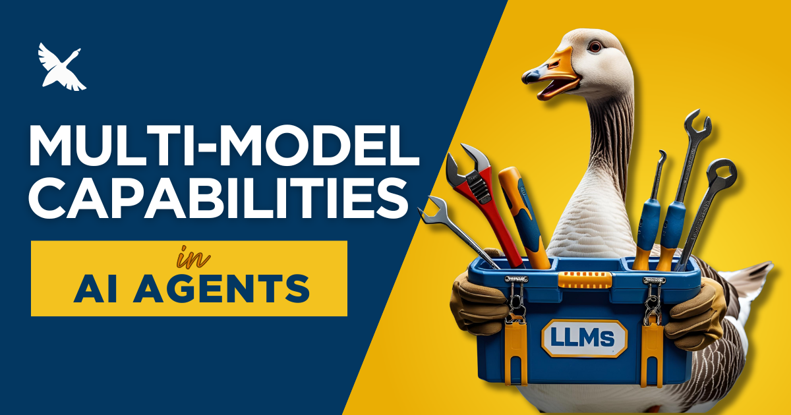

:::danger 已过时
Lead/Worker 模式已从 goose 中移除，取代它的规划模式也已移除。当前工作流见[多模型指南](/docs/guides/multi-model/)。
:::




不是每项任务都需要天才。也不是每一步都该花一大笔钱。

这是我们在扩展 goose——我们的开源 AI 智能体——时学到的。同一个擅长拆解规划请求的模型，可能完全搞砸一条基本的 shell 命令，或者更糟——做这件事时烧光你的 token 预算。

所以我们问自己：如果能在单次会话里混搭模型呢？

不只是根据用户命令切换，而是让 goose 内建一套真正的系统，在不同模型之间路由任务，每个模型发挥自己的长处。

这正是 lead/worker 模型要填补的缺口。

<!-- truncate -->

## 单模型会话的问题

最初，每个 goose 会话从头到尾只用一个模型。对短任务这没问题，但更长的会话更难调：

* 选得太便宜，模型可能错过细微差别或弄坏工具。
* 选得太贵，你的成本曲线开始看起来像滑雪坡。

没有内建的方式可以随时适应。

我们在真实使用中看到了这种张力：智能体开始时很强，然后当模型难以贯彻下去时就停滞。有时用户会在会话中途手动切换模型。但这不可扩展，也肯定不像智能体。

## 设计 Lead/Worker 系统

核心想法很简单：

* 用一个擅长推理和规划的 lead 模型开始会话。
* 在你和模型之间来回几次（我们称之为「轮」）之后，交给一个更快、更便宜但仍有能力的 worker 模型。
* 如果 worker 卡住了，goose 可以检测到失败，并暂时把 lead 请回来。


你可以配置 lead 预先处理多少轮（`GOOSE_LEAD_TURNS`），多少次连续失败会触发回退（`GOOSE_LEAD_FAILURE_THRESHOLD`），以及回退持续多久后 goose 再重试 worker。

这给你一个灵活、有韧性的设置，每个模型都用在它发光的地方。

这个功能最棘手的部分之一，是定义失败长什么样。

我们不希望 goose 只因为 API 超时就换模型。相反，我们关注真正的任务失败：

* 工具执行错误
* 生成代码中的语法错误
* 文件未找到或权限错误
* 用户纠正，比如「那是错的」或「再试一次」

goose 跟踪这些信号，并知道何时升级。一旦回退模型把事情稳定下来，它会毫不停顿地切回去。

## 多模型设计的价值

节省成本是一个不错的副作用，但真正的价值在于这如何改变心智模型：把 AI 模型当作工具箱里的工具，每个都有自己的角色。有些为策略而生。有些为速度而生。你的智能体越能在它们之间智能切换，它就越接近一个真正的协作者。

我们发现这种多模型设计开启了新的工作流：

* **漫长的开发会话**，规划和执行此消彼长
* **跨提供商设置**（用 Claude 规划，用 OpenAI 执行）
* 为担心 LLM 支出的团队提供**摩擦更低的默认值**

它也为未来更聪明的路由打开了门，比如按任务切换、集成投票，甚至让 goose 根据工具上下文决定调用哪个模型。

## 试一试

Lead/worker 模式已经在 goose 中可用。要启用，导出这些变量，使用两个已经在 goose 中配置好的模型：

```bash
export GOOSE_LEAD_MODEL="gpt-4o"
export GOOSE_MODEL="claude-4-sonnet"
```

从那里开始，goose 负责交接、回退和恢复。你只要……继续 vibe。

如果你好奇底层如何工作，见[多模型指南](/docs/guides/multi-model/)。

---

如果你正在试验多模型设置，[分享什么有效、什么无效](https://discord.gg/n8R5VaWDAn)。


<head>
  <meta property="og:title" content="把 LLM 当作工具箱里的工具：让 AI 智能体更聪明的多模型方法" />
  <meta property="og:type" content="article" />
  <meta property="og:url" content="https://goose-docs.ai/blog/2025/06/16/multi-model-in-goose" />
  <meta property="og:description" content="goose 如何在单个任务中使用多个 LLM，在 AI 智能体工作流中优化速度、成本和可靠性" />
  <meta property="og:image" content="https://goose-docs.ai/assets/images/multi-model-ai-agent-d408feaeba3e13cafdbfe9377980bc3d.png" />
  <meta name="twitter:card" content="summary_large_image" />
  <meta property="twitter:domain" content="goose-docs.ai" />
  <meta name="twitter:title" content="把 LLM 当作工具箱里的工具：让 AI 智能体更聪明的多模型方法" />
  <meta name="twitter:description" content="goose 如何在单个任务中使用多个 LLM，在 AI 智能体工作流中优化速度、成本和可靠性" />
  <meta name="twitter:image" content="https://goose-docs.ai/assets/images/multi-model-ai-agent-d408feaeba3e13cafdbfe9377980bc3d.png" />
</head>
