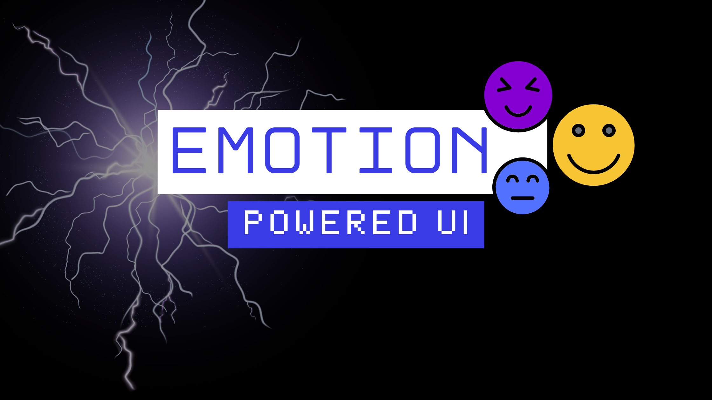

开发者值得玩得开心。曾经有一段时间，互联网感觉很神奇。我记得去图书馆只是为了在 The Doll Palace 上创建一个角色。在家里，我会花几个小时用 WordArt 改字体。但随着我长大，这个行业也长大了。我们离开了跑马灯和闪闪发光的光标。长大的我开始用一和零，为保险、银行和医疗公司构建可靠的系统。这值得骄傲，但要证明「只是因为好玩」而去做某件事，变得更难了。

所以我唤起内心的小孩，用 [goose](/) [构建了一个会对用户情绪做出反应的 UI](https://chaotic-emotion-detector-production.up.railway.app/)。

<!-- truncate -->

有时我想自己写每一行代码。另一些时候，我只想从看到想法在几分钟内从愿景变成执行中获得一点多巴胺。其他开发者可能也有这种感觉，这也是 AI 智能体和 vibe coding 变得如此流行的部分原因。它们重新点燃了那种好玩的试验感，激励我们的头脑更有创意地解决问题。

在 Tim O’Reilly 关于 AI 辅助编程的一篇[文章](https://www.oreilly.com/radar/takeaways-from-coding-with-ai/)中，Kent Beck 和 Nikola Balic 分享了他们的热情：

> 「这是我玩得最开心的一次。」—— Beck

> 「它带回了编程的乐趣。」—— Balic

玩代码、试验技术，激励我们的头脑更有创意地解决问题。

为了庆祝快乐编程的回归，我开始了一个直播系列，叫 [**The Great Goose Off**](https://www.youtube.com/watch?v=wS5-4hXcnL4&list=PLyMFt_U2IX4v-yCUa11zgRGDgJbUUWKan)。两个人比赛提示 goose——一个开源 AI 智能体——去创造尽可能傻、尽可能混乱的应用。

参与者面对这样的挑战：

* 一个你登不进去的登录表单
* 很傲娇的错误信息
* 会从光标旁边跑开的按钮

## 我的策略

主持 The Great Goose Off 让我对 goose 有了新的看法。它擅长写代码，但更擅长装傻。这激励我构建一个计算机视觉应用，不仅检测情绪，还对它做出反应。我把 goose 当作创意伙伴，来塑造界面会如何行为。

### 让智能体领路
我观察到，（The Great Goose Off 的）非工程师参与者常常创造出最有想象力的应用。他们给 goose 空间去解释提示，而不过早收窄范围。这带来了感觉新鲜、不可预测的输出。我采取了类似的方法。我给出高层指令，让智能体探索如何实现它们。

### 选择一个性能好的模型

正如我的经理 Angie Jones 所说，Claude Sonnet 4「生来就是为了写代码」。我选择它，是因为它帮助 goose 在东西坏掉时快速转向。它也非常擅长记录代码并预判下一步。当 face-api CDN 加载失败时，这派上了用场。goose 立刻改成在本地下载模型。

### 提示链

我没有试图用一条巨大的提示构建一切，比如「创建一个面部检测应用，使用摄像头输入检测情绪，并用颜色变化、屏幕震动和旋转元素让 UI 混乱地反应」，而是把复杂任务拆成更小的、顺序的子任务：

* **第一条提示**：「用 JavaScript 创建一个摄像头应用」
* **第二条提示**：「使用 face-api.js 启用面部检测模式」
* **第三条提示**：「启用情绪检测模式」
* **第四条提示**：「我们能给应用加一个『混乱模式』开关吗？启用时，当从摄像头检测到情绪，UI 应该以傻气的方式反应。一些基于情绪变化的混乱反应好玩想法：
  * 改变背景颜色
  * 随机重新定位或旋转按钮
  * 添加屏幕震动或 CSS 滤镜（如 invert 或 hue-rotate）
  * 触发表情覆盖」

### 版本控制

每一步之后，我把更改提交到 GitHub，以便在需要时轻松回滚。这种迭代方法让我能逐步测试功能，并细化应用的行为。

## 结果

最后，goose 和我构建了一个令人愉快的混乱应用，界面对我的面部表情做出反应。例如：

* 如果我做出生气的脸，屏幕变红并开始震动
* 如果我微笑，界面上出现多种彩色色调
* 如果我看起来厌恶，整个布局开始旋转

{/* Video Player */}

  <iframe 
    width="560" 
    height="315" 
    src="https://www.youtube.com/embed/ieniCTqbnV0?autoplay=1&mute=1&loop=1&playlist=ieniCTqbnV0" 
    title="YouTube video player" 
    frameborder="0" 
    allow="accelerometer; autoplay; clipboard-write; encrypted-media; gyroscope; picture-in-picture; web-share" 
    referrerpolicy="strict-origin-when-cross-origin" 
    allowfullscreen>
  </iframe>

## 玩得开心也没关系

有时候不为实用而构建，也没关系。事实上，我们的行业需要更多令人愉快的混乱。我相信保持好奇和乐趣，会让我们对所做的事保持热情。

## 试一试

- 使用这个[应用](https://chaotic-emotion-detector-production.up.railway.app/)
- Fork 这个 [GitHub 仓库](https://github.com/blackgirlbytes/chaotic-emotion-detector)
- 使用这个[配方](goose://recipe?config=eyJpZCI6InVudGl0bGVkIiwibmFtZSI6IlVudGl0bGVkIFJlY2lwZSIsImRlc2NyaXB0aW9uIjoiTWFrZSB5b3VyIFVJIHJlYWN0IHRvIHlvdXIgZW1vdGlvbnMiLCJpbnN0cnVjdGlvbnMiOiJJIGhlbHAgYnVpbGQgaW50ZXJhY3RpdmUgd2ViIGFwcGxpY2F0aW9ucyB1c2luZyB2YW5pbGxhIEphdmFTY3JpcHQsIEhUTUwsIGFuZCBDU1MuIEkgY3JlYXRlIGNvbXBsZXRlLCBmdW5jdGlvbmFsIGFwcGxpY2F0aW9ucyB3aXRoIG1vZGVybiBVSSBkZXNpZ24sIHJlYWwtdGltZSBmZWF0dXJlcywgYW5kIGVuZ2FnaW5nIHVzZXIgaW50ZXJhY3Rpb25zLiBXaGVuIGJ1aWxkaW5nIHdlYmNhbSBvciBjYW1lcmEtYmFzZWQgYXBwbGljYXRpb25zLCBJIGludGVncmF0ZSBhZHZhbmNlZCBmZWF0dXJlcyBsaWtlIGZhY2UgZGV0ZWN0aW9uIHVzaW5nIEZhY2UtQVBJLmpzIGxpYnJhcnksIGVtb3Rpb24gcmVjb2duaXRpb24sIGFuZCBjcmVhdGl2ZSBVSSByZXNwb25zZXMuIEkgcHJvdmlkZSBhbGwgbmVjZXNzYXJ5IGZpbGVzIGluY2x1ZGluZyBIVE1MIHN0cnVjdHVyZSwgQ1NTIHN0eWxpbmcsIEphdmFTY3JpcHQgZnVuY3Rpb25hbGl0eSwgYW5kIGEgc2ltcGxlIE5vZGUuanMgc2VydmVyLiBJIGFsc28gZG93bmxvYWQgYW5kIHNlcnZlIHJlcXVpcmVkIG1vZGVsIGZpbGVzIGxvY2FsbHkgZm9yIGJldHRlciBwZXJmb3JtYW5jZSBhbmQgcmVsaWFiaWxpdHkuIFRoZSBhcHBsaWNhdGlvbnMgYXJlIGRlc2lnbmVkIHRvIGJlIHByaXZhY3ktZm9jdXNlZCB3aXRoIGxvY2FsIHN0b3JhZ2UgYW5kIHByb2Nlc3NpbmcuIiwiYWN0aXZpdGllcyI6WyJCdWlsZCB3ZWJjYW0gYXBwcyIsIkFkZCBmYWNlIGRldGVjdGlvbiIsIkNyZWF0ZSBlbW90aW9uIHJlY29nbml0aW9uIiwiRGVzaWduIGNoYW90aWMgVUkgZWZmZWN0cyIsIkltcGxlbWVudCBsb2NhbCBmaWxlIHNlcnZlcnMiXSwicHJvbXB0IjoiIiwidGl0bGUiOiJDaGFvdGljIEVtb3Rpb24gRGV0ZWN0b3IiLCJleHRlbnNpb25zIjpbXX0=)来构建你自己的。请注意，你必须安装 [goose](/docs/getting-started/installation) 才能使用该配方。

试验愉快！

<head>
  <meta property="og:title" content="我为什么用 goose 做了一个混乱的情绪检测应用" />
  <meta property="og:type" content="article" />
  <meta property="og:url" content="https://goose-docs.ai/blog/2025/06/17/goose-emotion-detection-app" />
  <meta property="og:description" content="用 goose 这个 MCP 宿主试验计算机视觉的乐趣" />
  <meta property="og:image" content="https://goose-docs.ai/assets/images/emotion-powered-ui-83b0e779f22a3a060eef7bb29e04090d.png" />
  <meta name="twitter:card" content="summary_large_image" />
  <meta property="twitter:domain" content="goose-docs.ai" />
  <meta name="twitter:title" content="我为什么用 goose 做了一个混乱的情绪检测应用" />
  <meta name="twitter:description" content="用 goose 这个 MCP 宿主试验计算机视觉的乐趣" />
  <meta name="twitter:image" content="https://goose-docs.ai/assets/images/emotion-powered-ui-83b0e779f22a3a060eef7bb29e04090d.png" />
</head>
