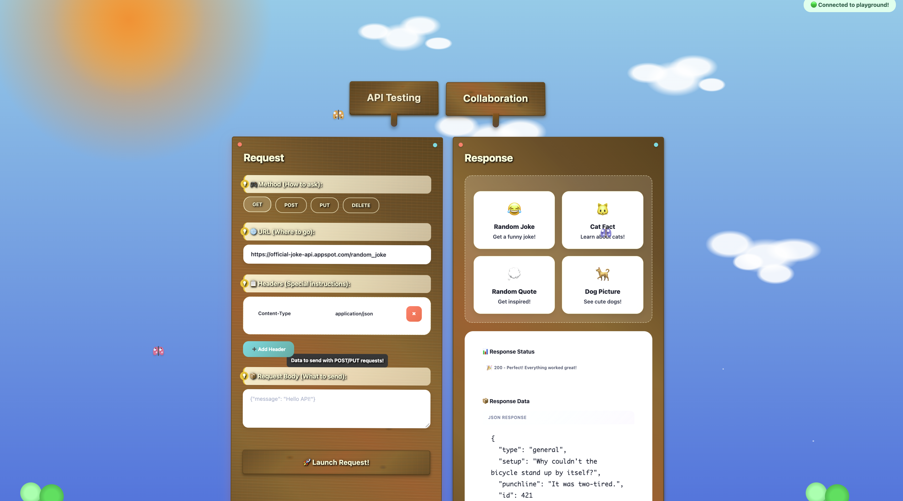
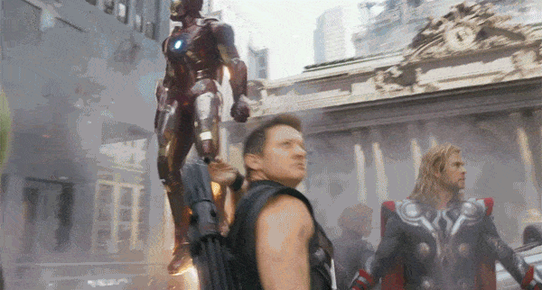

我做了给 10 岁孩子的 Postman 遇上 Google Docs。

*配上唱片刮擦声。*

*配上定格画面。*

*配上电影老套桥段。*

你大概在想我是怎么到这里的。


<!--truncate-->

在我解释之前，最好我直接给你看。

👉自己试试：https://api-playground-production.up.railway.app/



这是一个协作的 API 测试游乐场，孩子们可以运行示例请求，得到好玩的错误信息，并实时看到响应。会话中的每个人一起看到 API 响应，把独自调试的体验变成多人编程。而且它看起来就像一个真正的游乐场。

我是在参加公司的「带孩子来上班日」之后受到启发构建这个的。我没有带我的孩子，因为她还是婴儿，但我去支持我的队友 Adewale Abati，他主持了一场虚拟课程，向孩子们介绍 goose。他们用它构建漫画、游戏和音乐应用，有趣、有想象力，而且真的令人印象深刻。

我决定创建一个数字资源，以感觉邀请而不是吓人的方式教授 API 这类基础概念。传统 API 测试工具很强大，但对刚起步的孩子来说，可能令人困惑、不清楚。

**狂野的部分是，我让 goose 和六个子智能体把这个想法变成现实。**

## 认识子智能体

[子智能体](/docs/guides/context-engineering/subagents)是承担特定任务的单独 AI 实例。每个都在自己的会话中运行，这有助于保留主上下文窗口，并让你的主要 goose 对话保持不杂乱，聚焦于高层编排。我把子智能体想成临时队友。goose 给每个子智能体分配一项工作，工作完成时就释放它。

对这个项目，我把子智能体变成一支按需开发小队，并分配了以下角色：

* **后端开发者**——构建用于实时协作的 WebSocket 服务器
* **前端开发者**——创建协作 Web UI
* **冲突解决工程师**——处理同时发生的用户编辑
* **文档作者**——创建对初学者友好的 README
* **API 示例策展人**——用有趣的公共 API 构建示例集合
* **测试工程师**——编写一套简单的测试

旁注：感觉像我在召集复仇者联盟。


:::note
从 1.10.0 版本起，子智能体不再是实验性的，也不需要启用任何功能标志。
:::

## 指示我的团队

在 goose 中创建子智能体有几种方式。你可以使用自然语言提示，通过[配方](/docs/guides/recipes/)定义它们，甚至启动 [Codex 或 Claude Code 这样的外部子智能体](/docs/guides/context-engineering/subagents/#external-subagents)。

我采用了自然语言提示的方法，因为通过一条提示直接配置子智能体感觉方便。下面是我用的提示：

```
Build a real-time collaborative API testing platform using 3 AI subagents working sequentially - like "Google Docs for Postman" where teams can test APIs together, but for kids. Make it so errors and results are explained in a way that kids can understand and the design is kid friendly using metaphors. 

3 Sequential Subagents 

- Subagent 1: Create a WebSocket backend server that handles API request execution (GET/POST/PUT/DELETE with headers, body, auth) AND real-time collaboration features (multiple users, shared collections, live updates). 

- Subagent 2: Build a conflict resolution system for when multiple users edit the same API request simultaneously, plus response formatting and request history management. 

- Subagent 3: Create the collaborative web UI using HTML, CSS, and vanilla JavaScript with API testing interface (URL input, method selection, headers, request body) that shows live user cursors, real-time updates, and shared results when anyone runs a test. 

3 other subagents should work in parallel developing a readme, api collections and, a simple test suite. 

- Subagent 4: Create a beginner friendly README

- Subagent 5: Create a sample api collection and examples with 2-3 read to try example requests. Use safe, fun public apis like dog facts and joke api

- Subagent 6: Create a simple test suite 

Final result should be a working web app where multiple people can test APIs together, see each other's requests and responses instantly, and collaborate without conflicts. Use HTML/CSS/JS for the frontend, no frameworks. 

Set the time out to 9 minutes.
```

:::note 一句话
goose 让你并行或顺序运行子智能体。我选择了混合方法，指示 goose 顺序运行前几个子智能体（因为他们的任务依赖上一步），并并行运行后三个子智能体（因为他们只需要核心应用存在）。

我还把超时设为 9 分钟，给子智能体比默认 5 分钟更多的时间来完成任务。
:::

子智能体交付了一个能用的协作 API 游乐场。功能是扎实的，但我注意到视觉设计不一致。它用了太多颜色和字体。我希望它看起来对孩子友好，但不要看起来像孩子做的！

## 我的并行提示失败了

智能体完成初始任务后，我继续用一条后续提示，让 goose 再生成五个子智能体并行工作，每个负责不同的 UI 组件：页眉、请求构建器、标签布局和协作面板。我想让子智能体并行执行工作会更快完成。

但这条提示的结果让应用看起来更糟！每个子智能体对「对孩子友好」有自己的解释。页眉是游戏风格，黑紫配色，标签用了 Comic Sans，而应用其余部分没有，面板用了玻璃拟态设计。

这是因为每个子智能体不知道其他子智能体的计划。他们都并行运行，没有任何共享的设计愿景。

## 更好的提示策略

这次我采取了不同的方法。我告诉 goose 启动一个子智能体来分析 UI 并提出共享的设计计划。计划就绪后，goose 就可以再生成四个子智能体并行实现计划。

```
Can you take a look at the UI? The color scheme is all over the place. I want it to be unified but also have a playground theme like a real-life playground. Not just the colors but the elements as well.

I want to use CSS to create grass and trees and a full visual space. For the panels, background, buttons, and text—every single element. Detailed.

Have one subagent analyze the UI and decide what should be updated to feel cohesive and playful. It will create a plan.

After that, four subagents will carry out the plan.
```

第一个子智能体带回了一个有创意的设计方向：用明亮的绿色、阳光黄，以及秋千、滑梯和树等元素，把界面变成一个充满活力的户外游乐场。

下面是计划的摘录：

```
Core Visual Concept:

Transform the API testing interface into a vibrant outdoor playground where kids can "play" with APIs like playground equipment. Think bright sunny day, green grass, colorful playground equipment, and friendly cartoon-style elements.

🎨 Color Palette & Visual Elements

- Grass Green: #4CAF50, #66BB6A, #81C784 (various grass shades)
- Sky Blue: #2196F3, #42A5F5, #64B5F6 (clear sky)
- Sunshine Yellow: #FFC107, #FFD54F, #FFEB3B (sun and highlights)
- Playground Red: #F44336, #EF5350 (slides, swings)
- Tree Brown: #8D6E63, #A1887F (tree trunks, wooden elements)
- Flower Colors: #E91E63, #9C27B0, #FF5722 (decorative flowers)
```

然后，它把实现拆成四个阶段，分给剩下的四个子智能体：

```
Phase 1: Foundation (Area 1)
- Create base playground environment
- Implement sky, grass, and tree elements

Phase 2: Equipment (Area 2)
- Transform main panels into playground equipment

Phase 3: Interactions (Area 3)
- Convert buttons and form elements
- Add micro-animations and hover effects

Phase 4: Content (Area 4)
- Update typography and fonts
- Rewrite copy with playground metaphors
```

结果是一个连贯得多、好玩的界面，看起来真的像数字游乐场。让 goose 基于共享设计计划协调子智能体，比让他们松散地并行跑效果好得多。

## 最后的想法

这是我第一次使用子智能体，我学到：

* 当一项任务建立在另一项之上时，顺序执行更好。
* 当任务独立或遵循共享计划时，并行执行有效
* 对可以委派的、有独立任务的复杂项目使用子智能体。
* 你可以让 goose 为你做规划。你不必微观管理每一步。

我喜欢的是，不必管理每个细节，我可以分配聚焦的工作，让 goose 协调流程。

下一个我想尝试的实验是使用外部子智能体，这会让我把一次性任务委派给 Claude Code 或 Codex 这类工具。

你会用子智能体构建什么？

[下载 goose](/)

[了解子智能体](/docs/guides/context-engineering/subagents)

<head>
  <meta property="og:title" content="编排 6 个子智能体，为孩子构建协作 API 游乐场" />
  <meta property="og:type" content="article" />
  <meta property="og:url" content="https://goose-docs.ai/blog/2025/07/21/orchestrating-subagents" />
  <meta property="og:description" content="把后端、前端、文档和测试委派出去，让六个子智能体为孩子构建协作 API 工具。" />
  <meta property="og:image" content="https://goose-docs.ai/assets/images/built-by-subagents-869a01d4b147ebdb54334dcc22dc521e.png" />
  <meta name="twitter:card" content="summary_large_image" />
  <meta property="twitter:domain" content="goose-docs.ai" />
  <meta name="twitter:title" content="编排 6 个子智能体，为孩子构建协作 API 游乐场" />
  <meta name="twitter:description" content="把后端、前端、文档和测试委派出去，让六个子智能体为孩子构建协作 API 工具。" />
  <meta name="twitter:image" content="https://goose-docs.ai/assets/images/built-by-subagents-869a01d4b147ebdb54334dcc22dc521e.png" />
</head>
