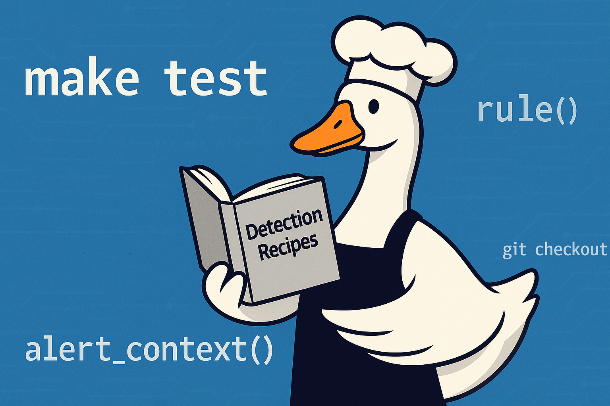
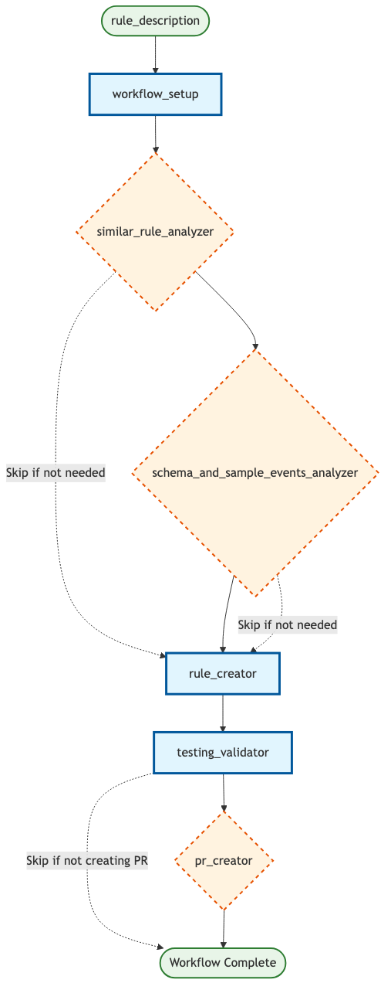

在 Panther 里创建有效的安全检测，传统上需要深入了解检测逻辑、测试框架和开发工作流。Block 的检测工程团队通过构建 goose 配方精简了这个过程，这些配方把整个检测创建生命周期自动化，从最初的仓库设置一直到创建拉取请求。

这篇博文探讨如何利用 goose 的[配方](https://goose-docs.ai/docs/guides/recipes/)和[子配方](https://goose-docs.ai/docs/guides/recipes/subrecipes)系统，以最少的手工干预在 Panther 中创建新检测，同时确保一致性、质量，并遵守团队标准。

<!-- truncate -->

## 什么是配方？
配方是可复用、可分享的配置，为特定任务打包一套完整设置。这些独立文件可以用于自动化工作流，把复杂任务拆成可管理的专门组件来编排。把它们想成面向 AI 辅助开发的精密 CI/CD 流水线，每一步都有清楚定义的输入、输出和职责。

配方里两个值得注意的原料是 `instructions` 和 `prompt`。简而言之：

- 指令被加进系统提示，定义智能体的角色和能力（影响 AI 的行为和个性）
- 提示成为带具体任务的初始用户消息（开始对话）

<details>
<summary>
来自 `workflow_setup` 的片段，展示二者的差别
</summary>
```
instructions: |
  Create a Panther detection rule that detects: {{ rule_description }}

  Use the following context:
  - Similar rules found: {{ similar_rules_found }}
  - Rule analysis: {{ rule_analysis }}
  - Log schemas: {{ log_schemas }}
  - Standards summary: {{ standards_summary }}

  **SCOPE BOUNDARIES:**
  - ...

prompt: |
  ## Process:

  1. **Rule Planning**:
     - Follow "📝 Create Rule Files" guidance from `AGENTS.md`
     - Use streaming rule type (default) unless otherwise specified
     - Choose appropriate log source and severity level
  2. **File Creation**:
     - ...
  ...
  5. **Test Cases**:
     - ...
  ...
  7. **🛑 STOP CONDITION**:
      - ...

  ## ✅ SUCCESS CRITERIA:
      - ...
```
</details>


检测创建配方展示了这种方法的力量：它协调六个专门的子配方，每个处理检测开发的一个具体方面：

1. [**workflow_setup**](#1-workflow_setup-foundation-first)——仓库准备和环境校验
2. [**similar_rule_analyzer**](#2-similar_rule_analyzer-learning-from-existing-patterns)——寻找并分析现有检测模式
3. [**schema_and_sample_events_analyzer**](#3-schema_and_sample_events_analyzer-data-driven-detection-logic)——分析日志模式并采集样本数据
4. [**rule_creator**](#4-rule_creator-the-implementation-engine)——实际的检测规则实现
5. [**testing_validator**](#5-testing_validator-quality-assurance)——全面的测试执行和校验
6. [**pr_creator**](#6-pr_creator-automated-pull-request-pipeline)——以恰当格式创建拉取请求

### `.goosehints` 呢？
在我们的[上一篇](https://goose-docs.ai/blog/2025/06/02/goose-panther-mcp)里，我们讨论了用 [.goosehints](/docs/guides/context-engineering/using-goosehints/) 给大语言模型（LLM）提供持久上下文。我们继续用 `.goosehints` 定义编码标准和通用偏好，以引导 LLM 行为。

不过，为了减少冗余并避免相互冲突的指引，我们采用单一参考文件 `AGENTS.md`，作为所有智能体的事实来源。每个智能体都被指示查阅这个文件，同时仍通过它们的默认上下文文件（例如 `.goosehints`、`CLAUDE.md` 等）或规则（例如 `.cursor/rules/`）支持智能体特定的指令。

这些上下文文件很重要，但它们也有一些权衡和限制：

| 方面 | 上下文文件 | 配方 |
|--------|---------------|---------|
| **污染上下文窗口** | 整个文件随每次请求发送，把上下文窗口弄乱 | 只有与任务相关的指令，让提示清楚、聚焦 |
| **信噪比** | 一般偏好稀释焦点，并可能产生冲突的指引 | 每条指令都针对工作流，消除噪声 |
| **成本和性能影响** | 不必要的上下文可能导致更高的 token 成本和更慢的处理 | 只为相关 token 付费，响应更快 |
| **AI 的认知负担** | 冲突的指令造成决策瘫痪 | 清楚、统一的指引促成果断行动 |
| **针对任务的优化** | 泛泛的指令缺少专门工具和参数 | 为特定工作流专门构建，并预配置工具 |

通过 `AGENTS.md` 的这种集中方法，成为我们配方架构的基础，接下来我们会探讨它。

## 架构
### 设计原则
1. **单一职责**：每个子配方有一项清楚的工作
2. **显式数据流**：没有隐藏状态或隐含依赖
3. **快速失败**：关键步骤失败时立即停止
4. **优雅降级**：可能时以降低的功能继续
5. **全面测试**：部署前校验一切

### 子配方为什么重要
AI 辅助检测创建的传统做法，常常是一条单一、庞大的提示（也就是「单次提示」），试图一次处理所有事。这会导致几个问题：
- **上下文混乱**：AI 在同时应付多项职责时失去焦点
- **输出不一致**：没有清楚边界时，结果差异很大（例如一个子配方可能试图完成我们期望另一个子配方完成的任务）
- **难以调试**：出问题时，很难定位具体问题
- **可维护性差**：某一方面的更改会影响整个工作流

子配方架构通过严格的关注点分离解决这些问题，设定边界并提供退出标准。

每个子配方隔离运行，具有：
- 清楚定义的输入和输出
- 特定的范围边界（它必须做什么、绝不能做什么）
- 标准化的 JSON 响应模式
- 正式的错误处理模式

在高层，一个（非并行）版本看起来会是这样：

| 步骤 | 组件 | 类型 | 描述 |
|------|-----------|------|-------------|
| **1** | [`workflow_setup`](#1-workflow_setup-foundation-first) | 必需 | 初始化工作流环境 |
| **2** | [`similar_rule_analyzer`](#2-similar_rule_analyzer-learning-from-existing-patterns) | *条件* | 分析现有的相似规则 |
| **3** | [`schema_and_sample_events_analyzer`](#3-schema_and_sample_events_analyzer-data-driven-detection-logic) | *条件* | 处理模式和样本数据 |
| **4** | [`rule_creator`](#4-rule_creator-the-implementation-engine) | 必需 | 生成检测规则 |
| **5** | [`testing_validator`](#5-testing_validator-quality-assurance) | 必需 | 校验并测试规则 |
| **6** | [`pr_creator`](#6-pr_creator-automated-pull-request-pipeline) | *条件* | 创建拉取请求 |

> 💡 **注意：** *条件*步骤可能根据工作流配置被跳过

<details>
<summary>
工作流可视化
</summary>

</details>

## 数据流与状态管理
由于子配方目前隔离运行，数据必须在它们之间显式传递。主配方编排这条流：

在配方里这样定义的例子：
```
`workflow_setup(rule_description)` → Returns:
  - **branch_name**: Name of the created feature branch
  - **standards_summary**: Key standards and requirements from `AGENTS.md`
  - **repo_ready**: Boolean indicating if repository is ready for development
  - **mcp_panther**: Object containing Panther MCP access test results
    - **access_test_successful**: Boolean indicating if Panther MCP access test was successful
    - **error_message**: Error message if access test failed
```

数据如何流动的一个例子：
```
workflow_setup(rule_description) → {
  branch_name: "ai/aws-privilege-escalation",
  standards_summary: "Key requirements from AGENTS.md...",
  repo_ready: true,
  mcp_panther: { access_test_successful: true }
}

similar_rule_analyzer(rule_description, standards_summary) → {
  similar_rules_found: [...],
  rule_analysis: "Analysis of existing patterns...",
  suggested_approach: "Create new rule with modifications..."
}
```

这种显式的数据传递确保：
- 各次运行之间**行为可预期**
- 出问题时**容易调试**
- 哪些数据影响了每个决定，有**清楚的审计轨迹**
- 对单个组件做**模块化测试**

## 聪明的优化：条件执行
检测创建工作流最强大的功能之一，是它的智能优化系统：根据参数和运行时条件跳过不必要的步骤。

### 基于参数的条件
用户可以通过参数控制工作流行为：

```shell
# Fast mode - skip similar rule analysis
goose run --recipe recipe.yaml --params skip_similar_rules_check=true --rule_description="What you want to detect"

# Skip Panther MCP integration
goose run --recipe recipe.yaml --params skip_panther_mcp=true --rule_description="What you want to detect"

# Create PR automatically
goose run --recipe recipe.yaml --params create_pr=true --rule_description="What you want to detect"
```

### 运行时条件
工作流根据前面步骤的结果做出智能决定：

```
# Current implementation uses both parameter-based and runtime conditions
# Parameter-based (available at recipe start):
- skip_similar_rules_check: Controls similar_rule_analyzer execution
- skip_panther_mcp: Controls schema_and_sample_events_analyzer execution  
- create_pr: Controls pr_creator execution

# Runtime conditions (based on subrecipe results):
- schema_and_sample_events_analyzer runs only if:
  * skip_panther_mcp is false AND
  * (similar_rules_found is empty OR mcp_panther.access_test_successful is false)
```

这种混合方法提供：
- **效率**：当相似规则已提供足够上下文时，避免冗余的 API 调用
- **可靠性**：外部服务不可用时优雅降级
- **灵活性**：用户可以选择自己偏好的速度与彻底程度的权衡

此外，Jinja 支持让事件触发可以被编码下来，确保智能体遵守预定义指令，而不是自己做可能不正确的决定。例如，可以根据某个参数的值，指示智能体跳过一步：

```

6. `pr_creator(rule_files_created, rule_description, branch_name, create_pr={{ create_pr }}, panther_mcp_usage)` → Returns:
    {
      "success": true,
      "data": {
        "pr_created": true,
        "pr_url": "https://github.com/<org>/<team>-panther-content/pull/123",
        "pr_number": 123,
        "summary": "Summary of the completed work"
      }
    }

6. **SKIPPED** `pr_creator` - create_pr parameter is false
    - Provide final summary of completed work instead

```

## 深入：关键子配方
### 1. `workflow_setup`：先打基础 {#1-workflow_setup-foundation-first}
|输入 | 输出
--- | ---
`rule_description` | `branch_name`、`standards_summary`、`repo_ready`、`mcp_panther`

这个子配方处理所有基础工作：

**关键职责**：
- 核验仓库访问
- Git 分支的创建和管理
- 从 `AGENTS.md` 提取标准
- 环境校验
- 测试 Panther MCP 访问

**输出示例**：
```json
{
  "status": { "success": true },
  "data": {
    "branch_name": "ai/okta-suspicious-login",
    "standards_summary": "Rules must use ai_ prefix, implement required functions...",
    "repo_ready": true,
    "mcp_panther": { "access_test_successful": true }
  }
}
```

### 2. `similar_rule_analyzer`：从现有模式学习 {#2-similar_rule_analyzer-learning-from-existing-patterns}
输入 | 输出
--- | ---
`rule_description`、`standards_summary`、`rule_type` | `similar_rules_found`、`rule_analysis`、`suggested_approach`

这个子配方在仓库里搜索相似的检测模式：

```
# Search strategy by rule type:
- streaming rules: Search rules/<team>_rules/
- correlation rules: Search correlation_rules/<team>_correlation_rules/  
- scheduled rules: Search queries/<team>_queries/
```

**关键职责**：
- 搜索日志源和检测逻辑相似的现有规则
- 优先团队创建的规则，而不是上游模式
- 分析实现方法和编码模式
- 为新规则开发提供建议
- 从相似实现中提取相关上下文

**关键洞察**：它优先团队创建的规则（\<team\>_* 目录），而不是上游规则，以确保与已建立的模式一致。

即使不能直接访问检测引擎，用户也可以借助现有检测，以及我们已建立的标准和测试套件，来开发新检测。

### 3. `schema_and_sample_events_analyzer`：数据驱动的检测逻辑 {#3-schema_and_sample_events_analyzer-data-driven-detection-logic}
输入 | 输出
--- | ---
`rule_description`、`similar_rules_found` | `log_schemas`、`example_logs`、`field_mapping`、`panther_mcp_usage`

这个子配方借助 Panther 的 MCP 集成，弥合检测要求与实现之间的差距：

**关键职责**：
- 用 Panther MCP 做日志模式分析
- 从数据湖采集样本事件
- 为检测逻辑做字段映射
- Snowflake SQL 查询优化

**聪明的数据采集策略**：
- _并行执行_：同时运行多条 Snowflake 查询，而不是顺序执行
- _查询规划_：执行前识别所有需要的查询，以最大化效率
- _渐进采样_：从小结果集开始（LIMIT 5），按需要扩大
- _关键边界_：它明确不能创建规则文件或运行测试——它唯一的焦点是理解数据结构。

**输出示例**：
```json
{
  "status": { "success": true },
  "data": {
    "log_schemas": [{
      "log_type": "AWS.CloudTrail",
      "schema_summary": "Contains eventName, sourceIPAddress, userIdentity fields",
      "relevance": "Essential for detecting privilege escalation patterns"
    }],
    "example_logs": [{
      "log_type": "AWS.CloudTrail", 
      "event_summary": "AssumeRole events with cross-account access",
      "key_fields": ["eventName", "sourceIPAddress", "userIdentity.type"]
    }],
    "panther_mcp_usage": {
      "mcp_used": true,
      "log_schemas_referenced": true,
      "data_lake_queries_performed": true
    }
  }
}
```

_降级处理_：当 Panther MCP 不可用时，它智能地使用相似规则分析来推断模式结构，确保工作流以降低但仍然可用的能力继续。

### 4. `rule_creator`：实现引擎 {#4-rule_creator-the-implementation-engine}
输入 | 输出
--- | ---
`rule_description`、`similar_rules_found`、`rule_analysis`、`log_schemas`、`standards_summary` | `rule_files_created`、`rule_implementation`、`test_cases_created`

魔法在这里发生——这个子配方生成包含检测逻辑、元数据和单元测试的所需文件。

**聪明的日志源校验**：
- 如果模式分析成功运行 → 使用已校验的日志类型
- 如果跳过了模式分析 → 对照 pytest 中定义的已知日志类型进行校验。

**关键原则示例**：
- 始终为事件字段使用默认值
- 对用户控制的字段使用不区分大小写的匹配
- 用分组条件把逻辑结构写清楚
- 优先用 `any()` 和 `all()`，而不是多个 return 语句

为了说明，下面的例子为最后一点提供指引：

> 💡 **代码质量提示：简化条件逻辑**
> 
> ❌ 避免：太多 return 语句
> ```python
> # multiple returns make logic hard to follow
> def rule(event) -> bool:
>  if event.deep_get("eventType", default="") != "user.session.start":
>    return False
>  
>  if event.deep_get("outcome", "result", default="") != "SUCCESS":
>    return False 
>
>  if event.deep_get("actor", "alternateId", default="").lower() == TARGET_USER.lower():
>    return True
>
>  return False
>```
>
> ✅ 推荐：用 `any()` 和 `all()` 的清楚结构
> ```python
> def rule(event) -> bool:
>   return all([
>     event.deep_get("eventType", default="") == "user.session.start",
>     event.deep_get("outcome", "result", default="") == "SUCCESS",
>     event.deep_get("actor", "alternateId", default="").lower() == TARGET_USER.lower()
>   ])
> ```
>

### 5. `testing_validator`：质量保证 {#5-testing_validator-quality-assurance}
输入 | 输出
--- | ---
`rule_files_created` | `test_results`、`validation_status`、`issues_found`

这个子配方是关键的质量门，执行强制性测试流水线，确保每条检测达到生产标准。

**关键职责**：
- 执行 `AGENTS.md` 中所有强制性测试命令（例如代码检查、格式化，以及单元测试和 pytest）
- 对照团队标准校验规则实现
- 为修复问题提供可执行的反馈
- 确保遵守安全和编码要求

这些检查确保检测达到我们的标准，防止不合格的代码被合并。如果某项检查失败，LLM 会迭代，识别并实现必要的更改，直到在同一次配方运行中达到合规。

**智能的失败分析**：这个子配方不只是跑测试——它分析失败并提供具体指引：
```json
{
  "test_results": {
    "tests_passed": 3,
    "tests_failed": 1,
    "test_details": [{
      "test_name": "make lint",
      "status": "failed", 
      "message": "pylint: missing default value in deep_get() call"
    }]
  },
  "recommendations": [
    "Add default values to all deep_get() calls per AGENTS.md standards",
    "Reference 'Core Coding Standards' section for proper error handling"
  ]
}
```

**输出示例**：
```json
{
  "status": { "success": true },
  "data": {
    "test_results": {
      "tests_passed": 4,
      "tests_failed": 0,
      "test_details": [
        { "test_name": "make fmt", "status": "passed", "message": "All files formatted correctly" },
        { "test_name": "make lint", "status": "passed", "message": "No linting issues found" },
        { "test_name": "make test", "status": "passed", "message": "Rule tests passed: 2/2" },
        { "test_name": "make pytest-all", "status": "passed", "message": "All unit tests passed" }
      ]
    },
    "validation_summary": "All mandatory tests passed. Rule ready for PR creation.",
    "recommendations": []
  }
}
```

### 6. `pr_creator`：自动化拉取请求流水线 {#6-pr_creator-automated-pull-request-pipeline}
输入 | 输出
--- | ---
`rule_files_created`、`rule_description`、`branch_name`、`create_pr`、`panther_mcp_usage` | `pr_created`、`pr_url`、`pr_number`、`summary`

这个子配方处理工作流的最后一步，并完全遵守团队标准：

**关键职责**：
- Git 分支管理和提交
- 以恰当格式填充 PR 模板
- 跟踪并报告 Panther MCP 的使用
- 创建草稿 PR 供团队审阅

**智能的 PR 创建**：
- _条件执行_：只有当 `create_pr=true` 时才创建 PR，否则提供摘要
- _模板合规_：根据 `AGENTS.md` 标准自动填充 PR 模板
- _MCP 使用报告_：在工作流部分记录是否使用了 Panther MCP（这对 PR 审阅者有用）

**Git 操作标准**：
- 从不使用 `--no-verify` 标志——修复问题，而不是绕过它们
- 遵循团队标准中的提交信息指南
- 确保恰当的分支管理和远程同步

**输出示例**：
```json
{
  "status": { "success": true },
  "data": {
    "pr_url": "https://github.com/<org>/<team>-panther-content/pull/123",
    "pr_number": 123,
    "branch_name": "ai/aws-privilege-escalation",
    "commit_hash": "abc123def",
    "files_committed": ["rules/<team>_rules/ai_aws_privilege_escalation.py", "rules/<team>_rules/ai_aws_privilege_escalation.yml"]
  }
}
```

_质量保证_：这个子配方对 git 失败、PR 创建问题和模板填充问题包含全面的错误处理，在自动化失败时提供清楚的降级说明。

## 错误处理与快速失败设计
这个工作流实现了精密的错误处理，带有智能的停止点：

### 标准化响应模式
每个子配方使用一致的 JSON 响应格式：
```json
{
  "status": {
    "success": boolean,
    "error": "Error message if failed",
    "error_type": "categorized_error_type"
  },
  "data": { /* Actual response data */ },
  "partial_results": { /* Optional partial data */ }
}
```

### 失败
这个工作流区分不同类型的失败。例如，每个子配方的响应都有一个 `error_code` 字段。发生失败时，LLM 对遇到的错误类型分类，并把这个信息呈现给主配方，以便它决定下一步做什么。

作为例子，`rule_creator` 配置了这些错误类别：
```
response:
  json_schema:
    type: object
    properties:
      status:
        type: object
        properties:
          ...
          error_type:
            type: string
            enum: ["git_operation_failed", "pr_creation_failed", "template_population_failed", "validation_failed"]
            description: "Category of error for debugging purposes"
        ...
```

如果这个子配方返回 `file_creation_failed`，我们就不该继续到 `testing_validator` 或 `pr_creator` 步骤。

这种快速失败的方法避免在没有意义的后续步骤上浪费力气。

## 实际使用示例
### 基本用法：快速创建检测
```shell
# Create a detection without creating a PR or similar rule/Panther MCP analysis
goose run --recipe recipe.yaml \
  --params skip_similar_rules_check=true \
  --params skip_panther_mcp=true \
  --params rule_description="Create an AWS CloudTrail detection to identify new regions being enabled without any associated errorCodes"
```

### 全面分析模式
```shell
# Full workflow with schema/event sampling and automatic PR creation
goose run --recipe recipe.yaml --interactive \
  --params skip_similar_rules_check=true \
  --params skip_panther_mcp=false \
  --params create_pr=true \
  --params rule_description="Create a Panther rule that will detect when the user fbar@block.xyz successfully logs in to Okta from a Windows system"
```

## 标准合规与质量保证
配方系统通过以下方式确保遵守团队标准：

### 自动化标准提取
`workflow_setup` 子配方从 `AGENTS.md` 提取关键要求：
- 文件命名约定（AI 创建的规则使用 `ai_` 前缀）
- 必需的 Python 函数和错误处理模式
- 测试要求和校验命令
- PR 创建标准和模板

### 内置质量检查
- **代码格式化**：自动执行格式化
- **代码检查**：全面的 lint 校验
- **测试**：强制执行测试套件
- **安全**：测试用例中没有个人身份信息（基于 LLM 的判断），以及恰当的错误处理（例如确保返回默认值）
- **一致性**：标准化的文件结构和命名

### 拉取请求自动化
`pr_creator` 子配方遵循团队标准：
- 恰当的分支命名（例如 `ai/<description>`）
- 基于模板的 PR 描述
- 供审阅的草稿模式
- 全面的更改摘要

### Panther MCP 集成
工作流与 [Panther 的模型上下文协议](https://github.com/panther-labs/mcp-panther)（MCP）集成，用于：
- **模式分析**：理解日志结构和可用字段
- **样本数据采集**：从数据湖收集真实的测试数据
- **字段映射**：识别检测逻辑的关键字段

## 好处与影响
对安全团队
- **更快的检测开发**：几分钟，而不是几小时
- **一致的质量**：自动遵守标准
- **更少的错误**：部署前的全面测试
- **知识共享**：相似规则分析传播最佳实践

对 AI 开发
- **模块化架构**：容易修改单个组件
- **清楚的调试**：具体的失败点和错误类别
- **可预期的行为**：各次运行输出一致
- **可维护的代码**：定义良好的边界和职责

对组织
- **可及性**：让用户无需深入了解底层检测引擎就能创建检测
- **可扩展的安全**：对新威胁快速响应
- **质量保证**：内置测试和校验
- **文档**：带恰当上下文的自动 PR 创建
- **合规**：遵守安全和开发标准

## 结论
goose 的配方和子配方系统代表 AI 辅助安全检测开发的一次显著进步。通过把复杂工作流拆成专门、可组合的组件，团队可以达成：
- 通过自动化测试和校验得到**更高质量的检测**
- 借助智能优化得到**更快的开发周期**
- 通过标准化流程得到**更好的一致性**
- 借助模块化、定义良好的组件得到**更容易的维护**

检测创建配方展示了深思的架构和清楚的关注点分离，如何把一个复杂、易错的手工过程变成可靠的自动化工作流。

无论你是在构建第一份 goose 配方，还是想优化现有工作流，这里概述的模式和原则都为成功的自动化提供了扎实基础。

---

## 最佳实践与经验

#### 指令的格式与清晰度
- 优先用**简洁的要点**，而不是密实的段落，让指令可以扫读。
- 用**强调**（例如 \**粗体\**、全大写）突出重要约束或行为。
- 写**针对任务**的指令，并有清楚的退出标准——避免让智能体做超出需要的事。

#### 提示中的结构与逻辑
- 在模板（例如 Jinja）里使用**显式逻辑**：定义是/否标志，而不是依赖 LLM 推断条件。
- 在需要时提供**结构化输出**（例如 JSON），以支持下游配方或工具。
- **避免模糊标签**——使用中性、一致的措辞（例如用「正确/不正确」，而不是「好/坏」）。

#### 校验与护栏
- 加上**代码片段或示例**来说明预期行为。
- 用**检查清单**帮助 AI 核验自己是否遵循了所有必需步骤。
- 纳入 **pytest** 或其他测试门，及早抓住问题。避免在 `git` 命令上使用 `--no-verify` 这类绕过。
  - **尽可能让系统自我纠正**。
  - 把标准编码下来，这样在 PR 能被推送之前，更新必须通过测试。

#### 知识共享与上下文管理
- 提供智能体可以学习的**有力示例**，减少对查询数据湖的依赖。
- 为所有 AI 智能体维护一份**中心参考**（例如 `AGENTS.md`）：
  - 用户可能想在你传统开发工作流之外做贡献
  - 把 `.goosehints`、`CLAUDE.md`、`.cursor/rules/*` 等里的步骤或章节链接回这个文件。
  - 考虑让一个智能体帮助组织 `AGENTS.md`，以便更容易解析，并在智能体之间复用。

#### 工作流设计
- 用 **PR 模板和指南**来标准化 AI 生成贡献的格式和预期。
- 利用**跨配方的共享上下文**，但在适当处用分开的上下文窗口隔离工作流。
    - 允许传递输出和**并行执行**，同时支持步骤之间的**职责分离**。

<!-- Social Media Meta Tags (edit values as needed) -->
<head>
  <meta property="og:title" content="用 goose 配方精简检测开发" />
  <meta property="og:type" content="article" />
  <meta property="og:url" content="https://goose-docs.ai/blog/2025/07/28/streamlining-detection-development-with-goose-recipes" />
  <meta property="og:description" content="一份全面指南：在 goose 中使用配方，精简安全检测开发" />
  <meta property="og:image" content="https://goose-docs.ai/assets/images/goose-recipes-detection-development-cover.png" />
  <meta property="og:image" content="https://goose-docs.ai/assets/images/goose-recipes-detection-development-cover-cac8a9bea2d090ec2758a0b907bc9da8.png" />
  <meta property="twitter:domain" content="goose-docs.ai" />
  <meta name="twitter:title" content="用 goose 配方精简检测开发" />
  <meta name="twitter:description" content="一份全面指南：在 goose 中使用配方，精简安全检测开发" />
  <meta name="twitter:image" content="https://goose-docs.ai/assets/images/goose-recipes-detection-development-cover.png" />
  <meta name="twitter:image" content="https://goose-docs.ai/assets/images/goose-recipes-detection-development-cover-cac8a9bea2d090ec2758a0b907bc9da8.png" />
</head>
