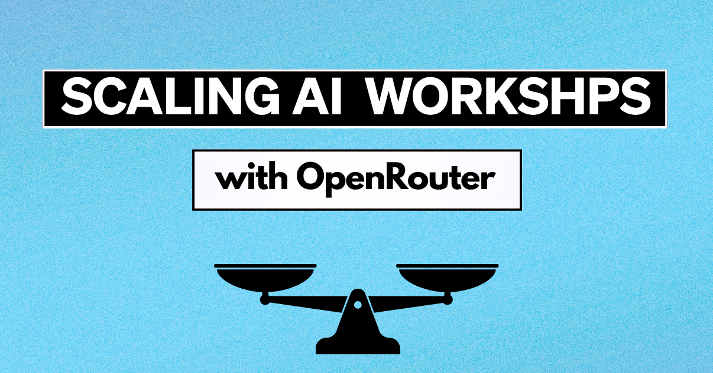
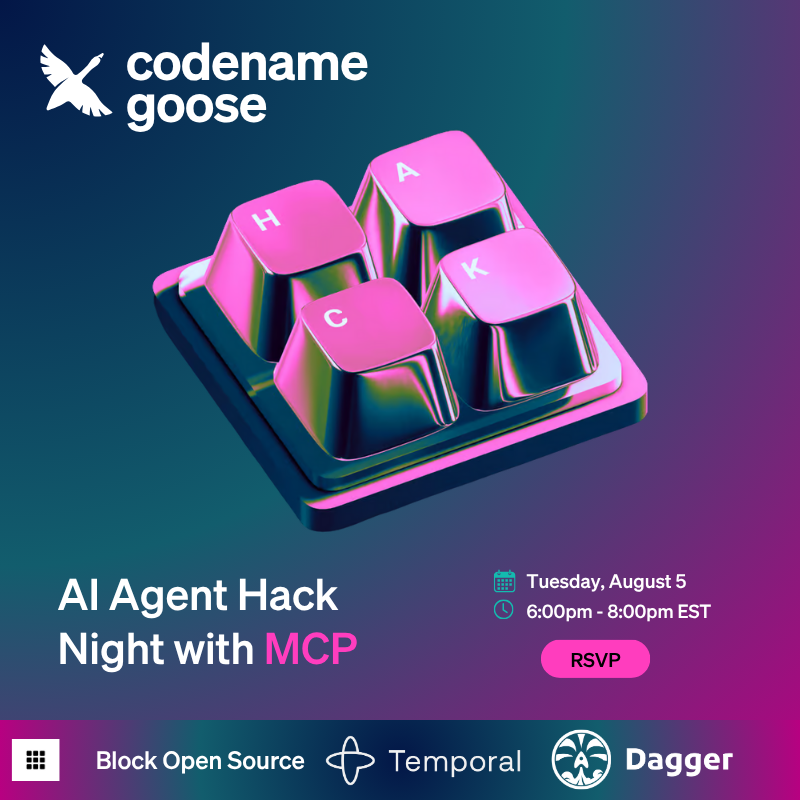

2025 年 1 月初，我的团队发布 [goose](/) 时，我们知道自己做出了特别的东西。我们构建了一个免费、开源的 AI 智能体，利用 Model Context Protocol。它的方法很有创意：为开发者提供一个本地解决方案，并可以灵活地带上自己选择的 LLM。

## LLM 成本问题

在内部使用产品几个月之后，我的队友渴望通过工作坊和黑客松把 goose 分享给开发者社区。我们想提供动手体验，让人们真正用 goose 构建，因为开发者就是这样爱上一个产品的。

但我们碰到一个棘手的挑战：goose 是免费的，高性能 LLM 却不是。

<!--truncate-->

免费的本地开源模型存在，但体验不稳定，而且常常需要高端硬件。许多本地模型在工具调用上吃力，或上下文窗口很小。让人们自掏腰包只为试用这个工具，并不公平。

## 我们考虑过的现有方案

团队最初考虑承担 LLM 使用成本。和其他组织谈过之后，我们发现人们要么：

* 手动分发 API 密钥
* 使用一把共享的 API 密钥
* 依靠与提供商的合作来获得额度

对我们这个小而灵活的团队来说，这些选项感觉不安全、不灵活、也不可扩展。我们担心人们会偷走并滥用共享 API 密钥，或者额度无法均匀分配。手动分享 API 密钥会很繁琐、耗时，挤占聚会本身的深度。

## 发现 OpenRouter

休完育儿假回来后，我准备重新投入，正面解决这个问题。我开始和 Alex Hancock 合作——他是 MCP 指导委员会成员，也是 goose 开源工程师——规划我们在波士顿的第一场聚会。我的老板 Angie Jones 建议，这场聚会是让人们亲手用上 goose 的完美时机。

这给了我找到快速方案所需的动力。我想我可以做一个 Web 应用，为参会者生成 API 密钥。他们可以领取自己的密钥，密钥上已经预设了一定额度。

唯一的问题是，OpenAI 和 Anthropic 这类热门提供商不允许我为每把 API 密钥设置具体的额度。

然后我发现了 [OpenRouter](https://openrouter.ai/)：「一个统一的 API 平台，通过智能路由和自动回退，提供对多种大语言模型的访问。」你可以用同一把 API 密钥使用任何想要的模型。但我真正需要的功能是它的临时 API 密钥系统，它允许我生成一把主密钥，并以编程方式：

* 按需创建单独的 API 密钥
* 为每把密钥设置具体的额度上限（每位参与者 5 美元）
* 按需要管理和禁用密钥
* 支持通过其平台提供的任何模型
* 避免共享或静态密钥带来的混乱

## 构建 Web 应用

我围绕 OpenRouter 的 API 做了一个简单的 Web 应用。参会者可以访问一个链接，点击一个按钮，立刻得到自己的临时 API 密钥。他们可以把密钥插进 goose，开始构建，而不必在 OpenRouter 上注册账号。

```shell
curl -X POST https://openrouter.ai/api/v1/keys \
     -H "Authorization: Bearer <PROVISIONARY API KEY>" \
     -H "Content-Type: application/json" \
     -d '{
  "name": "string"
}'
```

而且它奏效了。人们*真的*用了 goose，并且喜欢整个体验，从聚会到演讲，再到 goose 本身。

我们现在已经在悉尼、柏林、波士顿、亚特兰大、旧金山、得克萨斯和纽约举办过聚会。你可以在我们的[波士顿](/blog/2025/03/21/goose-boston-meetup)和[纽约](/blog/2025/04/17/goose-goes-to-NY)博客里读到过往经历。

## 即将到来的丹佛工作坊

我们将于 8 月 5 日把这场动手 goose 工作坊带到丹佛。

来和我们一起度过与 Temporal 和 Dagger 合作的一个晚上。你会获得免费 API 额度，用 goose 做出实实在在的东西，并深入了解 MCP。

**在此报名：** https://lu.ma/tylz1e9o



## 未来的改进

这个系统并不完美。现在它仍然是 goose 界面之外的单独体验，对于额度不同或需求更复杂的活动，它扩展得也不好。

我们正在改进。goose 工程师 Mic Neale 最近开了一个[拉取请求](https://github.com/aaif-goose/goose/pull/3507)，用来自动化 goose 的首次设置。它简化了上手流程，让新用户可以通过浏览器登录 OpenRouter、安全认证，并得到预先配置好的 goose，而不必碰配置文件或复制 API 密钥。这是用户体验上的一大步，也为未来的改进打下基础。

## 为什么这种方法重要

随着更多开发者试验本地智能体和自带模型的设置，我们需要与这种灵活性匹配、又不牺牲控制的基础设施。灵活的 API 提供商加上可编程的密钥管理，可能正是你活动策略里缺少的那一块。

想让我们办一场 goose 工作坊或黑客松吗？我们带 API 额度。你带构建者。


<head>
  <meta property="og:title" content="OpenRouter 如何打开了我们的工作坊策略" />
  <meta property="og:type" content="article" />
  <meta property="og:url" content="https://goose-docs.ai/blog/2025/07/29/openrouter-unlocks-workshops" />
  <meta property="og:description" content="我们如何用 Open Router 为 goose 工作坊提供无摩擦的 LLM 访问" />
  <meta property="og:image" content="https://goose-docs.ai/assets/images/scaling-ai-workshops-open-router-2af052d2b72f502ba14b06c4d784c0cc.png" />
  <meta name="twitter:card" content="summary_large_image" />
  <meta property="twitter:domain" content="goose-docs.ai" />
  <meta name="twitter:title" content="OpenRouter 如何打开了我们的工作坊策略" />
  <meta name="twitter:description" content="我们如何用 Open Router 为 goose 工作坊提供无摩擦的 LLM 访问" />
  <meta name="twitter:image" content="https://goose-docs.ai/assets/images/scaling-ai-workshops-open-router-2af052d2b72f502ba14b06c4d784c0cc.png" />
</head>
