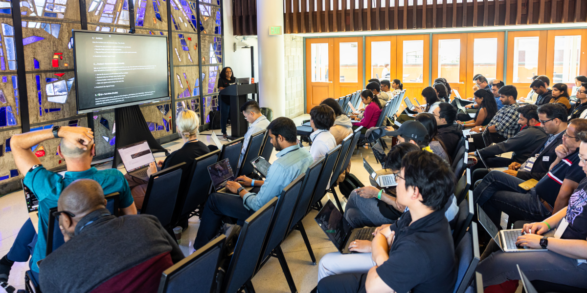

如果我告诉你，只用 AI 智能体，就能在一小时内做出一个完整、能跑的 Web 应用，你会怎么想？不只是简单的「Hello World」，而是一个带后端 API、响应式前端、单元测试和文档的全栈应用？

这正是我们在 [伯克利智能体 AI 峰会](https://www.youtube.com/live/_w5m3h9jY-w?t=5310)的 Vibe Coding 工作坊里做成的事。我演示了如何用 goose 的子智能体编排，拉起一整支 AI 智能体开发团队。每个智能体承担一个具体角色——从产品规划到 QA 测试——并一起构建「AI BriefMe」，一个能就任何主题生成高管风格简报的 Web 应用。

<!-- truncate -->

## 多智能体开发的力量

传统 AI 编程助手很擅长帮你写单个函数或调试具体问题。但如果你要从零构建呢？如果你想模拟整个软件开发生命周期呢？

这正是 goose 子智能体功能发光的地方。你不必自己做所有事，可以编排一支各有专长的专门 AI 智能体团队：

- 🧠 **规划者**——定义产品愿景和 MVP 范围
- 📋 **项目经理**——拆解任务并协调执行
- 🏗️ **架构师**——搭建项目结构和技术栈
- 🎨 **前端开发者**——构建界面
- 🧩 **后端开发者**——构建 API 逻辑
- 🧪 **QA 工程师**——编写测试并找出上线阻碍
- 📝 **技术写作者**——记录设置、用法和 API 细节

## 工作坊体验

在现场工作坊里，参与者跟着我们一步步构建 AI BriefMe。这种方法的美妙之处在于，你不只是看别人写代码，而是在学习如何有效地提示和编排 AI 智能体。

工作流是这样展开的：

### 步骤 1：产品规划
首先，我们拉起一个规划者智能体，定义我们在构建什么。规划者没有一头扎进代码，而是做出了一份清楚的产品定义：

<details>
 <summary>产品计划</summary>

 ```md
 # AI BriefMe MVP - 40-Minute Build Plan

## Goals
Build a functional web app that generates daily briefings on any topic in **40 minutes**. Users input a topic and get an instant, well-formatted briefing.

## Core MVP Features (Must-Have)
1. **Simple web interface** with topic input field and generate button
2. **AI-powered briefing generation** that returns:
   - Title
   - Today's date
   - 2-3 bullet-point takeaways
   - Optional code snippet or chart for technical topics
3. **Clean display** of the generated briefing
4. **Basic error handling** for API failures

## Technical Stack (Keep It Simple)
- **Frontend**: Single HTML page with vanilla JS (no frameworks)
- **Backend**: Python Flask app with single endpoint
- **AI**: Headless Goose as an LLM service
- **Deployment**: Local development server (no cloud deployment)

## Team Responsibilities

### PM
- Define exact briefing format and user flow
- Create sample topics for testing

### Architect  
- Design simple API contract between frontend/backend
- Choose AI prompt structure for consistent output

### Frontend Dev
- Build single-page interface with form and results display
- Handle loading states and basic error messages

### Backend Dev
- Create Flask app with `/generate-briefing` endpoint
- Integrate with AI API and format response
- Add basic input validation

### QA
- Test with 3-5 different topic types
- Verify error handling works
- Check output format consistency

### Tech Writer
- Write brief README with setup instructions
- Document the API endpoint

## Design Considerations
- **Mobile-friendly** but desktop-first
- **Fast response time** - show loading indicator
- **Copy-friendly output** - users should be able to easily copy/share
- **Graceful failures** - clear error messages when AI is unavailable

## Success Criteria
✅ User can enter any topic and get a formatted briefing  
✅ App handles both technical and non-technical topics  
✅ Clean, readable output format  
✅ Works locally without deployment complexity  

## Out of Scope (Save for Later)
- User accounts or login
- Email delivery or scheduling  
- Historical briefings or dashboard
- Advanced formatting or customization
- Mobile app or PWA features
- Analytics or usage tracking

---
**Timeline**: 40 minutes total  
**Demo ready**: Functional app running locally with 2-3 example briefings generated
```
</details>


### 步骤 2：项目管理
接下来，项目经理智能体把工作拆成具体任务，并标出哪些可以并行、哪些必须按顺序做

<details>
  <summary>项目看板</summary>

  ```md
  # AI BriefMe - Project Board

## Sprint Overview
**Duration**: 40 minutes  
**Goal**: Functional MVP with topic input → AI briefing generation → display

---

## 🏗️ ARCHITECT (Start First - 5 minutes)
**Dependencies**: None - blocks all other dev work

### Tasks:
- [ ] **API Contract Design** (3 min)
  - Define `/generate-briefing` POST endpoint structure
  - Specify request/response JSON format
  - Document error response codes
- [ ] **AI Prompt Template** (2 min)
  - Create consistent prompt structure for briefing generation
  - Define output format requirements (title, date, bullets, optional code)

**Deliverables**: `api_spec.md` with endpoint docs and prompt template

---

## 🔧 BACKEND DEV (After Architect - 15 minutes)
**Dependencies**: API contract from Architect

### Tasks:
- [ ] **Flask App Setup** (3 min)
  - Create `app.py` with basic Flask structure
  - Add CORS for frontend integration
- [ ] **Generate Briefing Endpoint** (8 min)
  - Implement `/generate-briefing` POST route
  - Format AI response to match API contract
- [ ] **Error Handling** (2 min)
  - Add try/catch for API failures
  - Return appropriate error responses
- [ ] **Basic Validation** (2 min)
  - Validate topic input (not empty, reasonable length)
  - Sanitize input before sending to AI

**Deliverables**: Working Flask backend ready for frontend integration

---

## 🎨 FRONTEND DEV (Parallel with Backend - 15 minutes)
**Dependencies**: API contract from Architect (can start with mock data)

### Tasks:
- [ ] **HTML Structure** (3 min)
  - Create `index.html` with form and results sections
  - Add basic semantic structure
- [ ] **CSS Styling** (5 min)
  - Style input form and results display
  - Add loading spinner/state
  - Make mobile-friendly
- [ ] **JavaScript Logic** (5 min)
  - Handle form submission
  - Make API call to backend
  - Display results and handle loading states
- [ ] **Error UI** (2 min)
  - Show user-friendly error messages
  - Handle network failures gracefully

**Deliverables**: Complete frontend ready to connect to backend

---

## 🧪 QA (After Backend + Frontend Ready - 8 minutes)
**Dependencies**: Working backend and frontend integration

### Tasks:
- [ ] **Happy Path Testing** (3 min)
  - Test 3 different topic types: business, technical, general
  - Verify output format consistency
- [ ] **Error Scenarios** (3 min)
  - Test empty input, very long input
  - Test with backend down/API key issues
  - Verify error messages display correctly
- [ ] **Cross-browser Check** (2 min)
  - Quick test in Chrome and Safari
  - Verify mobile responsiveness

**Deliverables**: Bug report and sign-off for demo readiness

---

## 📝 TECH WRITER (Parallel with Development - 10 minutes)
**Dependencies**: API spec from Architect, can work in parallel

### Tasks:
- [ ] **README Creation** (5 min)
  - Setup instructions for local development
  - Required dependencies and API keys
  - How to run the application
- [ ] **API Documentation** (3 min)
  - Document the `/generate-briefing` endpoint
  - Include request/response examples
- [ ] **Sample Topics List** (2 min)
  - Create 5-10 example topics for demo
  - Mix of technical and non-technical subjects

**Deliverables**: `README.md`, `API.md`, and `sample_topics.md`

---

## 📋 PM COORDINATION TASKS
**Ongoing throughout sprint**

### Tasks:
- [ ] **Define Exact Briefing Format** (2 min)
  - Specify title format, bullet structure
  - Decide on code snippet criteria
- [ ] **Create Test Topics** (3 min)
  - Prepare demo scenarios
  - Include edge cases for QA
- [ ] **Integration Coordination** (5 min)
  - Ensure frontend/backend connection works
  - Coordinate final testing and demo prep

---

## ⏱️ TIMELINE & DEPENDENCIES

### Phase 1 (0-5 min): Foundation
- **Architect**: API design and prompt template
- **Tech Writer**: Start README and documentation

### Phase 2 (5-20 min): Parallel Development  
- **Backend Dev**: Build Flask app and endpoint
- **Frontend Dev**: Build UI (can use mock data initially)
- **Tech Writer**: Continue documentation

### Phase 3 (20-32 min): Integration & Testing
- **Frontend/Backend**: Connect and test integration
- **QA**: Begin testing as soon as integration works
- **PM**: Coordinate final pieces

### Phase 4 (32-40 min): Final Polish & Demo Prep
- **All**: Bug fixes and demo preparation
- **QA**: Final sign-off
- **PM**: Demo script and presentation

---

## 🎯 CRITICAL PATH
1. Architect completes API spec → Backend can start
2. Backend completes endpoint → Frontend integration can happen  
3. Frontend + Backend working → QA can test
4. QA passes → Demo ready

## ⚠️ RISK MITIGATION
- **Integration Problems**: Frontend dev should test with mock data first
- **Time Overruns**: Cut optional features (code snippets, advanced styling) if needed
```

</details>


### 步骤 3：技术架构
架构师智能体建立了技术基础：

- **技术栈**：原生 HTML/CSS/JS 前端，Express.js 后端
- **API 设计**：简单的 POST 端点，接受 `{"topic": "string"}`
- **文件结构**：组织好的项目，关注点分离清楚
- **依赖**：Express、CORS，以及用于调用无界面 goose 的 child_process

架构师还定义了 API 契约，这使得下一步前端和后端开发者智能体能并行工作。

### 步骤 4：并行开发
事情在这里变得真正有趣。我们同时拉起两个开发者智能体：

**前端开发者**做出了：
- 干净、响应式的界面，带现代 CSS
- 带加载状态的表单处理
- 错误处理和用户反馈
- 复制到剪贴板的功能

**后端开发者**实现了：
- 带恰当错误处理的 Express 服务器
- 使用无界面 goose 做 AI 生成的 `/api/briefing` 端点
- 响应解析和 JSON 格式化
- 超时处理和 CORS 配置

#### 无界面 goose 的魔力

这个项目最酷的一点，是后端如何使用[无界面 goose](/docs/tutorials/headless-goose)，本质上是以编程方式调用 goose 来生成 AI 简报：

```javascript
const gooseProcess = spawn('goose', [
  'run', '-t', prompt, 
  '--quiet', '--no-session', '--max-turns', '1'
]);
```

这创造了一个迷人的递归场景：我们在用 goose 构建一个用 goose 生成内容的应用。一层层都是 AI 智能体！

### 步骤 5：测试与文档
最后，我们并行运行 QA 和技术写作智能体：

**QA 工程师**交付了：
- 用 Jest 写的全面单元测试套件
- 为可靠测试而模拟的外部依赖
- 对上线准备阻碍的详细分析
- 安全和性能建议

**技术写作者**产出了：
- 带设置说明的完整 README
- 带示例的 API 文档
- 排障指南
- 用法示例和最佳实践

## 实时看到的真实结果

一小时结束时，参与者有了一个功能完整的 Web 应用。最终产品交付了这些：

- **干净的 UI**：在桌面和移动端都能用、看起来专业的界面
- **AI 驱动的内容**：生成带标题、日期和要点的结构化简报
- **代码示例**：对技术主题，包含相关代码片段
- **生产洞察**：QA 分析揭示了部署前需要注意的具体方面
- **完整文档**：运行、修改和扩展应用所需的一切

但重要的是：这不是可以上生产的代码。QA 智能体对此非常清楚，标出了安全、性能和可扩展性问题。

<details>
  <summary>QA 分析要点</summary>

  ```md
    ## 🔍 QA Analysis Highlights

    ### Critical Issues Identified
    - **Security**: Command injection risk, no authentication, missing rate limiting
    - **Performance**: Blocking operations, memory leaks, inefficient parsing
    - **Scalability**: Single-threaded bottleneck, no horizontal scaling support

    ### Risk Assessment
    - **Overall Risk Level**: HIGH ⚠️
    - **Production Readiness**: Not recommended without addressing critical issues
    - **Timeline for Production**: 2-3 weeks for P0 items, 4-6 weeks for full readiness

    ### Testing Quality Assessment
    - **Test Coverage**: Excellent (91%+ across all metrics)
    - **Edge Case Handling**: Comprehensive
    - **Error Scenarios**: Well covered
    - **Resilience Testing**: Implemented
  ```

</details>

## 人仍然重要

这次工作坊恰当地说明了 AI 辅助开发的现状。goose 和它的子智能体完全可以加速原型，帮你快速做出能跑的应用。但关键的判断仍然属于人类开发者：

- **架构决策**：这是解决这个问题的正确方法吗？
- **安全方面的考虑**：我们需要缓解哪些风险？
- **上线准备**：真实用户接触之前，哪些地方需要加固？
- **业务逻辑**：这真的解决了用户的问题吗？

## 开发的未来

我们在这次工作坊里演示的，暗示了软件开发一个迷人的未来：我们可能会编排 AI 智能体团队。真正要紧的技能变成：

- **提示工程**：你如何把需求清楚地传达给 AI 智能体？
- **系统设计**：你如何把复杂问题拆成智能体大小的任务？
- **质量保证**：你如何校验和测试 AI 生成的代码？
- **集成**：你如何把多个智能体的输出组合成连贯的方案？

## 开始使用子智能体

想自己试试？你需要这些：

1. **安装并配置 goose**：按照[快速开始指南](https://goose-docs.ai/docs/quickstart)
2. **从小处开始**：先试着做一个简单应用，熟悉这套工作流

:::note
从 1.10.0 版本起，子智能体不再是实验性的，也不需要启用任何功能标志。
:::

[完整的工作坊材料](https://gist.github.com/angiejones/60ff19c08c5a3992e42adc8de3e96309)可以获取，包括分步说明和速查提示。

关键是学会如何有效提示。每个智能体都需要关于自己角色、约束和交付物的清楚指令。

记住，这是为了做原型和探索，不是为了生产部署。用它快速验证想法、做演示，或学习新技术。然后运用人类判断，决定什么值得打磨成生产质量的软件。

---

*想看它实际运行？看看我们现场构建 AI BriefMe 的完整工作坊视频：*

<iframe class="aspect-ratio" src="https://www.youtube.com/embed/_w5m3h9jY-w?start=5310" title="Vibe Coding with Goose Workshop" frameborder="0" allow="accelerometer; autoplay; clipboard-write; encrypted-media; gyroscope; picture-in-picture" allowfullscreen></iframe>

<head>
  <meta property="og:title" content="7 个 AI 智能体如何在一小时内合作做出一个应用" />
  <meta property="og:type" content="article" />
  <meta property="og:url" content="https://goose-docs.ai/blog/2025/08/10/vibe-coding-with-goose-building-apps-with-ai-agents" />
  <meta property="og:description" content="了解如何用 goose 的子智能体编排，在一小时内从规划到测试，构建一个全栈 AI 应用。" />
  <meta property="og:image" content="https://goose-docs.ai/assets/images/header-image-b685ea475ff7b8ae3563317b347fddb0.png" />
  <meta name="twitter:card" content="summary_large_image" />
  <meta property="twitter:domain" content="goose-docs.ai" />
  <meta name="twitter:title" content="7 个 AI 智能体如何在一小时内合作做出一个应用" />
  <meta name="twitter:description" content="了解如何用 goose 的子智能体编排，在一小时内从规划到测试，构建一个全栈 AI 应用。" />
  <meta name="twitter:image" content="https://goose-docs.ai/assets/images/header-image-b685ea475ff7b8ae3563317b347fddb0.png" />
</head>
