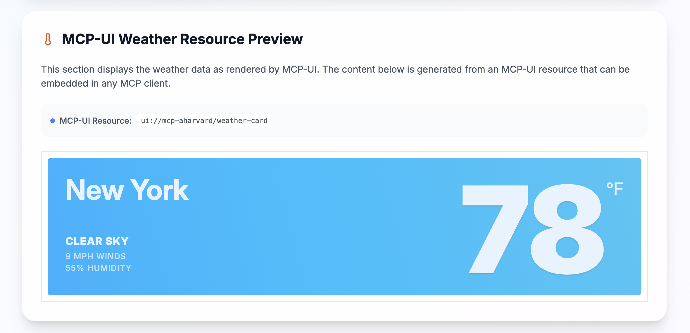

import Tabs from '@theme/Tabs';
import TabItem from '@theme/TabItem';
import YouTubeShortEmbed from '@site/src/components/YouTubeShortEmbed';
import CLIExtensionInstructions from '@site/src/components/CLIExtensionInstructions';



goose 最近发布了对 [MCP-UI](https://mcpui.dev/) 的支持，它允许 MCP 服务器向智能体建议并贡献用户界面元素。

:::warning
MCP-UI 仍然是一份[开放 RFC](https://github.com/modelcontextprotocol-community/working-groups/issues/35)，正在考虑纳入 MCP 规范。它目前可以工作，但随着提案推进可能会变化。
:::

MCP-UI 位于协议之上，但结果不再是 text/markdown，服务器可以返回客户端能够丰富渲染的内容（包括交互式 GUI 内容）。

<!-- truncate -->

智能体承担的许多日常活动都可以从图形表示中受益。有时这由智能体自己渲染 GUI 来完成（我知道我经常这么做），但这让它更内在于扩展，适用于与人进行图形交互最好的情况。它也自然地（因此有[与 Shopify 的联系](https://shopify.engineering/mcp-ui-breaking-the-text-wall)）很适合商业应用，因为你想看到产品！

值得花一分钟看看这个航空公司选座演示的 MCP 服务器，以感受这种能力：

  <video 
    controls 
    class="aspect-ratio"
    poster={require('@site/static/img/mcp-ui-shot.png').default}
    playsInline
  >
    <source src={require('@site/static/videos/mcp-ui.mov').default} type="video/mp4" />
    你的浏览器不支持 video 标签。
  </video>

本质上，MCP 服务器在建议 GUI 元素，供客户端（智能体）按它认为合适的方式渲染。

## 我如何使用它

从 goose v1.3.0 开始，你可以把 MCP-UI 添加为扩展。

:::tip 把 MCP-UI 添加到 goose
<Tabs groupId="interface">
  <TabItem value="ui" label="goose 桌面版" default>
  [启动安装器](goose://extension?type=streamable_http&url=https%3A%2F%2Fmcp-aharvard.netlify.app%2Fmcp&id=mcpuidemo&name=MCP-UI%20Demo&description=Demo%20MCP-UI-enabled%20extension)
  </TabItem>
  <TabItem value="cli" label="goose CLI">
  使用 `goose configure` 添加 `Remote Extension (Streaming HTTP)` 扩展类型，并设置：

  **端点 URL**
  ```
  https://mcp-aharvard.netlify.app/mcp
  ```
  </TabItem>
</Tabs>
:::


看看 Andrew Harvard 提供的 [MCP-UI 演示](https://mcp-aharvard.netlify.app/)。你也可以查看他的 GitHub 仓库，里面有[你可以起步的示例](https://github.com/aharvard/mcp_aharvard/tree/main/components)。

## MCP-UI 背后的技术

MCP-UI 的核心是一个 `UIResource` 接口：

```ts
interface UIResource {
  type: 'resource';
  resource: {
    uri: string;       // e.g., ui://component/id
    // highlight-next-line
    mimeType: 'text/html' | 'text/uri-list' | 'application/vnd.mcp-ui.remote-dom'; // text/html for HTML content, text/uri-list for URL content, application/vnd.mcp-ui.remote-dom for remote-dom content (JavaScript)
    text?: string;      // Inline HTML, external URL, or remote-dom script
    blob?: string;      // Base64-encoded HTML, URL, or remote-dom script
  };
}
```

`mimeType` 是动作发生的地方。它可以是 HTML 内容，例如（在最简单的情况下）。

这里发挥作用的另一项关键技术是 [Remote DOM](https://github.com/Shopify/remote-dom)，这是 Shopify 的一个开源项目。它让你从沙箱环境取出 DOM 元素，并在另一个环境中渲染它们，这对智能体相当有用。这也打开了一种可能性：智能体一侧可以按需要渲染小组件（也就是使用本地匹配的样式或设计语言）。


## 可能的未来

MCP-UI 仍处于早期，所以细节可能会变，但这正是现在试验它令人兴奋的一部分。

MCP-UI 将继续演进，并可能获得更多声明式方式，让 MCP-UI 服务器指定它们需要某种类型的表单或小组件，但不必指定确切的渲染。如果能指定这些组件，并让智能体漂亮地渲染它——无论是在桌面或移动客户端，甚至是命令行里的文本 UI——那该多好！

<head>
  <meta property="og:title" content="MCP UI：把浏览器带进智能体" />
  <meta property="og:type" content="article" />
  <meta property="og:url" content="https://goose-docs.ai/blog/2025/08/11/mcp-ui-post-browser-world" />
  <meta property="og:description" content="初步了解基于提议中的 MCP-UI 扩展、为智能体构建的 UI" />
  <meta property="og:image" content="https://goose-docs.ai/assets/images/mcp-ui-shot-1b80ebfab25d885a8ead1ca24bb6cf13.png" />
  <meta name="twitter:card" content="summary_large_image" />
  <meta property="twitter:domain" content="goose-docs.ai" />
  <meta name="twitter:title" content="MCP UI：把浏览器带进智能体" />
  <meta name="twitter:description" content="初步了解基于提议中的 MCP-UI 扩展、为智能体构建的 UI" />
  <meta name="twitter:image" content="https://goose-docs.ai/assets/images/mcp-ui-shot-1b80ebfab25d885a8ead1ca24bb6cf13.png" />
</head>
