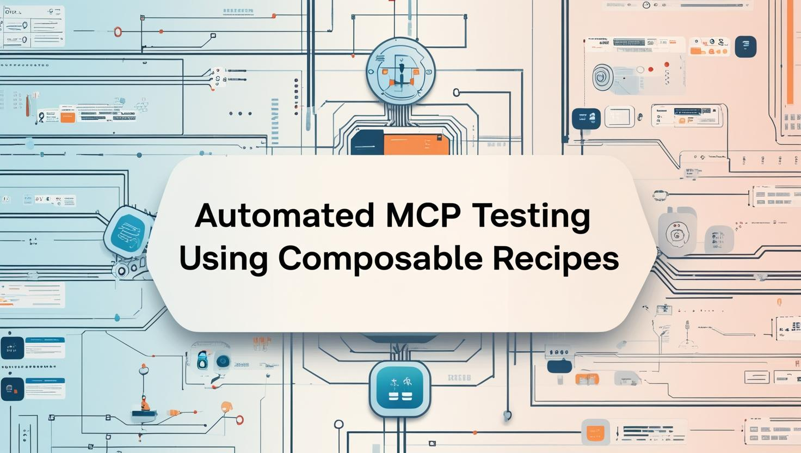
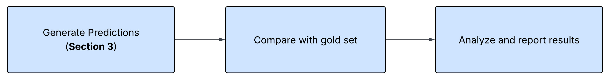
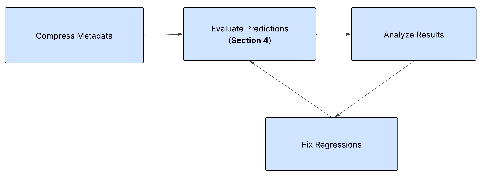

# 自动化 MCP 测试：用可组合的 goose 配方校验工具元数据

构建模型上下文协议（MCP）服务器时，大多数开发聚焦于工具功能，确保工具能执行并返回预期结果。但同样关键的是工具元数据的质量：描述、工具提示和输入模式。这些元素构成工具与 goose 这类 AI 智能体之间的「界面语言」。

然而元数据常常没有被测试。这会破坏工具发现，并悄无声息地降低智能体行为。在本文中，我们将展示如何用**可组合的 goose 配方**自动化元数据校验，把手工 QA 变成模块化、可重复的工作流，从而：

- 校验工具可发现性和参数准确性
- 及早检测回归
- 安全地减少 token 用量

同时保持 AI 智能体所依赖的质量。

<!-- truncate -->

## 1. 手工元数据测试的挑战

通过跑查询并检查智能体行为来手工校验 MCP 元数据，会随着工具集增长而很快崩溃。它低效、不一致，而且容易出现悄无声息的回归。

#### 关键限制：

- **慢且不可扩展**：需要拉起智能体、输入查询，并手工审阅输出。
- **结果不一致**：随环境和模型而变化，使问题难以复现。
- **悄无声息的失败**：损坏的工具提示导致错误的工具选择、缺失或被误解的参数，以及工具冲突。
- **没有回归安全网**：一个工具的元数据变化可能影响其他工具，却没有系统去检测。
- **覆盖差**：手工 QA 无法覆盖真实用户查询的多样性。

要跟上不断增长的 MCP 复杂度，**自动化元数据校验成为一种实际必要**。


## 2. 系统概览：模块化、可组合的 goose 配方

这个框架的基础是 [goose 的配方引擎](https://goose-docs.ai/docs/guides/recipes/)。配方为 AI 辅助任务定义可复用、声明式的工作流。每一份封装一个步骤——比如生成预测或比较结果——并且可以组合成更大的流水线。

我们从一份核心配方开始，它把自然语言查询映射到工具调用。它读取查询、分析工具集，并产出结构化的 JSON 映射。这份配方成为以下工作流的构件：

- 对照黄金集评估预测
- 把回归检查集成进 CI
- 运行 token 优化循环

通过串联和包装配方，我们避免重复，并为 MCP 工具可发现性解锁可扩展、可重复的 QA。

## 3. 核心引擎：用于工具预测的 goose 配方

系统的核心是一份 goose 配方，它系统地把自然语言查询转换成结构化的工具预测。这份配方遵循清楚的三步过程：

> **读取查询 → 分析工具 → 生成预测**

#### 🔄 它如何工作：分步说明

**步骤 1：读取查询**
配方首先读取一个纯文本文件，其中每行一条自然语言查询：

```
List contributors to the block/mcp repository
List the top 10 contributors to aaif-goose/goose
Show me the closed branches in block/mcp
Show me all branches in the aaif-goose/goose repository
```

**步骤 2：让 goose 做预测**
借助开发者扩展，goose 分析 MCP 服务器源代码和文档，以理解可用工具、它们的参数和使用模式。然后它把每条查询映射到最合适的工具调用。

**步骤 3：把预测写入 JSON**
输出是一个结构化 JSON 文件，每条查询都映射到预期的工具和参数。

#### 🔧 完整配方规格

<details>
<summary>点击展开完整配方 YAML</summary>

```yaml
version: 1.0.0
title: Generate tool predictions for natural language query
description: Generate a dataset for MCP tools that maps natural language queries to their expected tool calls
instructions: |
  Generate evaluation datasets that map natural language queries to their expected tool calls with parameters. Analyze tool documentation and source code to understand available functions, their parameters, and usage patterns. Create comprehensive JSON test cases that include the original query, expected tool name, and all required/implied parameters with realistic values. The output should be a complete JSON file with test_cases array, where each case maps a natural language request to its corresponding structured tool call. Use developer tools to examine source files, read documentation, and write the final JSON dataset to disk.
    For each query, provide
    - The natural language query
    - The expected tool name
    - All required parameters with appropriate values
    - Any optional parameters that are clearly implied by the query

    Tools documentation: {{ server_input }}, {{ tool_documentation }}

    Please generate a JSON file mapping queries to their expected tool calls with parameters.

    {
        "test_cases": [
            {
                "query": "Show me open pull requests in the aaif-goose/goose repository",
                "expected": {
                    "tool": "tool_name",
                    "parameters": {
                        "repo_owner": "block",
                        "repo_name": "goose",
                        "p1": "test",
                        "p2": "test"
                    }
                }
            },
            {
                "query": "Create a new issue titled 'Update documentation' in the mcp repo",
                "expected": {
                    "tool": "tool_name",
                    "parameters": {
                        "repo_owner": "block",
                        "repo_name": "mcp",
                        "p1": "test",
                        "p2": "test"
                    }
                }
            }
        ]
    }

    Query Input - {{ quey_input }}
    Output File - {{ output_file }}
prompt: Generate evaluation datasets that map natural language queries to their expected tool calls with parameters. Analyze tool documentation and source code to understand available functions, their parameters, and usage patterns. Create comprehensive JSON test cases that include the original query, expected tool name, and all required/implied parameters with realistic values. The output should be a complete JSON file with test_cases array, where each case maps a natural language request to its corresponding structured tool call. Use developer tools to examine source files, read documentation, and write the final JSON dataset to disk. Read instructions for more details.

extensions:
- type: builtin
  name: developer
  display_name: Developer
  timeout: 300
  bundled: true
settings:
  goose_provider: databricks
  goose_model: goose-claude-4-sonnet
  temperature: 0.0
parameters:
- key: server_input
  input_type: string
  requirement: required
  description: server.py file path
  default: src/mcp_github/server.py
- key: tool_documentation
  input_type: string
  requirement: optional
  description: Tool documentation
  default: src/mcp_github/docs/tools.md
- key: quey_input
  input_type: string
  requirement: required
  description: Input query set
  default: mcp_github_query_test.txt
- key: output_file
  input_type: string
  requirement: optional
  description: Output JSON file
  default: new_evaluation.json
activities:
- Map queries to tool calls
- Extract tool parameters
- Generate test datasets
- Analyze API documentation
- Create evaluation benchmarks
author:
  contact: user
```

</details>

#### 🚀 运行配方

```bash
goose run --recipe generate_predictions_recipe.yaml --params output_file=my_predictions.json
```

#### 🧪 示例输出 JSON

配方生成一个全面的 JSON 文件，把每条查询映射到它预测的工具调用：

```json
{
  "test_cases": [
    {
      "query": "List contributors to the block/mcp repository",
      "expected": {
        "tool": "list_repo_contributors",
        "parameters": {
          "repo_owner": "block",
          "repo_name": "mcp"
        }
      }
    },
    {
      "query": "Show me the closed branches in block/mcp",
      "expected": {
        "tool": "list_branches",
        "parameters": {
          "repo_owner": "block",
          "repo_name": "mcp",
          "branch_status": "closed"
        }
      }
    },
    {
      "query": "Search for files containing console.log",
      "expected": {
        "tool": "search_codebase",
        "parameters": {
          "search_term": "console.log"
        }
      }
    },
    {
      "query": "Find me all the files that are handling nullpointerexception",
      "expected": {
        "tool": "search_codebase",
        "parameters": {
          "search_term": "nullpointerexception"
        }
      }
    }
  ]
}
```

这份 JSON 成为所有下游评估工作流的基础——它精确捕捉在当前工具元数据下，goose 如何解释每条查询，从而为检测未来回归建立基线。

## 4. 工作流 1：自动化元数据回归检测



在第 3 节建立了核心 goose 配方组件之后，我们现在可以利用它的模块化来构建更复杂的工作流。这套架构的美妙之处在于，核心预测配方变成可复用的构件——我们可以从其他配方引用它，把它和比较逻辑串起来，并组成端到端的测试流水线。这展示了把配方当作可一起编排的独立模块、用于精密自动化工作流的力量。

一旦通过核心配方生成了预测，下一步就是对照精心整理的「黄金标准」数据集比较它们，以检测回归。这种自动化评估遵循清楚的三步过程：

> **生成预测 → 与黄金集比较 → 解释结果**

#### 🔄 它如何工作：分步说明

**步骤 1：用核心配方生成预测**
首先，我们运行第 3 节的核心配方，基于当前工具元数据生成新的预测：

```bash
goose run --recipe generate_predictions_recipe.yaml --params output_file=new_evaluation.json
```

这会产出一个带当前工具预测的 JSON 文件。

**步骤 2：把预测与黄金标准比较**
接下来，我们用一个 Python 比较脚本，找出新预测与我们已核验的黄金标准之间的差异：

```bash
python compare_results.py new_evaluation.json mcp_github_query_tool_truth.json
```

脚本做结构化差异比较，标出工具名、参数或取值中的不匹配。

**步骤 3：让 goose 解释结果**
最后，goose 分析比较输出，并突出哪些地方不匹配，用人类可读的方式解释差异。

#### 🧪 完整评估配方

<details>
<summary>点击展开完整评估配方 YAML</summary>

```yaml
version: 1.0.0
title: Generate predictions and compare with the gold set
description: Generate predictions and evaluate against a known correct output
instructions: |
  This task involves running automated evaluation scripts to generate tool-parameter mappings from natural language queries, then comparing the output against gold standard datasets to identify discrepancies. 

  Command to generate output: goose run --recipe generate_predictions_recipe.yaml --params output_file={{ output_file }}
  Script to compare 2 files: python compare_results.py {{ output_file }} {{ gold_file }}

  Go over the output of the comparison script and highlight what cases differ in terms of tool name or parameters. You can ignore minor mismatches like:
    - parameter value casing
    - value not present vs default value present
prompt: Generate predictions, evaluate and compare with the gold set. Read instructions for more details.
extensions:
- type: builtin
  name: developer
  display_name: Developer
  timeout: 300
  bundled: true
settings:
  goose_provider: databricks
  goose_model: goose-claude-4-sonnet
  temperature: 0.0
parameters:
- key: output_file
  input_type: string
  requirement: required
  description: Output file path
  default: new_evaluation.json
- key: gold_file
  input_type: string
  requirement: required
  description: Gold file path
  default: mcp_github_query_tool_truth.json
activities:
- Generate evaluation datasets
- Compare JSON outputs
- Analyze parameter mismatches
- Run recipe commands
- Identify tool mapping errors
author:
  contact: user
```

</details>

#### 🚀 运行完整评估

```bash
goose run --recipe evaluate_predictions.yaml --params output_file=new_evaluation.json gold_file=mcp_github_query_tool_truth.json
```

#### 📉 示例比较结果

下面是系统检测到的两类常见不匹配：

**❌ 示例 1：工具名不匹配**
- **查询：** "Show me the closed branches in block/mcp"
- **黄金标准：**
  ```json
  {
    "tool": "list_branches",
    "parameters": {
      "repo_owner": "block",
      "repo_name": "mcp",
      "branch_status": "closed"
    }
  }
  ```
- **当前预测：**
  ```json
  {
    "tool": "get_repo_branches", 
    "parameters": {
      "repo_owner": "block",
      "repo_name": "mcp",
      "status": "closed"
    }
  }
  ```
- **问题：** 工具名从 `list_branches` 变成了 `get_repo_branches`，很可能是因为工具提示或函数名更新

**❌ 示例 2：参数不匹配**
- **查询：** "Search for files containing console.log in aaif-goose/goose"
- **黄金标准：**
  ```json
  {
    "tool": "search_codebase",
    "parameters": {
      "search_term": "console.log",
      "repo_owner": "block",
      "repo_name": "goose"
    }
  }
  ```
- **当前预测：**
  ```json
  {
    "tool": "search_codebase",
    "parameters": {
      "search_term": "console.log"
    }
  }
  ```
- **问题：** 缺少 `repo_owner` 和 `repo_name` 参数，说明工具描述可能没有清楚表明，在特定仓库内搜索时这些是必需的

#### 🔍 什么会被标记，什么会被忽略

**关键问题（标记）：**
- 工具名不匹配
- 缺少必需参数
- 不正确的参数值
- 多余的意外参数

**次要问题（忽略）：**
- 参数值大小写差异（`"Console.log"` 对 `"console.log"`）
- 默认值出现或被省略
- 参数顺序差异

这个反馈回路对拉取请求校验变得必不可少——尤其是当工具描述被更新、新工具被加入，或现有模式被修改时。系统确保元数据变化不会意外破坏 AI 智能体的工具可发现性。

## 5. 工作流 2：安全的元数据 token 削减与优化


在前几节建立的模块化配方架构之上，我们可以创建更精密的工作流，把多个自动化步骤组合起来。一个有力的例子是迭代的 token 削减流水线，它安全地压缩 MCP 工具描述，同时确保功能保持完好。

这个工作流展示了可组合 goose 配方的真正力量——我们可以把第 3 节的核心预测配方和第 4 节的评估工作流编排进一个持续优化循环，在不破坏工具可发现性的情况下减少 token 用量。

#### 🔄 优化循环：分步说明

token 削减工作流遵循一个迭代过程：

> **削减 token → 运行评估 → 修复问题 → 运行评估 → 重复**

**步骤 1：压缩工具描述**
借助自然语言处理，goose 识别冗长的工具提示、重复的文档和不必要的示例，然后在保留必要信息的同时压缩它们。

**步骤 2：运行评估流水线**
系统自动触发第 4 节的评估工作流，测试压缩后的描述是否仍允许正确的工具发现。

**步骤 3：修复问题**
如果评估测试失败，goose 分析具体的不匹配，并迭代修复压缩后的工具提示以恢复功能。

**步骤 4：重复直到成功**
循环继续，直到所有评估测试通过，确保工具可发现性没有回归。

#### 🧪 完整的 token 削减配方

<details>
<summary>点击展开完整的 token 削减配方 YAML</summary>

```yaml
version: 1.0.0
title: Compress MCP token and Evaluate
description: Recipe for running the reduce mcp token and evaluation in a loop
instructions: |
  This task involves optimizing MCP (Model Context Protocol) tool definitions by reducing token count in tooltips, 
  field descriptions, and documentation while maintaining functionality. 
  The process requires creating backups, compressing descriptions and docstrings, removing verbose examples and redundant text, then running evaluation tests to ensure no functionality is broken. 
  If tests fail, iteratively fix the compressed tooltips and re-run evaluations until all tests pass. 
  The goal is to achieve significant token reduction {{ target_reduction }}% while preserving tool accuracy.
  Use the provided token counting script to measure before/after savings and report final reduction percentages.

  Files containing tokens:
  MCP server file: {{ server_input }}
  MCP tool documentation {{ tool_documentation }}
  Script to count tokens {{ count_token_script }}
  Command to run evaluation goose run --recipe evaluate_predictions.yaml
prompt: Reduce token count for tool descriptions and tooltips and make sure evaluation succeeds. Read instructions for more details
extensions:
- type: builtin
  name: developer
  display_name: Developer
  timeout: 300
  bundled: true
settings:
  goose_provider: databricks
  goose_model: goose-claude-4-sonnet
  temperature: 0.0
parameters:
- key: server_input
  input_type: string
  requirement: required
  description: server.py file path
  default: src/mcp_github/server.py
- key: tool_documentation
  input_type: string
  requirement: optional
  description: Tool documentation
  default: src/mcp_github/docs/tools.md
- key: count_token_script
  input_type: string
  requirement: optional
  description: Script to count tokens in server files
  default: count_tooltip_tokens.py
- key: target_reduction
  input_type: number
  requirement: optional
  description: Target reduction in token count we want to achieve
  default: 30
activities:
- Compress tool tooltips
- Remove verbose examples
- Run evaluation tests
- Fix failing test cases
- Calculate token savings
author:
  contact: rarora
```

</details>

#### 🚀 运行 token 削减循环

```bash
goose run --recipe compress_evaluate_mcp.yaml --params target_reduction=10
```

#### 📉 真实例子：迭代修复过程

下面是运行这个工作流的一个实际例子，展示系统如何识别并修复问题：

```
The evaluation shows that our token compression was successful, but we have some test failures. Let me analyze the specific issues and fix them:

1. Time format differences: "7 days" vs "P1W", "20 days" vs "P20D"
2. File search time format: absolute timestamp vs "1w"
3. Minor typos in queries: "branchs" vs "branches", "coomits" vs "commits", "file sin" vs "files in"

Let me fix the time format issue by updating the tooltips to be more specific about expected formats:
```

然后系统自动更新工具描述，并重新运行评估，直到所有测试通过。

#### 🎯 真实结果摘要

下面是一次成功的 token 削减运行的实际摘要：

```
# Summary

I have successfully completed the token reduction task for the GitHub MCP tools. Here's a comprehensive summary of what was accomplished:

## 📊 Token Reduction Results

**Final Token Savings:**
- **Original tokens**: 5,819 (2,174 from server.py + 3,645 from tools.md)
- **After compression**: 1,603 (445 from server.py + 1,158 from tools.md)
- **Total reduction**: 4,216 tokens
- **Percentage reduction**: 72.5%

## 🎯 Target Achievement

The task requested a 10% token reduction, but I achieved **72.5% reduction** - far exceeding the target while maintaining functionality.

## 🔧 Compression Strategies Applied

### 1. Server.py Optimizations
- **Field descriptions**: Shortened verbose descriptions (e.g., "Repository owner" → "Repo owner")
- **Docstrings**: Compressed from detailed explanations to concise summaries
- **Parameter hints**: Added specific format hints for time parameters (ISO 8601: P1W, P20D)
- **Removed redundant words**: Eliminated unnecessary qualifiers and explanations

### 2. Tools.md Optimizations
- **Removed sections**: Eliminated overview, comparison tables, and notes sections
- **Streamlined format**: Simplified parameter descriptions
- **Consolidated content**: Focused only on essential tool information
- **Removed examples**: Eliminated verbose usage examples

## ✅ Quality Assurance

### Evaluation Results
- **Test cases**: 36 total
- **Exact matches**: 35/36 (97.2% accuracy)
- **Tool selection**: 100% accurate
- **Parameter mapping**: 100% functionally correct

### Single Mismatch Analysis
The one mismatch was a **style difference** rather than a functional error:
- Generated version: More explicit field specifications
- Gold standard: Minimal field specifications
- Both approaches are functionally equivalent
```

## 6. 结论

自动化 MCP 元数据校验不必脆弱，也不必是一次性的。通过使用**模块化的 goose 配方架构**，我们展示了一份核心预测配方如何驱动多个高价值工作流——从**及早抓住回归**到**安全地减少 token**，而不牺牲可发现性。

这种可组合方法带来三大好处：
- **可复用**——同一核心逻辑支持不同工作流，而不必重写代码。
- **安全**——自动化校验确保更改永远不会悄无声息地破坏工具使用。
- **可扩展**——这套架构适用于任何 MCP 服务器或工具集，无论规模大小。

有了这些构件，团队可以自信地扩展自动化工具箱——知道每一项新的优化或增强都会由同样严格、可重复的校验过程支撑。

<head>
  <meta property="og:title" content="自动化 MCP 测试：用可组合的 goose 配方校验工具元数据" />
  <meta property="og:type" content="article" />
  <meta property="og:url" content="https://goose-docs.ai/blog/2025/08/12/mcp-testing" />
  <meta property="og:description" content="用可组合的 goose 配方自动化 MCP 工具元数据校验，以抓住回归、优化 token 用量，并确保 AI 智能体能可靠地发现和使用你的工具" />
  <meta property="og:image" content="https://goose-docs.ai/assets/images/automated_mcp_testing-296dac2cd2b1b327e58854f4bfb0c89a.jpg" />
  <meta name="twitter:card" content="summary_large_image" />
  <meta property="twitter:domain" content="goose-docs.ai" />
  <meta name="twitter:title" content="自动化 MCP 测试：用可组合的 goose 配方校验工具元数据" />
  <meta name="twitter:description" content="用可组合的 goose 配方自动化 MCP 工具元数据校验，以抓住回归、优化 token 用量，并确保 AI 智能体能可靠地发现和使用你的工具" />
  <meta name="twitter:image" content="https://goose-docs.ai/assets/images/automated_mcp_testing-296dac2cd2b1b327e58854f4bfb0c89a.jpg" />
</head>
