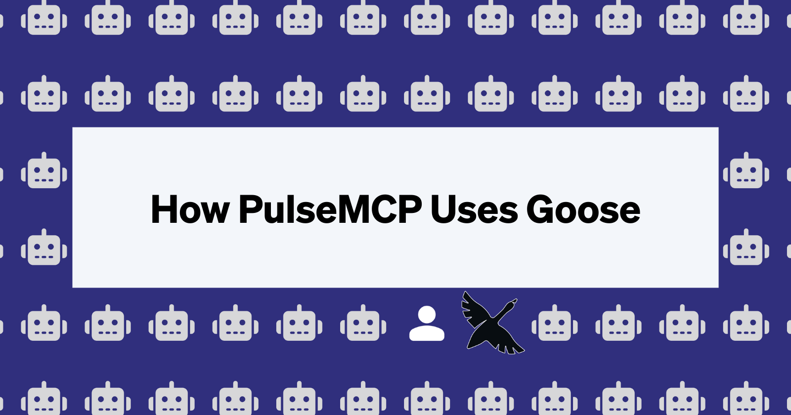

*「最好的 AI 智能体工作流超越演示。它们带来真实的生产力。」*

Block 的 DevRel 团队是 [PulseMCP](https://pulsemcp.com) 的忠实读者。他们的每周通讯一直是我们发现热门 MCP 服务器、跟上生态变化的绝佳方式。当 PulseMCP 的创作者 Mike 和 Tadas 分享他们用 goose [自动化通讯工作流中乏味部分](https://www.pulsemcp.com/building-agents-with-goose)的目标时，我们很期待看到他们会做出什么。

他们的实现恰好说明了我们为什么这样设计 goose 的功能集，而且他们记录了整个过程，帮助其他人从他们的经验中学习。

<!-- truncate -->

## 挑战

每周，PulseMCP 团队都面对同样耗时的工作流：从多个平台搜集相关新闻，整理并去除重复，起草有吸引力的叙述，打磨质量和准确性，在多个渠道发布，以及管理邮件分发。这个重复的工作流看起来非常适合 AI 自动化，但又复杂到大多数尝试都会失败。

## 解决方案：为什么顺序拆分胜过单体

他们没有构建一个庞大的「什么都做」智能体（这在复杂任务上必然失败），而是把工作流拆成六个不同阶段。每个阶段由聚焦的[配方](/docs/guides/recipes/session-recipes)、[子配方](/docs/guides/recipes/subrecipes)和[子智能体](/docs/guides/context-engineering/subagents)处理，输入、输出清晰，只做一件事。

这种方式有三个主要好处：智能体职责单一时调试更容易；阶段之间交接清晰，结果更可预测；人类保持对编辑过程的控制，同时自动化乏味的工作。

## 六智能体流水线

### **1. 搜集智能体**
通过 MCP 集成自动扫描 GitHub、Reddit 和 HackerNews 上的相关内容，同时人类在一周中挑选最有趣的发现。

### **2. 整理智能体**
去除重复、给条目分类并补充上下文，把原始链接变成有组织的内容。

### **3. 起草智能体**
把统计数据和上下文合并进人类撰写的叙述，处理乏味的数据组装，同时保留编辑的声音。

### **4. 打磨智能体**
处理错别字检查、链接验证和一致性审阅，否则这些会占用数小时的人类注意力。

### **5. 发布智能体**
管理技术发布：HTML 格式化、CMS 上传，以及通过 MCP 服务器部署内容。

### **6. 发送智能体**
处理邮件活动设置、预览生成和分发排期。

## 帮助人类，而不是取代他们

真正值得注意的不只是 PulseMCP 自动化了通讯，而是他们如何在去掉乏味工作的同时保留人类创造力。人类仍然做编辑决策、撰写叙述并保持创意控制，智能体则处理消耗人类精力的重复任务。

结果是一个既更高效、质量也更高的工作流。智能体检查链接或格式化内容时从不会疲倦，从而把人类解放出来，专注于战略思考和创造性叙事。

## 未来的一瞥

PulseMCP 团队设想智能体「替你构建这些配方」。想象用自然语言描述你的工作流，然后让 AI 自动生成智能体架构和集成点。

我们已经看到这种能力的苗头。Tadas 用这样的提示演示了这一点：

> 「嘿 goose：我有这些很难读的 AI 智能体日志文件。你能给我做一个简单的 Web 服务器，带一个漂亮的 UI，让我能作为人类解析这些日志吗？」*

这指向一个未来：AI 处理机制，人类专注于策略、创造力和判断。

## 蓝图已经公开

PulseMCP 团队把一切记录在一份 95 页的综合手册里，既是灵感也是实现指南。他们的工作证明，成功部署 AI 智能体不是要取代人类或构建复杂的 AI 系统，而是要有经过思考的工作流设计、清晰的边界和实用的模式。

**[阅读完整的 PulseMCP 手册：《A Human, A Goose, and Some Agents》](https://www.pulsemcp.com/building-agents-with-goose)**

他们详细的案例研究包括完整的智能体架构、实际的 YAML 配方文件、生产部署经验，以及构建你自己的智能体的实用速查表。

## 接下来呢？

PulseMCP 的实现证明，我们已经走过了 AI 智能体的演示阶段。真实的生产力提升正在发生，就在生产工作流里，通过经过思考的人机协作。掌握这些模式的组织将拥有显著优势。

---

*想构建自己的 AI 智能体工作流？[开始使用 goose](https://goose-docs.ai/)，加入正在构建人机协作未来的开发者社区。*

<head>
  <meta property="og:title" content="PulseMCP 如何用 goose 自动化他们的通讯工作流" />
  <meta property="og:type" content="article" />
  <meta property="og:url" content="https://goose-docs.ai/blog/2025/08/13/pulse-mcp-automates-recipe" />
  <meta property="og:description" content="PulseMCP 使用 goose 配方、子智能体和子配方，自动化通讯工作流中乏味的部分" />
  <meta property="og:image" content="https://goose-docs.ai/assets/images/pulsemcp-65abe93bd65402c122b395ae6bdadf95.png" />
  <meta name="twitter:card" content="summary_large_image" />
  <meta property="twitter:domain" content="goose-docs.ai" />
  <meta name="twitter:title" content="PulseMCP 如何用 goose 自动化他们的通讯工作流" />
  <meta name="twitter:description" content="PulseMCP 使用 goose 配方、子智能体和子配方，自动化通讯工作流中乏味的部分" />
  <meta name="twitter:image" content="https://goose-docs.ai/assets/images/pulsemcp-65abe93bd65402c122b395ae6bdadf95.png" />
</head>
