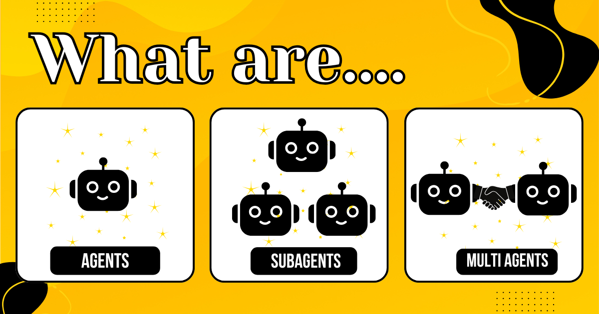

我在[加州大学伯克利分校教了一场 vibe coding 工作坊](/blog/2025/08/10/vibe-coding-with-goose-building-apps-with-ai-agents)，并告诉学生我们会启动 7 个子智能体。有人立刻举手问：「什么是子智能体？」那一刻我意识到，我们一直在抛出**智能体**、**多智能体**和**子智能体**这些词，却没有真正花时间解释它们是什么。所以，下面是一份入门说明，拆解这些协作模式以及何时使用它们。

<!-- truncate -->

:::tip 一句话
- **智能体**——一个自主行动者，接过你的目标，从头到尾自己完成

- **子智能体**——一种设置：主智能体充当编排者，把工作委派给它控制的其他智能体。主智能体拥有流程、顺序和协调。

- **多智能体**——两个或更多主智能体，各自独立行动，但可以协作、协商或交换结果。没有单一智能体是「老板」。
:::

这些词听起来很花哨，但归根结底，它们只是用 AI 把事情做完的不同方式。有点像决定你是想独自工作、结对编程，还是带领一个小队。

**我用一个简单的新功能来说明：给我们公司的 Web 应用加上深色模式。**

## 智能体：独行英雄模式

你把任务交给一个 AI 智能体，比如 [goose](/)。这个智能体是自主行动者，本质上是你的一人军队。

你告诉智能体：「给应用加上深色模式。」它阅读仓库，更新 CSS 和主题，运行测试，并打开一个 PR。它从头到尾处理整件事。没有队友，没有交接。

如果智能体在某一步搞砸了（比如说，忘了更新设置菜单里的开关），它必须自己回头修好。

想想一个独自啃工单的开发者。

## 子智能体设置：带着小队的编排者

使用[子智能体](/docs/guides/context-engineering/subagents)时，你仍然有一个「主」智能体，但它不再事事亲为，而是扮演技术负责人，把工作拆给其他专门的智能体。

主智能体说：

- _「设计师智能体，创建深色模式调色板。」_
- _「前端智能体，把它应用到所有 UI 组件。」_
- _「QA 智能体，运行视觉回归测试。」_

这些子智能体可以并行工作（例如设计师做调色板时，前端在更新样式），也可以顺序工作（例如前端等到设计师完成）。

主智能体让一切保持在轨道上，收集结果，并把它们缝合在一起。

可以把这想成技术负责人把功能拆成子任务、分配出去，再合并工作成果。

## 多智能体场景：两个主脑互相商量

在多智能体中，没有单一编排者。你有多个主智能体互相交谈，每个都有自己的目标或视角。

对于我们的深色模式功能，想象：

- 开发智能体了解代码库，可以实现 UI 变更。
- UX 研究智能体了解用户如何与主题交互，以及需要考虑哪些无障碍需求。

它们一起工作。UX 智能体解释最佳实践、边界情况和用户痛点，开发智能体实现并回头征求反馈。它们甚至可能跑在不同系统上，比如你的开发智能体调用托管在别处的外部设计智能体。

值得注意的是，多智能体设置不一定在做完全相同的任务。有时它们只是在同一环境中运行，当工作重叠时再协作。

可以把这想成两个同伴在 Slack 上商量，直到做出扎实的东西。

## 何时用哪一种

- **智能体**：你信任一个 AI 独自负责的小型、自包含任务
- **子智能体**：适合分而治之、并需要监督的复杂任务
- **多智能体**：需要多个头脑或视角来协商和协作

这些设置只是组织工作的不同方式，无论是人的工作还是 AI 的工作。诀窍是选出能让你在速度和准确度之间取得最佳平衡的结构。

<head>
  <meta property="og:title" content="智能体、子智能体和多智能体：它们是什么，何时使用" />
  <meta property="og:type" content="article" />
  <meta property="og:url" content="https://goose-docs.ai/blog/2025/08/14/agent-coordination-patterns" />
  <meta property="og:description" content="直白解释智能体如何组织起来一起工作" />
  <meta property="og:image" content="https://goose-docs.ai/assets/images/agent-coordination-52282acab8107e9503b17e471465ffa5.png" />
  <meta name="twitter:card" content="summary_large_image" />
  <meta property="twitter:domain" content="goose-docs.ai" />
  <meta name="twitter:title" content="智能体、子智能体和多智能体：它们是什么，何时使用" />
  <meta name="twitter:description" content="直白解释智能体如何组织起来一起工作" />
  <meta name="twitter:image" content="https://goose-docs.ai/assets/images/agent-coordination-52282acab8107e9503b17e471465ffa5.png" />
</head>
