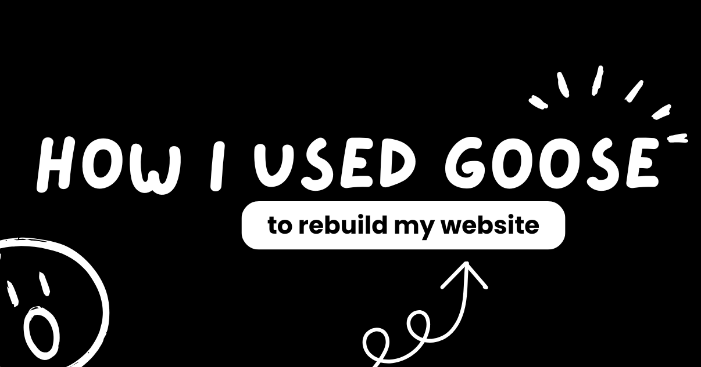
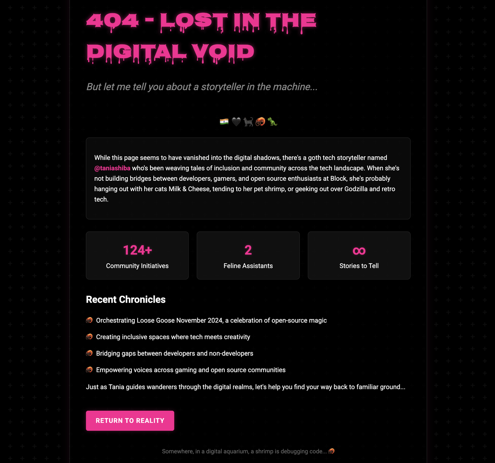

对我来说，网站是互联网上属于我的一角：我可以做自己、分享作品，最终也是一个我可以随心所欲的地方。如果它不能体现我的个性，尤其我曾经是个书呆气的博客设计师（中学和高中那会儿），那就太可惜了！直到突然，一个原本无害的「404 日」挑战，很快变成几乎没花时间就把那个网站做了出来。

<!-- truncate -->

## 回到我的原点

我说自己曾经给别人做书呆气的博客，意思是我深陷在 HTML 和 CSS 里。那是一种爱好：我在网上为和我一样的书呆子做高度定制的网站。所以今天拥有一个基本上就是 :poopemoji: 化身的网站，真的让我难受。没有个性，没有自己的风格，只是一个极简的通用布局，我每月付订阅费，只为避免彻底尴尬。从那以后至少过了十年，我完全没有心情坐下来重新学习那些零件，从零搭一个网站结构。草稿里该有的都有了，只缺结构。

## 引发一切的 404 挑战

然后出现了这条[在 404 日的简单提示](https://www.linkedin.com/posts/block-opensource_happy-404-day-we-used-goose-to-generate-activity-7313972103613939713-GF1T/)。那篇帖子是关于用 goose 创建你自己的 404 页面，goose 会根据你的资料给你一个定制页面。原始提示大致是这样：

> 创建一个 404 页面，用 GitHub 用户 @taniashiba 的公开 GitHub 数据讲一个有创意的故事——提交历史、贡献图、仓库，或任何你能访问的其他内容。

我拿了这条提示，稍微改了一下。我的个人 GitHub 资料和贡献很好，但我也想确保 goose 参考我的 LinkedIn、Instagram 和其他社交渠道，好好把握我是谁。

> 你也可以参考 Tania 的 Bluesky/Instagram/TikTok/Twitter 账号（用户名 @taniashiba）以及她的 LinkedIn，获取关于她的更多信息。

很快就活了：一个机智的 404 页面，风格上相当反映我是谁、我喜欢什么。它甚至插入了我以前在社交帖子里讲过的一个虾的笑话。我甚至没告诉 goose 我喜欢的配色，它却做出了能跟我说话的东西。这点燃了一点明亮的灵感。于是我问 goose：

> 你能记住你做了这个吗？我希望你用完全一样的风格，为 taniachakraborty.com 做一个网站。

## 实现

goose 在帮我解决一个感觉由来已久的问题，而且做得非常简单。我把网站给了 goose，告诉它托管在 Neocities 上，它就开始干活。在用 404 页面的风格做出常规页面之后，实现很容易：

1. **上传** goose 做出的文件到 Neocities
2. **审阅**站点，并让 goose 编辑或创建我需要的任何页面
3. **写内容**来填满网站的不同页面（我最喜欢的部分）

然后，砰，我的网站完成了。不必从脑子里翻出古老记忆来重新学 CSS，不必调试我凌晨 2 点觉得很酷的响应式悬停效果引起的问题，完全没有麻烦。goose 处理了一切。它从一个简单结构开始，使用它在 404 日挑战中想出的风格，并在对话中按我的要求修改。我的网站从尴尬地空着，变成设计出色、几分钟内就容易编辑。

## 永远使用 Git

说实话感觉像在玩电子游戏，因为我能在本地预览里实时看到变化，并且可以用 git 在过程中保存进度。goose 甚至建议我把 dev.to 上的博客文章加进来，并为我创建了一个简单模板。如果有什么没有按预期显示？我们就一起排查：我把看到的截图发给它，goose 直接修好。

## 真的节省大量时间

原本可能要花我一周到一个月来构建的东西，瞬间就完成了。你不必为了现在就需要的东西去学习或重新学习一项技能，可以跟着 goose 边做边学。整个经历提醒我，当初为什么爱上为别人设计网站：你真的是从无到有创造东西！

所以如果你坐在那里，有一个光秃秃、需要帮助的网站，或者你一直推迟一个项目，因为技术部分感觉像一场压倒性的噩梦，也许是时候和 goose 这样有用的工具开始一段对话了。谁知道呢？也许你最终会得到一个自己的数字水族馆网站，页脚里藏着关于调试的虾笑话。🦐

---

*想看最终结果？看看我的作品集 [taniachakraborty.com](https://taniachakraborty.com)。告诉我你找到了多少个虾笑话。*

---

<head>
  <meta property="og:title" content="goose 如何帮我重建网站" />
  <meta property="og:type" content="article" />
  <meta property="og:url" content="https://goose-docs.ai/blog/2025/08/14/how-goose-rebuilt-my-website" />
  <meta property="og:description" content="一条简单的提示如何把空白网站变成个人作品集" />
  <meta property="og:image" content="https://goose-docs.ai/assets/images/blog_banner-656bd5e1014edfbcd313a9f799f9e9a5.png" />
  <meta name="twitter:card" content="summary_large_image" />
  <meta property="twitter:domain" content="goose-docs.ai" />
  <meta name="twitter:title" content="goose 如何帮我重建网站" />
  <meta name="twitter:description" content="一条简单的提示如何把空白网站变成个人作品集" />
  <meta name="twitter:image" content="https://goose-docs.ai/assets/images/blog_banner-656bd5e1014edfbcd313a9f799f9e9a5.png" />
</head>
