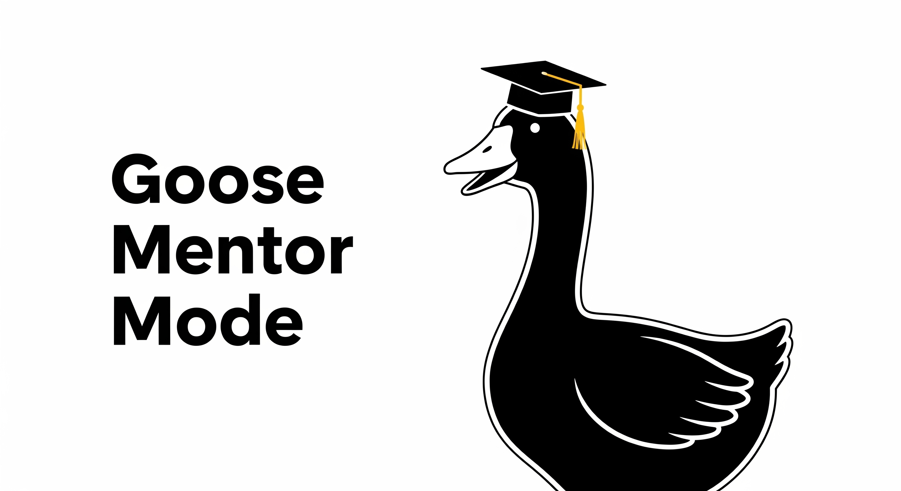

Kim 刚从学院出来，只花了 18 个月学习开发。当我问她对 goose 的感觉时，她的反应是混合的。虽然她觉得它能为她做这么多很酷，但她一半时间其实不确定它*在*为她做什么，以及*为什么*。当她让 goose 修复一个坏掉的构建，或追查一个 bug 时，它会完成任务并声称「成功！」。这很好，但她觉得自己学到的没有在学院时那么多。再加上有时她甚至不知道*该*让 goose 做什么。

那天下午我开始看，能否让 goose 对我的初级开发者不只是一个「魔法盒子」。如果 goose 能充当导师，在加快开发的同时也教学呢？

<!-- truncate -->

# **把 AI 协助从自动化变成教育：goose Mentor 模式背后的故事**

作为企业领域的工程经理，我的团队大约有 16 名开发者。和现在行业里很多人一样，我一直在看 AI 能放进我们流程的哪里，以及它能提供什么效率。今年 7 月我开始用 goose，很快看到它对我自己和团队的巨大潜力。兴奋于可能发生的事，我很快给所有开发者开通访问，给他们接上几个不同的模型，然后让他们玩了几周。

我的团队里开发者经验范围很广。从技术负责人，一直到刚毕业的新人。高级工程师和技术负责人惊叹于他们现在推进工作的速度。我的中级开发者也惊讶于他们调试坏掉的构建有多快。直到我和一位初级毕业生的定期一对一，我才听到不同的东西。

## **问题：做事而不是教学的 AI**

传统 AI 编程助手基于一个简单前提：用户提问，AI 交付。虽然这最大化了即时生产力，它制造了几个长期问题：

* **依赖形成**：开发者变得依赖 AI 来解决他们本应理解的问题
* **失去学习机会**：每个请求都可以是建立知识的机会，但反而只变成任务完成
* **一刀切**：在学习认证的初级开发者和在截止日期压力下实现它的高级开发者之间没有区分
* **上下文盲目**：无论是有 6 个月还是 6 年经验的人问「我如何实现 JWT？」，AI 都一样对待

## **愿景：goose Mentor 模式**

goose Mentor 模式背后的使命简单但有变革性：**把 AI 协助从自动化变成教育，同时保持开发者需要的效率**。

核心哲学围绕四个原则：

1. **发现优于交付**：帮助用户理解*为什么*，不只是*怎么做*
2. **自适应学习**：根据经验和上下文调整方法
3. **渐进复杂度**：一层一层建立理解
4. **关注留存**：强调能留下来的学习

## **当前功能：概念验证**

我设想系统运作的核心，是配置一些基本的协助级别：

### **🎯 四个自适应协助级别**

把协助模式想成一个旋钮，可以在学习速度和交付速度之间平衡。

**GUIDED 模式**——通过发现进行深度学习

* 使用苏格拉底式提问引导用户走向解决方案
* 非常适合新概念和技能建设
* *例子*：「你觉得 JWT 代表什么？无状态认证可能如何工作？」

**EXPLAINED 模式**——带实现的教育

* 在可运行代码旁边提供详细解释
* 适合有学习价值的时间敏感任务
* *例子*：「JWT 是这样工作的……［详细解释］＋可运行代码」

**ASSISTED 模式**——带学习上下文的快速帮助

* 带教育洞察的直接协助
* 最适合需要快速帮助的有经验开发者
* *例子*：「用这个 JWT 库。关键安全考虑：［简短要点］」

**AUTOMATED 模式**——高效完成任务

* 没有教育开销的直接解决方案
* 用于生产压力和重复任务
* *例子*：「这是完整的 JWT 实现。」

###

### **🧠 学习检测**

现在系统处于概念验证阶段，所以我只用关键词检查做学习检测。我在试验语义分析，看能否「智能地」做这件事，但那可能证明是过度，甚至让系统膨胀变慢。

* **19 个技术概念**，跨越 7 个类别（安全、数据库、API、架构、测试、性能、DevOps）
* **6 个意图类别**，用于理解请求类型（帮助请求、学习询问、调试等）
* **上下文感知分析**，区分「认证错误」和「认证最佳实践」

### **📊 全面的进度跟踪**

理想情况下，我可以为每个用户做长期运行的进度跟踪，随时间跟踪。现在这个跟踪是基本的，只基于当前正在「教」的概念。
完全实现的解决方案的一些功能可能包括：

* 跨概念的学习速度跟踪
* 基于请求模式的技能差距识别
* 个性化学习路径推荐
* 随时间的知识留存分析

### **⚙️ 以开发者为中心的配置**

通过环境变量轻松设置，与 goose 桌面版无缝集成：

```bash
DEFAULT_ASSISTANCE_LEVEL=guided          # Customize default behavior
LEARNING_PHASE=skill_building           # Set learning context
TIMELINE_PRESSURE=low                   # Adjust for project pressure
ENABLE_VALIDATION_CHECKPOINTS=true     # Control learning validation
DEVELOPER_EXPERIENCE_MONTHS=6           # Personalize experience
```

##

## **未来功能：前方的路线图**

这只是概念验证，扩展还非常早期。我目前有几个初级开发者在测试并提供反馈。下面是我在 goose 帮助下整理的想法清单，关于未来路线图可能是什么样子。

### **阶段 1：增强智能（进行中）**

* **多信号学习检测**：结合语义分析、意图分类和行为模式
* **自适应阈值**：基于用户反馈的自调节置信度评分
* **上下文感知指导**：把用户资料、项目压力和学习阶段纳入决策引擎

### **阶段 2：外部学习集成**

* **上下文文档链接**：自动链接到相关文档，无论在线，或可能由 Confluence 等企业系统支持。
* **教程推荐**：个性化学习路径建议
* **最佳实践库**：代码模式示例和教育资源

### **阶段 3：高级分析**

* **学习速度跟踪**：衡量跨概念的技能发展
* **团队洞察**：协作学习机会和知识分享
* **技能差距分析**：识别需要聚焦学习的领域
* **动态协助调整**：基于学习进度的实时适应

### **阶段 4：团队协调**

* **多开发者洞察**：团队知识地图和技能分布
* **协作学习**：同伴学习推荐
* **知识分享**：团队范围的模式识别和最佳实践
* **保护隐私的分析**：聚合洞察，同时保护个人隐私

## **社区影响**

虽然我是在工作时想出这个主意的，我很快决定这会是组织之外的个人项目。这感觉像是如果它有价值，理想情况下应该开源，并开放给更广泛的采用。现在源代码在 GitHub 上可用，也可以在 PyPI 上下载。

## **更大的图景：改变我们如何思考 AI**

goose Mentor 模式代表的不只是一个新扩展——它是开发者与 AI 之间一种根本不同关系的概念验证。它不是制造依赖，而是建立能力。它不是提供鱼，而是教钓鱼。

早期结果表明，这种方法与想成长、而不只是把事情做完的开发者产生共鸣。随着 AI 在软件开发中变得更普遍，像 goose Mentor 模式这样的工具指向一个未来：AI 增强人的能力，而不是取代人的思考。

---
*goose Mentor 模式是开源的，可在 [PyPI](https://pypi.org/project/goose-mentor-mode/) 上获得。在 [GitHub](https://github.com/joeeuston-dev/goose-mentor-mode) 上加入对话，帮助塑造教育性 AI 协助的未来。*

<head>
  <meta property="og:title" content="把 AI 协助从自动化变成教育：goose Mentor 模式背后的故事" />
  <meta property="og:type" content="article" />
  <meta property="og:url" content="https://goose-docs.ai/blog/2025/08/14/transforming-ai-assistance-gooe-mentor-mode" />
  <meta property="og:description" content="一位初级开发者对 AI 智能体的困惑，如何促成一个教育性 MCP 扩展，把 goose 从自动化工具变成学习导师。" />
  <meta property="og:image" content="https://goose-docs.ai/assets/images/goose-mentor-mode-header-77058a250a163440d791e057ef3196ea.png" />
  <meta name="twitter:card" content="summary_large_image" />
  <meta property="twitter:domain" content="goose-docs.ai" />
  <meta name="twitter:title" content="把 AI 协助从自动化变成教育：goose Mentor 模式背后的故事" />
  <meta name="twitter:description" content="一位初级开发者对 AI 智能体的困惑，如何促成一个教育性 MCP 扩展，把 goose 从自动化工具变成学习导师。" />
  <meta name="twitter:image" content="https://goose-docs.ai/assets/images/goose-mentor-mode-header-77058a250a163440d791e057ef3196ea.png" />
</head>
