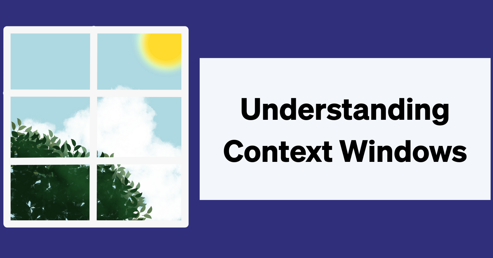

和 AI 工具一起工作，可能感觉像和一个靠不住、混乱、但又过度自信的同事一起工作。你知道的，那种会忘记任务、无缘无故撒谎、不告诉你就开始新项目、然后做到一半就撂挑子的人。这足以让你说：「算了。我自己来。」但在我们完全放弃 AI 之前，值得理解引擎盖下实际发生了什么，这样我们才能避开常见陷阱，让 AI 工具值得使用。

<!--truncate-->

这种行为的根源在于 AI 工具如何处理工作记忆。同样，作为人类，你一次只能同时应付这么多信息。例如，当我读一篇很长的研究论文时，读到结论时可能已经忘了引言里的关键细节，尽管那些早期要点对理解整个论证很重要。

AI 助手工作记忆的技术术语是**上下文窗口**。

## 什么是上下文窗口？

上下文窗口是 AI 模型在单次会话中能处理的最大信息量。它以「token」衡量。

## 什么是 token？

token 是 AI 模型为处理而拆分文本的方式。它们大致相当于词或词的片段，不过不同模型根据训练数据和设计选择，对文本分词的方式有所不同。

**例如：**  
 「Hello」= 1 个 token  
 「Understanding」= 2 个 token（「Under」+「standing」）  
 「AI」= 1 个 token  
 「Tokenization」= 3 个 token

自己试试：把任何文本粘贴到 [OpenAI 的分词器工具](https://platform.openai.com/tokenizer)，看看不同模型如何计数 token。

### goose 如何使用 token

来谈谈这在实践中如何工作。当你使用像 goose 这样的 AI 智能体时，你开始一个会话并选择一个模型，比如 Claude Sonnet 3.7。这个模型的上下文窗口是 128,000 个 token。这意味着每个会话（或对话）最多可以处理 128,000 个 token。如果你给 goose 发「hey」，你会用掉一个 token。当 goose 回应时，你又会用掉更多 token。现在你已经用掉了 128,000 个 token 中的一小部分，剩下的还在。

:::note
上下文窗口因 LLM 而异。
:::

一旦对话超过 128,000 个 token 或接近它，你的智能体可能开始忘记对话早期的关键细节，并可能优先考虑最近的信息。

但你的对话不是唯一使用 token 的东西。goose 里还有其他东西消耗你的 token 预算：

* **系统提示：** 一条内置提示，指示你的智能体如何行为并定义它的身份  
  * 系统提示定义 goose 的名字、创建者（Block）、当前日期/时间、任务和扩展处理，以及回应格式。  
* **扩展及其工具定义**——许多扩展内置了不止一个工具。例如，Google Drive 扩展可能包括读文件、创建文件和评论文档等工具。此外，每个工具都带有如何使用它的说明，以及对工具做什么的解释。  
* **工具回应**——工具返回的回应。例如，工具可能回应「这是你 500 行代码文件的全部内容。」  
* 除了对话历史，goose 还保留关于你对话的元数据，例如时间戳。

这是大量数据，很容易吃掉你的上下文窗口。除了影响性能，token 用量也影响成本。你用的 token 越多，付的钱越多，而如果你的 token 浪费在智能体误解你的请求上，你可能会感到沮丧。

幸运的是，goose 有聪明的设计来帮助你节省上下文窗口。

## goose 如何自动管理你的上下文窗口

goose 有一种方法，一旦对话达到某个阈值就自动压缩（或总结）。默认情况下，当你达到上下文窗口的 80% 时，goose 会总结对话，保留关键部分并压缩其余部分，从而减少上下文窗口用量，让你可以留在会话里而不必开始新的。

你实际上可以自定义这个阈值。如果你觉得 80% 对你的工作流太少或太多，可以把环境变量 `GOOSE_AUTO_COMPACT_THRESHOLD` 设为你偏好的阈值。

## 如何管理你的上下文窗口

虽然 goose 擅长帮你管理上下文窗口，你也可以主动管理。下面是高效管理上下文窗口和钱包的一些技巧。

**1. 手动总结**

当对话变得太长时，你可以总结关键点并开始一个新会话。把重要决策、代码片段或项目要求复制到新会话。这样你保留必要上下文，而不必带上完整的对话历史。

**2. `.goosehints`**

使用 [.goosehints](/docs/guides/context-engineering/using-goosehints/) 文件来避免重复同样的指令。不必在每次对话中打出你的项目上下文、编码标准和偏好，在 .goosehints 文件里定义一次。这避免把 token 浪费在重复解释上，并帮助 goose 更快理解你的要求。

**3. Memory 扩展**

[Memory 扩展](https://goose-docs.ai/docs/mcp/memory-mcp)跨会话存储重要信息。不必每次开始新对话都重新解释项目背景、过去的决策或重要上下文，你可以引用已存储的信息。这让你的提示聚焦于当前任务，而不是重复历史上下文。

**4. 配方**

[配方](https://goose-docs.ai/docs/guides/recipes/)把完整的任务设置打包成可复用的配置，消除反复提供冗长指令的需要。不必在每个会话里消耗 token 来解释复杂工作流，配方预先包含所有必要的指令、扩展和参数。这对重复任务特别有价值，否则你会在设置和解释上花掉大量 token。如果你的配方开始显得过长，可以把任务拆成[子配方](https://goose-docs.ai/docs/guides/recipes/subrecipes)。

**5. 子智能体**

[子智能体](https://goose-docs.ai/docs/guides/context-engineering/subagents)在自己隔离的会话中处理特定任务。这防止你的主对话被实现细节和工具输出弄乱。你把工作委派给子智能体，只看到最终结果，让主上下文窗口保持干净和聚焦。

**6. 短会话**

让单个会话聚焦于特定任务。当你完成一项任务或到达自然的停顿点时，开始一个新会话。这防止累积的对话历史让上下文窗口膨胀，并确保你的 token 花在当前、相关的工作上。

**7. 规划模型 + 聚焦执行**

用一个强[推理模型](/docs/guides/multi-model/)做复杂工作，让默认模型聚焦于执行。这让你控制成本和质量，同时让模型行为明确、可预测。

---

下次你的 AI 智能体似乎「忘记」了重要的事或偏离轨道时，先检查上下文窗口用量。解决方案可能是更好的提示，或更干净的上下文窗口。往往，靠不住和聚焦之间的差别，只是几个 token。

<head>
  <meta property="og:title" content="给 AI 怀疑者的上下文窗口指南" />
  <meta property="og:type" content="article" />
  <meta property="og:url" content="https://goose-docs.ai/blog/2025/08/18/understanding-context-windows" />
  <meta property="og:description" content="为什么 AI 智能体会忘记？了解上下文窗口、token 和 goose 如何帮助你管理记忆和长对话。" />
  <meta property="og:image" content="https://goose-docs.ai/assets/images/contextwindow-fa46f7a54cfb23a538d62f0e4502e19e.png" />
  <meta name="twitter:card" content="summary_large_image" />
  <meta property="twitter:domain" content="goose-docs.ai" />
  <meta name="twitter:title" content="给 AI 怀疑者的上下文窗口指南" />
  <meta name="twitter:description" content="为什么 AI 智能体会忘记？了解上下文窗口、token 和 goose 如何帮助你管理记忆和长对话。" />
  <meta name="twitter:image" content="https://goose-docs.ai/assets/images/contextwindow-fa46f7a54cfb23a538d62f0e4502e19e.png" />
</head>
