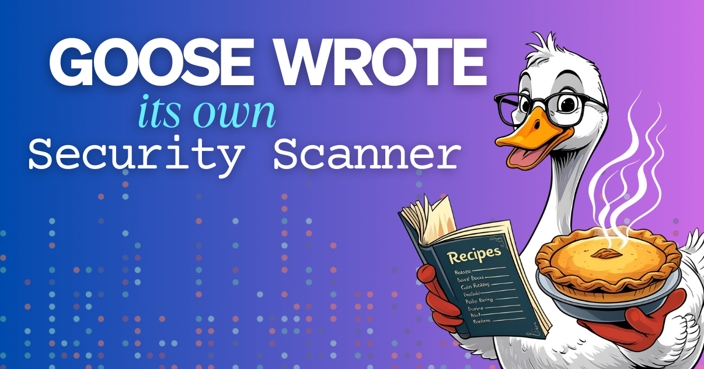

> **更新：** 本文作为历史记录保留。公开的 Recipe Cookbook 提交计划已经结束，我们不再接受新的配方提交。

还记得人们靠在邻居之间传递手写卡片来分享食谱吗？你信任奶奶的苹果派食谱，因为你认识奶奶。但当陌生人开始在网上分享食谱时会发生什么？你需要有人先试吃。

这正是我们面对 goose 配方时的挑战。我们在构建一本社区食谱，让你可以放心试用其他用户的 goose 配方，并确信它们是安全的。但我们需要一种方法，确保每个配方都可以安全运行。

<!--truncate-->

## 无界面方案

我问 goose：「你能构建一个系统来分析你自己的配方吗？」

这个漂亮的反讽我没有错过。我本质上是在让我们的 AI 成为它自己的看门狗。

我给了它更多方向：我希望扫描器从 GitHub Actions 运行，并且扫描在 Docker 容器内完成，这样它可以在隔离环境中检查配方。

在概念和它应当如何工作上经过几次高层迭代之后，goose 构建了一套完整的安全分析系统。它把自己容器化，设置了 GitHub Actions 工作流，并开始自动扫描提交的配方。

### 更好的提示带来更好的结果

我的第一版构建相当过度工程化。后来我简化了，只给 goose 一条「你是安全专家」的提示，但如果不引导它应该寻找哪些东西，结果就没那么好。我必须把提示水平提上来，包含*一些*具体内容，同时仍然给 goose 灵活度去学习、成长，并下载它认为在 Docker 容器内完成工作所需的任何工具。

最后我精心准备了一系列配方：有些是安全的，有些可能有一点风险，有些则完全危险，并告诉 goose 我们需要警惕的一些必要事项。

## 它如何工作

乍看这个过程出人意料地简单，但其实相当复杂——想象优雅的 goose 在水面上游泳，水面下脚却在拼命划水，做着大量工作！

当有人通过我们的 GitHub issue 模板提交配方时，就会启动一次自动扫描。goose 在隔离的 Docker 容器中运行，用它自己的安全专长加上我们的一些指导来分析配方，给出风险评分，并把结果发回 GitHub issue。

整个过程用分钟而不是天来计，提交者会立即收到关于其配方安全性的透明反馈。如果有什么看起来不对，我们的团队可以审查情况并采取适当行动。

## 无界面模式中的 goose

我们在[教程](https://goose-docs.ai/docs/tutorials/headless-goose/)和[视频](https://www.youtube.com/@goose-oss/search?query=headless)里介绍过无界面模式，这里快速回顾：无界面模式允许 goose 在没有图形用户界面的情况下运行，让自动化任务更快、更高效。只要我们对要遵循的指令*非常*清楚，或者在指令无法遵循时有回退方案，它在服务器环境中就表现出色——我们不希望 goose 卡在不知道做什么时，留下半成品或坏掉的结果。

我们大致这样启动 Docker 容器：

```bash
docker run --rm \
    -e AIMODEL_API_KEY="$AIMODEL_API_KEY" \
    -v "$PWD/$RECIPE_FILE:/input/recipe.yaml:ro" \
    -v "$RECIPE_OUT:/output" \
```

我们传进 Docker 的第一样东西，是正在使用的 AI 模型的 API 密钥。我只用「AIMODEL_API_KEY」作为占位符，你会把它改成 OPENAI_API_KEY 或 GEMINI_API_KEY 等，取决于你希望 goose 在容器里使用哪个 LLM。

接下来，我们传入从 GitHub 拿到的用户配方，然后是用于日志和分析的「输出」。

### 看容器内部

在容器内，我们安装 goose，并传入一份配置文件，指定要使用的 AI 提供商和模型，再加上一份「基础」配方，告诉 goose 如何分析用户的配方。那份配方也在强化 goose 作为安全专家的角色。

## 学习曲线

只告诉 goose「你是安全专家」是不够的。需要来回几次，才能教会它区分：一个下载有用开发工具的配方，和一个把可疑东西下载到你的主目录去寻找敏感数据的配方。

我们必须微调安全与可用性之间的平衡。太严，合法配方会被标记。太松，危险的会漏过去。要找对这个平衡，需要向 goose 展示大量安全模式和风险模式的例子。我们也把这些传进 Docker 容器，我们的「基础」配方告诉 goose 把它们当作灵感。

然后我们进入「无界面」模式：

```bash
goose run --recipe base_recipe.yaml --no-session --params recipe_path="user_recipe.yaml" > /logs/results.txt
```

这会运行我们的「基础」配方，并跳过存储会话，因为这本来就是一次性的 GitHub action。我们的基础配方会寻找用户配方文件所在位置的参数，所以我们把该参数传进无界面模式，然后记录结果。这些结果稍后由我们的 GitHub action 拾取，用来在 GitHub issue 或 pull request 上填写评论。

## 建立社区信任

真正的收获不只是把这一切自动化，而是透明度。每次分析都可见、一致，并且有解释。社区成员可以确切看到一个配方为什么通过或失败，这既建立对系统的信任，也建立对配方本身的信任。

goose 能抓住人类可能错过的边界情况，比如细微的混淆技术，或只有在分析几十个配方时才变得明显的模式。就像有一位注意力完美、从不会累的安全专家。

## 用 AI 审查 AI，再审查提交

有时候，解决潜在 AI 问题的最好办法是更多 AI。goose 比任何人类审查者都更理解 goose 的行为模式。它知道自动化任务的合法方式，并能发现某样东西何时偏离了这些模式。用 goose 构建这个扫描器不只是节省了做工具的时间，对我们的团队来说，不必再手动审查每个配方，也是一次生产力上的胜利。

当时，任何人都可以提交配方，并知道它会得到公平、彻底的审查。当一个配方获得安全批准时，批准它的就是 goose 自己。

<iframe class="aspect-ratio" src="https://www.youtube.com/embed/Jtw_FxF3Iug" title="YouTube video player" frameborder="0" allow="accelerometer; autoplay; clipboard-write; encrypted-media; gyroscope; picture-in-picture; web-share" referrerpolicy="strict-origin-when-cross-origin" allowfullscreen></iframe>

<head>
  <meta property="og:title" content="我让 goose 构建了它自己的安全配方扫描器" />
  <meta property="og:type" content="article" />
  <meta property="og:url" content="https://goose-docs.ai/blog/kljaslkjasd" />
  <meta property="og:description" content="goose 无界面模式运行一个容器化扫描器，用于社区配方提交。" />
  <meta property="og:image" content="https://goose-docs.ai/assets/images/goose-security-scanner-7fbe93f4a738fed2002e656fe66e715f.png" />
  <meta name="twitter:card" content="summary_large_image" />
  <meta property="twitter:domain" content="goose-docs.ai" />
  <meta name="twitter:title" content="我让 goose 构建了它自己的安全配方扫描器" />
  <meta name="twitter:description" content="goose 无界面模式运行一个容器化扫描器，用于社区配方提交。" />
  <meta name="twitter:image" content="https://goose-docs.ai/assets/images/goose-security-scanner-7fbe93f4a738fed2002e656fe66e715f.png" />
</head>
