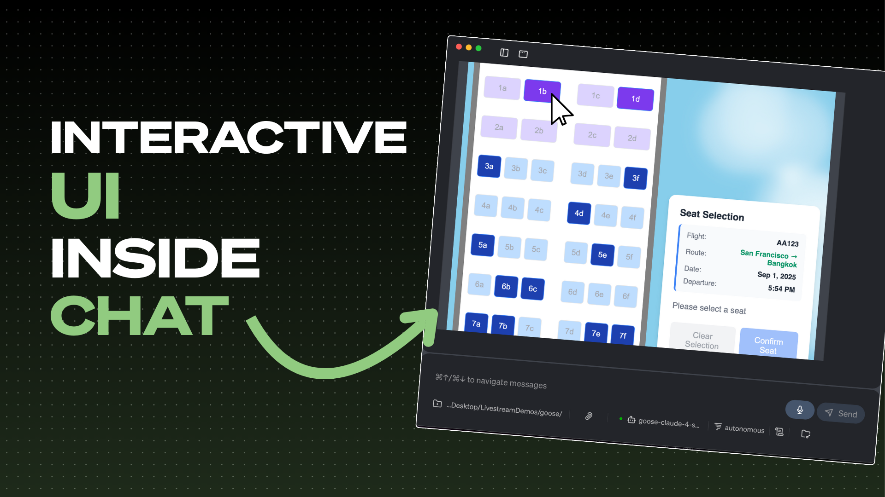

AI 智能体对话里无尽文字墙的日子不多了。如果不是读完一段段产品描述，而是浏览一个漂亮、可交互的目录呢？如果订机票座位可以简单到在视觉座位图上点击你偏好的位置呢？这不是科幻。它正在通过 MCP-UI 发生。

在最近的 [Wild Goose Case 一集](https://www.youtube.com/live/GS-kmreZDgU)中，我们与 MCP-UI 的创建者、来自 Monday.com 的 Ido Salomon 和 Liad Yosef，以及 Block 自己的 Andrew Harvard 一起深入 MCP-UI，探索这项开创性技术如何重塑智能体界面的未来。

<!-- truncate -->

## 纯文本界面的问题

说实话，我们都经历过。你让 AI 智能体帮你买鞋，得到的是一堵文字墙，里面是产品名、价格和描述。然后你得复制粘贴 URL，打开多个标签，基本上所有工作还是自己做。这违背了拥有 AI 助手的初衷。

正如 Ido 在我们的对话中所说：「我觉得每个人都做过某件事，得到一大堆文字，然后想这太糟糕了，为什么我得把那些都打出来，然后有点愤怒地退出 ChatGPT。」

现实是，基于文本的界面对早期采用者和技术用户还行，但它们不是未来。它们肯定不会对每个人都有效——包括我们的妈妈们，她们越来越多地使用 AI 助手，但不应该不得不在复杂的文本回应中导航。

## MCP-UI 登场：弥合差距

MCP-UI（Model Context Protocol User Interface）代表了我们思考 AI 智能体交互方式的根本转变。它不再强迫用户通过文本消费一切，而是让丰富、可交互的 Web 组件直接嵌入智能体对话。

核心哲学简单而出色：**既然我们可以用 AI 增强它，为什么要扔掉几十年的 Web UI/UX 专长？**

正如 Liad 解释的：「我们有超过十年面向人类的 Web 界面，它们为人类的认知限制和需求而构建并完善，智能体让我们扔掉这一切并不合理。」

## MCP-UI 如何工作

本质上，MCP-UI 既是协议也是 SDK，它使以下成为可能：

1. **丰富的 UI 组件**：不是文本描述，你得到可交互的目录、座位图、预订表单等等
2. **品牌保留**：像 Shopify 这样的公司保持他们的品牌和用户体验完整
3. **无缝集成**：UI 组件通过安全、沙箱化的 iframe 与智能体通信
4. **跨平台兼容**：同一个 UI 可以在不同的 AI 智能体和平台上工作

魔力通过 MCP 规范中的嵌入资源发生。当你与支持 UI 的 MCP 服务器交互时，它不只返回文本，还可以返回直接在你的智能体界面中渲染的丰富 UI 组件。

## 真实世界中的例子

在我们的演示中，我们看到了 MCP-UI 的一些不可思议的例子：

### 让购物可视化
用户看到的不是读完产品描述，而是一个漂亮的 Shopify 目录，带有图片、价格和交互元素。点击商品就把它们加入购物车，就像常规电商体验，但无缝嵌入在 AI 对话中。

### 重新想象旅行规划
我们看到用户可以通过点击视觉座位图选择飞机座位，然后让智能体自动查询目的地城市的天气信息，全程不必离开对话或输入额外命令。

### 发现餐厅
演示展示了用户如何浏览本地餐厅，用丰富的卡片显示照片、评分和菜单，然后通过交互界面直接下单，同时保持与 AI 智能体的对话流。

## 技术基础

从技术角度看，MCP-UI 优先考虑安全和隔离。UI 组件在沙箱 iframe 中渲染，只能通过 post message 与宿主通信。这确保第三方 UI 代码不能访问或操纵父应用。

当前实现支持几种内容类型：
- **外部 URL**：嵌入 iframe 的现有 Web 应用
- **原始 HTML**：带 CSS 和 JavaScript 的自定义 HTML 组件
- **Remote DOM**：在单独的 worker 中渲染 UI，以增强安全

对开发者来说，开始出人意料地简单。正如 Andrew 演示的，你可以从像这样基本的东西开始：

```javascript
return createUIResource({
  type: 'html',
  content: '<h1>Hello World</h1>'
});
```

## 利益相关者生态

MCP-UI 的成功取决于几个关键利益相关者：

1. **智能体开发者**（如 goose 团队）：需要在他们的平台中实现 MCP-UI 支持
2. **MCP 服务器开发者**：构建 UI 组件并把它们与现有服务集成
3. **服务提供商**（如 Shopify、Square）：为他们的平台创建丰富界面
4. **最终用户**：从更直观、更视觉化的 AI 交互中受益

这种方法的美在于它创造网络效应。一旦实现，一个 Shopify MCP-UI 组件就能在所有兼容的智能体上工作——从 goose 到 VS Code 扩展，再到未来的移动 AI 助手。

## 向前看：未来是视觉的

MCP-UI 的影响远远超出更漂亮的界面。我们看到的是：

### 无障碍革命
正如 Ido 指出的：「还有什么比一个了解你、并为你的偏好构建 UI 的智能体更可及？你不必依赖世界上每一个 Web 应用都支持或构建那个。」

### 生成式 UI
未来版本可能超越静态 HTML，走向为个人用户的需求、偏好和无障碍要求量身定制的 AI 生成界面。

### 多模态体验
协议不限于视觉界面——它可以扩展到语音交互、移动原生组件，甚至我们还没想象到的全新交互范式。

### 跨平台标准化
不必每家公司为每个 AI 平台构建单独的集成，MCP-UI 创造一个到处都能用的标准。

## 采用的挑战

技术已经就绪，但采用是下一个前沿。正如团队强调的，这现在更是一个采用问题，而不是技术问题。好消息？主要玩家已经加入。Shopify 已经为他们所有商店推出了 MCP 支持，为商业体验提供了巨大的真实世界试验场。当然，goose 也支持 MCP-UI。

对有兴趣贡献的开发者，重点是：
- 构建解决真实用户问题的真实应用
- 根据真实世界需求扩展规范
- 创建更好的工具和 SDK，以降低入门门槛

## 开始使用

如果你对 MCP-UI 感到兴奋并想开始试验，从这里开始：

1. **查看文档**：MCP-UI 团队创建了[全面的文档和示例](https://mcpui.dev/)
2. **加入社区**：有一个活跃的 [Discord 服务器](https://discord.gg/4ww9QnJgCp)用于协作和讨论
3. **从简单开始**：拿一个现有的 MCP 服务器，给它添加 UI 资源
4. **用 goose 试验**：试试 [goose 中的 MCP-UI](/docs/guides/interactive-chat/mcp-ui)，看看它实际运行

## 底线

MCP-UI 代表了从文字沉重的 AI 交互，转向丰富、视觉、直观体验的根本转变。

当你浏览产品时，你想看到图片并与目录交互。当你预订旅行时，你想要视觉座位图和行程。当你管理日历时，你想要熟悉、就是能用的界面模式。

MCP-UI 让这一切成为可能，同时保留 AI 智能体的对话性质。它是我们所知道的 Web 与我们正在构建的智能体未来之间的桥梁。

与 AI 交互的未来依赖于更聪明的界面。有了 MCP-UI，那个未来已经在这里。

---

*想看 MCP-UI 实际运行？查看下面完整的 Wild Goose Chase 一集，并加入我们的社区，开始构建智能体界面的未来。*

<iframe src="https://www.youtube.com/embed/GS-kmreZDgU" title="MCP-UI：智能体界面的未来" frameborder="0" allow="accelerometer; autoplay; clipboard-write; encrypted-media; gyroscope; picture-in-picture" allowfullscreen class="aspect-ratio"></iframe>

*在 [Discord](https://discord.gg/n8R5VaWDAn) 上加入对话，并关注我们的进展，我们继续推动 AI 智能体可能性的边界。*

<head>
  <meta property="og:title" content="MCP-UI：智能体界面的未来" />
  <meta property="og:type" content="article" />
  <meta property="og:url" content="https://goose-docs.ai/blog/2025/08/25/mcp-ui-future-agentic-interfaces" />
  <meta property="og:description" content="了解 MCP-UI 如何把丰富、可交互的 Web 组件直接带进智能体对话，从而革新 AI 智能体交互，让 AI 对每个人都更可及、更直观。" />
  <meta property="og:image" content="https://goose-docs.ai/assets/images/mcpui-goose-44f248ede0eb5d2e0bddccf76e98b07e.png" />
  <meta name="twitter:card" content="summary_large_image" />
  <meta property="twitter:domain" content="goose-docs.ai" />
  <meta name="twitter:title" content="MCP-UI：智能体界面的未来" />
  <meta name="twitter:description" content="了解 MCP-UI 如何把丰富、可交互的 Web 组件直接带进智能体对话，从而革新 AI 智能体交互，让 AI 对每个人都更可及、更直观。" />
  <meta name="twitter:image" content="https://goose-docs.ai/assets/images/mcpui-goose-44f248ede0eb5d2e0bddccf76e98b07e.png" />
</head>
