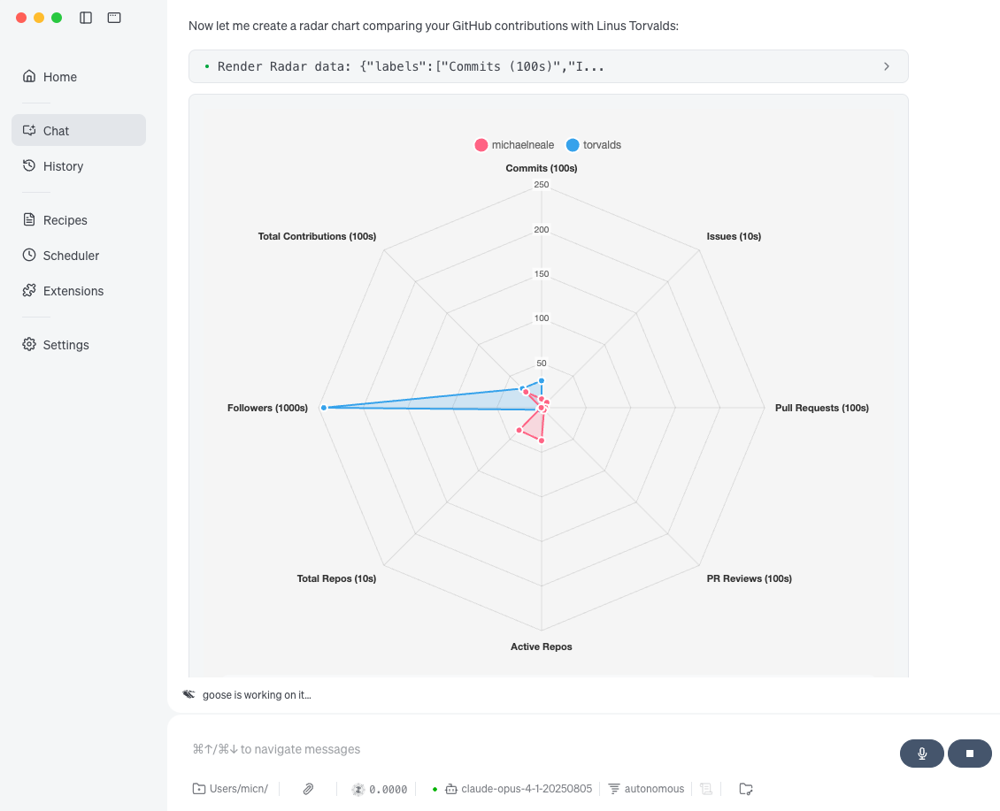
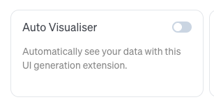
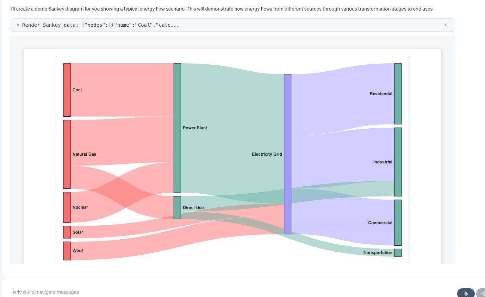
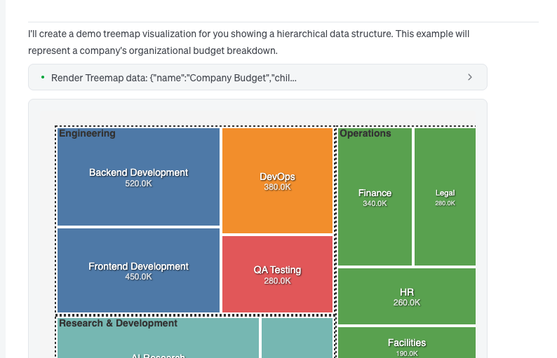
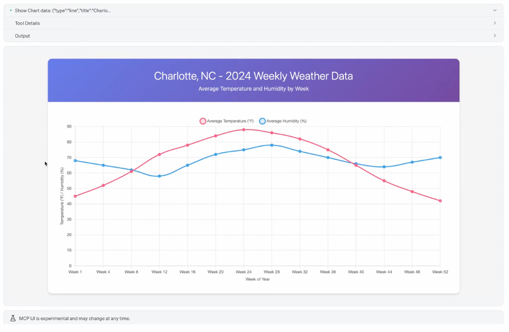

goose 里的数据可视化刚刚迎来一次重大升级。有了新的 MCP-UI 自动可视化功能，你不再需要手动请求图表、图形或数据的可视化表示。goose 现在会自动判断数据什么时候适合可视化，并直接在对话里渲染可交互的可视化组件。

<!-- truncate -->

## 什么是自动可视化？

[自动可视化](/docs/mcp/autovisualiser-mcp)是一个内置扩展，它与 [goose 的 MCP-UI 系统](/docs/guides/interactive-chat/)集成，在你工作的过程中自动生成数据的可视化表示。

开启之后，一批可视化工具会作为工具提供出来，并在合适的时候自动调用。例如，把内容显示成雷达图，或一张「桑基」图：

你也可以明确要求某种可视化，甚至指定想要的风格，goose 会尽量整理你的数据，然后在对话里内联渲染。这由新兴标准 [MCP-UI](https://mcpui.dev/) 驱动：MCP 服务器可以构造一种可视化（这里使用 d3.js 等库），并内联渲染。

自动可视化会分析数据模式，并自动建议最合适的可视化类型。我最喜欢的是树图，它很适合看出事物的相对大小，而饼图在这方面容易误导。它也是可交互的，你可以向下钻取。

当然，如果你愿意，也可以退回到「缺乏想象力者的最后避难所」，把天气画成图：

请注意，这是一项早期功能，行为可能会有很大变化（MCP-UI 也是如此）。这是正在兴起的生成式 UI 的一个早期例子。不过在这里，模板是预先生成的，数据会动态匹配到当前会话，然后显示出来（来自本地资源）。

## 可视化类型

目前它能展示几类内容：

* 桑基图
* 雷达图
* 弦图
* 环形图/饼图
* 柱状图和一般图表
* 树图可视化（瓷砖）
* 地图（把地点标在地理地图上）

---

*准备好看看你的数据了吗？在 goose 中[启用自动可视化扩展](/docs/mcp/autovisualiser-mcp#configuration)。*

<head>
  <meta property="og:title" content="用 MCP-UI 做自动可视化" />
  <meta property="og:type" content="article" />
  <meta property="og:url" content="https://goose-docs.ai/blog/2025/08/27/autovisualiser-with-mcp-ui" />
  <meta property="og:description" content="goose 现在如何在你与数据交互时自动渲染可视化表示，由新的 MCP-UI 功能驱动" />
  <meta property="og:image" content="https://goose-docs.ai/assets/images/autovis-banner-c6e34e561b2fad329ea00024c301e910.png" />
  <meta name="twitter:card" content="summary_large_image" />
  <meta property="twitter:domain" content="goose-docs.ai" />
  <meta name="twitter:title" content="用 MCP-UI 做自动可视化" />
  <meta name="twitter:description" content="goose 现在如何在你与数据交互时自动渲染可视化表示，由新的 MCP-UI 功能驱动" />
  <meta name="twitter:image" content="https://goose-docs.ai/assets/images/autovis-banner-c6e34e561b2fad329ea00024c301e910.png" />
</head>
