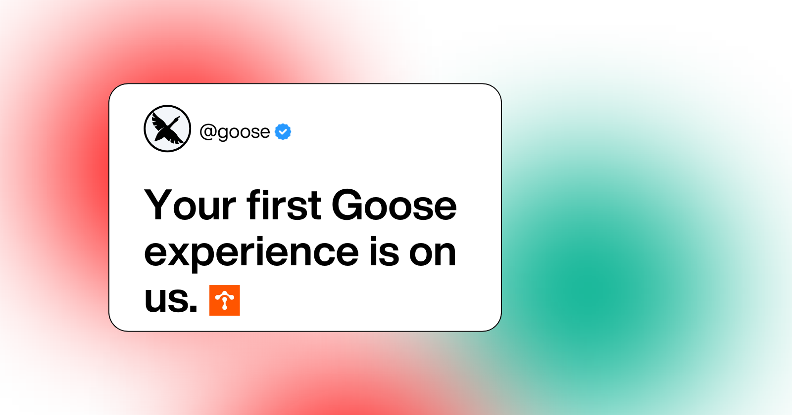
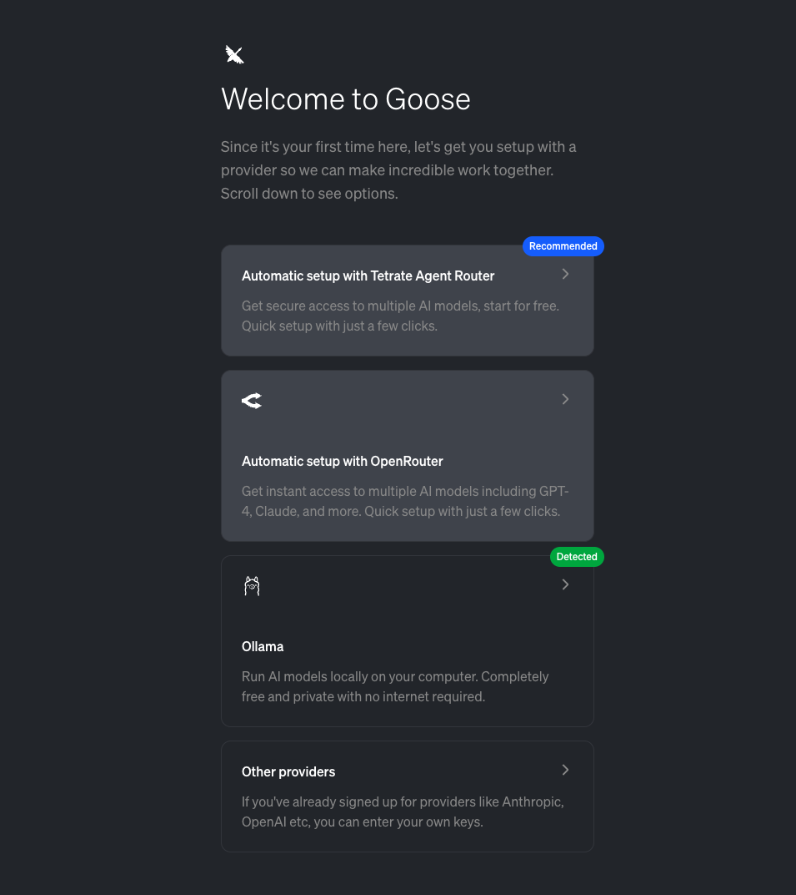
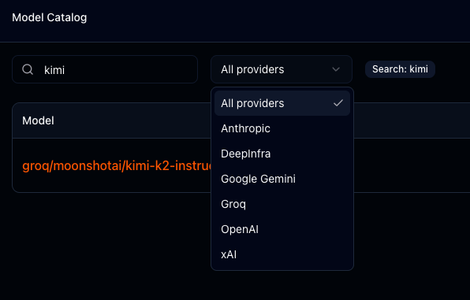
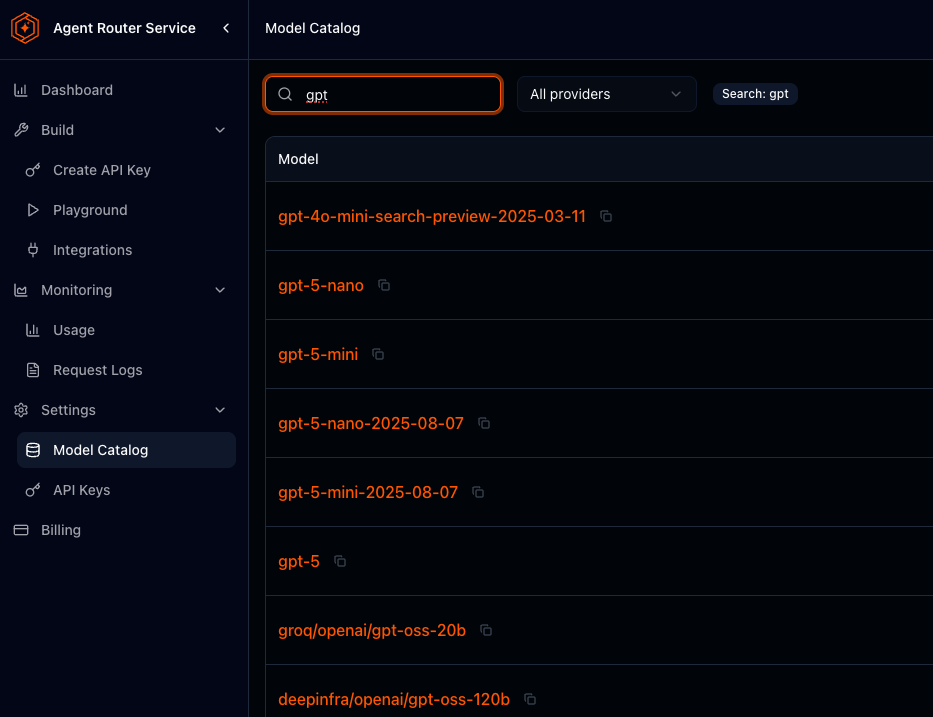

 你不应该需要信用卡才能用 goose 做 vibe coding。虽然 goose 本身完全免费，但现实是大多数高性能 LLM 并不免费。你希望体验 goose 的实际效果，又不必花很多钱或走很多弯路。我们一直在想，如何让 goose 新手的第一步更容易。

所以我们对最新的提供商集成感到兴奋：[Tetrate 的 Agent Router Service](https://router.tetrate.ai)。新的 goose 用户可以获得 10 美元额度，用 Tetrate 平台上的任意模型配合 goose。

<!--truncate-->

我们升级了上手流程。Tetrate Agent Router 现在作为新用户的[推荐设置选项](/docs/getting-started/installation#set-llm-provider)出现。选择 Tetrate 后，你会走过 OAuth 账号创建，然后回到 goose，10 美元额度已经就绪。

这次集成为 goose 用户带来：
* **即时访问**模型，无需手动设置
* **10 美元额度**，开始构建而不必先付费
* 由 Tetrate 驱动的**统一模型层**
* 构建在 [Envoy](https://www.envoyproxy.io/) 之上的**稳定路由**。Envoy 是面向大规模系统的开源代理

## Tetrate 的 Agent Router Service

Tetrate 的 Agent Router Service 提供对一整套 AI 模型的统一访问，从开源选项到 GPT-5、Sonnet-4 和 Grok-4 这类前沿模型。

### 从云基础设施到 AI 模型路由

Tetrate 把多年的路由和基础设施经验带到了 AI 领域。作为 Istio 和 Envoy 等开源项目的主要贡献者，他们懂得如何构建可靠、可扩展的路由系统。现在他们把同样的专长用到 LLM 流量管理上。

LLM 请求本质上是无状态的，因此非常适合在多个提供商和模型之间做智能路由。这让你可以按成本、速度、可用性或质量来优化，甚至用多个模型交叉核对结果。这个领域的术语仍在稳定中。为了一致，goose 把 Tetrate 称为「提供商」，但在底层它是一个连接到其他提供商的路由服务。这一层把模型选择、认证和主机配置抽象掉，让你的设置保持干净。

## 为什么这次合作重要

我们的目标很简单：让每个人都能立刻使用 goose。这意味着去掉开始时的障碍。Tetrate 慷慨的额度支持和无缝集成，正好帮助我们做到这一点。

这也体现了 Tetrate 对开源的持续投入，以及让全球开发者更容易进行 AI 开发的承诺。

## 探索完整模型目录

虽然 goose 默认自动配置为 Sonnet-4，你可以通过界面访问 Tetrate 的整个模型目录：

浏览并选择广泛的选项，包括：
- 已托管、可直接使用的**开放权重模型**（如 Kimi/K2）
- 来自各提供商的**前沿模型**
- 针对不同用例优化的**专用模型**

:::tip 小提示
 想两全其美？用强推理模型做复杂策略，用更快的默认模型来执行。参见[多模型指南](/docs/guides/multi-model/)，只在需要时使用强推理，既省时间也省额度。
:::

---

感谢 Tetrate 支持开源，并让 AI 开发更容易获得！

**还在等什么？** [开始使用 goose](/)

*有问题？* 浏览我们的[文档](/docs/category/guides)和[博客](/blog)，或加入 [Discord](https://discord.gg/n8R5VaWDAn) 和 [GitHub Discussions](https://github.com/aaif-goose/goose/discussions) 一起讨论。我们很希望你加入。

<head>
  <meta property="og:title" content="你的第一次 goose 体验由我们请客" />
  <meta property="og:type" content="article" />
  <meta property="og:url" content="https://goose-docs.ai/blog/2025/08/27/get-started-for-free-with-tetrate" />
  <meta property="og:description" content="新的 goose 用户可获得 10 美元 Tetrate Agent Router 额度，立即使用包括 GPT-5 和 Sonnet-4 在内的多种模型。" />
  <meta property="og:image" content="https://goose-docs.ai/assets/images/tetrate-header-9e2afbf5d1ce961d5f25547a7439c65f.png" />
  <meta name="twitter:card" content="summary_large_image" />
  <meta property="twitter:domain" content="goose-docs.ai" />
  <meta name="twitter:title" content="你的第一次 goose 体验由我们请客" />
  <meta name="twitter:description" content="新的 goose 用户可获得 10 美元 Tetrate Agent Router 额度，立即使用包括 GPT-5 和 Sonnet-4 在内的多种模型" />
  <meta name="twitter:image" content="https://goose-docs.ai/assets/images/tetrate-header-9e2afbf5d1ce961d5f25547a7439c65f.png" />
</head>
