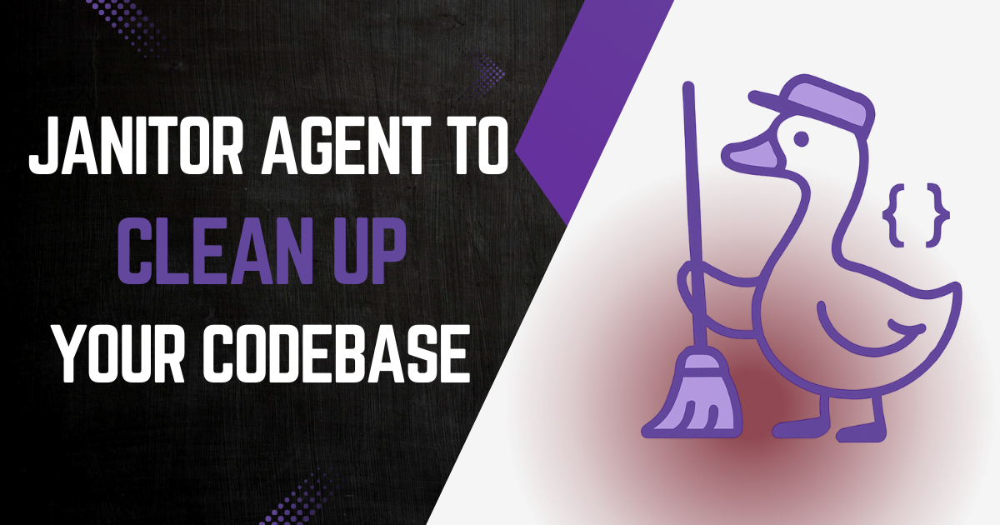

这些年来，Block 的 iOS 工程师一直感受着技术债累积的痛苦。功能开关就是一个具体例子。即便成功推出，它们也倾向于留在代码库里，每一个都是拖慢开发的一点重量。

2025 年初，随着对开发者加速的重新关注，Foundation iOS 团队决定组织「功能开关移除月」——大型 iOS 单体仓库里的团队聚在一起，删除*可能数十万行*死代码的机会。

差不多同一时间，goose 配方恰好发布，团队想知道一份专门的配方能否帮助这项工作。[Gemma Barlow](https://www.linkedin.com/in/gemmakbarlow/) 是团队里较新的 iOS 工程师，她想找出来。


<!-- truncate -->


## 阶段 1：让知识可被 AI 访问

Gemma 的第一步是利用现有的 `.mdc`、`.goosehints` 和其他符号链接的上下文文档系统，记录如何安全地从仓库移除功能开关。

她添加了文档，让 AI 智能体能获取足够的上下文，从而准确完成移除工作。

## 阶段 2：跨代验证

鉴于 AI 文档被设计为与 Block 使用的多种工具一起工作，还需要进一步迭代和验证。几周测试和试验之后，确认这种方法足够准确、有用，*并且*能处理积累下来的三代功能开关实现：

- 团队很久以前用的超级遗留开关
- 更新一些、但现在已经旧了的遗留开关
- 当前的功能开关实现

单是这些文档就能帮助团队更快清理。但现在，AI 也能在大多数场景中理解并安全地穿行真实世界遗留系统的复杂性，这对开发者速度是一次胜利！🎉

## 阶段 3：构建一个 AI 团队成员

这是很大的进展。Gemma 本可以停在这里。

但她用 goose 配方创建了 **goose Janitor**。


goose Janitor 充当新的 AI 团队成员，职责是在我们实验结束后整理代码。它深受现有 [goose 配方](/recipes/detail/?id=clean-up-feature-flag)以及 Block 其他地方正在进行的内部讨论和实验的启发。运行方式如下：

```bash
goose run \
--recipe .goose/recipes/goose-janitor-flag-removal.yaml \
--params feature_flag_key=log-observer-is-enabled \
--params variant_to_remain=true \
--params create_pr=false
```

这份配方：
- 完全自主运行（不需要人工干预）
- 处理不同的开关实现，复杂度各异
- 尝试重构过时的代码路径
- 可以通过 GitHub CLI 自动创建草稿拉取请求
- 与 [Xcode Index MCP](https://github.com/block/xcode-index-mcp) 集成，以深入理解 iOS 项目
- 在本地规划、实现、构建和测试，以提高开关移除结果的准确度


## 更大的图景：AI 优先的开发

像 goose Janitor 这样的配方，代表了我们如何思考软件开发中的 AI 的根本转变。它们可以被部署来：

- 理解复杂的遗留代码库
- 做出安全的重构决策
- 与现有开发工作流无缝集成
- 提供开发者速度的提升
- 在大型代码库上扩展

Block 的团队有信心，goose Janitor 将在生产规模的清理工作中提供帮助。

这正是 AI 应该处理的那种工作：乏味、重复，但需要深入的代码库知识。通过自动化部分工作，开发者可以专注于他们最擅长的事，也就是构建新功能、解决新问题，同时 AI 让代码库保持干净、可维护。


## AI 优先的心态

这个故事说明，对遗留代码库采取 AI 优先方法在实践中是什么样子。

先让部落知识可被 AI 访问。测试并验证 AI 真的能以足够的准确度处理复杂性，证明它有用。即使复杂情况仍需要人工干预，AI 做的第一遍也可以是对生产力有用的提升。构建能跨团队扩展的自动化，把人的精力集中在高价值的创造性工作上。


## 接下来呢？

goose Janitor 的成功打开了迷人的可能性。还有哪些形式的技术债可以从这种方法中受益？我们还能构建哪些「AI 团队成员」来处理常规但知识密集的工作？

随着我们走向 AI 优先的未来，像 Gemma 这样的故事给我们指出了路径。不只是使用 AI 工具，而是系统性地思考如何让我们的代码库和流程为 AI 做好准备。

软件开发的未来是混合团队：AI 智能体是自主贡献者，处理保持系统健康的维护工作，而人类专注于构建未来。

---

想为你自己的需求调整基础配方？查看我们配方食谱中的[清理功能开关](/recipes/detail/?id=clean-up-feature-flag)！

<head>
  <meta property="og:title" content="当 AI 成为你的新团队成员：goose Janitor 的故事" />
  <meta property="og:type" content="article" />
  <meta property="og:url" content="https://goose-docs.ai/blog/2025/08/28/ai-teammate" />
  <meta property="og:description" content="一个工程团队如何试运行由 AI 驱动的自主技术债清理" />
  <meta property="og:image" content="https://goose-docs.ai/assets/images/goose-janitor-129889884d9265d001fe12cbfde03d57.png" />
  <meta name="twitter:card" content="summary_large_image" />
  <meta property="twitter:domain" content="goose-docs.ai" />
  <meta name="twitter:title" content="当 AI 成为你的新团队成员：goose Janitor 的故事" />
  <meta name="twitter:description" content="一个工程团队如何试运行由 AI 驱动的自主技术债清理" />
  <meta name="twitter:image" content="https://goose-docs.ai/assets/images/goose-janitor-129889884d9265d001fe12cbfde03d57.png" />
</head>
