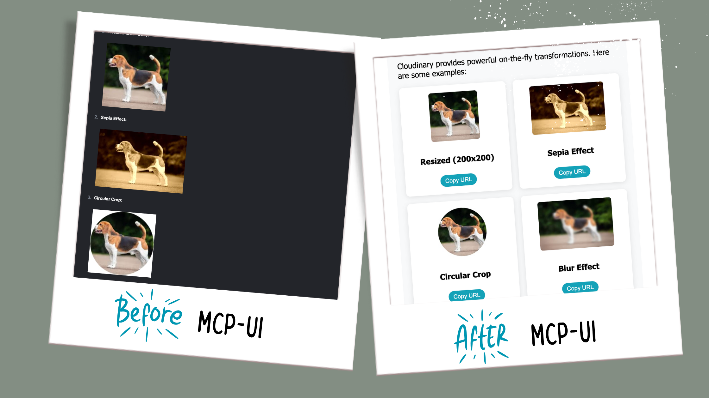
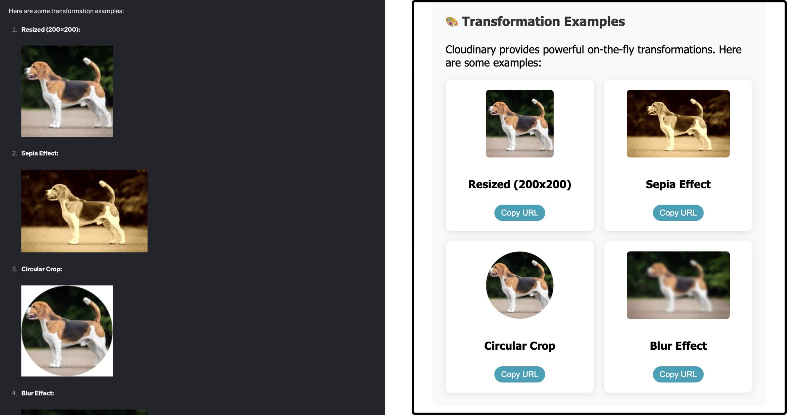
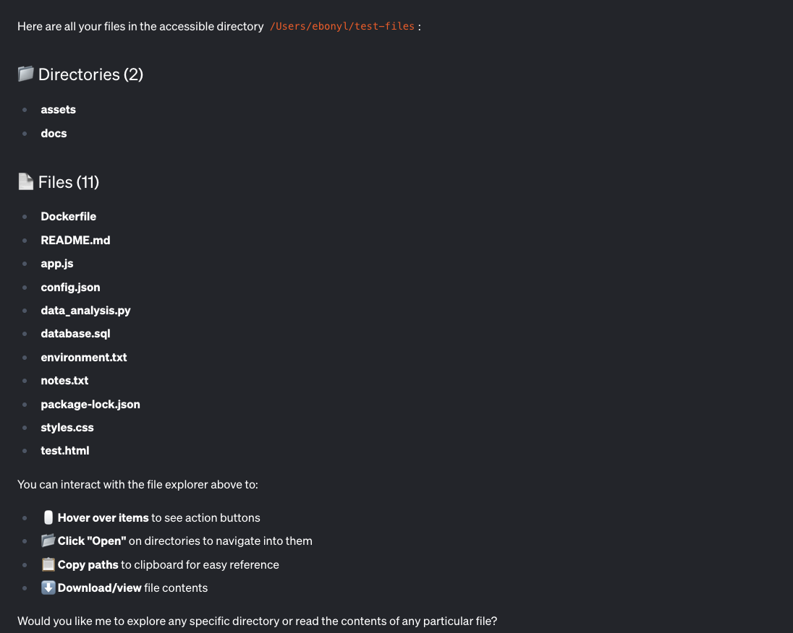
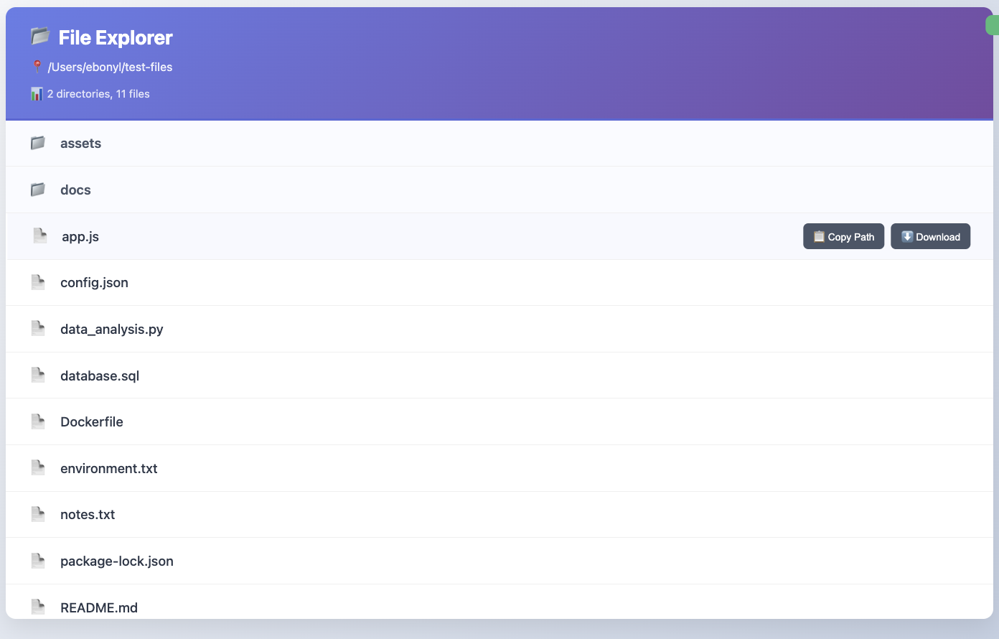

[MCP-UI](https://mcpui.dev/guide/introduction) 还在襁褓期，这么早入场有种让人上瘾的感觉。我们正处在规范和客户端实现都在积极发展的迷人节点，我发现跟着这种演进一起构建令人兴奋。

我想看看自己能把它推多远。于是我拿了两台开源 MCP 服务器，[Cloudinary](https://github.com/felores/cloudinary-mcp-server) 和 [Filesystem](https://github.com/modelcontextprotocol/servers/tree/main/src/filesystem)，给它们加了 UI。不再是无聊的文本，我现在直接在 goose 里得到丰富、可交互的界面。

<!-- truncate -->

## 我为什么想要这个

原始 JSON 和文本也行，能把事办完，但说实话我更想跟漂亮的东西交互。给我一个酷的 UI，而不是来回提示。

以 Cloudinary 为例。默认情况下，上传返回一块文本，基本上是 URL、元数据和 public ID 的 JSON 转储。有用，当然，但不那么容易一眼看清。

我真正想要的是：

- 图片和视频预览
- 一键复制或查看链接的按钮
- 变换示例

有了 MCP-UI，回应不再只是文本。现在回应可以是小小的应用，你可以在智能体的聊天界面里实际点来点去。

{/* Video Player */}
<div style={{ width: '100%', maxWidth: '800px', margin: '0 auto' }}>
  <video 
    controls 
    width="100%" 
    height="400px"
    playsInline
  >
    <source src={require('@site/static/videos/cloudinary2.mp4').default} type="video/mp4" />
    你的浏览器不支持 video 标签。
  </video>
</div>

## 模式

酷的地方在于，对任何 MCP 服务器，步骤基本上都一样。

### **1. 安装 SDK**

```bash
npm install @mcp-ui/server
```

### **2. 导入它**

```ts
import { createUIResource } from "@mcp-ui/server";
```

### **3. 构建你的 HTML**

对我的 Cloudinary 服务器更新，我用了 `Direct HTML → iframe`。我写了一个函数，返回包含上传预览和操作按钮的 HTML 字符串。

MCP-UI 用 `srcdoc` 把那段 HTML 渲染进 iframe。
它简单、完全自包含、迭代快，而且我能完全控制它的样子。

💡 不过，还存在其他模式：

- **外部 URL**——用 iframe 嵌入一个托管页面：
  `content: { type: "externalUrl", iframeUrl }`

- **远程 DOM**——发送一段脚本，直接在宿主的 DOM 里构建 UI：
  `content: { type: "remoteDom", script, framework }`

但对我的用例，**直接 HTML 正合适。**

### **4. 两者都返回**

在你的工具处理函数里，我建议同时返回原始回应和 `createUIResource`。

就这样。无论哪台服务器，主要步骤都一样。

:::tip 警告
  目前 MCP-UI SDK 只有 **TypeScript** 和 **Ruby**。
  如果你的服务器用的是这两种语言之一，今天就可以开始。
  如果不是，你要么等更多 SDK 发布，要么自己写绑定。
:::

## 步骤 3：我的 Cloudinary UI

这是我为 Cloudinary 写的 HTML 生成器，你在这里决定 UI 到底该长什么样。

与其只是告诉你，我们来看看差别。

**MCP-UI 之前（左）：** 一块没有样式的文本，带着链接和原始变换

**MCP-UI 之后（右）：** 干净的布局，带可爱的交互卡片和预览



<details>
<summary>点击查看代码</summary>

```ts
private createUploadResultUI(result: UploadApiResponse): string {
    const isImage = result.resource_type === 'image';
    const isVideo = result.resource_type === 'video';

    return `
    <!DOCTYPE html>
    <html lang="en">
    <head>
    <meta charset="UTF-8">
    <meta name="viewport" content="width=device-width, initial-scale=1.0">
    <title>Cloudinary Upload Result</title>
    <style>
    body {
      font-family: 'Segoe UI', Tahoma, Geneva, Verdana, sans-serif;
      margin: 0;
      padding: 20px;
      background: linear-gradient(135deg, #667eea 0%, #764ba2 100%);
      min-height: 100vh;
    }
    .container {
      max-width: 800px;
      margin: 0 auto;
      background: white;
      border-radius: 15px;
      box-shadow: 0 20px 40px rgba(0,0,0,0.1);
      overflow: hidden;
    }
    .header {
      background: linear-gradient(135deg, #4CAF50, #45a049);
      color: white;
      padding: 30px;
      text-align: center;
    }
    .content { padding: 30px; }
    .preview-section { text-align: center; margin-bottom: 30px; }
    .preview-section img, .preview-section video {
      max-width: 100%; max-height: 300px; border-radius: 10px;
      box-shadow: 0 10px 30px rgba(0,0,0,0.2);
    }
    .actions { display: flex; gap: 15px; justify-content: center; flex-wrap: wrap; }
    .btn { padding: 12px 24px; border-radius: 25px; color: white; border: none; cursor: pointer; }
    .btn-primary { background: #007bff; }
    .btn-success { background: #28a745; }
    </style>
    </head>
    <body>
      <div class="container">
        <div class="header">
          <div style="font-size:3em">✅</div>
          <h1>Upload Successful!</h1>
        </div>
        <div class="content">
          ${isImage ? `` : ''}
          ${isVideo ? `<video controls><source src="${result.secure_url}" /></video>` : ''}
          <div class="actions">
            <a href="${result.secure_url}" target="_blank" class="btn btn-primary">🔗 View</a>
            <button class="btn btn-success" onclick="navigator.clipboard.writeText('${result.secure_url}')">📋 Copy URL</button>
          </div>
        </div>
      </div>
      <script>
    // highlight-start
        const resizeObserver = new ResizeObserver((entries) => {
          entries.forEach((entry) => {
            window.parent.postMessage({
              type: "ui-size-change",
              payload: { height: entry.contentRect.height },
            }, "*");
          });
        });
        resizeObserver.observe(document.documentElement);
    //highlight-end
      </script>
    </body>
    </html>
    `;
}
```

</details>

:::tip 调整 UI 大小
注意 HTML 底部的 `ResizeObserver`。
那段小代码让 iframe 高度与内容保持同步，所以如果 UI 变大或变小，窗口会自动调整。没有它，你的 UI 可能会被裁切，很难看全。
:::

### 是什么让 MCP-UI 可交互？

干净的 UI 很好，但当那些按钮真的做事时，就有趣得多。这就是 **UI 动作**的用武之地；它们把静态布局变成能回话给你的智能体的交互工具。

{/* Video Player */}
<div style={{ width: '100%', maxWidth: '800px', margin: '0 auto' }}>
  <video 
    controls 
    width="100%" 
    height="400px"
    playsInline
  >
    <source src={require('@site/static/videos/cloudinaryaction.mp4').default} type="video/mp4" />
    你的浏览器不支持 video 标签。
  </video>
</div>

在我的 Cloudinary 服务器里，我在 `createUploadResultUI` 的 `<script>` 块中、紧接 `ResizeObserver` 之后加了**两个** UI 动作：

- **提示动作** → 向 goose 发出一条提示，请它把图片配上表情包式的说明。

<details>
<summary>点击查看代码</summary>
```ts
  function makeMeme() {
    window.parent.postMessage({
      type: "prompt",
      payload: {
        prompt: "Create a funny meme caption for this image. Make it humorous and engaging."
      }
    }, "*");
  }
```
</details>

- **链接动作** → 打开 Twitter，并预先带上已上传的图片，让你一键分享。

<details>
<summary>点击查看代码</summary>
```ts
        function shareOnTwitter() {
            const tweetText = encodeURIComponent(
            "I didn’t write this tweet… goose did. (${result.resource_type} included). & here’s how you can do it too 🧵 #MCPUI");
            const imageUrl = encodeURIComponent("${result.secure_url}");
            const twitterUrl = "https://twitter.com/intent/tweet?text=" + tweetText + "&url=" + imageUrl;

            window.parent.postMessage({
            type: "link",
            payload: { url: twitterUrl }
            }, "*");
        }
```
</details>

> 想看现场？[这是 goose 替我发的推文](https://x.com/EbonyJLouis/status/1966203455955157337)。

:::tip 更多 UI 动作
提示和链接只是两个例子。MCP-UI 还支持 **Tool**、**Intent** 和 **Notify** 动作。
:::


## 步骤 4：看看差异有多小

这部分让我震惊：让一个工具兼容 UI，只是很小的代码改动。

这是旧版本：

```ts
return {
    content: [
        {
            type: "text",
            text: JSON.stringify(response, null, 2)
        }
    ]
};
```

这是带 MCP-UI 支持的新版本：

```ts
return {
    content: [
        {
            type: "text",
            text: `🎉 Upload successful!\n\n${JSON.stringify(response, null, 2)}`
        },
        createUIResource({
            uri: `ui://cloudinary-upload/${result.public_id}`,
            content: { type: 'rawHtml', htmlString: this.createUploadResultUI(result) },
            encoding: 'text'
        })
    ]
};
```

就这样。多一个资源，goose 突然就渲染出完整 UI。

## Filesystem：同样的模式

为了证明这不是一次性的，我也让 Filesystem MCP 服务器兼容了 UI。

**之前：** 文本输出（goose 默认显示的）



**之后：** UI 输出（带 MCP-UI 的交互式浏览器）



你需要的唯一差异在这里：

```ts
return {
    content: [
        { type: "text", text: `📂 Files in ${directoryPath}:\n\n${textResponse}` },
        createUIResource({
            uri: `ui://filesystem/explorer/${encodeURIComponent(directoryPath)}`,
            content: { type: "rawHtml", htmlString: htmlContent },
            encoding: "text",
        })
    ]
};
```

## 走在曲线前面

我已经让两台 MCP 服务器兼容了 UI，而 MCP-UI 甚至还没完全铺开。这对我来说很疯狂。

把视野拉开，你会看到其他公司也在往这里推。goose 和 Postman 已经支持渲染和几种 UI 动作。在现在的 goose 里，一个按钮可以发出新提示，或打开外部链接。这还不是完整愿景，但已经足以开始构建更像迷你应用、而不是静态回应的体验。

这就是让我兴奋的地方：我们没有干等。我们在公开地实验，并塑造未来的感觉。

---

## 自己试试

想看它实际运行？

下载 [goose](/docs/quickstart#install-goose)，给你的 MCP 服务器做一次自己的 UI 改头换面，亲眼看看这种魔力。无聊的文本提示再也不会是同一种感觉。

*有问题？* 看看我们的[文档](/docs/category/guides)，浏览[博客](/blog)，或加入我们的 [Discord](https://discord.gg/n8R5VaWDAn) 和 [GitHub Discussions](https://github.com/aaif-goose/goose/discussions)。我们很希望你来。


<head>
  <meta property="og:title" content="如何让 MCP 服务器兼容 MCP-UI" />
  <meta property="og:type" content="article" />
  <meta property="og:url" content="https://goose-docs.ai/blog/2025/09/08/turn-any-mcp-server-mcp-ui-compatible" />
  <meta property="og:description" content="我如何只用几行代码，让现有 MCP 服务器兼容 MCP-UI。" />
  <meta property="og:image" content="https://goose-docs.ai/assets/images/mcp-ui-0a7ec9ab9d9b8b0f84e1372e956cfbde.png" />
  <meta name="twitter:card" content="summary_large_image" />
  <meta property="twitter:domain" content="goose-docs.ai" />
  <meta name="twitter:title" content="如何让 MCP 服务器兼容 MCP-UI" />
  <meta name="twitter:description" content="我如何只用几行代码，让现有 MCP 服务器兼容 MCP-UI。" />
  <meta name="twitter:image" content="https://goose-docs.ai/assets/images/mcp-ui-0a7ec9ab9d9b8b0f84e1372e956cfbde.png" />
</head>
