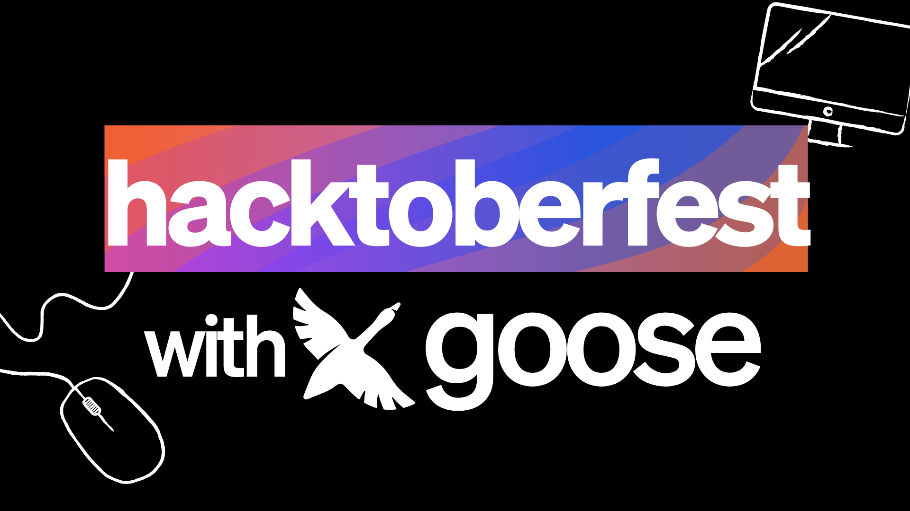

> **更新：** 本文作为历史记录保留。Hacktoberfest 2025 已经结束，公开的 Recipe Cookbook 提交计划也已关闭。

十月就在眼前，这意味着恐怖季节来了，还有那让人起一身「goose」皮疙瘩的清爽秋风……终于到了 Hacktoberfest 2025！goose 团队非常兴奋，今年第一次和大家一起庆祝。来看看你如何参与，以及可以赢得什么奖品。👀

<!-- truncate -->

# 📌 什么是 Hacktoberfest？
[Hacktoberfest](https://hacktoberfest.com/participation/) 是每年十月为期一个月的开源庆祝，以及参与其中的开源项目。这是为你喜欢的项目做贡献、赢得有趣奖品的好机会，也是在新项目里迈出第一步的完美时机。

# 🎉 我如何为 goose 做贡献？
在 [goose 仓库](https://github.com/aaif-goose/goose)里，无论你是新手还是老手，都有适合你的事。

我们创建了官方的 [goose Hacktoberfest 2025 项目中心](https://github.com/aaif-goose/goose/issues/4705)。这个中心将作为你整个月所需的所有开放 `hacktoberfest` 标签 issue 和资源的事实来源。随着我们收到贡献，它每周都会更新新的 issue，所以一定要收藏它！

从撰写关于 goose 的博客、修复 bug，到添加新功能，我们的目标是让不同实践的贡献者都有机会为 goose 做贡献！下面是你可以期待产生影响的所有 issue 类别：

- 功能请求：添加新功能以改善 goose 体验
- Bug 修复：修复一直困扰社区成员的关键 bug
- 平台支持：为 Windows 等平台添加 goose 的功能和支持
- 文档：通过对文档站点的贡献来支持 goose 指南
- 配方：提交你自己的 goose 配方，供社区成员收藏和使用
- 提示库：把你的顶级提示提交到 goose 的顶级提示库
- 内容创作：创建描述 goose 及其功能的博客和视频

# 📝 goose x Hacktoberfest 2025 指南
为了帮助你充分利用每一份贡献，下面是一份简短指南，涵盖要遵循的一般规则、重要资源、杰出贡献者如何统计，以及更多：

## ✅ 关键规则
1. 阅读[行为准则](https://github.com/block/.github/blob/main/CODE_OF_CONDUCT.md)。
2. 贡献时参考[负责任的 AI 辅助编程指南](https://web.archive.org/web/20260305122657/https://github.com/aaif-goose/goose/blob/main/HOWTOAI.md)、[贡献指南](https://github.com/aaif-goose/goose/blob/main/CONTRIBUTING.md)和 [README](https://github.com/aaif-goose/goose/blob/main/README.md)。
3. 从这个项目的 Hacktoberfest [项目中心](https://github.com/aaif-goose/goose/issues/4705)选择一项任务。每个 issue 都有 🏷️ `hacktoberfest` 标签。
4. 在对应 issue 上评论「.take」以被分配该任务。
5. Fork 仓库，并为你的工作创建一个新分支。
6. 做出更改并提交拉取请求。
7. 等待评审并处理任何反馈。

## 🏷️ 如何自己认领 issue
所有可供贡献的 issue 都在前面提到的官方项目中心里。

1. 一旦你找到一个尚未被认领的 issue，可以通过评论「.take」来认领任何标有 `hacktoberfest` 的 issue，从而把 issue 分配给自己。（不要抢别人的！）
2. 遵循 issue 中的任何指导，连同我们的 AI 辅助指南，并提交你的 PR。一旦它被评审、批准，并带着 `hacktoberfest-accepted` 标签合并，你就可以认为贡献已被接受。
- 如果你的 PR 被标记为 `spam`、`invalid`，或需要你提供更多输入，你需要重新评估你的贡献。这是为了确保它计入 Hacktoberfest，并且你的 PR 与仓库目标一致。
- 在给定 issue 的指南之外，始终确保你的贡献遵守我们的行为准则。

## 🏆 排行榜和奖品
每个 hacktoberfest PR 和贡献都会在我们的排行榜上为你赢得积分。月底积分最高的前 20 名贡献者将赢得特别奖品！排行榜会随每次贡献自动更新，下面是我们排名系统的拆解：

| 权重 | 获得积分 | 说明 |
| -------- | -------- | -------- |
| 🐭 小     | 5 分     | 完成时间有限，且/或不需要任何产品知识的较小 issue。     |
| 🐰 中     | 10 分     | 需要额外时间完成，且/或需要一些产品知识的一般 issue。     |
| 🐂 大     | 15 分     | 需要大量时间完成，且/或可能需要深入产品知识的厚重 issue。     |

作为特别感谢，团队为前 20 名贡献者提供全新 goose 周边商店的专属礼品卡，以及免费 LLM 额度：

| 名次 | 奖品 |
| -------- | -------- |
| 🥇 前 1–5 名贡献者 | goose 周边商店 100 美元礼品卡 + 100 美元 LLM 额度     |
| 🥈 前 6–10 名贡献者 | goose 周边商店 50 美元礼品卡 + 50 美元 LLM 额度     |
| 🥉 前 11–20 名贡献者 | 25 美元 LLM 额度    |

你可以整个月在我们的 Hacktoberfest 2025 排行榜上关注自己的进度！

## 当你需要帮助时
有疑问时，别紧张！goose 团队在这里帮助你充分利用贡献。有具体问题时可以去这些地方：

1. 🆘 维护者帮助：在 issue 上评论与维护者联系，或在 Discord 的 #🎃┃hacktoberfest 频道直接和他们聊天。
2. 🫶 社区支持：[在 Discord 加入我们](https://discord.gg/n8R5VaWDAn)，与其他贡献者实时聊天，并从参与者那里获得成功技巧！
3. 🎙️ 办公时间：整个十月，每周二美国东部时间下午 1 点在 [Discord](https://discord.gg/n8R5VaWDAn)加入我们，就开放的 PR、你可能有的问题以及一般帮助获得实时语音帮助。关注 [goose 活动日历](https://goose-docs.ai/community/)上围绕 Hacktoberfest 的未来活动！

祝编程愉快，为 goose x Hacktoberfest 2025 干杯！🎉

<head>
  <meta property="og:title" content="goose 在庆祝 Hacktoberfest 2025！" />
  <meta property="og:type" content="article" />
  <meta property="og:url" content="https://goose-docs.ai/blog/2025-09-26-hacktoberfest2025" />
  <meta property="og:description" content="探索 Hacktoberfest 2025 期间你可以赢得的 goose 奖品，以及你可以做的贡献" />
  <meta property="og:image" content="https://goose-docs.ai/assets/images/hacktoberfest2025-49342480747ee95fe69415c0f2de26f2.png" />
  <meta name="twitter:card" content="summary_large_image" />
  <meta property="twitter:domain" content="goose-docs.ai" />
  <meta name="twitter:title" content="goose 在庆祝 Hacktoberfest 2025！" />
  <meta name="twitter:description" content="探索 Hacktoberfest 2025 期间你可以赢得的 goose 奖品，以及你可以做的贡献" />
  <meta name="twitter:image" content="https://goose-docs.ai/assets/images/hacktoberfest2025-49342480747ee95fe69415c0f2de26f2.png" />
</head>
