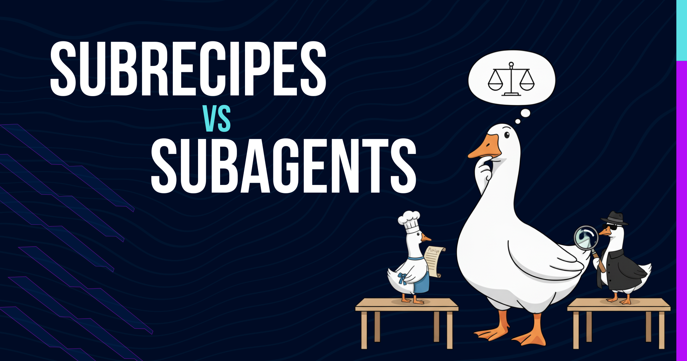

当你用 goose 做复杂项目时，常常需要把工作拆成多个任务，并用 AI 智能体运行它们。goose 给你两种强大的方式：[子智能体](/docs/guides/context-engineering/subagents/)和[子配方](/docs/tutorials/subrecipes-in-parallel/)。两者都可以并行运行多个 AI 实例，但工作方式不同。选哪一个可能让人困惑，所以我们来带你做决定。

我两种方法都在用，选择取决于你想完成什么。让我拆解何时使用每种方法，并展示真实例子。

<!--truncate-->

## 核心差异：复用还是不复用

子智能体是你在提示里用自然语言创建的临时 AI 实例，往往是一次性任务，然后就消失。

子配方是预先写好的、充满指令的文件，定义可复用的工作流，你可以用自定义参数反复运行。

一句话：子智能体用于快速、一次性的委派。子配方用于结构化、可重复的过程。

另外，两者仍处于「实验」状态，所以它们的功能和能力始终有可能随时间变化。


## 子智能体：快速而灵活

当你在 goose 会话里，只想委派任务、不想要设置开销时，子智能体表现出色。使用起来就是这么简单：

```
Build a simple task management web app doing these 3 tasks in parallel:

- one task writes the backend API code (Node.js/Express with basic CRUD operations for tasks)
- one task writes comprehensive tests for the API endpoints
- one task creates user documentation explaining how to use the API

Each task should work independently and complete their part simultaneously.
```

goose 自动生成三个独立的 AI 实例，每个处理不同的组件。你得到实时进度跟踪，它们都从那条提示并行工作。你立刻就能跑起来：没有设置，没有配置文件，只有自然语言指令。

### 什么让子智能体很好

* **用自然语言快速设置**——不必写配方文件。只要在提示里描述你想要什么。
* **进程隔离**——失败不影响你的主工作流。每个子智能体独立运行。
* **上下文保留**——把详细工作卸到单独的实例，让主聊天保持干净。
* **灵活执行**——很容易在提示里指定并行或顺序执行。
* **外部集成**——可以使用 Codex 或 Claude Code 等外部 AI 智能体。
* **实时进度**——实时监控仪表板显示任务完成状态。

### 子智能体的限制

* **可复用性有限**——每个子智能体都从零创建。没有保存的配置。
* **共用 LLM**——所有子智能体与父会话使用同一个 LLM 模型。
* **工具限制**——子智能体不能管理扩展，它们只能使用启动子智能体之前主会话已经能访问的东西。
* **不持久**——配置不会为将来的使用保存。

## 子配方：结构化且可复用

子配方解决可复用性问题。主「父」配方可以是 YAML 或 JSON，但子配方只能用 YAML 格式编写。这些文件定义结构化工作流，带有参数、验证、要使用的扩展，甚至允许你为这项工作选择不同的提供商/模型。

详细的子配方例子和实现指南，请看我们的[子配方博客](/blog/2025/09/15/subrecipes-in-goose)和 YouTube 上的[高级配方技巧](https://www.youtube.com/watch?v=1szmJSKInnU)视频。

### 什么让子配方强大

* **高度可复用**——配方文件可以在项目之间分享并进行版本控制。
* **结构化参数**——带验证和文档的类型安全参数处理。
* **模板支持**——使用模板语法动态注入参数。
* **完整工具访问**——子配方可以使用 goose 可用的任何扩展和工具。
* **LLM 自定义**——每个子配方可以指定自己要使用的 LLM 模型。
* **条件逻辑**——基于对话上下文的智能参数传递。
* **工作流编排**——带有依赖和执行顺序控制的复杂多步过程。

### 子配方的取舍

* **设置复杂度**——需要仔细创建 YAML 文件并定义参数。
* **学习曲线**——需要理解配方语法和结构。
* **文件管理**——必须组织和维护配方文件。


## 决策框架

**在这些情况下使用子智能体：**
- 你需要快速、一次性的任务委派
- 任务可以独立完成，并且不需要重复

**在这些情况下使用子配方：**
- 构建可以与团队分享的可复用工作流
- 需要结构化的参数处理

## 两种方法共同的好处和限制

这两个功能共享一些限制。我们已经提到了实验性和仍在演进的性质，但还有几点更重要的需要注意：

* 子配方和子智能体在隔离中运行任务，彼此不共享状态。这种隔离有助于防止冲突，并让任务自包含。如果你确实需要在进程之间共享信息，就必须在提示和指令中非常明确地说明。

* 两者都不能再生成类似的工作者：子智能体不能创建更多子智能体，子配方也不能调用其他子配方。这防止进程失控，但限制了深层嵌套。

* 无论你使用子智能体还是子配方，总共最多只能同时运行 10 个并行工作者。这不是用户可配置的，但这个限制让资源用量可控；它可能限制非常大规模的并行。


## 开始使用

我的建议：先从子智能体开始实验，理解你的工作流需求。它们更容易上手，因为你不必先写配置文件。

一旦你识别出想重复的模式，就可以把那个子智能体会话工作流转换成配方和子配方结构。这给你从实验到生产的最佳进阶。

## 选择在你

选择取决于你的具体需求和工作流要求。不会重复的快速任务偏向子智能体。有多个步骤或自定义的复杂工作流偏向子配方。

你的工作流要求应该驱动这个决定。

在我们的 [Discord 社区](https://discord.gg/n8R5VaWDAn)或 [GitHub discussions](https://github.com/aaif-goose/goose/discussions)上和我们分享你的子智能体提示或子配方想法。


<head>
  <meta property="og:title" content="在 goose 中如何在子智能体和子配方之间选择" />
  <meta property="og:type" content="article" />
  <meta property="og:url" content="https://goose-docs.ai/blog/2025-09-26-subagents-vs-subrecipes" />
  <meta property="og:description" content="当你需要把复杂工作拆成多个 AI 任务时，应该用子智能体还是子配方？了解关键差异以及何时使用每种方法。" />
  <meta property="og:image" content="https://goose-docs.ai/assets/images/subrecipes-vs-subagents-19bca16b86a951e4618be8ab6ce90fb2.png" />
  <meta name="twitter:card" content="summary_large_image" />
  <meta property="twitter:domain" content="goose-docs.ai" />
  <meta name="twitter:title" content="在 goose 中如何在子智能体和子配方之间选择" />
  <meta name="twitter:description" content="当你需要把复杂工作拆成多个 AI 任务时，应该用子智能体还是子配方？了解关键差异以及何时使用每种方法。" />
  <meta name="twitter:image" content="https://goose-docs.ai/assets/images/subrecipes-vs-subagents-19bca16b86a951e4618be8ab6ce90fb2.png" />
</head>
