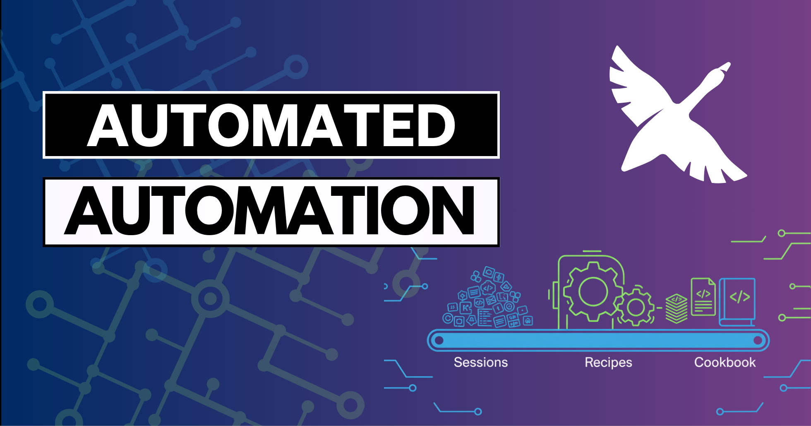

> **更新：** 本文为历史参考而保留。公开的配方食谱提交计划已经结束，我们不再接受新的配方提交。

你已经用了几周、也许几个月的 goose。你有几十次成功的[会话](/docs/guides/sessions/)，你在里面请求帮助写博客、做代码审查、写文档或做数据分析。每次你都想“我不是已经做过这个了吗？”，但从来没去查。听起来熟悉吗？

我自己有一百多次 goose 会话，以及同样多兆字节的对话数据。我坐在一座潜在自动化的金矿上。一位同事建议了一件聪明的事：“如果 goose 能分析你的会话并自动构建配方呢？”等等，等等，等等！！基于我自己的会话历史创建一个个性化食谱？好，请！让我们构建一个“食谱生成器”配方！

<!--truncate-->

## 手工创建配方的问题

手工创建配方很耗时，尤其是如果你像我一样要翻几十或几百次先前的会话，来做下面这些事：

- 弄清哪些会话成功了、哪些没有
- 从冗长的对话中提取核心工作流
- 识别相似但不相同的工作流，并弄清什么应该被参数化
- 用模板写出正确的 YAML 语法，也许还要构建子配方？
- 测试并打磨配方结构

这不就是首先拥有一个 AI 智能体的目标吗？为了节省时间和精力？

让我们通过实现一些自动化来提升生产力。我们要让 goose 写一个能创建其他配方的配方！

## 什么是食谱生成器配方？

我在这里描述的“食谱生成器”是一种方式，让 goose 查看你先前的会话，分析它们的共性，并从常见模式自动创建新配方。这是创造自动化的自动化——元编程的极致。

我会在最后分享我自己的食谱生成器。

它做的是：

1. **扫描你的会话历史**——找到并阅读你所有的 goose 会话文件
2. **识别成功的工作流**——过滤掉不完整或失败的会话
3. **检测模式**——把相似的请求和工作流分组
4. **生成参数化配方**——创建带正确模板的可复用 YAML 文件
5. **处理敏感数据**——询问如何处理文件路径、API 密钥和个人信息
6. **跟踪进度**——记住上次运行的时间，只处理新会话

最终结果是一本个性化的配方食谱，为你自己的具体工作流量身定做。

## 氛围提示过程

[我在一场直播里演示了](https://www.youtube.com/watch?v=-_1GALH2ER0)用“[氛围提示](https://www.youtube.com/watch?v=IjXmT0W4f2Q)”创建这个生成器的整个过程——和 goose 进行一场较长的对话，来打磨想法并提前回答潜在问题。这种方法比迭代编码用的 token 更少，成功率更高。

<iframe class="aspect-ratio" src="https://www.youtube.com/embed/-_1GALH2ER0" title="用 goose 做氛围编程：自动化我的工作流" frameborder="0" allow="accelerometer; autoplay; clipboard-write; encrypted-media; gyroscope; picture-in-picture" allowfullscreen></iframe>

在我和 goose 自己的对话中，goose 问了聪明的问题，比如：

- **模式识别**：我们应该如何区分常见工作流和一次性任务？
- **粒度**：我们应该创建具体配方，还是更一般的模式？
- **敏感信息**：我们应该如何处理文件路径、API 密钥和个人数据？
- **可复用性**：哪些参数应该自动检测，哪些由用户指定？
- **考虑哪些会话**：我有一个延伸的项目不想包括进去——那是关于单个项目的几十次会话，为那个做配方没有意义。

通过预先回答这些问题，我们在写任何代码之前创建了一份全面的规格。

## 生成器的关键功能

### 1. 聪明的会话分析

生成器通读你的会话文件（通常存在 `~/.local/share/goose/sessions/`，但这可能因平台而异，也可能在未来的 goose 发布中改变）并分析：
- 整体结果是否成功
- 用户请求模式
- 工具使用序列
- 它可以提取的常见参数类型

最后这一点对我真的很重要。我经常让 goose 帮我为像这样的博客、我们 [YouTube 频道](https://youtube.com/@goose-oss)的视频脚本，或教程页面构建大纲。它们都围绕一个主题或题目遵循相似的模式，但输出格式可能不同。

### 2. 智能过滤

并非每个会话都应该变成配方。生成器应该跳过看起来不完整或被放弃的会话，或与其他会话比较，以判断这是否是一次性任务。不过，看起来像一次性的任务，实际上可能是我想重复的某件事的开始。

让 goose 问我是否事先知道有哪些会话想排除，这很有帮助——我有几个关于我构建的[社区食谱安全扫描器](/blog/2025/08/25/goose-became-its-own-watchdog/)的真的很大、很长的会话，但我不想从那一切里做出一个配方。

相反，我希望 goose 专注于多次出现的工作流，并在它不确定的情况下让我确认。

### 3. 参数化逻辑

工具应该自动识别适合作为参数的好候选。我围绕下面这些事有一些想法：

- 我是否经常访问文件路径和目录结构？
- 是否有我正在访问或试图创建的特定文档类型？（博客、视频、文档）
- 我是否经常访问同类 URL 和外部资源
- 是否有常见的项目名或主题，比如 MCP？

### 4. 模板生成

:::tip
我希望 goose 为我写所有配方，但要尽可能跟上最新。我克隆了 [goose 仓库](https://github.com/aaif-goose/goose)，并告诉 goose 检查它自己的源代码，学习如何成功创建配方，并确保使用正确的 YAML 语法。
:::

由此，我让 goose 在考虑如何做我的配方时思考下面这些想法：

- 参数验证和默认值
- 针对不同场景的条件逻辑
- 重复任务的循环结构
- 在合适的地方集成子配方

## 真实世界的结果

构建食谱生成器花了一个多小时的“氛围提示”和打磨想法，然后 goose 给了我一个配方。我总是验证 AI 生成的工作，然后在直播之后又花了大约 15 分钟打磨一些想法，并为配方增加更多护栏。

它为我生成的配方正如我预测的那样：

- **大纲生成器**：按我在做的内容类型参数化：博客、视频（以及哪种），或教程文档
- **开源代码生成器**：我经常做小代码示例来配合博客，或需要代码在视频里演示一个概念，但可能会换编程语言。不，我在骗谁，对我来说永远是 Python。
- **研究助手**：我经常请求帮助收集某个主题的信息，但范围和深度不同。这个配方让我指定要挖多深，以及优先哪些来源。
- **图像生成**：我需要视频和博客的缩略图想法，但风格和焦点可以差很多。这个配方让我指定主题和情绪。
- **社交媒体帖子**：我很挣扎于想出抓人的社交媒体帖子，所以我想给 goose 内容类型（博客、视频等），指向内容（如果是视频，我给它我的旁白脚本），并让它生成许多不同选项，我可以稍后挑选。

这些配方大约 90% 可用，我又进一步打磨了其中一些。

### 这些配方真的能用吗？

通过运行大纲生成器配方（三次）、图像生成器配方和社交媒体配方，goose 处理了下面这些工作：

- 这篇博客的大纲，这样我可以更快写内容
- 本文顶部的“传送带”图像（通过 Gemini）
- 把你带到这里的那些社交媒体帖子
- 社交媒体帖子里短视频的视频脚本
- 将发布到我们 [YouTube 频道](https://youtube.com/@goose-oss)的较长视频的脚本大纲

所以，是的。它们能用！

## 元自动化的优势

这种方法代表了 AI 辅助生产力的新层次。AI 为你识别自动化机会，而不是你手工识别。就像有一位从不睡觉的生产力顾问，可以按需分析你的工作模式，并建议自动化的方式。

:::info
如果你想试试一些免手工的自动化，看看我们一位队友的实验性 [Perception](https://github.com/michaelneale/goose-perception) 项目！
:::

食谱生成器也处理配方创建中乏味的部分：

- 正确的 YAML 语法和结构
- 参数类型定义和验证
- 模板逻辑和条件语句
- 扩展要求和依赖

## 增量更新

食谱生成器根据你告诉它构建配方的输出文件夹，跟踪它上次运行的时间，所以后续执行只分析新会话。这让定期更新高效而实用。

### 未来增强？路线图？

我们可以从这里扩展这个想法吗？当然！

- **聪明的分类**——按领域自动组织配方（内容、代码、数据）
- **质量评分**——按潜在的时间节省和复用频率给配方排名
- **依赖检测**——识别配方使用子配方的更好位置——也许我想从同一个配方同时做博客、视频和社交媒体帖子
- **性能优化**——对大型会话历史做增量分析和缓存

我最想改进的最后一件事，是让 goose 用更新的会话重新分析它做出的配方，以打磨现有配方，而不是每次运行都创建新配方。

## 元编程的未来

配方食谱生成器只是开始。随着 AI 智能体变得更精密，我们会看到更多创造工具的工具、构建自动化的自动化，以及放大人类生产力的元编程方法。

关键洞察是，AI 智能体不应该只执行任务——它们应该从那些执行中学习，并帮助我们构建更好的系统。这个生成器把你的 goose 使用历史变成生产力资产，从你实际的工作模式创建一套个性化的自动化工具包。

开始构建你自己的食谱生成器，不要把同样的工作做两遍。未来的你会感谢你今天创造的自动化。


## 配方提交已关闭

配方食谱仍然可以浏览，但我们不再接受新的社区配方提交。


## 我自己的食谱生成器配方

下面是 goose 帮我创建的食谱生成器，加上我自己的笔记。你可以试着原样使用它，但我认为更好的做法是你自己和 goose 做氛围提示，去分析你自己的会话历史，看看你想为自己设置什么样的自动化。

```yaml
version: "1.0.0"
title: Recipe Cookbook Generator
description: |
  Analyze your goose session history to automatically generate recipes from your common workflows. This tool examines your past interactions with goose, identifies repetitive patterns, and creates reusable recipes that can automate similar tasks in the future. Perfect for capturing your personal automation patterns and building a custom recipe library.

prompt: |
  I want to analyze my goose session history and create recipes from common workflows I've used. I've done a variety of work, and I'd like your help finding repetitive tasks that we can turn into goose recipes to build my own personal 'cookbook' based on my goose usage patterns.

  My work priorities are: {{ work_priorities }}
  Please skip sessions containing these topics: {{ exclusion_keywords }}
  
  I want to organize the recipes {{ organization_preference }} and review them in {{ review_mode }} mode.
  
  The process should:
  1. Find and analyze my goose session files (located at {{ session_storage_path }})
  2. Identify successful workflows, prioritizing those I use repeatedly (at least {{ min_workflow_frequency }} times)
  3. Distinguish between repetitive patterns (high priority) and one-off tasks (user choice)
  4. Let me choose which patterns to turn into recipes, and subtasks that could be turned into subrecipes
  5. Generate parameterized YAML recipes with proper templating
  6. Handle sensitive data appropriately
  7. Test generated recipes against recent sessions to validate they work
  
  Store the generated recipes in {{ recipe_output_dir }} and track when this cookbook generator last ran so future runs only analyze new sessions.

parameters:
  - key: recipe_output_dir
    description: Directory where generated recipes should be saved
    input_type: string
    requirement: required
  - key: session_storage_path
    description: Path to goose session storage (will auto-detect if not provided)
    input_type: string
    requirement: optional
  - key: work_priorities
    description: What types of work should I prioritize? (e.g., content, research, analysis, automation, development)
    input_type: string
    requirement: optional
  - key: exclusion_keywords
    description: Skip sessions containing these words/topics (comma-separated)
    input_type: string
    requirement: optional
  - key: organization_preference
    description: How to organize recipes - flat, by_category, by_date, by_frequency
    input_type: string
    requirement: optional
    default: "by_category"
  - key: review_mode
    description: How to review findings - interactive, batch_file
    input_type: string
    requirement: optional
    default: "interactive"
  - key: min_workflow_frequency
    description: Minimum number of times a workflow pattern must appear to be considered
    input_type: string
    requirement: optional
    default: "2"
  - key: include_test_mode
    description: Whether to validate generated recipes against recent sessions
    input_type: string
    requirement: optional
    default: "true"

instructions: |
  You are helping the user build a 'cookbook' of goose recipes based on their actual usage patterns.
  
  ## Step 1: Setup and Discovery
  - Determine the goose session storage path (try default locations like ~/.local/share/goose/sessions, or ask the user)
  - Check if this is an incremental run by looking for last-run timestamp in recipe_output_dir
  - Look for existing analysis metadata file (cookbook_analysis.json) to reuse previous work
  - Identify which session files to analyze (all files or only newer than last run)
    - ignore 0-byte session files and corrupted/incomplete files
  - If exclusion_keywords provided, skip sessions containing those terms
  
  ## Step 2: Intelligent Session Analysis  
  - Parse .jsonl session files to extract user requests, tool usage patterns, and outcomes
  - Use LLM analysis to automatically tag sessions with:
    - Intent categories (research, content-creation, analysis, automation, development)
    - Topic domains (extracted from session content - don't hardcode domains)
    - Action patterns (analyze, summarize, generate, outline, compare, etc.)
    - Tool usage sequences that indicate workflow patterns
  - Identify successful workflows by looking for:
    - Iterative refinement patterns (request → refine → refine → stop)
    - File creation/export outcomes
    - User satisfaction indicators
    - Task completion signals
  - Group similar workflows by analyzing:
    - Semantic similarity in user requests ("give me 5 ideas for...", "help me outline...")
    - Tool usage sequences (web_scrape → analyze → summarize)
    - Content types and domains worked with
    - Parameter patterns (file paths, URLs, content types)
  - Categorize findings:
    - HIGH PRIORITY: Patterns occurring >= min_workflow_frequency times
    - USER CHOICE: One-off tasks that might be worth generalizing
  - Focus on work_priorities if specified by user
  
  ## Step 3: User Review Process
  Based on review_mode parameter:
  
  ### Interactive Mode (default):
  - Present HIGH PRIORITY patterns first with numbering:
    - "1. Content Ideas Generator (Used 5 times)"
    - Brief description: "Generate ideas for blog posts, videos, workshops"
    - Parameters needed: content_type, topic_area, number_of_ideas
    - Sensitive data warnings if detected
  - Then present USER CHOICE patterns similarly
  - User can select by numbers: "1,3,5,7" or "all" or "none"
  
  ### Batch File Mode:
  - Generate a markdown summary file: "cookbook_review.md" in recipe_output_dir
  - Include all patterns with checkboxes: "- [ ] Content Ideas Generator..."
  - User edits file to check desired patterns
  - User tells you when ready to proceed
  
  ## Step 4: Recipe Generation with Subagents
  - For each confirmed pattern, launch a subagent to generate the recipe
  - Each subagent gets context about:
    - The specific workflow pattern
    - Example sessions that match the pattern
    - Suggested parameters and their default values
    - Organization preference for naming/structure
  - Subagents work in parallel to generate recipes faster
  - Each recipe includes:
    - Proper goose YAML format with version, title, description
    - Parameterized prompts using minijinja templating
    - Comprehensive instructions for headless mode
    - Custom metadata: cookbook_generator_metadata with source info
  - Generate subrecipes when workflows share common patterns
  - Ensure unique naming and handle subrecipe dependencies
  
  ## Step 5: Testing and Finalization
  - If include_test_mode is true:
    - Validate each generated recipe against recent matching sessions
    - Report any recipes that might not work as expected
  - Organize recipes according to organization_preference:
    - flat: All recipes in recipe_output_dir
    - by_category: Create subdirectories by workflow type
    - by_date: Organize by when patterns were first detected
    - by_frequency: Most frequent patterns in priority folders
  - Save analysis metadata to cookbook_analysis.json for incremental runs
  - Update last-run timestamp
  - Generate comprehensive README.md with:
    - Summary of generated recipes
    - Usage instructions
    - Parameter explanations
    - Tips for customization
  
  ## Advanced Guidelines:
  - SMART PATTERN DETECTION: Use LLM intelligence to find semantic patterns, not just keyword matching
  - PARAMETER INTELLIGENCE: Suggest default values based on most common values in sessions
  - SUBRECIPE OPPORTUNITIES: Identify shared workflow components for reusability
  - INCREMENTAL LEARNING: On subsequent runs, suggest updates to existing recipes
  - TOKEN EFFICIENCY: Summarize large sessions, focus on key patterns, batch similar analyses
  - CROSS-SESSION LEARNING: Weight patterns higher if they appear across different time periods
  - SENSITIVE DATA HANDLING: Detect API keys, file paths, personal info - warn but let user decide
  - RECIPE QUALITY: Ensure recipes are actionable, well-parameterized, and genuinely useful
  
  ## Pattern Recognition Intelligence:
  - Look for linguistic patterns: "give me X ideas", "help me outline", "research and summarize"
  - Detect workflow stages: ideation → planning → creation → refinement
  - Identify content domains from session content (don't assume specific domains)
  - Recognize tool usage signatures that indicate reusable processes
  - Find parameter opportunities in repeated values (paths, URLs, content types)
  - Distinguish setup tasks (one-time) from creative/analytical processes (repetitive)

extensions:
  - type: builtin
    name: developer
  - type: builtin
    name: dynamic_task

activities:
  - analyze_sessions
  - pattern_recognition  
  - recipe_generation
  - user_interaction
```


<head>
  <meta property="og:title" content="为 goose 构建你自己的配方食谱生成器" />
  <meta property="og:type" content="article" />
  <meta property="og:url" content="https://goose-docs.ai/blog/2025/10/08/recipe-cookbook-generator" />
  <meta property="og:description" content="了解 goose 如何研究你过去的会话，并把你喜欢的工作流变成可复用的自动化模板。" />
  <meta property="og:image" content="https://goose-docs.ai/assets/images/recipe-cookbook-generator-ba6ce396585e1fc591e339720ee80a30.png" />
  <meta name="twitter:card" content="summary_large_image" />
  <meta name="twitter:title" content="为 goose 构建你自己的配方食谱生成器" />
  <meta name="twitter:description" content="了解 goose 如何研究你过去的会话，并把你喜欢的工作流变成可复用的自动化模板。" />
  <meta property="twitter:domain" content="goose-docs.ai" />
  <meta name="twitter:image" content="https://goose-docs.ai/assets/images/recipe-cookbook-generator-ba6ce396585e1fc591e339720ee80a30.png" />
</head>
